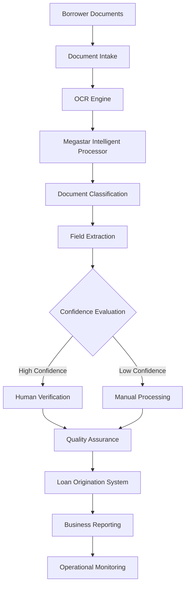

# Enterprise AI Architecture

## Document Control

| Field | Value |
|--------|-------|
| Document Name | Enterprise AI Architecture |
| Capability | Foundations |
| Repository | Enterprise AI Governance Playbook |
| Reference Organization | Megastar Mortgage |
| AI System | Megastar Intelligent Processor (MIP) |
| Document Owner | Enterprise Architecture |
| Version | 1.0 |
| Classification | Public Reference Implementation |
| Status | Published |
| Review Cycle | Annual |
| Last Updated | July 2026 |

---

# Executive Summary

Megastar Intelligent Processor (MIP) is the enterprise Intelligent Document Processing (IDP) platform supporting mortgage document processing across the loan origination lifecycle.

Rather than operating as a standalone AI application, MIP functions as part of a broader enterprise ecosystem comprising mortgage operations, AI services, enterprise applications, governance functions, and supporting technology platforms.

Understanding this operating environment is fundamental to effective AI governance.

This document provides a high-level architectural view of MIP, identifies its major components, describes enterprise integrations, establishes trust boundaries, and defines the architectural context that supports governance throughout the AI lifecycle.

The purpose of this document is not to describe software implementation in detail, but to establish a common architectural understanding of the enterprise AI environment being governed.

---

# Enterprise Architecture Overview

Borrower documents enter Megastar Mortgage through controlled business processes and are processed by MIP using AI-assisted document processing capabilities.

Documents are classified, relevant information is extracted, confidence is evaluated, and appropriate Human-in-the-Loop (HITL) validation is performed before validated information progresses into downstream mortgage systems.

Governance activities are embedded throughout this workflow to ensure accountability, transparency, operational oversight, and continuous monitoring.

---

# Business Workflow

---

# Enterprise Architecture Layers

The enterprise architecture supporting MIP consists of six logical layers.

| Layer | Purpose |
|--------|---------|
| Business Layer | Mortgage operations, business users, and operational workflows supported by AI. |
| Document Processing Layer | Document intake, OCR, classification, and intelligent information extraction. |
| AI Processing Layer | AI services responsible for document processing and confidence evaluation. |
| Human Oversight Layer | Human verification, exception handling, and quality assurance activities. |
| Enterprise Services Layer | Loan Origination System, Identity & Access Management, Document Management, Reporting, and Monitoring. |
| Governance Layer | Audit logging, governance reporting, operational monitoring, lifecycle oversight, and governance evidence. |

Each layer contributes to the overall governance posture of the enterprise AI platform.

---

# Enterprise Components

| Component | Purpose |
|-----------|---------|
| Borrower Documents | Source documents submitted during mortgage applications. |
| Document Intake | Registers and manages incoming mortgage documentation. |
| OCR Engine | Converts scanned documents into machine-readable content. |
| Megastar Intelligent Processor | Coordinates AI-assisted document processing. |
| Document Classification | Identifies mortgage document types. |
| Field Extraction | Extracts structured information from documents. |
| Confidence Evaluation | Determines whether human review is required. |
| Human Verification | Reviews AI-generated outputs before operational use. |
| Manual Processing | Handles low-confidence and exception scenarios. |
| Quality Assurance | Validates processing quality and consistency. |
| Loan Origination System | Receives validated business information. |
| Business Reporting | Supports operational reporting and analytics. |
| Operational Monitoring | Tracks platform health and governance metrics. |

---

# Enterprise Integrations

MIP integrates with enterprise technologies supporting mortgage operations.

These include:

- Loan Origination System (LOS)
- Document Management Platform
- OCR Services
- Identity & Access Management (IAM)
- Operational Monitoring Platform
- Audit Logging Services
- Data Loss Prevention (DLP)
- Business Reporting Platform

These integrations support secure, traceable, and efficient AI-assisted document processing.

---

# Human Oversight Points

Human oversight is intentionally embedded throughout the architecture.

Key oversight activities include:

- Validation of document classification.
- Verification of extracted information.
- Review of low-confidence predictions.
- Manual processing of unsupported scenarios.
- Quality assurance before operational use.

These activities ensure that business-critical outcomes remain subject to human judgment.

---

# Trust Boundaries

The enterprise architecture establishes several trust boundaries that influence governance activities.

| Trust Boundary | Governance Significance |
|----------------|-------------------------|
| Borrower → Enterprise | Customer information enters controlled business processes. |
| Document Intake → OCR | Document integrity is maintained during digitization. |
| OCR → MIP | AI-assisted processing begins. |
| MIP → Human Verification | Human accountability is preserved before operational use. |
| MIP → Loan Origination System | Only validated information progresses into business operations. |
| MIP → Enterprise Services | Monitoring, reporting, and audit evidence are generated. |

These trust boundaries identify where governance oversight and operational controls become necessary.

---

# Governance Touchpoints

The architecture provides the operational context for governance capabilities developed throughout this playbook.

| Architecture Component | Governance Capability |
|------------------------|----------------------|
| Megastar Intelligent Processor | AI System Profile |
| Business Workflow | AI Inventory & Assessment |
| Human Verification | Human Oversight |
| Operational Monitoring | Continuous Monitoring |
| Audit Logging | AI Assurance |
| Enterprise Integrations | Third-Party AI Governance |
| Enterprise Architecture | Governance Operating Model |

---

# Governance Boundaries

The Enterprise AI Governance Program applies to the operation and oversight of MIP within the architectural boundaries defined in this document.

Governance activities include:

- AI system lifecycle oversight
- Human oversight
- AI inventory management
- AI impact assessment
- AI risk management
- Governance controls
- Governance assurance
- Operational monitoring
- Third-party AI governance
- Governance reporting

Business activities outside these architectural boundaries remain subject to existing enterprise governance processes.

---

# Why This Document Matters

Enterprise AI governance depends upon understanding the environment in which AI operates.

This document establishes the architectural context required for governance by demonstrating how business processes, AI capabilities, enterprise systems, and governance activities interact throughout the lifecycle of MIP.

Every governance capability within this playbook references this architecture when evaluating accountability, oversight, controls, assurance, and continuous monitoring.

---

# Related Artifacts

This document provides foundational input to:

- Governance Operating Model
- AI Inventory & Assessment
- AI Impact Assessment
- AI Risk Management
- AI Controls
- AI Assurance
- Third-Party AI Governance

---

# Revision History

| Version | Date | Description |
|----------|------|-------------|
| 1.0 | July 2026 | Initial release of the Enterprise AI Architecture artifact. |