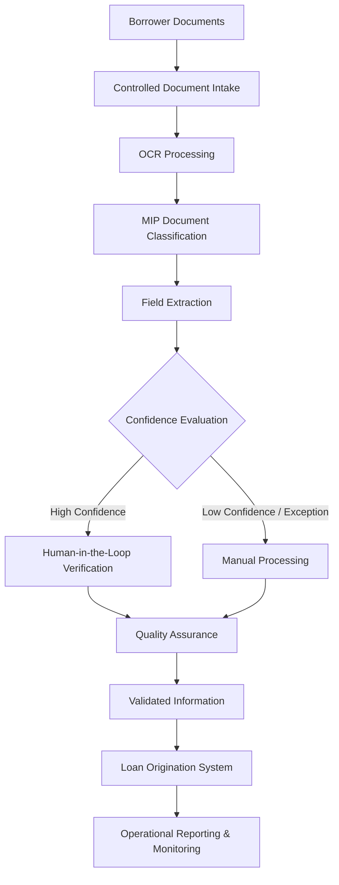

# Enterprise AI Architecture

> **Artifact Type:** Reference Implementation  
> **Capability:** Foundations  
> **Reference Organization:** Megastar Mortgage  
> **Reference AI System:** Megastar Intelligent Processor (MIP)  
> **Authoritative Record:** No  
> **Document Owner:** Enterprise Architecture  
> **Version:** 2.0  
> **Status:** Published Reference Implementation  
> **Review Cycle:** Annual

---

# Purpose

This document provides the high-level architectural context for the Megastar Intelligent Processor (MIP).

It establishes:

- the end-to-end business workflow supported by MIP;
- the major architectural components;
- enterprise and third-party integrations;
- human oversight points;
- trust boundaries;
- architectural dependencies relevant to AI governance.

This document provides architectural context only. It does not define software implementation details, governance decisions, controls, risks, or operational procedures.

---

# Architecture Overview

Megastar Intelligent Processor (MIP) operates as one component of the broader mortgage-origination ecosystem.

Borrower documents enter controlled enterprise workflows, pass through AI-supported document processing, undergo appropriate human review, and are transferred to downstream mortgage systems only after validation.

Supporting enterprise services provide identity management, monitoring, audit logging, reporting, document management, and security capabilities that enable trustworthy operation of the platform.

---

# Business Workflow

This workflow illustrates the business context in which governance activities later operate.

---

# Architecture Layers

| Layer | Purpose |
|--------|---------|
| Business Process Layer | Mortgage operations and business activities supported by MIP. |
| Document Processing Layer | Intake, OCR, classification, extraction, and workflow routing. |
| AI Processing Layer | AI capabilities responsible for document interpretation and confidence evaluation. |
| Human Oversight Layer | Human verification, exception handling, manual processing, and quality assurance. |
| Enterprise Services Layer | Identity & Access Management, Document Management, Monitoring, Reporting, Audit Logging, and Data Loss Prevention. |
| Governance Evidence Layer | Evidence generated for governance, monitoring, assurance, incidents, and lifecycle management. |

The Governance Evidence Layer represents records generated during operation. It is not a separate processing platform.

---

# Major Components

| Component | Architectural Role |
|-----------|--------------------|
| Borrower Documents | Source mortgage documentation. |
| Controlled Document Intake | Receives and manages inbound documents. |
| Document Management Platform | Stores and manages source documentation. |
| OCR Engine | Converts documents into machine-readable content. |
| MIP Classification Service | Identifies mortgage-document types. |
| MIP Extraction Service | Extracts configured business fields. |
| Confidence Evaluation | Determines routing based on configured thresholds. |
| Human-in-the-Loop Interface | Allows authorized users to review and correct AI outputs. |
| Manual Processing Workflow | Handles unsupported or low-confidence scenarios. |
| Quality Assurance | Performs quality validation and operational sampling. |
| Loan Origination System | Receives validated business information. |
| Monitoring Platform | Produces operational and governance metrics. |
| Audit Logging | Captures traceable system and user activity. |
| Identity & Access Management | Controls authentication and authorization. |
| Data Loss Prevention | Restricts unauthorized movement of sensitive information. |

---

# Data Flow

The primary processing flow is:

1. Borrower documents enter approved intake channels.
2. Documents are stored or referenced within enterprise document management.
3. OCR converts document content into machine-readable information.
4. MIP classifies documents.
5. MIP extracts configured fields.
6. Confidence evaluation determines the review path.
7. Human reviewers validate, correct, reject, or manually process outputs.
8. Quality Assurance performs operational review.
9. Validated information is transferred into the Loan Origination System.
10. Monitoring and audit services retain operational evidence.

Detailed data lineage, retention, privacy, and information-governance requirements are managed by later governance capabilities.

---

# Enterprise Integrations

MIP integrates with:

- Loan Origination System (LOS)
- Document Management Platform
- OCR Services
- Identity & Access Management (IAM)
- Audit Logging
- Operational Monitoring
- Data Loss Prevention (DLP)
- Business Reporting Services

Where enterprise capabilities rely upon external providers, those relationships are governed through the Third-Party AI Governance capability.

---

# Human Oversight Points

Human oversight exists at multiple stages:

- document classification review;
- extracted field validation;
- correction of AI-generated values;
- exception handling;
- manual processing;
- Quality Assurance sampling;
- escalation of operational issues.

Human reviewers retain responsibility for business-critical decisions supported by MIP.

Detailed responsibilities are maintained within the Governance Operating Model.

---

# Trust Boundaries

| Trust Boundary | Governance Significance |
|----------------|-------------------------|
| Borrower → Megastar Mortgage | Sensitive customer information enters controlled enterprise processes. |
| Document Intake → OCR | Document integrity and provider dependency begin. |
| OCR → MIP | AI-supported processing begins. |
| MIP → Human Review | Human accountability is preserved before downstream use. |
| Human Review → Quality Assurance | Operational validation is independently reviewed. |
| Validated Output → Loan Origination System | Only validated information progresses into business operations. |
| MIP → Monitoring & Audit | Governance evidence is generated. |
| Enterprise → External Provider | Third-party contractual, security, privacy, and resilience obligations apply. |

These trust boundaries identify where governance activities become necessary.

---

# Architectural Dependencies

The operation of MIP depends upon:

- supported mortgage-document formats;
- OCR availability;
- configured AI models;
- confidence-threshold configuration;
- authorized human review;
- downstream enterprise systems;
- Identity & Access Management;
- audit logging;
- operational monitoring;
- third-party services;
- approved change management.

Material changes to these dependencies may trigger reassessment through later governance capabilities.

---

# Governance Boundary

This document establishes the architectural context for MIP.

It does not:

- register the AI system;
- assign governance classifications;
- perform impact assessments;
- identify or assess risks;
- define controls;
- assign operational responsibilities;
- approve changes;
- provide assurance conclusions;
- accept residual risk.

Those responsibilities belong to later governance capabilities.

---

# Related Artifacts

- [Foundations](README.md)
- [Business Context](01-Business-Context.md)
- [AI System Profile](02-AI-System-Profile.md)
- [AI Governance Stakeholder Model](03-AI-Governance-Stakeholder-Model.md)
- [Governance Operating Model](../02-Governance-Operating-Model/README.md)
- [AI Inventory and Assessment](../03-AI-Inventory-and-Assessment/README.md)
- [Third-Party AI Governance](../07-Third-Party-AI-Governance/README.md)
- [Continuous Monitoring](../08-Continuous-Monitoring/README.md)

---

# Revision History

| Version | Date | Description |
|----------|------|-------------|
| 1.0 | July 2026 | Initial release of the Enterprise AI Architecture artifact. |
| 2.0 | July 2026 | Clarified architecture scope, trust boundaries, integrations, dependencies, and capability ownership. |