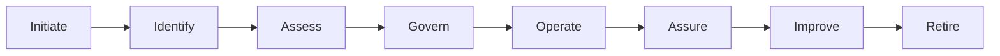

# Governance Lifecycle

> **Artifact Type:** Governance Standard  
> **Capability:** Governance Operating Model  
> **Reference Organization:** Megastar Mortgage  
> **Reference AI System:** Megastar Intelligent Processor (MIP)  
> **Authoritative Record:** No  
> **Document Owner:** AI Governance Lead  
> **Version:** 2.0  
> **Status:** Published Reference Implementation  
> **Review Cycle:** Annual

---

# Purpose

This document establishes the governance lifecycle used by Megastar Mortgage to govern MIP from governance initiation through controlled retirement.

It provides a consistent governance operating sequence that integrates business ownership, governance oversight, risk management, controls, assurance, and continual improvement into a single repeatable lifecycle.

This lifecycle describes **how governance progresses**. It does not replace business delivery, software development, or operational processes.

---

# Governance Lifecycle Principles

The governance lifecycle is based on the following principles:

- Governance begins before operational implementation.
- Governance remains active throughout the operational life of the AI system.
- Governance activities are proportionate to business impact and risk.
- Significant changes require renewed governance review.
- Decisions are evidence-based and traceable.
- Independent assurance remains separate from operational ownership.
- Governance concludes only after controlled retirement.

---

# Governance Lifecycle

The lifecycle represents the governance journey of an AI system rather than its technical development lifecycle.

---

# Lifecycle Stages

| Lifecycle Stage | Governance Purpose | Primary Governance Output |
|---|---|---|
| **Initiate** | Confirm that governance should begin and establish sponsorship, ownership, and governance applicability. | Governance initiation |
| **Identify** | Register, inventory, and understand the AI system and its intended business use. | AI Intake and AI Inventory |
| **Assess** | Evaluate impact, risk, proportionality, and governance requirements. | Impact Assessment and Risk Assessment |
| **Govern** | Apply governance controls, approvals, and required governance decisions before operational use. | Approved governance controls |
| **Operate** | Govern the AI system during production through oversight, monitoring, human review, and controlled change. | Governed operational use |
| **Assure** | Independently evaluate governance effectiveness, controls, and compliance. | Assurance findings |
| **Improve** | Strengthen governance through monitoring, lessons learned, audit observations, incidents, and continual improvement. | Improvement actions |
| **Retire** | Govern the controlled withdrawal of the AI system while preserving required governance evidence. | Retirement record |

---

# Repository Capability Mapping

The Enterprise AI Governance Playbook expands each lifecycle stage through dedicated governance capabilities.

| Lifecycle Stage | Primary Repository Capability |
|---|---|
| Initiate | Foundations and Governance Operating Model |
| Identify | AI Inventory and Assessment |
| Assess | AI Risk Management |
| Govern | AI Controls |
| Operate | Human Oversight, Third-Party AI Governance, and Operational Governance |
| Assure | AI Assurance |
| Improve | Continuous Monitoring |
| Retire | AI Retirement and Record Retention (where applicable) |

This lifecycle provides the connective structure between the repository capabilities rather than creating separate governance processes.

---

# Governance Throughout the Lifecycle

Throughout every lifecycle stage:

- business ownership remains accountable for business outcomes;
- governance oversight remains active;
- human judgment supports business-critical decisions;
- governance evidence is created and maintained;
- risks are continuously identified and managed;
- changes are governed according to their significance;
- assurance activities remain independent from operational ownership.

Governance is therefore continuous rather than event-based.

---

# Lifecycle Transitions

Movement between lifecycle stages should occur only when the governance objectives of the current stage have been completed or an authorized governance decision permits progression.

Material changes to the AI system, business use, operating environment, or regulatory obligations may require the governance lifecycle to revisit earlier stages rather than proceeding linearly.

The lifecycle therefore supports iterative governance while maintaining governance traceability.

---

# Governance Outcomes

Applying the Governance Lifecycle enables Megastar Mortgage to:

- govern AI consistently throughout its operational life;
- integrate governance into business operations rather than treating it as a standalone approval exercise;
- coordinate governance activities across organizational functions;
- support proportionate governance decisions;
- maintain governance traceability;
- strengthen organizational learning through continual improvement.

---

# Governance Boundary

This document owns:

- the governance lifecycle;
- lifecycle stages;
- lifecycle objectives;
- lifecycle transitions;
- capability mapping.

This document does not own:

- AI Intake procedures;
- AI Inventory records;
- impact assessments;
- risk assessments;
- control implementation;
- governance approvals;
- RACI assignments;
- governance forums;
- monitoring metrics;
- assurance findings;
- retirement procedures.

Those responsibilities belong to their respective governance capabilities.

---

# Related Artifacts

- [AI Governance Operating Model](01-AI-Governance-Operating-Model.md)
- [Roles, Responsibilities and Decision Rights](02-Roles-Responsibilities-and-Decision-Rights.md)
- [AI Governance RACI Matrix](03-AI-Governance-RACI-Matrix.md)
- [Governance Forums and Escalation](04-Governance-Forums-and-Escalation.md)
- [Performance and Reporting](06-Performance-and-Reporting.md)
- [AI Inventory and Assessment](../03-AI-Inventory-and-Assessment/README.md)
- [Governance Glossary](../00-Governance-Glossary.md)

---

# Revision History

| Version | Date | Description |
|---|---|---|
| 1.0 | July 2026 | Initial release of the Governance Lifecycle artifact. |
| 2.0 | July 2026 | Refined governance lifecycle stages, aligned terminology with repository capabilities, added capability mapping, lifecycle transitions, and governance boundaries. |