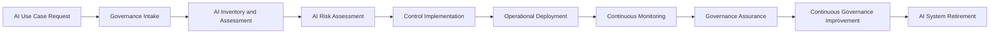

# Governance Lifecycle

## Document Control

| Field | Value |
|--------|-------|
| Document Name | Governance Lifecycle |
| Capability | Governance Operating Model |
| Repository | Enterprise AI Governance Playbook |
| Reference Organization | Megastar Mortgage |
| AI System | Megastar Intelligent Processor (MIP) |
| Document Owner | AI Governance Lead |
| Version | 1.0 |
| Classification | Public Reference Implementation |
| Status | Published |
| Review Cycle | Annual |
| Last Updated | July 2026 |

---

# Executive Summary

Enterprise AI governance is an operational capability that accompanies an AI system throughout its entire lifecycle rather than a one-time approval or compliance exercise.

As AI systems evolve, governance activities must continuously adapt to changing business objectives, operational conditions, regulatory expectations, and organizational risks.

This document establishes the governance lifecycle adopted by Megastar Mortgage for the Megastar Intelligent Processor (MIP). It provides the operational blueprint that connects governance activities from the initial AI use case request through ongoing oversight and the eventual retirement of the AI system.

Each subsequent capability within this repository expands one stage of this lifecycle in greater operational detail.

---

# Objective

The objective of this document is to establish a consistent governance lifecycle that integrates governance activities into every major stage of the enterprise AI lifecycle.

The lifecycle provides a repeatable operating model that supports coordination between business, technology, governance, and assurance functions while ensuring governance remains active throughout the operational life of the AI system.

---

# Governance Lifecycle

---

# Lifecycle Stages

| Lifecycle Stage | Governance Purpose |
|-----------------|--------------------|
| AI Use Case Request | Identify and document a business requirement for AI adoption. |
| Governance Intake | Confirm governance applicability, identify stakeholders, establish ownership, and determine whether the proposed AI initiative proceeds into governance. |
| AI Inventory and Assessment | Register, classify, and assess the AI system before operational implementation. |
| AI Risk Assessment | Identify, evaluate, and prioritize AI-related risks. |
| Control Implementation | Implement governance controls appropriate to the identified risks and business context. |
| Operational Deployment | Deploy the AI system into production following completion of required governance activities. |
| Continuous Monitoring | Monitor operational performance, governance effectiveness, emerging risks, and operational issues. |
| Governance Assurance | Evaluate governance effectiveness through reviews, assurance activities, and independent oversight. |
| Continuous Governance Improvement | Strengthen governance through lessons learned, monitoring outcomes, audit observations, and organizational experience. |
| AI System Retirement | Govern the controlled retirement of the AI system while preserving appropriate governance records and organizational knowledge. |

---

# Governance Throughout the Lifecycle

The governance lifecycle is supported by continuous collaboration between business, technology, governance, and assurance functions.

Throughout every stage of the lifecycle:

- Business ownership remains accountable for business outcomes.
- Governance oversight remains active.
- Human judgment is preserved for business-critical decisions.
- Risks are continuously identified, evaluated, and managed.
- Governance evidence is maintained to support transparency and accountability.
- Governance activities evolve alongside changes in business needs, technology, and regulatory expectations.

---

# Lifecycle Principles

The Governance Lifecycle operates according to the following principles:

- Governance begins before AI implementation.
- Governance continues throughout operational use.
- Significant changes require renewed governance review.
- Governance decisions are supported by documented evidence.
- Continuous monitoring enables continual governance improvement.
- Governance concludes only when the AI system is formally retired.

---

# Governance Outcomes

Implementation of the Governance Lifecycle enables Megastar Mortgage to:

- Apply governance consistently across AI initiatives.
- Coordinate governance activities across organizational functions.
- Improve governance visibility and accountability.
- Support informed governance decision-making.
- Strengthen operational oversight.
- Promote continual governance maturity throughout the AI lifecycle.

---

# Why This Document Matters

Enterprise AI governance is effective only when governance activities are integrated into the complete lifecycle of an AI system.

This Governance Lifecycle provides the operational structure that connects every governance capability within the Enterprise AI Governance Playbook into a single, repeatable implementation model.

Rather than treating governance as isolated activities, the lifecycle demonstrates how governance becomes an integrated business capability supporting responsible AI adoption from initial request through retirement.

---

# Related Artifacts

This document provides the transition into:

- AI Inventory & Assessment
- AI Risk Management
- AI Controls
- AI Assurance
- Continuous Monitoring

---

# Revision History

| Version | Date | Description |
|----------|------|-------------|
| 1.0 | July 2026 | Initial release of the Governance Lifecycle artifact. |