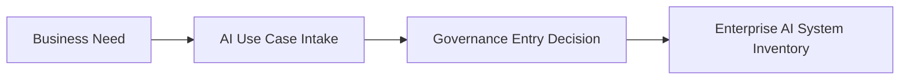

# AI Use Case Intake

> **Artifact Type:** Governance Record Standard  
> **Capability:** AI Inventory and Assessment  
> **Reference Organization:** Megastar Mortgage  
> **Reference AI System:** Megastar Intelligent Processor (MIP)  
> **Authoritative Record:** No  
> **Document Owner:** AI Governance Lead  
> **Version:** 2.0  
> **Status:** Published Reference Implementation  
> **Review Cycle:** Annual

---

# Purpose

This document establishes the standardized governance entry process for proposed AI initiatives within Megastar Mortgage.

Its purpose is to determine whether a proposed AI initiative should formally enter the Enterprise AI Governance Program.

The AI Use Case Intake captures the minimum information required to understand the proposed initiative, confirm governance applicability, establish business sponsorship, and support a Governance Entry Decision.

Once accepted into governance, the Enterprise AI System Inventory becomes the authoritative enterprise record for the AI system throughout its lifecycle.

---

# Governance Workflow

Every proposed AI initiative follows the same governance workflow.

Only AI initiatives accepted through this process proceed into enterprise governance.

---

# Intake Information

The AI Use Case Intake captures information required to determine whether governance should begin.

| Information Area | Purpose |
|---|---|
| Request Information | Identifies the requestor, sponsoring business area, business owner, and executive sponsor. |
| Business Context | Describes the business problem, objectives, expected value, and business process supported. |
| Proposed AI Solution | Provides a high-level description of the intended AI capability and business use. |
| Intended Users | Identifies the primary users and affected business teams. |
| High-Level Data Context | Describes the categories of information expected to be processed. |
| Expected Human Involvement | Describes the anticipated level of human review, oversight, and decision-making. |

The intake intentionally captures only high-level governance information.

Detailed system, technical, lifecycle, assessment, and risk information is collected after the AI initiative has formally entered governance.

---

# Governance Entry Review

Following submission, the AI Governance function performs a Governance Entry Review to determine whether:

- sufficient information has been provided;
- the initiative falls within governance scope;
- appropriate business sponsorship has been established;
- the proposal is ready to enter enterprise governance.

The Governance Entry Review does not:

- create the Enterprise AI System Inventory record;
- classify the AI system;
- perform an impact assessment;
- determine governance significance;
- perform AI Risk Management activities;
- approve implementation or production deployment.

---

# Governance Entry Decision

Each AI initiative receives one of the following governance decisions.

| Decision | Outcome |
|---|---|
| Accepted | The initiative proceeds to the Enterprise AI System Inventory. |
| Clarification Required | Additional information is required before governance can continue. |
| Closed | The initiative will not proceed into enterprise AI governance. |

The Governance Entry Decision should include the decision date, approving authority, supporting rationale, and next governance activity.

---

# Governance Principles

The AI Use Case Intake operates according to the following principles:

- every proposed AI initiative enters governance through a standardized intake process;
- governance begins before implementation;
- governance decisions are evidence-based and documented;
- information should be collected once and referenced thereafter whenever practical;
- accepted initiatives transition into an authoritative Enterprise AI System Inventory record;
- governance entry does not constitute approval for implementation or operational use.

---

# Governance Boundary

This document owns:

- proposed AI initiative information;
- governance entry review;
- governance entry decision;
- governance scope determination;
- transition into the Enterprise AI System Inventory.

This document does not own:

- authoritative AI system records;
- technical architecture;
- AI system classification;
- AI impact assessment;
- governance significance;
- AI Risk Management;
- control implementation;
- deployment approval.

Those responsibilities belong to subsequent governance artifacts.

---

# Related Artifacts

- [AI Inventory and Assessment](README.md)
- [Enterprise AI System Inventory](02-Enterprise-AI-System-Inventory.md)
- [AI System Assessment](03-AI-System-Assessment.md)
- [AI Use Case Intake Template](templates/AI-Use-Case-Intake-Template.md)
- [Governance Glossary](../00-Governance-Glossary.md)

---

# Revision History

| Version | Date | Description |
|---|---|---|
| 1.0 | July 2026 | Initial release of the AI Use Case Intake artifact. |
| 2.0 | July 2026 | Simplified governance entry process, established governance entry decision, strengthened capability boundaries, and aligned with the authoritative record model. |