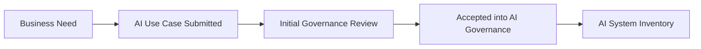

# AI Use Case Intake

## Executive Summary

Every proposed AI initiative begins with an idea, but not every idea should immediately progress into development or deployment.

The AI Use Case Intake serves as the formal entry point into the Enterprise AI Governance Program at Megastar Mortgage. Its purpose is not to govern the AI system itself, but to determine whether the proposed AI initiative should formally enter the organization's governance lifecycle.

Before inventory registration, classification, impact assessment, or risk evaluation can begin, the organization must first understand the proposed business problem, the intended use of AI, and the operational context in which the solution will operate.

This document establishes a standardized AI Use Case Intake process for the Megastar Intelligent Processor (MIP), ensuring that every proposed AI initiative enters governance through a structured, transparent, and repeatable process.

---

## Purpose

The purpose of this document is to establish a standardized intake process for all proposed AI use cases within Megastar Mortgage.

The intake process captures the business, operational, and technical information required to determine whether an AI initiative should formally enter the Enterprise AI Governance Program.

By collecting consistent information at the earliest stage of the AI lifecycle, the organization improves governance visibility, supports informed governance decisions, and establishes the foundation for all subsequent governance activities.

Successful completion of the intake process results in the creation of a governed AI system record within the Enterprise AI System Inventory, where the AI system is formally managed throughout its governance lifecycle.

---

## Intake Process

Every proposed AI initiative follows the same governance intake process before progressing to enterprise inventory registration.

Only AI use cases accepted through this process proceed into the Enterprise AI Governance Playbook.

---

## AI Use Case Intake Information

The following information is collected for every proposed AI use case.

| Information Category | Information Captured |
|----------------------|----------------------|
| General Information | Use case title, business unit, business owner, submission date, requestor |
| Business Context | Business problem, business objectives, expected business value |
| AI Solution Overview | Description of the proposed AI capability and intended operational use |
| Intended Users | Primary users and business teams expected to use the AI system |
| Business Process | Business process or workflow supported by the proposed AI solution |
| Data Overview | High-level description of the information expected to be used by the AI system |
| Technology Overview | Proposed AI technology, platform, or vendor (if known) |
| Human Involvement | Description of how people are expected to interact with or oversee the AI system |
| Expected Outputs | Expected recommendations, predictions, classifications, generated content, or other AI outputs |
| Dependencies | Known integrations with business systems or external services |
| Implementation Status | Proposed, pilot, development, production migration, or enhancement |
| Additional Notes | Supporting business information relevant to the governance review |

Information collected during intake supports the initial governance review and, where appropriate, is carried forward into the Enterprise AI System Inventory to avoid unnecessary duplication. Once accepted into governance, the AI System Inventory becomes the organization's authoritative record for the AI system throughout its lifecycle.

---

## Intake Review

Following submission, the AI Governance Lead performs an initial governance review to determine whether:

- The submission contains sufficient information.
- The proposed AI initiative falls within the organization's governance scope.
- Appropriate business ownership has been identified.
- The AI initiative should formally enter the Enterprise AI Governance Program.

This review does not evaluate risk, classify the AI system, or approve deployment. Its sole purpose is to determine whether the proposed AI initiative is ready to proceed into the Enterprise AI System Inventory.

---

## Intake Outcomes

An AI use case may result in one of the following outcomes.

| Outcome | Description |
|----------|-------------|
| Accepted | The AI initiative proceeds into the Enterprise AI System Inventory. |
| Returned for Clarification | Additional information is required before governance can continue. |
| Rejected | The proposed AI initiative falls outside the organization's governance scope or will not proceed. |

---

## Governance Principles

The AI Use Case Intake process operates according to the following principles:

- Every AI initiative enters governance through a standardized intake process.
- Governance begins before implementation.
- Information is collected once and reused throughout the governance lifecycle wherever appropriate.
- Business ownership is established before detailed governance activities begin.
- Governance decisions are based on documented information rather than assumptions.

---

## Why This Document Matters

Enterprise AI governance begins with visibility.

Without a consistent intake process, organizations struggle to identify AI initiatives, establish ownership, and collect the information required to support effective governance.

The AI Use Case Intake provides the structured entry point into enterprise AI governance, ensuring that every proposed AI initiative is evaluated consistently before progressing into the Enterprise AI System Inventory.

By establishing this governance entry point, Megastar Mortgage ensures that every subsequent governance activity begins with complete, consistent, and documented information.

---

## Related Artifacts

This document provides input to:

- AI System Inventory
- AI System Classification
- AI Impact Assessment
- AI Risk Triage

---

## Document Control

| Field | Value |
|------|------|
| Document | AI Use Case Intake |
| Capability | AI Inventory & Assessment |
| Repository | Enterprise AI Governance Playbook |
| Reference Organization | Megastar Mortgage |
| Reference AI System | Megastar Intelligent Processor (MIP) |
| Document Owner | AI Governance Lead |
| Version | 1.0 |
| Review Cycle | Annual |
| Status | Published Reference |

---

## Revision History

| Version | Date | Description |
|---------|------|-------------|
| 1.0 | July 2026 | Initial release of the AI Use Case Intake artifact. |