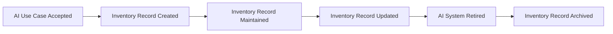

# AI System Inventory

## Executive Summary

An organization cannot govern AI systems it cannot identify.

Following acceptance into the Enterprise AI Governance Program, every AI system at Megastar Mortgage is formally registered within the Enterprise AI System Inventory. The inventory serves as the organization's authoritative record of governed AI systems, providing a consistent and centralized view of the AI portfolio throughout its lifecycle.

Rather than acting as a simple list of AI applications, the Enterprise AI System Inventory establishes a governed record for each AI system, enabling ownership, traceability, lifecycle management, and governance oversight across the organization.

This document establishes how Megastar Mortgage creates, maintains, and governs its Enterprise AI System Inventory for the Megastar Intelligent Processor (MIP).

---

## Purpose

The purpose of this document is to establish a standardized approach for creating and maintaining the Enterprise AI System Inventory.

The inventory provides a single authoritative record of AI systems operating under enterprise governance. It enables the organization to identify governed AI systems, assign ownership, maintain lifecycle information, and support subsequent governance activities through accurate and consistent system records.

The Enterprise AI System Inventory becomes the foundation upon which classification, impact assessment, risk management, controls, assurance, and monitoring activities are performed.

---

## Inventory Lifecycle

Every AI system accepted through the AI Use Case Intake process follows a consistent inventory lifecycle.

The inventory record remains active throughout the operational life of the AI system and is archived following formal retirement.

---

## Inventory Governance Principles

Megastar Mortgage governs its Enterprise AI System Inventory according to the following principles:

- Every governed AI system shall have one authoritative inventory record.
- Every inventory record shall have a unique identifier.
- Inventory records shall remain accurate, complete, and current.
- Changes to inventory records shall be authorized and traceable.
- Inventory records shall be maintained throughout the AI system lifecycle.
- Inventory information shall support governance transparency and auditability.

These principles ensure the inventory remains a trusted source of governance information across the organization.

---

## Required Inventory Information

Each inventory record contains standardized information describing the governed AI system.

| Information Category | Purpose |
|----------------------|---------|
| System Identification | Establishes the unique identity of the AI system. |
| Ownership | Identifies accountable business and technical owners. |
| Business Information | Records the business function and organizational context supported by the AI system. |
| Technical Information | Records essential information describing the AI system and its implementation. |
| Lifecycle Information | Tracks the operational status of the AI system throughout its lifecycle. |
| Governance References | Links the inventory record to related governance artifacts and activities. |

The detailed inventory fields are maintained within the **AI System Inventory Template**.

---

## Inventory Maintenance

The Enterprise AI System Inventory is maintained throughout the operational life of each governed AI system.

Inventory records are reviewed and updated whenever significant changes occur, including:

- Changes to business ownership.
- Changes to technical ownership.
- Major system modifications.
- Deployment status changes.
- Retirement of the AI system.

Maintaining current inventory information ensures that subsequent governance activities are performed using accurate and reliable information.

---

## Inventory Quality

Megastar Mortgage maintains the quality of its Enterprise AI System Inventory by ensuring that inventory records are:

- Complete.
- Accurate.
- Current.
- Consistently maintained.
- Traceable throughout the AI system lifecycle.

High-quality inventory information strengthens governance decision-making and supports audit readiness across the Enterprise AI Governance Program.

---

## Why This Document Matters

Enterprise AI governance begins with knowing which AI systems exist within the organization.

Without a centralized and governed inventory, organizations struggle to establish ownership, maintain visibility, coordinate governance activities, and demonstrate governance maturity.

The Enterprise AI System Inventory provides the authoritative governance record for every AI system operating within Megastar Mortgage. It enables governance activities to be performed consistently while supporting traceability, accountability, and lifecycle management across the enterprise AI portfolio.

---

## Related Artifacts

This document supports:

- AI System Inventory Template
- AI System Classification
- AI Impact Assessment
- AI Risk Triage

---

## Document Control

| Field | Value |
|------|------|
| Document | AI System Inventory |
| Capability | AI Inventory & Assessment |
| Repository | Enterprise AI Governance Playbook |
| Reference Organization | Megastar Mortgage |
| Reference AI System | Megastar Intelligent Processor (MIP) |
| Document Owner | AI Governance Lead |
| Version | 1.0 |
| Review Cycle | Annual |
| Status | Published Reference |

---

## Revision History

| Version | Date | Description |
|---------|------|-------------|
| 1.0 | July 2026 | Initial release of the AI System Inventory artifact. |