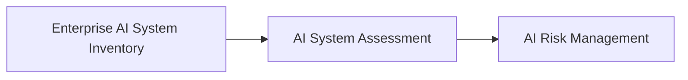

# AI System Assessment

> **Artifact Type:** Governance Assessment Standard  
> **Capability:** AI Inventory and Assessment  
> **Reference Organization:** Megastar Mortgage  
> **Reference AI System:** Megastar Intelligent Processor (MIP)  
> **Authoritative Record:** No  
> **Document Owner:** AI Governance Lead  
> **Version:** 2.0  
> **Status:** Published Reference Implementation  
> **Review Cycle:** Annual

---

# Purpose

The AI System Assessment establishes a structured governance assessment for AI systems that have entered the Enterprise AI Governance Program.

Using information recorded within the Enterprise AI System Inventory, the assessment evaluates the AI system's characteristics, potential organizational impacts, governance significance, and readiness to progress into AI Risk Management.

The assessment determines the level of governance attention required. It does not perform detailed AI Risk Management or determine residual risk.

---

# Assessment Workflow

Every governed AI system follows the same assessment workflow.

---

# Assessment Components

The AI System Assessment consists of four integrated governance activities.

| Assessment Component | Purpose |
|---|---|
| AI System Classification | Describe the characteristics of the AI system using a consistent governance methodology. |
| Organizational Impact Assessment | Evaluate the potential consequences of the AI system across key organizational impact dimensions. |
| Governance Significance | Determine the appropriate level of governance attention based upon documented assessment information. |
| Governance Recommendation | Confirm readiness to proceed into AI Risk Management together with any required conditions or escalations. |

These activities are completed as one governance assessment rather than separate governance records.

---

# Assessment Principles

The AI System Assessment operates according to the following principles:

- every governed AI system shall undergo a structured assessment;
- classification describes the AI system without assigning risk;
- impact assessment evaluates potential consequences without determining likelihood;
- governance significance is based upon documented assessment evidence;
- assessment outcomes remain proportionate, consistent, and traceable;
- detailed AI Risk Management begins only after completion of the assessment.

---

# Governance Outcomes

Completion of the AI System Assessment enables Megastar Mortgage to:

- establish a consistent understanding of the AI system;
- evaluate potential organizational impacts;
- determine governance significance;
- identify assessment observations requiring further attention;
- determine readiness to progress into AI Risk Management.

---

# Governance Recommendation

Following completion of the assessment, one of the following governance recommendations is recorded.

| Recommendation | Outcome |
|---|---|
| Proceed | The AI system is ready to enter AI Risk Management. |
| Proceed with Conditions | Additional governance actions are required before or during AI Risk Management. |
| Escalate | Governance review by the appropriate authority is required before progression. |
| Reassess | Additional assessment information is required before governance can continue. |

The recommendation represents a governance routing decision. It is not a deployment approval or a risk acceptance decision.

---

# Governance Boundary

This document owns:

- AI system classification;
- organizational impact assessment;
- governance significance;
- governance recommendation;
- readiness for AI Risk Management.

This document does not own:

- authoritative AI system records;
- detailed risk identification;
- risk ratings;
- risk treatment;
- control implementation;
- deployment approval;
- assurance activities.

Those responsibilities belong to subsequent governance capabilities.

---

# Related Artifacts

- [AI Inventory and Assessment](README.md)
- [AI Use Case Intake](01-AI-Use-Case-Intake.md)
- [Enterprise AI System Inventory](02-Enterprise-AI-System-Inventory.md)
- [AI System Assessment Template](templates/AI-System-Assessment-Template.md)
- [AI Risk Management](../04-AI-Risk-Management/README.md)
- [Governance Glossary](../00-Governance-Glossary.md)

---

# Revision History

| Version | Date | Description |
|---|---|---|
| 1.0 | July 2026 | Initial release using separate Classification, Impact Assessment, Risk Triage, and Assessment Summary artifacts. |
| 2.0 | July 2026 | Consolidated assessment activities into a single AI System Assessment, strengthened governance boundaries, and aligned the assessment workflow with the repository architecture. |