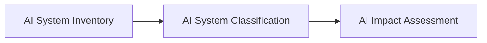

# AI System Classification

## Executive Summary

Not all AI systems are alike.

Enterprise AI systems differ in their purpose, capabilities, deployment models, levels of autonomy, intended users, and operational characteristics. Before governance activities such as impact assessment and risk evaluation can be performed consistently, organizations must first establish a common method for describing and categorizing AI systems.

The AI System Classification process provides Megastar Mortgage with a standardized approach for classifying AI systems using consistent classification dimensions. This enables governance activities to be performed using a shared understanding of the AI system while supporting consistency across the Enterprise AI Governance Program.

This document establishes the AI System Classification approach for the Megastar Intelligent Processor (MIP).

---

## Purpose

The purpose of this document is to establish a standardized approach for classifying AI systems operating within Megastar Mortgage.

Classification provides a consistent description of an AI system's characteristics without evaluating its business impact, risk, or governance requirements.

A standardized classification approach improves communication, supports governance consistency, and provides the contextual information required for subsequent assessment activities.

---

## Classification Process

Every AI system recorded within the Enterprise AI System Inventory is classified using a consistent methodology before progressing to impact assessment.

Classification establishes a common description of the AI system that supports subsequent governance activities.

---

## Classification Principles

Megastar Mortgage classifies AI systems according to the following principles:

- Every governed AI system shall be classified using a standardized methodology.
- Classification describes the characteristics of an AI system without evaluating risk or impact.
- Classification shall be applied consistently across all governed AI systems.
- Classification shall be reviewed whenever significant changes occur to the AI system.
- Classification information shall support subsequent governance activities without duplicating them.

---

## Classification Dimensions

Each AI system is classified using standardized dimensions that describe its characteristics.

| Classification Dimension | Purpose |
|---------------------------|---------|
| AI Capability | Describes the primary AI capability provided by the system. |
| Deployment Model | Describes how the AI system is deployed and delivered. |
| Primary User Group | Identifies the primary organizational users of the AI system. |
| Decision Role | Describes how AI outputs support business decisions. |
| Human Oversight Model | Describes the expected level of human involvement. |
| Operational Environment | Identifies the primary environment in which the AI system operates. |
| Data Sensitivity Category | Describes the highest category of information processed by the AI system. |

Detailed classification values are maintained within the **AI System Classification Template**.

---

## Classification Maintenance

Classification is reviewed whenever significant changes occur to the AI system, including:

- Changes to AI capabilities.
- Changes to deployment approach.
- Changes to intended users.
- Changes to operational use.
- Major enhancements to the AI system.

Maintaining current classification information ensures that subsequent governance activities continue to reflect the current characteristics of the AI system.

---

## Why This Document Matters

Enterprise AI governance requires a consistent understanding of the AI systems operating within the organization.

Without a standardized classification approach, governance activities become inconsistent, making it difficult to compare AI systems or apply governance processes consistently across the enterprise.

AI System Classification establishes a common language for describing AI systems before evaluating their potential impact or governance requirements.

---

## Related Artifacts

This document supports:

- AI System Classification Template
- AI Impact Assessment
- AI Risk Triage

---

## Document Control

| Field | Value |
|------|------|
| Document | AI System Classification |
| Capability | AI Inventory & Assessment |
| Repository | Enterprise AI Governance Playbook |
| Reference Organization | Megastar Mortgage |
| Reference AI System | Megastar Intelligent Processor (MIP) |
| Document Owner | AI Governance Lead |
| Version | 1.0 |
| Review Cycle | Annual |
| Status | Published Reference |

---

## Revision History

| Version | Date | Description |
|---------|------|-------------|
| 1.0 | July 2026 | Initial release of the AI System Classification artifact. |