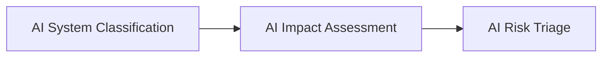

# AI Impact Assessment

## Executive Summary

Understanding an AI system is not sufficient to govern it effectively.

Organizations must also understand the potential consequences associated with its operation. An AI system may influence business processes, customers, employees, financial outcomes, regulatory obligations, privacy, or organizational reputation. Identifying these potential impacts enables governance activities to be proportionate to the significance of the AI system.

The AI Impact Assessment provides Megastar Mortgage with a structured approach for evaluating the potential organizational consequences associated with an AI system before formal risk evaluation begins.

This document establishes the AI Impact Assessment approach for the Megastar Intelligent Processor (MIP).

---

## Purpose

The purpose of this document is to establish a standardized approach for identifying and documenting the potential impacts associated with governed AI systems.

The assessment evaluates how an AI system could affect the organization, its stakeholders, and its operations without determining the likelihood of those impacts or assigning a risk rating.

By evaluating impacts consistently, Megastar Mortgage establishes the context required for subsequent AI risk evaluation and governance decision-making.

---

## Assessment Process

Every governed AI system undergoes an AI Impact Assessment following completion of AI System Classification.

The assessment documents potential organizational impacts that will be considered during subsequent governance activities.

---

## Impact Assessment Principles

Megastar Mortgage performs AI Impact Assessments according to the following principles:

- Every governed AI system shall undergo an impact assessment.
- Impact assessments evaluate potential consequences without assigning risk ratings.
- Assessments shall consider both positive and adverse organizational impacts.
- Assessments shall be performed using a consistent methodology.
- Impact assessments shall be reviewed whenever significant changes occur to the AI system.

---

## Impact Dimensions

Each AI system is assessed across standardized organizational impact dimensions.

| Impact Dimension | Purpose |
|------------------|---------|
| Business Impact | Evaluates potential effects on business operations and service delivery. |
| Customer Impact | Evaluates potential effects on customers and customer outcomes. |
| Employee Impact | Evaluates potential effects on employees and internal users. |
| Financial Impact | Evaluates potential financial consequences for the organization. |
| Privacy Impact | Evaluates potential effects on personal and confidential information. |
| Regulatory Impact | Evaluates potential implications for regulatory and legal obligations. |
| Reputational Impact | Evaluates potential effects on organizational trust and reputation. |
| Third-Party Impact | Evaluates potential effects on vendors, partners, or external service providers. |

Detailed assessment information is maintained within the **AI Impact Assessment Template**.

---

## Assessment Maintenance

The AI Impact Assessment is reviewed whenever significant changes occur to the AI system, including:

- Changes to business purpose.
- Changes to operational use.
- Expansion to new business functions.
- Significant changes to data usage.
- Major enhancements affecting organizational impact.

Maintaining current impact assessments ensures that governance decisions continue to reflect the AI system's operational context.

---

## Why This Document Matters

Not every AI system has the same organizational consequences.

Some systems may have limited operational significance, while others may influence customers, business operations, regulatory obligations, or organizational reputation.

The AI Impact Assessment enables Megastar Mortgage to understand those potential consequences before evaluating governance risk. This creates a consistent foundation for proportionate governance and informed decision-making across the Enterprise AI Governance Program.

---

## Related Artifacts

This document supports:

- AI Impact Assessment Template
- AI Risk Triage
- AI Risk Management

---

## Document Control

| Field | Value |
|------|------|
| Document | AI Impact Assessment |
| Capability | AI Inventory & Assessment |
| Repository | Enterprise AI Governance Playbook |
| Reference Organization | Megastar Mortgage |
| Reference AI System | Megastar Intelligent Processor (MIP) |
| Document Owner | AI Governance Lead |
| Version | 1.0 |
| Review Cycle | Annual |
| Status | Published Reference |

---

## Revision History

| Version | Date | Description |
|---------|------|-------------|
| 1.0 | July 2026 | Initial release of the AI Impact Assessment artifact. |