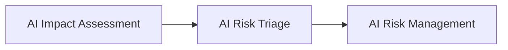

# AI Risk Triage

## Executive Summary

Not every AI system requires the same level of governance.

Following AI Intake, Inventory, Classification, and Impact Assessment, Megastar Mortgage performs an initial AI Risk Triage to determine the appropriate governance pathway for each AI system.

AI Risk Triage does not perform a detailed risk assessment or assign risk ratings. Instead, it evaluates the information collected during earlier governance activities to determine the level of governance attention required before formal AI Risk Management begins.

This document establishes the AI Risk Triage approach for the Megastar Intelligent Processor (MIP).

---

## Purpose

The purpose of this document is to establish a standardized approach for determining the appropriate governance pathway for governed AI systems.

AI Risk Triage reviews information collected during previous governance activities and determines whether an AI system should proceed through the standard governance process, receive enhanced governance oversight, or be escalated for additional review before formal AI Risk Management.

By applying a consistent triage methodology, Megastar Mortgage ensures that governance effort remains proportionate while supporting efficient governance decision-making.

---

## Triage Process

Every governed AI system undergoes AI Risk Triage following completion of the AI Impact Assessment.

The triage process determines the governance pathway for the AI system before detailed risk evaluation begins.

---

## AI Risk Triage Principles

Megastar Mortgage performs AI Risk Triage according to the following principles:

- Every governed AI system shall undergo AI Risk Triage.
- Triage determines governance routing, not risk ratings.
- Governance decisions shall be based on documented assessment information.
- Escalation decisions shall be applied consistently across AI systems.
- AI Risk Triage shall be completed before formal AI Risk Management begins.

---

## Governance Pathways

Following triage, each AI system is assigned an initial governance pathway.

| Governance Pathway | Purpose |
|--------------------|---------|
| Standard Governance | The AI system proceeds through the standard AI governance process. |
| Enhanced Governance | The AI system requires additional governance attention before progressing. |
| Governance Escalation | The AI system requires review by the appropriate governance authority before continuing. |

The detailed triage decision is maintained within the **AI Risk Triage Template**.

---

## Triage Maintenance

AI Risk Triage is reviewed whenever significant changes occur to the AI system or its operating context, including:

- Significant business changes.
- Material changes identified during impact assessment.
- Major enhancements to the AI system.
- Changes affecting governance scope.

Where appropriate, the governance pathway may be reassessed before continuing governance activities.

---

## Why This Document Matters

Enterprise AI governance should be proportionate.

Treating every AI system identically can result in unnecessary governance effort for lower-impact systems while failing to provide sufficient oversight for more significant AI initiatives.

AI Risk Triage provides a structured governance routing mechanism that directs AI systems toward an appropriate governance pathway before detailed risk evaluation begins.

---

## Related Artifacts

This document supports:

- AI Risk Triage Template
- AI Risk Management

---

## Document Control

| Field | Value |
|------|------|
| Document | AI Risk Triage |
| Capability | AI Inventory & Assessment |
| Repository | Enterprise AI Governance Playbook |
| Reference Organization | Megastar Mortgage |
| Reference AI System | Megastar Intelligent Processor (MIP) |
| Document Owner | AI Governance Lead |
| Version | 1.0 |
| Review Cycle | Annual |
| Status | Published Reference |

---

## Revision History

| Version | Date | Description |
|---------|------|-------------|
| 1.0 | July 2026 | Initial release of the AI Risk Triage artifact. |