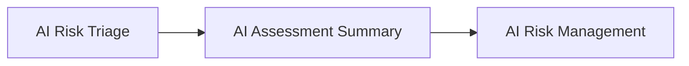

# AI Assessment Summary

## Executive Summary

The AI Inventory & Assessment capability establishes the foundational governance understanding required before detailed AI Risk Management begins.

By completing the AI Use Case Intake, AI System Inventory, AI System Classification, AI Impact Assessment, and AI Risk Triage, Megastar Mortgage develops a consistent understanding of the AI system, its operational context, and the governance pathway it should follow.

The AI Assessment Summary consolidates the outcomes of these governance activities into a single reference document, providing a structured transition from AI Inventory & Assessment to AI Risk Management.

This document establishes the AI Assessment Summary approach for the Megastar Intelligent Processor (MIP).

---

## Purpose

The purpose of this document is to consolidate the outcomes of the AI Inventory & Assessment capability into a single governance summary.

Rather than repeating information contained within individual governance artifacts, this document provides a concise overview of the completed governance activities, significant observations, and the selected governance pathway.

The AI Assessment Summary becomes the formal handover document for subsequent AI Risk Management activities.

---

## Summary Process

Every governed AI system receives an AI Assessment Summary following completion of AI Risk Triage.

The summary consolidates governance information without replacing the underlying governance artifacts.

---

## Summary Principles

Megastar Mortgage prepares AI Assessment Summaries according to the following principles:

- Every governed AI system shall have one assessment summary.
- The summary consolidates governance outcomes without duplicating source artifacts.
- Conclusions shall be supported by completed governance activities.
- The assessment summary shall serve as the formal transition into AI Risk Management.
- Updates shall reflect material changes to previous assessment outcomes.

---

## Summary Contents

Each AI Assessment Summary includes:

| Summary Area | Purpose |
|---------------|---------|
| AI System Overview | Summarizes the governed AI system. |
| Assessment Overview | Summarizes completed governance activities. |
| Key Governance Observations | Highlights notable governance considerations identified during assessment. |
| Governance Pathway | Records the governance pathway determined through AI Risk Triage. |
| Next Governance Activity | Confirms readiness to proceed into AI Risk Management. |

Detailed summary information is maintained within the **AI Assessment Summary Template**.

---

## Summary Maintenance

The AI Assessment Summary is reviewed whenever assessment outcomes change significantly or governance activities are repeated.

Where updates occur, the summary shall remain aligned with the latest approved governance artifacts.

---

## Why This Document Matters

Enterprise AI governance generates information across multiple governance activities.

Without a consolidated summary, stakeholders may need to review several governance artifacts before understanding the overall assessment outcome.

The AI Assessment Summary provides a concise governance overview that supports efficient communication while preserving the detailed evidence contained within individual governance artifacts.

---

## Related Artifacts

This document supports:

- AI Assessment Summary Template
- AI Risk Management

---

## Document Control

| Field | Value |
|------|------|
| Document | AI Assessment Summary |
| Capability | AI Inventory & Assessment |
| Repository | Enterprise AI Governance Playbook |
| Reference Organization | Megastar Mortgage |
| Reference AI System | Megastar Intelligent Processor (MIP) |
| Document Owner | AI Governance Lead |
| Version | 1.0 |
| Review Cycle | Annual |
| Status | Published Reference |

---

## Revision History

| Version | Date | Description |
|---------|------|-------------|
| 1.0 | July 2026 | Initial release of the AI Assessment Summary artifact. |