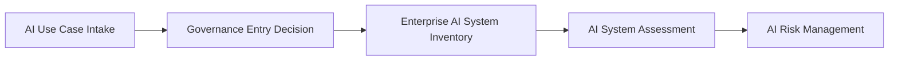

# AI Inventory and Assessment

> **Capability:** AI Inventory and Assessment  
> **Repository:** Enterprise AI Governance Playbook  
> **Reference Organization:** Megastar Mortgage  
> **Reference AI System:** Megastar Intelligent Processor (MIP)  
> **Capability Owner:** AI Governance Lead  
> **Version:** 2.0  
> **Status:** Published Reference Implementation  
> **Review Cycle:** Annual

---

# Executive Summary

Effective AI governance begins with visibility.

Before an organization can assess risk, implement controls, perform assurance, or monitor AI systems, it must first know which AI systems exist, why they exist, who owns them, and how significant they may be to the organization.

The AI Inventory and Assessment capability establishes this foundation.

Using a structured governance process, Megastar Mortgage captures proposed AI initiatives, determines whether they should formally enter governance, establishes an authoritative enterprise inventory record, and performs a structured assessment that determines the appropriate governance pathway before detailed AI Risk Management begins.

This capability establishes enterprise visibility without prematurely performing risk management activities.

---

# Purpose

The purpose of this capability is to provide a consistent governance process for bringing AI systems into enterprise governance.

The capability enables the organization to:

- establish governance visibility;
- create authoritative AI system records;
- understand the characteristics and potential organizational impact of AI systems;
- determine the appropriate governance pathway; and
- prepare AI systems for detailed AI Risk Management.

Rather than treating every AI initiative identically, this capability supports proportionate governance based upon documented assessment outcomes.

---

# Governance Workflow

Every proposed AI initiative progresses through the following governance workflow.

Each stage builds upon the previous stage while avoiding duplication of governance information.

---

# Core Artifacts

| Governance Artifact | Primary Purpose |
|---|---|
| AI Use Case Intake | Captures the proposed AI initiative and determines whether it should formally enter enterprise AI governance. |
| Enterprise AI System Inventory | Establishes the authoritative enterprise record for each governed AI system. |
| AI System Assessment | Evaluates system characteristics, organizational impact, governance significance, and readiness to progress into AI Risk Management. |

Together these artifacts establish the governance baseline required before formal AI Risk Management begins.

---

# Authoritative Governance Records

Not every artifact within this capability owns enterprise information.

| Artifact | Record Type |
|---|---|
| AI Use Case Intake | Governance entry record |
| Enterprise AI System Inventory | **Authoritative enterprise record** |
| AI System Assessment | Governance assessment record |

Once an AI initiative has been accepted into governance, the Enterprise AI System Inventory becomes the authoritative source for AI system information throughout its lifecycle.

Subsequent governance capabilities should reference the inventory rather than recreate system information.

---

# Governance Principles

This capability operates according to the following principles:

- every AI initiative enters governance through a standardized intake process;
- every governed AI system has one authoritative inventory record;
- governance information is collected once and referenced thereafter whenever practical;
- assessment determines governance significance without performing detailed risk assessment;
- governance effort remains proportionate to documented assessment outcomes;
- governance decisions remain evidence-based and traceable.

---

# Expected Outcomes

Completion of this capability enables Megastar Mortgage to establish:

- consistent governance entry for AI initiatives;
- enterprise-wide visibility of governed AI systems;
- authoritative AI system records;
- documented governance assessments;
- appropriate governance routing into AI Risk Management;
- governance evidence supporting downstream governance activities.

---

# Capability Boundary

This capability owns:

- AI governance entry;
- AI system registration;
- enterprise AI inventory;
- AI system assessment;
- governance significance;
- readiness for AI Risk Management.

This capability does **not** own:

- detailed AI risk assessment;
- risk treatment;
- control implementation;
- deployment approval;
- continuous monitoring;
- assurance conclusions.

Those responsibilities belong to subsequent governance capabilities.

---

# Framework Alignment

This capability operationalizes governance practices described by internationally recognized AI governance frameworks, including:

- NIST AI Risk Management Framework (Govern, Map)
- ISO/IEC 42001 – Artificial Intelligence Management System
- EU AI Act
- ISO 31000 – Risk Management

Rather than reproducing framework requirements, this capability demonstrates how AI systems are consistently identified, documented, and assessed before progressing into enterprise AI Risk Management.

---

# Completion Criteria

This capability is complete when:

- the AI Use Case Intake has been completed;
- a governance entry decision has been recorded;
- an Enterprise AI System Inventory record has been created;
- the AI System Assessment has been completed;
- the AI system has been determined ready to proceed into AI Risk Management.

---

# Validation Checklist

| Status | Deliverable |
|---|---|
| ☐ | AI Use Case Intake completed |
| ☐ | Governance Entry Decision recorded |
| ☐ | Enterprise AI System Inventory created |
| ☐ | AI System Assessment completed |
| ☐ | Ready for AI Risk Management |

---

# Next Capability

Following completion of this capability, the AI system progresses to **AI Risk Management**, where detailed risk identification, evaluation, treatment, and governance decisions are performed.

---

# Related Capabilities

- Governance Operating Model
- AI Risk Management
- AI Controls
- AI Assurance
- Continuous Monitoring

---

# Revision History

| Version | Date | Description |
|---|---|---|
| 1.0 | July 2026 | Initial release of the AI Inventory & Assessment capability. |
| 2.0 | July 2026 | Consolidated capability architecture, established authoritative record principles, simplified governance workflow, and aligned capability boundaries with the repository constitution. |