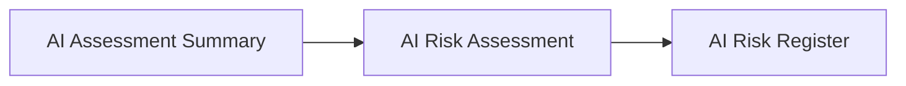

# AI Risk Assessment

## Executive Summary

Understanding an AI system is not sufficient to manage its risks.

Following completion of AI Inventory & Assessment, Megastar Mortgage performs an AI Risk Assessment to systematically identify potential events that could prevent an AI system from achieving its intended objectives or create unintended consequences for the organization and its stakeholders.

The AI Risk Assessment establishes a consistent methodology for identifying AI risks before they are documented, analyzed, prioritized, or assigned a response strategy.

This document establishes the AI Risk Assessment approach for the Megastar Intelligent Processor (MIP).

---

## Purpose

The purpose of this document is to establish a standardized approach for identifying AI risks associated with governed AI systems.

The assessment focuses on identifying potential AI risk events, understanding their source, and documenting their potential organizational consequences without determining their significance or selecting an appropriate response.

By applying a consistent risk identification methodology, Megastar Mortgage establishes the foundation for all subsequent AI risk management activities.

---

## Risk Assessment Process

Every governed AI system undergoes AI Risk Assessment following completion of the AI Assessment Summary.

The assessment identifies AI risks before they are formally documented within the Enterprise AI Risk Register.

---

## Risk Assessment Principles

Megastar Mortgage performs AI Risk Assessments according to the following principles:

- Every governed AI system shall undergo AI Risk Assessment.
- Risk identification shall follow a consistent enterprise methodology.
- Risks shall be documented before analysis or prioritization.
- Risk assessments shall consider both technical and organizational sources of AI risk.
- AI Risk Assessments shall be reviewed whenever significant changes occur to the AI system.

---

## AI Risk Categories

Megastar Mortgage identifies AI risks using standardized enterprise risk categories.

| Risk Category | Purpose |
|---------------|---------|
| Fairness & Bias | Identifies risks associated with unfair or discriminatory AI outcomes. |
| Transparency & Explainability | Identifies risks associated with insufficient transparency or explainability. |
| Privacy | Identifies risks affecting personal, confidential, or sensitive information. |
| Security | Identifies risks affecting the confidentiality, integrity, or availability of AI systems and supporting assets. |
| Safety | Identifies risks that could result in physical or operational harm. |
| Human Oversight | Identifies risks arising from insufficient human review, intervention, or accountability. |
| Reliability & Robustness | Identifies risks affecting the consistency, resilience, and dependable operation of AI systems. |
| Model Performance | Identifies risks associated with the model's ability to achieve its intended analytical objective. |
| Regulatory & Compliance | Identifies risks associated with legal, regulatory, or policy obligations. |
| Operational | Identifies risks affecting business operations, processes, or service delivery. |
| Third-Party & Vendor | Identifies risks arising from external AI providers, vendors, or service dependencies. |
| Data | Identifies risks associated with data quality, availability, integrity, lineage, or governance. |

Detailed risk information is maintained within the **AI Risk Assessment Template**.

---

## Assessment Maintenance

AI Risk Assessments are reviewed whenever significant changes occur, including:

- Changes to AI capabilities.
- Changes to business processes.
- Introduction of new data sources.
- Major model updates.
- Significant architectural or operational changes.

Maintaining current AI Risk Assessments ensures that identified risks continue to reflect the current characteristics of the AI system.

---

## Why This Document Matters

Organizations cannot manage risks they have not identified.

Without a structured AI Risk Assessment process, significant governance concerns may remain undiscovered until they affect business operations, customers, employees, or regulatory obligations.

The AI Risk Assessment establishes a consistent foundation for identifying AI risks before they are documented, analyzed, prioritized, and addressed through subsequent governance activities.

---

## Related Artifacts

This document supports:

- AI Risk Assessment Template
- AI Risk Register

---

## Document Control

| Field | Value |
|------|------|
| Document | AI Risk Assessment |
| Capability | AI Risk Management |
| Repository | Enterprise AI Governance Playbook |
| Reference Organization | Megastar Mortgage |
| Reference AI System | Megastar Intelligent Processor (MIP) |
| Document Owner | AI Governance Lead |
| Version | 1.0 |
| Review Cycle | Annual |
| Status | Published Reference |

---

## Revision History

| Version | Date | Description |
|---------|------|-------------|
| 1.0 | July 2026 | Initial release of the AI Risk Assessment artifact. |