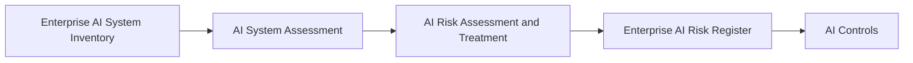

# AI Risk Assessment and Treatment

> **Artifact Type:** Governance Assessment Standard  
> **Capability:** AI Risk Management  
> **Reference Organization:** Megastar Mortgage  
> **Reference AI System:** Megastar Intelligent Processor (MIP)  
> **Authoritative Record:** No  
> **Document Owner:** AI Governance Lead  
> **Version:** 2.0  
> **Status:** Published Reference Implementation  
> **Review Cycle:** Annual

---

# Purpose

The AI Risk Assessment and Treatment establishes the enterprise methodology used to identify, analyze, evaluate, prioritize, and determine treatment strategies for AI risks.

Using information established during AI Inventory and Assessment, this artifact enables Megastar Mortgage to understand AI risks consistently before governance controls are designed or implemented.

The assessment determines the inherent significance of each identified AI risk and the organization's intended treatment strategy. It does not implement controls, determine residual risk, or formally accept risk.

---

# Assessment Workflow

Every identified AI risk follows the same governance workflow.

---

# Assessment Activities

The AI Risk Assessment and Treatment consists of five integrated governance activities.

| Assessment Activity | Purpose |
|---|---|
| Risk Identification | Identify and describe AI risks affecting the organization or stakeholders. |
| Risk Analysis | Evaluate causes, contributing factors, likelihood, and potential consequences. |
| Inherent Risk Evaluation | Determine the inherent risk level using standardized likelihood and consequence criteria. |
| Governance Prioritization | Determine governance priority and required escalation. |
| Risk Treatment Strategy | Select and document the intended treatment strategy before control design begins. |

These activities form one continuous governance assessment and should not be treated as independent governance records.

---

# Risk Management Principles

AI Risk Management operates according to the following principles.

- Every identified AI risk shall undergo a structured assessment.
- Risk decisions shall be evidence-based and proportionate.
- Inherent risk shall be evaluated before governance controls are designed.
- Professional judgment shall complement standardized assessment criteria.
- Governance decisions shall be documented and traceable.
- Formal residual-risk acceptance occurs only after controls have been implemented and evaluated.

---

# Inherent Risk Evaluation

Each identified AI risk is evaluated using standardized likelihood and consequence criteria.

The resulting **Inherent Risk Rating** represents the level of risk before governance controls are considered.

The approved inherent risk level supports governance prioritization, escalation, and treatment strategy selection.

---

# Risk Treatment Strategies

Following evaluation, each identified AI risk receives one or more treatment strategies.

| Strategy | Purpose |
|---|---|
| Avoid | Eliminate the activity introducing the risk. |
| Mitigate | Reduce the likelihood or consequences through governance measures. |
| Transfer | Allocate defined responsibilities through appropriate contractual or commercial arrangements. |
| Proposed Acceptance | Recommend retaining the risk for later formal residual-risk evaluation and approval. |

Selection of **Proposed Acceptance** does not constitute formal risk acceptance.

---

# Governance Outcomes

Completion of the AI Risk Assessment and Treatment enables Megastar Mortgage to:

- identify AI risks consistently;
- evaluate inherent risk;
- prioritize governance attention;
- determine escalation requirements;
- establish treatment direction before AI Controls;
- populate the Enterprise AI Risk Register with approved assessment outcomes.

---

# Governance Boundary

This artifact owns:

- risk identification;
- risk analysis;
- inherent risk evaluation;
- governance prioritization;
- escalation determination;
- treatment strategy selection.

This artifact does not own:

- authoritative risk records;
- implemented controls;
- control effectiveness;
- assurance activities;
- residual-risk acceptance;
- risk closure.

Those responsibilities belong to subsequent governance capabilities.

---

# Related Artifacts

- [AI Risk Management](README.md)
- [Enterprise AI Risk Register](02-Enterprise-AI-Risk-Register.md)
- [AI Risk Assessment and Treatment Template](templates/AI-Risk-Assessment-and-Treatment-Template.md)
- [AI Controls](../05-AI-Controls/README.md)
- [Governance Glossary](../00-Governance-Glossary.md)

---

# Revision History

| Version | Date | Description |
|---|---|---|
| 1.0 | July 2026 | Initial release using separate assessment, analysis, prioritization, and response artifacts. |
| 2.0 | July 2026 | Consolidated the complete risk assessment workflow into a single governance artifact aligned with repository architecture. |