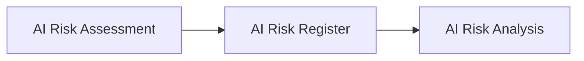

# AI Risk Register

## Executive Summary

Identifying AI risks is only the first step in effective risk management.

Once AI risks have been identified, they must be formally recorded and maintained as a living governance record that evolves throughout the AI governance lifecycle. As additional governance activities are completed, the AI Risk Register is progressively enriched with analysis, prioritization, response strategies, governance controls, assurance outcomes, and ongoing monitoring information.

The AI Risk Register serves as Megastar Mortgage's authoritative enterprise record of identified AI risks associated with the Megastar Intelligent Processor (MIP). It provides a structured, traceable, and continuously maintained repository supporting governance decision-making from initial risk identification through final risk closure.

This document establishes the AI Risk Register approach for the Enterprise AI Governance Program.

---

## Purpose

The purpose of this document is to establish a standardized approach for maintaining the Enterprise AI Risk Register.

The register provides a single authoritative and continuously maintained record of identified AI risks. Rather than representing a one-time assessment, the AI Risk Register evolves as additional governance activities are completed, ensuring that the organization's understanding of each AI risk remains accurate, current, and fully traceable throughout its governance lifecycle.

The AI Risk Register serves as the enterprise source of record supporting AI Risk Analysis, AI Risk Prioritization, AI Risk Response Strategy, AI Controls, AI Assurance, and Continuous Monitoring.

---

## Risk Register Process

Every AI risk identified during AI Risk Assessment is formally recorded within the Enterprise AI Risk Register.

The register establishes the official governance record for every identified AI risk and is progressively updated as governance activities continue.

---

## Risk Register Principles

Megastar Mortgage maintains its AI Risk Register according to the following principles:

- The AI Risk Register is a living governance record that is progressively enriched throughout the AI governance lifecycle.
- Every identified AI risk shall have one authoritative risk record.
- Every risk record shall have a unique identifier.
- Risk records shall remain accurate, complete, and current.
- Changes to risk records shall be authorized and traceable.
- Risk records shall be maintained throughout the governance lifecycle.
- Risk information shall support governance transparency and auditability.

---

## Progressive Risk Record

The Enterprise AI Risk Register is progressively enriched as governance activities are completed throughout the AI Governance Program.

| Governance Activity | Register Information Added |
|----------------------|----------------------------|
| AI Risk Assessment | Risk identification information |
| AI Risk Analysis | Risk analysis information |
| AI Risk Prioritization | Priority and escalation decisions |
| AI Risk Response Strategy | Response strategy information |
| AI Controls | Governance control implementation information |
| AI Assurance | Assurance outcomes and residual risk information |
| Continuous Monitoring | Monitoring activities, risk acceptance, review, and closure information |

This progressive approach enables Megastar Mortgage to maintain a single enterprise risk record rather than creating multiple disconnected governance documents throughout the AI risk management lifecycle.

---

## Required Risk Information

Each risk record contains standardized information describing the identified AI risk and is progressively enriched throughout the governance lifecycle.

| Information Category | Purpose |
|----------------------|---------|
| Risk Identification | Establishes the unique identity of the AI risk. |
| Risk Analysis | Records the analysis performed to understand the identified AI risk, including contributing factors, likelihood, potential consequences, and supporting observations. |
| Risk Prioritization | Records governance priority and escalation decisions. |
| Risk Response Strategy | Records the selected strategic response for the identified AI risk. |
| Governance Controls | Records implemented governance controls. |
| Assurance | Records assurance outcomes and residual risk information. |
| Monitoring & Closure | Records monitoring activities, risk acceptance, review history, and closure information. |

The detailed risk record fields are maintained within the **AI Risk Register Template**.

---

## Register Maintenance

The Enterprise AI Risk Register is progressively updated as governance activities are completed throughout the AI Governance Program.

Each governance capability contributes additional information to the existing enterprise risk record rather than creating duplicate governance records.

Risk records are reviewed and updated whenever:

- New information becomes available.
- AI systems change significantly.
- Risk analysis identifies additional context.
- Governance decisions change.
- Governance controls are implemented.
- Assurance activities are completed.
- Monitoring activities identify changes requiring record updates.
- Risk records are accepted or closed.

Maintaining current risk records ensures that governance decisions are based upon accurate, current, and traceable enterprise risk information.

---

## Why This Document Matters

Enterprise AI governance depends on maintaining an accurate and trustworthy record of identified AI risks.

Without a centralized AI Risk Register, organizations may duplicate effort, lose visibility of previously identified risks, or struggle to demonstrate governance oversight across the AI lifecycle.

The AI Risk Register establishes the authoritative enterprise record of AI risks, supporting governance traceability, organizational transparency, and informed decision-making throughout the Enterprise AI Governance Program.

By maintaining a single living governance record rather than multiple disconnected documents, Megastar Mortgage preserves a complete and auditable history of every identified AI risk from initial identification through final closure.

---

## Related Artifacts

This document supports:

- AI Risk Register Template
- AI Risk Analysis

---

## Document Control

| Field | Value |
|------|------|
| Document | AI Risk Register |
| Capability | AI Risk Management |
| Repository | Enterprise AI Governance Playbook |
| Reference Organization | Megastar Mortgage |
| Reference AI System | Megastar Intelligent Processor (MIP) |
| Document Owner | AI Governance Lead |
| Version | 1.0 |
| Review Cycle | Annual |
| Status | Published Reference |

---

## Revision History

| Version | Date | Description |
|---------|------|-------------|
| 1.0 | July 2026 | Initial release of the AI Risk Register artifact. |