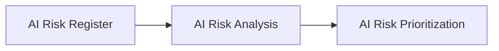

# AI Risk Analysis

## Executive Summary

Identifying AI risks establishes what uncertainties exist. Understanding those risks requires a structured analysis of why they could occur, how likely they are to occur, and the potential consequences they may create for the organization and its stakeholders.

Following AI Risk Assessment and registration within the Enterprise AI Risk Register, Megastar Mortgage performs AI Risk Analysis to develop a deeper understanding of each identified AI risk before governance priorities and response strategies are determined.

The AI Risk Analysis establishes a consistent methodology for analyzing identified AI risks, enabling governance decisions to be informed by evidence rather than assumptions.

This document establishes the AI Risk Analysis approach for the Megastar Intelligent Processor (MIP).

---

## Purpose

The purpose of this document is to establish a standardized approach for analyzing identified AI risks.

The analysis focuses on understanding the characteristics of each identified risk by examining its contributing factors, estimating its likelihood, evaluating its potential consequences, and documenting supporting observations.

The AI Risk Analysis does not determine governance priority or prescribe response strategies. Its purpose is to provide the information required for those decisions to be made consistently during subsequent governance activities.

---

## Risk Analysis Process

Every identified AI risk undergoes AI Risk Analysis following registration within the Enterprise AI Risk Register.

The analysis progressively enriches the Enterprise AI Risk Register with additional information describing each identified AI risk.

---

## Risk Analysis Principles

Megastar Mortgage performs AI Risk Analysis according to the following principles:

- Every identified AI risk shall undergo structured analysis.
- Risk analysis shall be evidence-based and consistently applied.
- Analysis shall improve understanding of identified risks without determining governance priority.
- Analysis shall distinguish observed evidence from assumptions where appropriate.
- AI Risk Analysis shall be reviewed whenever significant changes occur to the AI system or the identified risk.

---

## Risk Analysis Components

Each identified AI risk is analyzed using standardized enterprise analysis components.

| Analysis Component | Purpose |
|--------------------|---------|
| Contributing Factors | Identifies conditions or circumstances that contribute to the identified AI risk. |
| Likelihood | Estimates the probability of the identified AI risk occurring. |
| Potential Consequences | Evaluates the organizational consequences if the identified AI risk occurs. |
| Analysis Notes | Records supporting observations, assumptions, evidence, and additional analysis information. |

The detailed analysis fields are maintained within the **AI Risk Analysis Template** and progressively update the Enterprise AI Risk Register.

---

## Analysis Maintenance

AI Risk Analysis is reviewed whenever significant changes occur, including:

- Changes to AI capabilities.
- Changes to business processes.
- Introduction of new data sources.
- Significant model updates.
- New evidence affecting previously completed analysis.
- Material changes identified through governance monitoring.

Maintaining current AI Risk Analysis ensures that governance decisions continue to reflect the current characteristics of identified AI risks.

---

## Why This Document Matters

Effective governance depends upon understanding risks before making governance decisions.

Without structured AI Risk Analysis, organizations may prioritize risks inconsistently, underestimate significant governance concerns, or determine response strategies without sufficient evidence.

The AI Risk Analysis enables Megastar Mortgage to understand identified AI risks consistently before governance priorities are established and response strategies are determined.

---

## Related Artifacts

This document supports:

- AI Risk Analysis Template
- AI Risk Prioritization
- Enterprise AI Risk Register

---

## Document Control

| Field | Value |
|------|------|
| Document | AI Risk Analysis |
| Capability | AI Risk Management |
| Repository | Enterprise AI Governance Playbook |
| Reference Organization | Megastar Mortgage |
| Reference AI System | Megastar Intelligent Processor (MIP) |
| Document Owner | AI Governance Lead |
| Version | 1.0 |
| Review Cycle | Annual |
| Status | Published Reference |

---

## Revision History

| Version | Date | Description |
|---------|------|-------------|
| 1.0 | July 2026 | Initial release of the AI Risk Analysis artifact. |