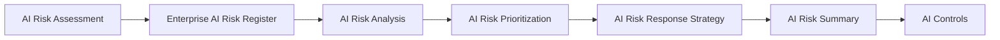

# AI Risk Summary

## Executive Summary

AI Risk Management produces multiple governance outputs across risk identification, registration, analysis, prioritization, and response-strategy selection. Before governance controls are designed, these outcomes must be consolidated into a clear view of the AI risk landscape.

The AI Risk Summary provides Megastar Mortgage with an executive-level overview of the risks identified for the Megastar Intelligent Processor (MIP). It summarizes the distribution of risks by category, governance priority, escalation status, and selected response strategy without duplicating the detailed records maintained within the Enterprise AI Risk Register.

This document serves as the formal handoff from AI Risk Management to AI Controls by confirming which risks require control design, which risks require additional governance attention, and whether the completed risk-management information is sufficient for the next capability to begin.

---

## Purpose

The purpose of this document is to establish a standardized approach for consolidating the outcomes of AI Risk Management.

The AI Risk Summary enables governance stakeholders to understand the overall risk profile of an AI system without reviewing every individual risk record. It presents portfolio-level information derived from the Enterprise AI Risk Register and highlights the governance matters requiring attention before control activities begin.

The summary does not replace the Enterprise AI Risk Register, individual risk assessments, analysis records, prioritization decisions, or response strategies. Those artifacts remain the authoritative sources for detailed risk information.

---

## Summary Process

The AI Risk Summary is prepared after risk response strategies have been established for all identified risks.

The summary consolidates completed risk-management outcomes and confirms readiness to proceed into AI Controls.

---

## Summary Principles

Megastar Mortgage prepares AI Risk Summaries according to the following principles:

- Every governed AI system shall have an AI Risk Summary before progressing into AI Controls.
- The summary shall aggregate approved information from the Enterprise AI Risk Register.
- Individual risk records shall not be duplicated within the summary.
- Summary information shall remain traceable to the authoritative risk records from which it was derived.
- Governance observations shall distinguish factual register information from professional judgment.
- Outstanding risk-management activities shall be identified before the system proceeds into AI Controls.
- The summary shall not prescribe controls, calculate residual risk, or constitute formal risk acceptance.

---

## Summary Scope

The AI Risk Summary consolidates the following information:

| Summary Area | Purpose |
|---|---|
| Risk Portfolio Overview | Presents the total number and current status of identified AI risks. |
| Risk Category Distribution | Summarizes identified risks across the approved enterprise AI risk taxonomy. |
| Governance Priority Distribution | Summarizes risks classified as Low, Medium, High, or Critical. |
| Escalation Overview | Identifies risks requiring additional governance or executive attention. |
| Response Strategy Distribution | Summarizes the approved strategic responses selected for identified risks. |
| Key Governance Observations | Highlights material themes, concentrations, dependencies, or unresolved matters. |
| Readiness for AI Controls | Confirms whether the risk-management outputs are sufficiently complete for control design to begin. |

---

## Risk Portfolio Overview

The portfolio overview provides a consolidated view of the risks associated with the governed AI system.

Typical information includes:

- Total risks identified.
- Number of open risk records.
- Number of risks by enterprise risk category.
- Number of Critical, High, Medium, and Low risks.
- Number of risks requiring escalation.
- Number of risks assigned to each response strategy.
- Number of risks requiring control design.
- Number of risk-management activities that remain incomplete.

The underlying Enterprise AI Risk Register remains the authoritative source for all individual risk records.

---

## Governance Priority Overview

Governance priority information is summarized using the approved prioritization levels.

| Governance Priority | Summary Purpose |
|---|---|
| Critical | Identifies risks requiring immediate governance attention and escalation. |
| High | Identifies risks requiring significant and timely governance action. |
| Medium | Identifies risks requiring active management through standard governance processes. |
| Low | Identifies risks suitable for proportionate and routine governance oversight. |

The summary presents the distribution of risks across these levels without recalculating or changing the approved priority of any individual risk.

---

## Response Strategy Overview

The summary consolidates the response strategies approved during AI Risk Response Strategy.

| Response Strategy | Summary Purpose |
|---|---|
| Avoid | Identifies risks addressed by discontinuing, prohibiting, or materially changing the associated activity. |
| Mitigate | Identifies risks requiring governance, operational, technical, or human measures. |
| Transfer | Identifies risks involving contractual, commercial, insurance, or other allocation mechanisms. |
| Proposed Acceptance | Identifies risks proposed for retention, subject to later control, assurance, residual-risk, and formal-approval requirements. |

A Proposed Acceptance strategy does not constitute formal risk acceptance.

---

## Key Governance Observations

The AI Risk Summary may highlight material observations such as:

- Concentration of risks within a particular AI risk category.
- Multiple risks arising from a common data, vendor, model, or operational dependency.
- Critical or High risks requiring accelerated governance action.
- Risks requiring cross-functional coordination.
- Risks subject to unresolved escalation.
- Response strategies dependent upon future control design.
- Gaps in supporting evidence or incomplete risk-management activities.

Governance observations provide context for decision-makers but do not replace the underlying approved risk records.

---

## Readiness for AI Controls

An AI system is ready to proceed into AI Controls when:

- All identified risks have been recorded within the Enterprise AI Risk Register.
- AI Risk Analysis has been completed for each identified risk.
- Governance priorities have been approved.
- Required escalations have been completed or formally tracked.
- A response strategy has been documented for each prioritized risk.
- Outstanding information does not prevent control design from beginning.
- Risks requiring mitigation have been clearly identified for AI Control Objectives and subsequent control design.

Where these conditions are not met, the AI Risk Summary records the outstanding requirements and the responsible governance function before progression.

---

## Handoff to AI Controls

AI Risk Management determines:

- which risks exist;
- how those risks are understood;
- which risks require the greatest governance attention; and
- what strategic response the organization intends to pursue.

AI Controls translates approved AI Risk Response Strategies into clearly defined AI Control Objectives, detailed control designs, governed control records, and implementation plans that reduce prioritized AI risks. These governance controls subsequently become subject to assurance activities that evaluate their effectiveness throughout the AI governance lifecycle.

The AI Risk Summary provides the formal transition between these two capabilities.

---

## Summary Maintenance

The AI Risk Summary shall be reviewed when:

- new risks are identified;
- approved priorities change;
- escalation decisions change materially;
- response strategies are revised;
- risk-management activities are repeated following a significant system change; or
- the existing summary no longer reflects the current Enterprise AI Risk Register.

Updates shall remain traceable to the approved source records.

---

## Why This Document Matters

Detailed risk records are necessary for governance execution, but decision-makers also require a concise understanding of the overall risk landscape.

Without a consolidated summary, significant themes, concentrations, escalations, and readiness gaps may remain hidden across multiple individual risk records.

The AI Risk Summary enables Megastar Mortgage to communicate the outcome of AI Risk Management clearly, preserve traceability to authoritative records, and begin AI Controls with a complete and evidence-based understanding of the risks requiring action.

---

## Related Artifacts

This document supports:

- AI Risk Summary Template
- Enterprise AI Risk Register
- AI Risk Response Strategy
- AI Controls

---

## Document Control

| Field | Value |
|---|---|
| Document | AI Risk Summary |
| Capability | AI Risk Management |
| Repository | Enterprise AI Governance Playbook |
| Reference Organization | Megastar Mortgage |
| Reference AI System | Megastar Intelligent Processor (MIP) |
| Document Owner | AI Governance Lead |
| Version | 1.0 |
| Review Cycle | Annual |
| Status | Published Reference |

---

## Revision History

| Version | Date | Description |
|---|---|---|
| 1.0 | July 2026 | Initial release of the AI Risk Summary artifact. |