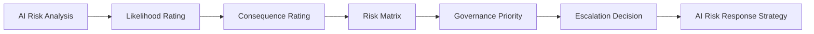

# AI Risk Prioritization

## Executive Summary

AI Risk Analysis establishes an evidence-based understanding of each identified risk, including its contributing factors, likelihood, and potential consequences. The next governance decision is determining which risks require attention first.

Megastar Mortgage performs AI Risk Prioritization by applying standardized likelihood and consequence criteria to the completed analysis of each risk. The resulting priority supports consistent escalation, governance focus, and allocation of organizational attention before a risk response strategy is selected.

The priority established during this activity represents the risk’s **pre-control governance priority**. It does not represent residual risk, which can only be determined after controls have been implemented and evaluated.

This document establishes the AI Risk Prioritization approach for the Megastar Intelligent Processor (MIP).

---

## Purpose

The purpose of this document is to establish a consistent method for prioritizing identified AI risks.

AI Risk Prioritization uses the evidence developed during AI Risk Analysis to:

- assign standardized likelihood and consequence ratings;
- determine an initial governance priority;
- identify risks requiring escalation; and
- document the rationale supporting the prioritization decision.

This activity does not determine the risk response strategy, prescribe controls, or evaluate residual risk. Those decisions occur during subsequent governance activities.

---

## Risk Prioritization Process

Every analyzed AI risk undergoes prioritization before a response strategy is selected.

The approved priority and escalation decision progressively enrich the corresponding record within the Enterprise AI Risk Register.

---

## Risk Prioritization Principles

Megastar Mortgage performs AI Risk Prioritization according to the following principles:

- Every analyzed AI risk shall receive a documented governance priority.
- Prioritization shall use standardized likelihood and consequence criteria.
- Ratings shall be supported by the evidence and analysis already completed.
- The risk matrix shall inform professional judgment rather than replace it.
- Any adjustment to the matrix-derived priority shall be documented and justified.
- Critical risks shall be escalated immediately through the established governance structure.
- Prioritization shall occur before selection of a risk response strategy.
- The priority assigned at this stage shall not be presented as residual risk.

---

## Likelihood Scale

Likelihood reflects the reasonable probability that the identified risk event could occur within the relevant business and operational context.

| Rating | Likelihood | Description |
|---:|---|---|
| 1 | Rare | The risk event is highly unlikely and would occur only under exceptional circumstances. |
| 2 | Unlikely | The risk event could occur, but available evidence indicates that occurrence is not expected. |
| 3 | Possible | The risk event may occur under plausible operating conditions. |
| 4 | Likely | The risk event is expected to occur in several relevant circumstances. |
| 5 | Almost Certain | The risk event is expected to occur frequently or under normal operating conditions. |

The selected rating shall be supported by the likelihood analysis, available evidence, historical observations, known dependencies, and documented assumptions.

---

## Consequence Scale

Consequence reflects the significance of the potential organizational effects if the identified risk event occurs.

| Rating | Consequence | Description |
|---:|---|---|
| 1 | Insignificant | Limited effect that can be resolved through routine operational activity with no material stakeholder consequence. |
| 2 | Minor | Localized or short-term effect requiring limited management attention. |
| 3 | Moderate | Meaningful effect on operations, stakeholders, obligations, or service delivery requiring coordinated management action. |
| 4 | Major | Significant effect on customers, employees, operations, financial outcomes, privacy, regulatory obligations, or organizational trust. |
| 5 | Severe | Extensive or sustained consequence involving material harm, major regulatory exposure, significant business disruption, or serious loss of trust. |

The consequence rating is based on the potential consequences documented during AI Risk Analysis. It does not repeat the earlier AI Impact Assessment; it converts the risk-specific consequence analysis into a standardized prioritization input.

---

## Risk Matrix

The likelihood and consequence ratings are combined using the following 5 × 5 matrix.

| Likelihood ↓ / Consequence → | 1 — Insignificant | 2 — Minor | 3 — Moderate | 4 — Major | 5 — Severe |
|---|---|---|---|---|---|
| **5 — Almost Certain** | Medium | High | High | Critical | Critical |
| **4 — Likely** | Medium | Medium | High | High | Critical |
| **3 — Possible** | Low | Medium | Medium | High | High |
| **2 — Unlikely** | Low | Low | Medium | Medium | High |
| **1 — Rare** | Low | Low | Low | Medium | Medium |

The matrix produces an initial governance priority. Where professional judgment indicates that the matrix result does not adequately reflect the organizational context, the priority may be adjusted with documented rationale and appropriate governance approval.

---

## Governance Priority Levels

| Priority | Governance Meaning | Expected Attention |
|---|---|---|
| Critical | The risk may create severe organizational or stakeholder consequences and requires immediate governance attention. | Immediate escalation and expedited response-strategy determination. |
| High | The risk requires significant cross-functional governance attention and timely action. | Formal governance review and prioritized response-strategy determination. |
| Medium | The risk requires active management through the standard governance process. | Planned response-strategy determination and routine governance oversight. |
| Low | The risk can be managed through proportionate and routine governance oversight. | Standard progression and periodic review. |

Priority determines the urgency and level of governance attention. It does not itself determine whether the risk will be avoided, mitigated, transferred, or accepted.

---

## Escalation Determination

Escalation is determined after the initial governance priority has been established.

Escalation is required when:

- the risk receives a Critical priority;
- the risk may result in severe customer, regulatory, privacy, safety, financial, or operational consequences;
- the risk exceeds delegated decision authority;
- material disagreement exists between governance stakeholders; or
- executive direction is required before governance can proceed.

High-priority risks may also be escalated where the organizational context warrants additional oversight.

The escalation decision and supporting rationale are recorded in the Enterprise AI Risk Register.

---

## Risk Register Enrichment

AI Risk Prioritization updates the following fields within the living Enterprise AI Risk Register:

| Risk Register Field | Information Added |
|---|---|
| Priority | Approved governance priority assigned using the risk matrix and professional judgment. |
| Escalation Required | Whether the risk requires review by a higher governance authority. |
| Prioritization Rationale | Evidence and reasoning supporting the priority and escalation decision. |

No response strategy, control, assurance outcome, residual-risk rating, or acceptance decision is recorded during this activity.

---

## Prioritization Maintenance

AI Risk Prioritization shall be reviewed when:

- the likelihood assessment materially changes;
- new or revised consequences are identified;
- the AI system or its operating environment changes significantly;
- new evidence alters the understanding of the risk;
- governance monitoring identifies a material change; or
- the existing priority no longer reflects the current organizational context.

Any revised priority shall be documented and reflected in the Enterprise AI Risk Register.

---

## Why This Document Matters

Risk identification and analysis do not, by themselves, tell an organization where to focus its attention.

Without a consistent prioritization method, governance effort may be allocated according to individual judgment, visibility, or urgency rather than the significance of the underlying risk.

AI Risk Prioritization enables Megastar Mortgage to compare risks using common criteria, escalate significant concerns consistently, and direct governance attention toward the risks that matter most before determining an appropriate response strategy.

---

## Related Artifacts

This document supports:

- AI Risk Prioritization Template
- Enterprise AI Risk Register
- AI Risk Response Strategy

---

## Document Control

| Field | Value |
|---|---|
| Document | AI Risk Prioritization |
| Capability | AI Risk Management |
| Repository | Enterprise AI Governance Playbook |
| Reference Organization | Megastar Mortgage |
| Reference AI System | Megastar Intelligent Processor (MIP) |
| Document Owner | AI Governance Lead |
| Version | 1.0 |
| Review Cycle | Annual |
| Status | Published Reference |

---

## Revision History

| Version | Date | Description |
|---|---|---|
| 1.0 | July 2026 | Initial release of the AI Risk Prioritization artifact. |