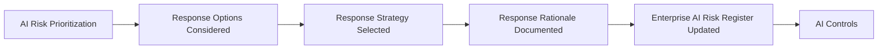

# AI Risk Response Strategy

## Executive Summary

AI Risk Prioritization determines which identified risks require the greatest governance attention. The next step is deciding how the organization intends to respond before governance controls are selected, designed, or implemented.

Megastar Mortgage establishes an AI Risk Response Strategy for each prioritized risk associated with the Megastar Intelligent Processor (MIP). The strategy records the organization’s intended direction for addressing the risk and provides the formal bridge between AI Risk Management and AI Controls.

This activity does not design controls, calculate residual risk, or constitute formal risk acceptance. It establishes whether the prioritized risk should be avoided, mitigated, transferred, or proposed for acceptance, together with the rationale supporting that direction.

This document establishes the AI Risk Response Strategy approach used within the Enterprise AI Governance Program.

---

## Purpose

The purpose of this document is to establish a standardized approach for selecting and documenting an appropriate strategic response to each prioritized AI risk.

The selected response strategy communicates the organization’s governance intent before implementation activities begin. It enables subsequent control design and related governance actions to remain aligned with the risk’s priority, organizational context, and approved direction.

AI Risk Response Strategy does not prescribe individual controls or approve residual risk. Those activities occur after the selected response has been implemented and evaluated through later governance capabilities.

---

## Response Strategy Process

Every prioritized AI risk receives a documented response strategy before progressing into AI Controls.

The selected strategy and its supporting rationale progressively enrich the corresponding record within the Enterprise AI Risk Register.

---

## Response Strategy Principles

Megastar Mortgage establishes AI Risk Response Strategies according to the following principles:

- Every prioritized AI risk shall have a documented response strategy.
- The selected strategy shall reflect the approved governance priority and organizational context.
- Response decisions shall be evidence-based, proportionate, and traceable.
- The strategy shall define governance direction without prematurely prescribing individual controls.
- More than one response strategy may be used where different aspects of a risk require different treatment.
- A proposed acceptance strategy shall not constitute formal acceptance of residual risk.
- Response strategies shall be reviewed when the risk, AI system, or organizational context changes materially.

---

## Response Strategy Options

| Response Strategy | Meaning | Typical Consideration |
|---|---|---|
| Avoid | Discontinue, prohibit, or materially change the activity so that the identified risk is no longer introduced. | Appropriate where the exposure is unacceptable, the activity cannot be governed proportionately, or the expected value does not justify proceeding. |
| Mitigate | Reduce the likelihood or potential consequences of the risk through governance, operational, technical, or human measures. | Appropriate where the activity should continue and practical measures can reduce the exposure. |
| Transfer | Allocate defined responsibilities or financial exposure to another party through contractual, commercial, or insurance arrangements. | Appropriate where specific responsibilities or losses can be legitimately allocated, while recognizing that organizational accountability cannot always be fully transferred. |
| Proposed Acceptance | Retain the risk without additional treatment at this stage because it appears to fall within organizational tolerance or further treatment is not proportionate. | Appropriate only as a proposed strategy and subject to later evaluation of controls, residual risk, and formal approval by the appropriate authority. |

---

## Strategy Selection Considerations

The response strategy is selected using the information established through earlier risk management activities.

Relevant considerations include:

- The approved governance priority.
- The nature and source of the risk.
- The likelihood and potential consequences documented during AI Risk Analysis.
- Organizational objectives and operational dependencies.
- Legal, regulatory, contractual, privacy, security, and policy obligations.
- The feasibility and proportionality of potential responses.
- The organization’s delegated authority and risk tolerance.
- The possibility that one response could introduce new or secondary risks.

These considerations support professional judgment but do not replace the organization’s established decision rights.

---

## Combined Response Strategies

Some AI risks may require more than one strategic response.

For example, Megastar Mortgage may:

- avoid a specific high-exposure use while mitigating a lower-exposure use;
- mitigate operational exposure while transferring defined financial exposure contractually; or
- mitigate selected aspects of a risk while proposing acceptance of the remaining exposure for later approval.

Where combined strategies are selected, each strategy and its intended scope shall be clearly documented.

---

## Proposed Acceptance Boundary

A **Proposed Acceptance** response means that the organization does not currently intend to avoid, mitigate, or transfer the identified risk.

It does not mean that the risk has been formally accepted.

Formal risk acceptance can occur only after:

- relevant controls have been implemented where applicable;
- control effectiveness has been evaluated;
- residual risk has been determined; and
- the appropriate decision authority has approved the remaining exposure.

This distinction preserves the boundary between strategic response selection and final residual-risk acceptance.

---

## Enterprise AI Risk Register Enrichment

AI Risk Response Strategy updates only the following fields within the living Enterprise AI Risk Register:

| Risk Register Field | Information Added |
|---|---|
| Response Strategy | The approved strategic response selected for the prioritized AI risk. |
| Response Rationale | The evidence, considerations, and reasoning supporting the selected strategy. |

Control objectives, implemented controls, control effectiveness, residual risk, and formal acceptance decisions are populated during later governance capabilities.

---

## Strategy Maintenance

The AI Risk Response Strategy shall be reviewed when:

- the approved governance priority changes;
- new evidence changes the understanding of the risk;
- the AI system or its operating environment changes materially;
- the selected strategy is no longer feasible or proportionate;
- legal, regulatory, contractual, or organizational requirements change; or
- later governance activities identify a need to revise the intended response.

Any revised strategy shall be documented and reflected in the Enterprise AI Risk Register.

---

## Why This Document Matters

Risk prioritization establishes where governance attention is needed, but it does not determine what the organization intends to do.

Without a documented response strategy, control design may become disconnected from the risk it is intended to address, resources may be applied inconsistently, and governance decisions may lack traceability.

AI Risk Response Strategy provides the formal bridge between risk understanding and control implementation. It ensures that Megastar Mortgage enters the AI Controls capability with a clear, approved, and evidence-based direction for each prioritized AI risk.

---

## Related Artifacts

This document supports:

- AI Risk Response Strategy Template
- Enterprise AI Risk Register
- AI Risk Summary
- AI Controls

---

## Document Control

| Field | Value |
|---|---|
| Document | AI Risk Response Strategy |
| Capability | AI Risk Management |
| Repository | Enterprise AI Governance Playbook |
| Reference Organization | Megastar Mortgage |
| Reference AI System | Megastar Intelligent Processor (MIP) |
| Document Owner | AI Governance Lead |
| Version | 1.0 |
| Review Cycle | Annual |
| Status | Published Reference |

---

## Revision History

| Version | Date | Description |
|---|---|---|
| 1.0 | July 2026 | Initial release of the AI Risk Response Strategy artifact. |