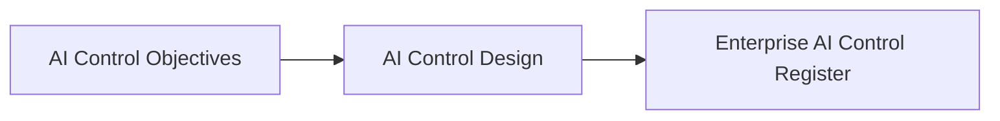

# AI Control Design

## Executive Summary

AI Control Objectives establish the governance outcomes that Megastar Mortgage intends to achieve in response to prioritized AI risks. AI Control Design translates those objectives into practical governance controls that can later be registered, implemented, and evaluated.

A control design defines how an approved AI Control Objective will be achieved without prescribing implementation planning, assurance activities, or continuous monitoring.

The resulting design provides a structured blueprint that ensures governance controls are consistent, repeatable, proportionate, and traceable to the AI risks they address.

This document establishes the AI Control Design approach for the Megastar Intelligent Processor (MIP).

---

## Purpose

The purpose of this document is to establish a standardized approach for designing AI governance controls.

AI Control Design translates approved AI Control Objectives into practical control designs that are suitable for registration within the Enterprise AI Control Register and subsequent implementation.

This activity defines the design of the governance control itself. It does not assign implementation responsibilities, prescribe rollout activities, establish testing procedures, or evaluate control effectiveness.

---

## Control Design Process

Every approved AI Control Objective progresses through a standardized control design process.

The approved design establishes the governance blueprint for each AI control before implementation activities begin.

---

## Control Design Principles

Megastar Mortgage designs AI governance controls according to the following principles:

- Every approved AI Control Objective shall have an appropriate control design.
- Control designs shall directly support the approved governance objective.
- Control designs shall be proportionate to the associated AI risk.
- Control designs shall remain technology-neutral wherever practical.
- Control designs shall be sufficiently detailed to support consistent implementation.
- Control designs shall remain traceable to the related AI risk and AI Control Objective.
- Control designs shall be reviewed whenever the objective, AI system, or operating context changes materially.

---

## Control Design Components

Every AI control design documents the following information.

| Design Component | Purpose |
|---|---|
| Control Objective | References the approved governance objective addressed by the control. |
| Control Logic | Describes how the control achieves the objective. |
| Control Type | Classifies the control as Preventive, Detective, Corrective, or Compensating. |
| Control Scope | Defines where the control applies. |
| Control Dependencies | Identifies prerequisites required for the control to operate correctly. |
| Design Assumptions | Documents assumptions that influenced the design. |
| Design Constraints | Documents known limitations affecting the control design. |

The detailed design information is maintained within the AI Control Design Template.

---

## Control Types

AI governance controls may be designed as one or more of the following types.

| Control Type | Purpose |
|---|---|
| Preventive | Prevents undesirable AI outcomes before they occur. |
| Detective | Identifies AI governance issues requiring attention. |
| Corrective | Restores acceptable governance conditions after an issue is identified. |
| Compensating | Provides an alternative governance measure where the preferred approach is not feasible. |

Control type describes the intended behavior of the control rather than its implementation method.

---

## Control Domain Classification

Approved control designs may support one or more governance domains.

Examples include:

- Human Oversight
- Privacy & Data Governance
- Security & Access Control
- Model Lifecycle
- Incident Management
- Change Management
- Transparency
- Accountability
- Fairness
- Data Quality
- Reliability & Robustness
- Model Performance
- Third-Party Governance

Control domains provide governance classification and reporting. They do not create separate control documents.

---

## Design Readiness

An AI control design is considered ready for registration when:

- the related AI Control Objective has been approved;
- the control logic clearly supports the approved objective;
- the control type has been identified;
- the scope has been defined;
- dependencies and assumptions have been documented;
- known design constraints have been identified; and
- the design is suitable for implementation planning.

Approved designs proceed to the Enterprise AI Control Register.

---

## Design Maintenance

AI Control Designs shall be reviewed whenever:

- AI Control Objectives change;
- related AI risks change materially;
- implementation planning identifies design issues;
- legal, regulatory, contractual, or organizational requirements change;
- AI system functionality changes significantly; or
- governance review determines that the design is no longer appropriate.

Approved revisions shall remain traceable to the associated AI Control Objective and Enterprise AI Control Register record.

---

## Why This Document Matters

AI Control Objectives describe what governance must achieve.

AI Control Design determines how those objectives will be achieved through structured governance controls.

Without consistent control design, organizations risk implementing controls that are incomplete, inconsistent, difficult to maintain, or disconnected from the AI risks they are intended to address.

AI Control Design establishes the governance blueprint that enables consistent registration, implementation, assurance, and continuous monitoring throughout the AI governance lifecycle.

---

## Related Artifacts

This document supports:

- AI Control Design Template
- AI Control Objectives
- Enterprise AI Control Register

---

## Document Control

| Field | Value |
|---|---|
| Document | AI Control Design |
| Capability | AI Controls |
| Repository | Enterprise AI Governance Playbook |
| Reference Organization | Megastar Mortgage |
| Reference AI System | Megastar Intelligent Processor (MIP) |
| Document Owner | AI Governance Lead |
| Version | 1.0 |
| Review Cycle | Annual |
| Status | Published Reference |

---

## Revision History

| Version | Date | Description |
|---|---|---|
| 1.0 | July 2026 | Initial release of the AI Control Design artifact. |