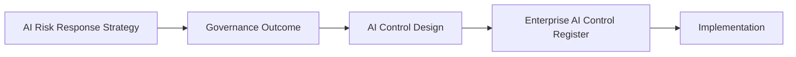

# AI Control Design Standard

## Document Control

| Field | Value |
|---|---|
| Document | AI Control Design Standard |
| Capability | AI Controls |
| Repository | Enterprise AI Governance Playbook |
| Reference Organization | Megastar Mortgage |
| Reference AI System | Megastar Intelligent Processor (MIP) |
| Document Owner | AI Governance Lead |
| Version | 2.0 |
| Review Cycle | Annual |
| Status | Published Reference |

---

# Executive Summary

AI Risk Response Strategy determines how Megastar Mortgage intends to address prioritized AI risks.

The AI Control Design Standard translates those approved response strategies into implementable governance controls. It begins by defining the governance outcome that must be achieved before establishing how that outcome will be delivered through a practical control design.

Each approved control design maintains traceability to the originating AI risk and approved response strategy while remaining independent from implementation planning, assurance activities, and continuous monitoring.

Approved control designs become the basis for registration within the Enterprise AI Control Register and subsequent implementation.

---

# Purpose

The purpose of this document is to establish a standardized approach for designing AI governance controls.

This standard defines:

- how approved AI Risk Response Strategies are translated into governance outcomes;
- how governance outcomes become practical control designs;
- the minimum information required for every approved AI control;
- principles governing AI control design; and
- readiness requirements before controls are registered and implemented.

This standard does not define implementation activities, assurance testing, monitoring activities, or residual-risk decisions.

---

# Control Design Lifecycle

Every approved AI Risk Response Strategy follows a consistent design lifecycle.

The governance outcome establishes **what** must be achieved.

The control design establishes **how** that outcome will be achieved.

---

# Control Design Principles

Megastar Mortgage designs AI governance controls according to the following principles.

- Every control shall address an approved AI Risk Response Strategy.
- Every control shall begin with a clearly defined governance outcome.
- Control designs shall remain proportionate to the associated AI risk.
- Control designs shall directly support the intended governance outcome.
- Control designs shall remain technology-neutral wherever practical.
- Control designs shall be sufficiently detailed to enable consistent implementation.
- Control designs shall remain traceable throughout the AI governance lifecycle.
- Control designs shall avoid duplicating existing governance controls wherever practical.
- Control designs shall be reviewed whenever the associated risk or operating context changes materially.

---

# Governance Outcome

Before designing a control, the organization defines the governance outcome that the control is intended to achieve.

The governance outcome describes the desired governance condition without prescribing the mechanism used to achieve it.

It establishes the purpose of the control and preserves traceability between the approved risk-response strategy and the future control.

A governance outcome should describe:

| Element | Purpose |
|---|---|
| Related AI Risk | Identifies the risk being addressed. |
| Approved Response Strategy | Identifies the governance response being executed. |
| Intended Governance Outcome | Defines the desired governance condition. |
| Scope | Defines where the outcome applies. |
| Success Condition | Describes the observable condition indicating that the outcome has been achieved. |
| Supporting Rationale | Explains why the outcome is appropriate and proportionate. |

Governance outcomes intentionally avoid defining workflows, technologies, ownership, frequencies, implementation activities, or evidence mechanisms.

Those decisions belong to later governance activities.

---

# Governance Outcome Focus

Governance outcomes may focus on different objectives depending upon the approved response strategy.

| Outcome Focus | Purpose |
|---|---|
| Prevention | Prevent an undesirable governance condition. |
| Detection | Identify governance issues requiring attention. |
| Correction | Restore an acceptable governance condition. |
| Compensation | Provide an alternative governance outcome where the preferred approach is not currently feasible. |

The selected focus guides subsequent control design but does not determine the implementation approach.

---

# Control Design Components

Once the governance outcome has been approved, the organization designs the control that will achieve it.

Every control design should define the following components.

| Component | Purpose |
|---|---|
| Governance Outcome | References the approved governance outcome. |
| Control Logic | Describes how the control achieves the intended outcome. |
| Control Type | Preventive, Detective, Corrective, or Compensating. |
| Control Scope | Defines where the control applies. |
| Control Dependencies | Identifies prerequisites required for operation. |
| Design Assumptions | Documents assumptions influencing the design. |
| Design Constraints | Documents known limitations affecting the design. |

The design establishes the governance blueprint for implementation without defining implementation planning or assurance activities.

---

# Control Types

AI governance controls may be designed as one or more of the following types.

| Control Type | Purpose |
|---|---|
| Preventive | Prevent undesirable AI outcomes before they occur. |
| Detective | Identify governance issues requiring attention. |
| Corrective | Restore acceptable governance conditions after an issue has been identified. |
| Compensating | Provide an alternative governance measure where the preferred approach is not currently feasible. |

Control type describes the intended behavior of the control rather than its implementation method.

---

# Control Domain Classification

Approved control designs may support one or more governance domains.

Examples include:

- Human Oversight
- Privacy & Data Governance
- Security & Access Control
- Model Lifecycle
- Incident Management
- Change Management
- Transparency
- Accountability
- Fairness
- Data Quality
- Reliability & Robustness
- Model Performance
- Third-Party Governance

Domain classification supports governance reporting, ownership, and traceability.

It does not create separate control records.

---

# Design Readiness

A control design is considered ready for registration when:

- the related AI Risk Response Strategy has been approved;
- the governance outcome has been clearly defined;
- the control logic supports the intended governance outcome;
- the control type has been identified;
- the control scope has been defined;
- dependencies have been documented;
- assumptions have been documented;
- constraints have been documented; and
- the design is suitable for implementation.

Approved control designs proceed to the Enterprise AI Control Register.

---

# Design Maintenance

Control designs shall be reviewed whenever:

- the associated AI risk changes materially;
- the approved response strategy changes;
- implementation planning identifies design limitations;
- legal, regulatory, contractual, or policy obligations change;
- AI-system functionality changes materially;
- governance reviews determine that the design is no longer appropriate; or
- monitoring or assurance identifies that the design no longer achieves its intended governance outcome.

All revisions shall remain traceable to the originating AI risk and approved response strategy.

---

# Relationship to Other Artifacts

This standard establishes the governance foundation for:

- Enterprise AI Control Register
- AI Control Implementation Record
- AI Assurance

The Enterprise AI Control Register becomes the authoritative record for every approved control.

The AI Control Implementation Record documents how each approved control is implemented.

AI Assurance evaluates whether implemented controls have been appropriately designed, successfully implemented, and are operating effectively.

---

# Why This Standard Matters

Approved AI Risk Response Strategies describe how the organization intends to address AI risk.

Without a consistent design standard, similar risks may result in inconsistent governance controls, duplicated activities, or controls that are difficult to implement, maintain, or assure.

The AI Control Design Standard ensures that every governance control begins with a clearly defined governance outcome, remains proportionate to the identified AI risk, and can be consistently implemented, governed, assured, and monitored throughout its lifecycle.

---

# Related Artifacts

This document supports:

- Enterprise AI Control Register
- AI Control Implementation Record
- AI Assurance

---

# Document Control

| Field | Value |
|---|---|
| Document | AI Control Design Standard |
| Capability | AI Controls |
| Repository | Enterprise AI Governance Playbook |
| Reference Organization | Megastar Mortgage |
| Reference AI System | Megastar Intelligent Processor (MIP) |
| Document Owner | AI Governance Lead |
| Version | 2.0 |
| Review Cycle | Annual |
| Status | Published Reference |

---

# Revision History

| Version | Date | Description |
|---|---|---|
| 2.0 | July 2026 | Merged AI Control Objectives into AI Control Design Standard to establish a single authoritative design artifact. |
| 1.0 | July 2026 | Initial release. |