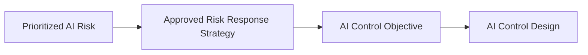

# AI Control Objectives

## Executive Summary

AI Risk Response Strategy establishes how Megastar Mortgage intends to respond to each prioritized AI risk. Before a control can be designed, the organization must define the governance outcome that the control is expected to achieve.

AI Control Objectives translate approved risk-response strategies into clear, outcome-focused requirements for the Megastar Intelligent Processor (MIP). They establish the purpose of future controls without prescribing the processes, technologies, responsibilities, frequencies, or evidence mechanisms used to implement them.

A well-defined control objective creates traceability from the identified risk to the intended governance outcome and provides the foundation for consistent AI Control Design.

This document establishes the AI Control Objectives approach used within the Enterprise AI Governance Program.

---

## Purpose

The purpose of this document is to establish a standardized approach for defining AI Control Objectives in response to prioritized AI risks.

Each control objective describes the condition or governance outcome that must be achieved to execute an approved AI Risk Response Strategy.

AI Control Objectives do not define how a control operates. Control mechanisms, ownership, frequency, workflows, evidence, and implementation requirements are established later through AI Control Design and the AI Control Implementation Plan.

---

## Control Objective Process

Every prioritized AI risk requiring a governance response is translated into one or more AI Control Objectives before control design begins.

The control objective preserves traceability between the approved risk response and the control that will later be designed.

---

## Control Objective Principles

Megastar Mortgage defines AI Control Objectives according to the following principles:

- Every control objective shall address an approved AI Risk Response Strategy.
- A control objective shall describe the governance outcome to be achieved, not the mechanism used to achieve it.
- Control objectives shall be clear, specific, proportionate, and traceable to the relevant risk.
- One risk may require multiple control objectives where different outcomes must be achieved.
- One control objective may support multiple related risks where the intended governance outcome is the same.
- Control objectives shall remain technology-neutral unless a specific technical outcome is essential.
- Control objectives shall be reviewed whenever the related risk, response strategy, or operating context changes materially.

---

## Developing AI Control Objectives

A complete AI Control Objective should identify:

| Objective Element | Purpose |
|---|---|
| Related Risk | Establishes the risk the objective is intended to address. |
| Approved Response Strategy | Connects the objective to the organization’s selected governance direction. |
| Intended Governance Outcome | Defines the condition that must be achieved. |
| Scope | Identifies the process, system component, data activity, user interaction, or lifecycle stage to which the objective applies. |
| Success Condition | Describes the observable state indicating that the objective has been achieved. |
| Supporting Rationale | Explains why the objective is appropriate and proportionate to the identified risk. |

These elements define the objective without prescribing the detailed control design.

---

## Objective Focus

AI Control Objectives may focus on different governance outcomes.

| Objective Focus | Purpose |
|---|---|
| Prevention | Establishes an outcome intended to prevent an undesirable event or condition. |
| Detection | Establishes an outcome intended to identify an issue, deviation, or control failure requiring attention. |
| Correction | Establishes an outcome intended to restore an acceptable operating or governance condition. |
| Compensation | Establishes an alternative outcome where the preferred control approach is not currently feasible. |

The objective focus describes the intended governance outcome. It does not determine the detailed control type or implementation method.

---

## Control Domains

An AI Control Objective may support one or more governance domains, including:

- Human Oversight
- Privacy & Data Governance
- Security & Access Control
- Model Lifecycle
- Incident Management
- Change Management
- Transparency
- Accountability
- Fairness
- Data Quality
- Reliability & Robustness
- Model Performance
- Third-Party Governance

Control domains provide classification and traceability. They do not replace the objective itself.

---

## Objective Quality Criteria

An AI Control Objective is ready for control design when it:

- Clearly identifies the intended governance outcome.
- Is linked to an approved AI risk and response strategy.
- Defines an appropriate scope.
- Can be translated into one or more practical control designs.
- Includes an observable success condition.
- Does not prematurely prescribe implementation mechanisms.
- Does not conflict with organizational policy, legal obligations, or existing governance requirements.

Objectives that do not meet these criteria shall be clarified before AI Control Design begins.

---

## Objective Maintenance

AI Control Objectives shall be reviewed when:

- the related risk changes materially;
- the approved response strategy is revised;
- the AI system or its operating context changes;
- a proposed control design cannot reasonably achieve the objective;
- legal, regulatory, contractual, or policy requirements change; or
- later governance activities identify that the objective is incomplete or no longer appropriate.

Any revision shall remain traceable to the relevant risk and approved response strategy.

---

## Why This Document Matters

Controls should not be designed before the organization understands what they are expected to achieve.

Without clear control objectives, controls may become disconnected from identified risks, duplicate existing activities, or create implementation effort without producing a meaningful governance outcome.

AI Control Objectives provide the disciplined transition from risk-response strategy to control design. They ensure that every control developed for MIP begins with a clear purpose, defined scope, and traceable governance outcome.

---

## Related Artifacts

This document supports:

- AI Control Objectives Template
- AI Risk Response Strategy
- Enterprise AI Risk Register
- AI Control Design

---

## Document Control

| Field | Value |
|---|---|
| Document | AI Control Objectives |
| Capability | AI Controls |
| Repository | Enterprise AI Governance Playbook |
| Reference Organization | Megastar Mortgage |
| Reference AI System | Megastar Intelligent Processor (MIP) |
| Document Owner | AI Governance Lead |
| Version | 1.0 |
| Review Cycle | Annual |
| Status | Published Reference |

---

## Revision History

| Version | Date | Description |
|---|---|---|
| 1.0 | July 2026 | Initial release of the AI Control Objectives artifact. |