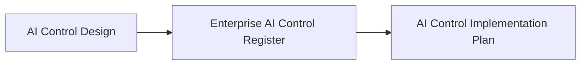

# Enterprise AI Control Register

## Executive Summary

Approved AI controls must be governed through a single authoritative enterprise record that preserves traceability throughout the AI governance lifecycle.

Following approval of an AI Control Design, Megastar Mortgage registers each governance control within the Enterprise AI Control Register. The register serves as the organization's living governance record for approved AI controls associated with the Megastar Intelligent Processor (MIP).

As governance activities progress, the Enterprise AI Control Register is progressively enriched with implementation information, assurance outcomes, monitoring activities, and continuous improvement actions.

This document establishes the Enterprise AI Control Register approach for the Enterprise AI Governance Program.

---

## Purpose

The purpose of this document is to establish a standardized approach for maintaining the Enterprise AI Control Register.

The register provides a single authoritative and continuously maintained record of approved AI governance controls.

Rather than representing a one-time inventory of controls, the Enterprise AI Control Register evolves as implementation, assurance, and monitoring activities are completed, ensuring that every approved control remains current, traceable, and governed throughout its lifecycle.

---

## Control Register Process

Every approved AI Control Design is formally registered within the Enterprise AI Control Register.

The register establishes the official governance record for every approved AI control and is progressively updated as governance activities continue.

---

## Control Register Principles

Megastar Mortgage maintains the Enterprise AI Control Register according to the following principles:

- The Enterprise AI Control Register is a living governance record that is progressively enriched throughout the AI governance lifecycle.
- Every approved AI control shall have one authoritative control record.
- Every control record shall have a unique control identifier.
- Control records shall remain accurate, complete, and current.
- Changes to control records shall be authorized and traceable.
- Control records shall be maintained throughout the governance lifecycle.
- Control information shall support governance transparency, implementation, assurance, and auditability.

---

## Progressive Control Record

The Enterprise AI Control Register is progressively enriched as governance activities are completed.

| Governance Activity | Information Added |
|----------------------|------------------|
| AI Control Design | Control identification and design information |
| AI Control Implementation Plan | Implementation planning information |
| AI Assurance | Assurance outcomes and control effectiveness |
| Continuous Monitoring | Monitoring activities, review history, improvement actions, and current control status |

This progressive approach enables Megastar Mortgage to maintain a single enterprise control record rather than multiple disconnected governance documents.

---

## Required Control Information

Each control record contains standardized information and is progressively enriched throughout the governance lifecycle.

| Information Category | Purpose |
|----------------------|---------|
| Control Identification | Establishes the unique identity of the approved AI control. |
| Control Design | Records the approved control design and governance classification. |
| Implementation | Records implementation planning and deployment information. |
| Assurance | Records assurance outcomes and control effectiveness information. |
| Monitoring & Improvement | Records monitoring activities, review history, improvement actions, and current control status. |

The detailed control record fields are maintained within the **Enterprise AI Control Register Template**.

---

## Register Maintenance

The Enterprise AI Control Register is progressively updated as governance activities are completed throughout the AI Governance Program.

Each governance capability contributes additional information to the existing enterprise control record rather than creating duplicate governance records.

Control records are reviewed and updated whenever:

- a new AI control is approved;
- implementation planning changes;
- implementation activities are completed;
- assurance activities identify new information;
- monitoring activities identify changes requiring updates;
- improvement actions are approved; or
- governance decisions require modification of an existing control.

Maintaining current control records ensures that governance decisions remain based on accurate, current, and traceable enterprise control information.

---

## Why This Document Matters

Enterprise AI governance depends upon maintaining an accurate and trustworthy record of approved governance controls.

Without a centralized Enterprise AI Control Register, organizations may duplicate controls, lose visibility of implementation progress, struggle to demonstrate governance oversight, or create inconsistent assurance activities.

The Enterprise AI Control Register establishes the authoritative enterprise record of AI controls, supporting governance traceability, implementation planning, assurance, continuous monitoring, and informed decision-making throughout the AI governance lifecycle.

By maintaining a single living governance record rather than multiple disconnected documents, Megastar Mortgage preserves a complete and auditable history of every approved AI control from design through continuous improvement.

---

## Related Artifacts

This document supports:

- Enterprise AI Control Register Template
- AI Control Implementation Plan

---

## Document Control

| Field | Value |
|------|------|
| Document | Enterprise AI Control Register |
| Capability | AI Controls |
| Repository | Enterprise AI Governance Playbook |
| Reference Organization | Megastar Mortgage |
| Reference AI System | Megastar Intelligent Processor (MIP) |
| Document Owner | AI Governance Lead |
| Version | 1.0 |
| Review Cycle | Annual |
| Status | Published Reference |

---

## Revision History

| Version | Date | Description |
|---------|------|-------------|
| 1.0 | July 2026 | Initial release of the Enterprise AI Control Register artifact. |