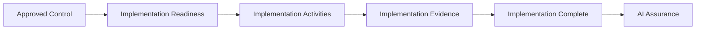

# AI Control Implementation Record

## Document Control

| Field | Value |
|---|---|
| Document | AI Control Implementation Record |
| Capability | AI Controls |
| Repository | Enterprise AI Governance Playbook |
| Reference Organization | Megastar Mortgage |
| Reference AI System | Megastar Intelligent Processor (MIP) |
| Document Owner | AI Governance Lead |
| Version | 2.0 |
| Review Cycle | Annual |
| Status | Published Reference |

---

# Executive Summary

Approval of an AI control does not reduce risk by itself.

Risk reduction begins only after the approved control has been implemented within the operational environment.

The AI Control Implementation Record establishes a governed approach for introducing approved AI controls into operation while maintaining traceability to the Enterprise AI Control Register.

Unlike an implementation plan, this record captures the complete implementation lifecycle—from readiness and planned implementation through implementation completion, supporting evidence, and readiness for assurance.

It provides the authoritative implementation record used before AI Assurance begins.

---

# Purpose

The purpose of this document is to establish a standardized approach for recording implementation of approved AI governance controls.

This document defines:

- implementation readiness;
- implementation planning;
- implementation progress;
- implementation completion;
- implementation evidence; and
- readiness for AI Assurance.

The implementation record documents what was implemented.

It does not evaluate control effectiveness, determine residual risk, or perform assurance activities.

---

# Implementation Lifecycle

Every approved AI control follows a consistent implementation lifecycle.

---

# Implementation Principles

Megastar Mortgage implements AI governance controls according to the following principles.

- Every implemented control shall reference an approved control record.
- Implementation shall remain traceable to the Enterprise AI Control Register.
- Governance prerequisites shall be satisfied before implementation begins.
- Planned implementation activities shall be documented.
- Actual implementation shall be recorded.
- Supporting implementation evidence shall be retained.
- Outstanding implementation issues shall be documented.
- Implementation completion shall be confirmed before AI Assurance begins.

---

# Implementation Readiness

Before implementation begins, the organization confirms:

- the control has been approved;
- the control has been registered;
- implementation prerequisites have been satisfied;
- dependencies have been identified;
- implementation responsibilities have been assigned;
- implementation target dates have been established; and
- implementation risks have been considered.

Implementation should not begin until readiness has been confirmed.

---

# Planned Implementation

Implementation planning establishes how the approved control will be introduced.

Planning should identify:

| Planning Component | Purpose |
|---|---|
| Implementation Scope | Defines where the control will operate. |
| Implementation Owner | Identifies accountable ownership. |
| Planned Implementation Date | Establishes the expected completion date. |
| Dependencies | Identifies prerequisites supporting implementation. |
| Implementation Considerations | Records factors influencing implementation. |
| Implementation Risks | Records implementation-specific risks. |

---

# Implementation Completion

When implementation activities are completed, the implementation record captures:

| Completion Component | Purpose |
|---|---|
| Implementation Status | Records current implementation state. |
| Actual Implementation Date | Records when implementation completed. |
| Implementation Evidence | References supporting evidence. |
| Outstanding Issues | Records unresolved implementation matters. |
| Readiness for Assurance | Confirms whether the control is ready for independent evaluation. |

Completion indicates that implementation activities have finished.

It does not indicate that the control is effective.

Control effectiveness is determined during AI Assurance.

---

# Implementation Evidence

Supporting evidence may include:

- approved configuration records;
- workflow implementation records;
- deployment documentation;
- policy publication;
- completed training records;
- access configuration records;
- implementation approvals;
- technical deployment evidence; or
- other approved implementation evidence.

Evidence supports implementation completion.

It does not replace assurance testing.

---

# Implementation Maintenance

Implementation records shall be updated whenever:

- implementation status changes;
- implementation activities are completed;
- implementation evidence is added;
- implementation ownership changes;
- implementation scope changes materially;
- implementation issues are resolved; or
- readiness for assurance changes.

All updates shall remain traceable to the approved control record.

---

# Relationship to Other Artifacts

This document supports:

- Enterprise AI Control Register
- AI Assurance

Implementation status and evidence progressively enrich the Enterprise AI Control Register.

AI Assurance uses this implementation record as evidence that approved controls are ready for independent evaluation.

---

# Why This Document Matters

An approved control design is only an intended governance measure.

Governance value is created when the control has been implemented, supporting evidence exists, and the organization can demonstrate that the control is ready for objective evaluation.

The AI Control Implementation Record provides the governed transition between approved control design and AI Assurance while preserving a complete implementation history within the AI governance lifecycle.

---

# Document Control

| Field | Value |
|---|---|
| Document | AI Control Implementation Record |
| Capability | AI Controls |
| Repository | Enterprise AI Governance Playbook |
| Reference Organization | Megastar Mortgage |
| Reference AI System | Megastar Intelligent Processor (MIP) |
| Document Owner | AI Governance Lead |
| Version | 2.0 |
| Review Cycle | Annual |
| Status | Published Reference |

---

# Revision History

| Version | Date | Description |
|---|---|---|
| 2.0 | July 2026 | Renamed AI Control Implementation Plan to AI Control Implementation Record and expanded to capture planned and completed implementation. |
| 1.0 | July 2026 | Initial release. |