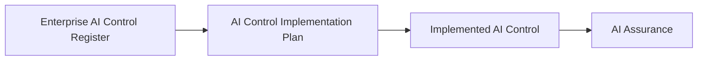

# AI Control Implementation Plan

## Executive Summary

Following approval and registration of an AI control, the organization must establish how that control will be introduced into the operational environment.

The AI Control Implementation Plan provides a structured governance approach for operationalizing approved AI controls associated with the Megastar Intelligent Processor (MIP). It identifies the governance prerequisites, implementation scope, dependencies, implementation considerations, and completion criteria required before the control becomes operational.

The implementation plan supports consistent deployment of approved governance controls while preserving traceability to the Enterprise AI Control Register.

This document establishes the AI Control Implementation Planning approach for the Enterprise AI Governance Program.

---

## Purpose

The purpose of this document is to establish a standardized approach for planning the implementation of approved AI governance controls.

The implementation plan defines how an approved control design will be operationalized without evaluating implementation success, control effectiveness, or assurance outcomes.

Implementation planning ensures that approved controls are introduced in a structured, consistent, and governed manner before assurance activities begin.

---

## Implementation Planning Process

Every approved AI control follows a standardized implementation planning process.

The implementation plan provides the governance bridge between approved control designs and operational controls.

---

## Implementation Planning Principles

Megastar Mortgage prepares AI Control Implementation Plans according to the following principles:

- Every approved AI control shall have an implementation plan before becoming operational.
- Implementation planning shall remain traceable to the approved control record.
- Implementation planning shall be proportionate to the control being implemented.
- Governance prerequisites shall be confirmed before implementation begins.
- Implementation dependencies shall be identified and documented.
- Completion criteria shall be established before implementation activities commence.
- Implementation planning shall not evaluate implementation success or control effectiveness.

---

## Implementation Planning Components

Each implementation plan documents the following information.

| Component | Purpose |
|---|---|
| Approved Control Reference | Identifies the approved AI control to be implemented. |
| Implementation Scope | Defines where the control will be introduced. |
| Governance Prerequisites | Confirms governance conditions required before implementation. |
| Implementation Dependencies | Identifies prerequisites that support successful implementation. |
| Implementation Considerations | Documents factors influencing implementation. |
| Implementation Risks | Identifies risks introduced by implementation activities. |
| Completion Criteria | Defines the conditions indicating that implementation activities are complete. |

These components support governance planning without prescribing project-management activities.

---

## Governance Readiness

Before implementation begins, Megastar Mortgage confirms that:

- the AI control has been approved;
- the control has been registered within the Enterprise AI Control Register;
- governance prerequisites have been satisfied;
- implementation dependencies have been identified;
- implementation risks have been considered; and
- completion criteria have been established.

Implementation planning shall not proceed where these readiness conditions have not been satisfied.

---

## Completion Criteria

Implementation activities are considered complete when:

- the approved implementation scope has been addressed;
- planned governance activities have been completed;
- implementation dependencies have been resolved or accepted;
- implementation documentation has been updated;
- implementation status has been recorded within the Enterprise AI Control Register; and
- the implemented control is ready to proceed to AI Assurance.

Completion of implementation does not indicate that the control is effective.

Control effectiveness is determined during AI Assurance.

---

## Plan Maintenance

AI Control Implementation Plans shall be reviewed whenever:

- the approved control design changes;
- implementation scope changes materially;
- implementation dependencies change;
- implementation risks change materially;
- governance decisions affect implementation planning; or
- implementation activities require significant revision.

Revisions shall remain traceable to the approved AI control record.

---

## Why This Document Matters

An approved control design does not become operational automatically.

Without structured implementation planning, organizations risk inconsistent deployment, incomplete governance activities, unmanaged dependencies, and reduced assurance readiness.

The AI Control Implementation Plan provides a consistent governance approach for operationalizing approved AI controls while preserving traceability to the Enterprise AI Control Register and preparing controls for AI Assurance.

---

## Related Artifacts

This document supports:

- AI Control Implementation Plan Template
- Enterprise AI Control Register
- AI Control Summary
- AI Assurance

---

## Document Control

| Field | Value |
|---|---|
| Document | AI Control Implementation Plan |
| Capability | AI Controls |
| Repository | Enterprise AI Governance Playbook |
| Reference Organization | Megastar Mortgage |
| Reference AI System | Megastar Intelligent Processor (MIP) |
| Document Owner | AI Governance Lead |
| Version | 1.0 |
| Review Cycle | Annual |
| Status | Published Reference |

---

## Revision History

| Version | Date | Description |
|---|---|---|
| 1.0 | July 2026 | Initial release of the AI Control Implementation Plan artifact. |