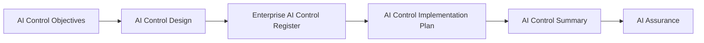

# AI Control Summary

## Executive Summary

AI Controls translates approved AI Risk Response Strategies into clearly defined control objectives, approved control designs, governed control records, and implementation plans.

Before Megastar Mortgage proceeds to AI Assurance, these outputs must be consolidated into a clear view of the control environment established for the Megastar Intelligent Processor (MIP).

The AI Control Summary provides an executive-level overview of the approved control portfolio, control coverage, implementation readiness, unresolved dependencies, and preparedness for assurance. It aggregates information maintained within the Enterprise AI Control Register and supporting implementation plans without duplicating individual control records.

This document serves as the formal handoff from AI Controls to AI Assurance.

---

## Purpose

The purpose of this document is to establish a standardized approach for consolidating the outcomes of the AI Controls capability.

The AI Control Summary enables governance stakeholders to understand:

- whether prioritized AI risks are supported by approved control objectives;
- whether approved control designs have been registered;
- whether implementation planning has been completed;
- whether material control gaps or dependencies remain; and
- whether the control portfolio is ready to proceed into AI Assurance.

The summary does not replace the Enterprise AI Control Register, AI Control Designs, or AI Control Implementation Plans. Those artifacts remain the authoritative sources for detailed control information.

---

## Control Summary Process

The AI Control Summary is prepared after control objectives, control designs, control registration, and implementation planning have been completed.

The summary consolidates approved information and confirms whether the control environment is sufficiently complete for assurance activities to begin.

---

## Summary Principles

Megastar Mortgage prepares AI Control Summaries according to the following principles:

- Every governed AI system shall have an AI Control Summary before progressing into AI Assurance.
- Summary information shall be derived from approved governance records.
- Individual control records shall not be duplicated within the summary.
- Control information shall remain traceable to the Enterprise AI Control Register.
- Readiness conclusions shall distinguish completed governance activities from outstanding dependencies.
- The summary shall not evaluate control effectiveness or record assurance conclusions.
- The summary shall not calculate residual risk or constitute formal risk acceptance.
- Material control gaps shall be documented before progression into AI Assurance.

---

## Summary Scope

The AI Control Summary consolidates the following information:

| Summary Area | Purpose |
|---|---|
| Control Portfolio Overview | Presents the number and status of approved AI controls. |
| Risk-to-Control Coverage | Confirms whether prioritized risks requiring mitigation are supported by approved control objectives and designs. |
| Control Type Distribution | Summarizes controls by Preventive, Detective, Corrective, and Compensating type. |
| Control Domain Distribution | Summarizes controls across applicable AI governance domains. |
| Implementation Readiness | Presents the status of implementation planning and unresolved dependencies. |
| Control Gaps | Identifies missing, incomplete, or unresolved control requirements. |
| Governance Observations | Highlights material themes, concentrations, dependencies, and cross-functional considerations. |
| Assurance Readiness | Confirms whether sufficient information exists for AI Assurance to begin. |

---

## Control Portfolio Overview

The portfolio overview provides a consolidated view of the approved AI controls associated with MIP.

Typical information includes:

- Total approved control objectives.
- Total approved control designs.
- Total controls registered within the Enterprise AI Control Register.
- Controls with approved implementation plans.
- Controls with unresolved implementation dependencies.
- Controls requiring additional design or governance clarification.
- Controls ready to proceed into AI Assurance.
- Controls not yet ready for AI Assurance.

The Enterprise AI Control Register remains the authoritative source for all individual control records.

---

## Risk-to-Control Coverage

The AI Control Summary confirms whether risks requiring mitigation have been translated into appropriate control objectives and approved control designs.

Coverage review includes:

- Prioritized risks requiring mitigation.
- Risks linked to one or more approved control objectives.
- Control objectives linked to approved control designs.
- Approved controls registered within the Enterprise AI Control Register.
- Risks lacking sufficient control coverage.
- Risks requiring additional governance review before assurance.

This review confirms traceability between risk response and control establishment. It does not evaluate whether the controls are effective.

---

## Control Type Distribution

Approved controls are summarized by control type.

| Control Type | Summary Purpose |
|---|---|
| Preventive | Identifies controls intended to prevent undesirable AI events or conditions. |
| Detective | Identifies controls intended to detect issues, deviations, or control failures. |
| Corrective | Identifies controls intended to restore acceptable operating or governance conditions. |
| Compensating | Identifies alternative controls used where the preferred approach is not currently feasible. |

A control may support more than one control type where its approved design performs multiple functions.

---

## Control Domain Distribution

Approved controls may be summarized across the governance domains established within the AI Controls capability, including:

- Human Oversight
- Privacy & Data Governance
- Security & Access Control
- Model Lifecycle
- Incident Management
- Change Management
- Transparency
- Accountability
- Fairness
- Data Quality
- Reliability & Robustness
- Model Performance
- Third-Party Governance

Because one control may support multiple domains, domain totals may exceed the total number of registered controls.

---

## Implementation Readiness

Implementation readiness is assessed using approved AI Control Implementation Plans.

A control is considered ready for assurance when:

- the related AI Control Objective has been approved;
- the AI Control Design has been approved;
- the control has been registered within the Enterprise AI Control Register;
- the implementation scope has been defined;
- governance prerequisites have been satisfied;
- material dependencies have been resolved or formally tracked;
- implementation completion criteria have been addressed; and
- the control has been identified as ready for assurance review.

Readiness for assurance does not indicate that the control is effective.

---

## Control Gaps

The AI Control Summary identifies gaps that may prevent the control environment from progressing into assurance.

Examples include:

- Prioritized risks without approved control objectives.
- Approved control objectives without completed control designs.
- Approved designs not registered within the Enterprise AI Control Register.
- Missing or incomplete implementation plans.
- Unresolved implementation dependencies.
- Controls with unclear scope or traceability.
- Material governance requirements not addressed by the existing control portfolio.

Each material gap shall have an assigned follow-up action or documented governance disposition.

---

## Key Governance Observations

The AI Control Summary may highlight observations such as:

- Concentration of controls within specific governance domains.
- Heavy reliance on manual or compensating controls.
- Multiple controls dependent on the same technology, team, vendor, or process.
- Gaps in preventive or detective coverage.
- Controls requiring cross-functional coordination.
- Implementation dependencies affecting assurance readiness.
- Risks supported by insufficient or incomplete control coverage.
- Areas where control rationalization may reduce duplication.

Governance observations provide context for decision-makers but do not replace individual control records.

---

## Readiness for AI Assurance

MIP is ready to proceed into AI Assurance when:

- all prioritized risks requiring mitigation have appropriate control coverage;
- control objectives have been approved;
- control designs have been approved;
- approved controls have been registered;
- implementation plans have been completed;
- material control gaps have been resolved or formally tracked;
- sufficient documentation exists to support assurance planning; and
- the appropriate governance authority has approved progression.

Where these conditions are not met, the AI Control Summary records the outstanding requirements and responsible governance functions.

---

## Handoff to AI Assurance

AI Controls establishes:

- what each control must achieve;
- how each control is designed;
- where each approved control is governed;
- how each control will be operationalized; and
- whether the control portfolio is ready for assurance.

AI Assurance evaluates whether those controls are appropriately designed, have been implemented as approved, and are operating effectively.

The AI Control Summary provides the formal transition between these capabilities.

---

## Summary Maintenance

The AI Control Summary shall be reviewed when:

- new controls are approved;
- control designs change materially;
- implementation plans are revised;
- control gaps are identified or resolved;
- the Enterprise AI Control Register changes materially;
- the AI system or associated risk profile changes; or
- the current summary no longer reflects the approved control portfolio.

Updates shall remain traceable to the authoritative source records.

---

## Why This Document Matters

Detailed control records are necessary for governance execution, but governance leaders also require a consolidated understanding of the overall control environment.

Without a structured summary, control gaps, domain concentrations, implementation dependencies, and assurance-readiness issues may remain hidden across multiple individual records.

The AI Control Summary enables Megastar Mortgage to communicate its control posture clearly, preserve traceability to authoritative governance records, and begin AI Assurance with a complete and evidence-based understanding of the control environment.

---

## Related Artifacts

This document supports:

- AI Control Summary Template
- Enterprise AI Control Register
- AI Control Implementation Plan
- AI Assurance

---

## Document Control

| Field | Value |
|---|---|
| Document | AI Control Summary |
| Capability | AI Controls |
| Repository | Enterprise AI Governance Playbook |
| Reference Organization | Megastar Mortgage |
| Reference AI System | Megastar Intelligent Processor (MIP) |
| Document Owner | AI Governance Lead |
| Version | 1.0 |
| Review Cycle | Annual |
| Status | Published Reference |

---

## Revision History

| Version | Date | Description |
|---|---|---|
| 1.0 | July 2026 | Initial release of the AI Control Summary artifact. |