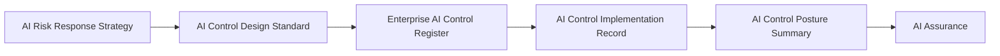

# AI Controls

## Document Control

| Field | Value |
|--------|-------|
| Document Name | AI Controls |
| Capability | AI Controls |
| Repository | Enterprise AI Governance Playbook |
| Reference Organization | Megastar Mortgage |
| Reference AI System | Megastar Intelligent Processor (MIP) |
| Document Owner | AI Governance Lead |
| Version | 1.0 |
| Classification | Public Reference Implementation |
| Status | Published |
| Review Cycle | Annual |
| Last Updated | July 2026 |

---

# Executive Summary

AI Risk Management determines which AI risks require governance attention and establishes the strategic direction for addressing those risks.

AI Controls transform those approved response strategies into practical governance measures that reduce AI risk across people, processes, technology, and organizational oversight.

Within Megastar Mortgage, AI Controls begin by defining the governance outcome each control must achieve as part of the control design, followed by registering the approved control within the Enterprise AI Control Register, implementing the control, recording implementation evidence, and consolidating the organization's control posture before assurance begins.

Together, these governance activities establish the operational control environment required to manage AI risks consistently throughout the AI system lifecycle.

---

# Purpose

The purpose of this capability is to establish a standardized approach for translating approved AI Risk Response Strategies into implemented AI governance controls.

This capability defines:

- how approved AI Risk Response Strategies are translated into AI governance controls;
- how governance outcomes and control designs are documented together;
- how approved AI controls are governed throughout their lifecycle;
- how implementation activities and implementation evidence are recorded; and
- how the organization's overall AI control posture is communicated before assurance begins.

Completion of this capability establishes the governance controls that AI Assurance will later evaluate for design adequacy, implementation, and operating effectiveness.

---

# Capability Scope

This capability establishes the governance processes for:

- designing AI governance controls;
- maintaining the Enterprise AI Control Register;
- recording AI control implementation;
- documenting implementation evidence; and
- summarizing enterprise AI control readiness.

The capability focuses on establishing governance controls.

It does not evaluate control effectiveness, perform assurance activities, determine residual risk, or continuously monitor implemented controls.

---

# Governance Artifacts

| Governance Artifact | Purpose |
|----------------------|---------|
| AI Control Design Standard | Defines the governance outcome and design of approved AI controls. |
| Enterprise AI Control Register | Maintains the authoritative enterprise record of approved AI controls throughout their governance lifecycle. |
| AI Control Implementation Record | Documents implementation activities, implementation evidence, and readiness for assurance. |
| AI Control Posture Summary | Consolidates the organization's overall AI control posture before AI Assurance begins. |

Together, these artifacts translate approved AI Risk Response Strategies into governed AI controls that are implemented, evidenced, and ready for independent assurance.

---

# Governance Lifecycle

Every approved AI Risk Response Strategy progresses through a consistent governance lifecycle.

Each approved control is maintained within the Enterprise AI Control Register as a living governance record and is progressively enriched during later governance capabilities.

---

# Living Governance Record

The Enterprise AI Control Register serves as the authoritative governance record for approved AI controls.

A control enters the register after its design has been approved.

As governance activities continue, the same control record is progressively enriched with implementation status, implementation evidence, assurance results, effectiveness evaluations, monitoring activities, review history, and improvement actions.

Maintaining a single enterprise control record preserves governance traceability and avoids duplicate documentation throughout the AI governance lifecycle.

---

# Control Domains

AI governance controls frequently address more than one governance domain.

Rather than maintaining separate control documents for individual domains, each approved control may be classified across one or more applicable control domains.

Examples include:

- Human Oversight
- Privacy & Data Governance
- Security & Access Control
- Model Lifecycle
- Incident Management
- Change Management
- Transparency
- Accountability
- Fairness
- Third-Party Governance

This classification supports enterprise reporting and governance without duplicating control documentation.

---

# Capability Outcomes

Upon completion of this capability, Megastar Mortgage will have established:

- approved AI Control Designs;
- a living Enterprise AI Control Register;
- implemented AI governance controls;
- documented implementation evidence supporting assurance readiness; and
- an AI Control Posture Summary confirming readiness for AI Assurance.

These deliverables establish the organization's AI control environment before assurance activities begin.

---

# Why This Capability Matters

Understanding AI risks does not reduce organizational exposure.

Risk reduction occurs only when approved governance decisions are translated into practical controls that operate consistently across people, processes, technology, and supporting governance activities.

The AI Controls capability provides the operational bridge between AI Risk Management and AI Assurance by ensuring that every prioritized AI risk is addressed through clearly defined, governed, and implementable AI controls.

---

# Relationship to Other Capabilities

This capability builds directly upon AI Risk Management.

It provides the governance foundation for:

- AI Assurance
- Continuous Monitoring
- Continuous Improvement

Each subsequent capability assumes that approved AI controls have been designed, implemented, registered, and supported by implementation evidence.

---

# Capability Completion Criteria

This capability is complete when:

- AI Control Designs have been approved.
- The Enterprise AI Control Register has been established.
- AI controls have been implemented.
- Implementation evidence has been documented.
- The AI Control Posture Summary has been completed.

---

# Capability Completion Checklist

| Status | Deliverable |
|--------|-------------|
| ☐ | AI Control Designs completed |
| ☐ | Enterprise AI Control Register established |
| ☐ | AI controls implemented |
| ☐ | Implementation evidence documented |
| ☐ | AI Control Posture Summary completed |

---

# Next Capability

Following completion of AI Controls, Megastar Mortgage proceeds to **AI Assurance**, where approved AI controls are evaluated to determine whether they have been appropriately designed, successfully implemented, and are operating effectively.

---

# Related Capabilities

- AI Risk Management
- AI Assurance
- Continuous Monitoring

---

# Revision History

| Version | Date | Description |
|----------|------|-------------|
| 1.0 | July 2026 | Initial release of the AI Controls capability. |