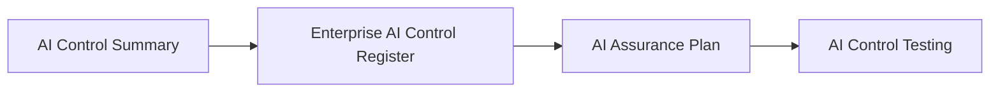

# AI Assurance Plan

## Executive Summary

AI Controls establishes the governance measures intended to reduce prioritized AI risks. Before those controls can be evaluated, Megastar Mortgage must define the scope, objectives, criteria, responsibilities, and approach for assurance.

The AI Assurance Plan establishes the formal basis for evaluating approved AI controls associated with the Megastar Intelligent Processor (MIP). It identifies which controls are included within the assurance engagement, what aspects of those controls will be evaluated, and the governance criteria against which conclusions will later be formed.

The plan does not execute control testing, collect assurance evidence, document findings, or determine control effectiveness. Those activities occur during subsequent AI Assurance activities.

This document establishes the AI Assurance Planning approach used within the Enterprise AI Governance Program.

---

## Purpose

The purpose of this document is to establish a standardized approach for planning AI assurance activities.

The AI Assurance Plan defines:

- the controls included within the assurance scope;
- the objectives of the assurance engagement;
- the governance criteria against which controls will be evaluated;
- the assurance dimensions to be reviewed;
- the roles and responsibilities supporting the engagement;
- the conditions required before control testing begins; and
- the boundaries, dependencies, and limitations affecting the assurance activity.

Completion of the plan provides an approved and traceable foundation for AI Control Testing.

---

## Assurance Planning Process

Every assurance engagement begins with an approved AI Assurance Plan.

The plan establishes the assurance engagement before testing procedures are developed or executed.

---

## Assurance Planning Principles

Megastar Mortgage prepares AI Assurance Plans according to the following principles:

- Assurance activities shall be planned before control testing begins.
- Assurance scope shall be proportionate to the related AI risks, control significance, and governance priorities.
- Assurance objectives and criteria shall be documented clearly.
- Assurance activities shall remain traceable to approved control objectives, control designs, and authoritative control records.
- Assurance responsibilities shall preserve appropriate objectivity and independence.
- Material limitations, dependencies, and exclusions shall be documented before testing.
- Assurance planning shall not predetermine testing results or assurance conclusions.
- Changes to the approved assurance plan shall be authorized and traceable.

---

## Assurance Scope

The assurance scope identifies the controls, organizational boundaries, systems, processes, and review period included within the engagement.

The scope may define:

- AI controls selected for assurance.
- Related control IDs and control objectives.
- Related AI risks and response strategies.
- Business processes and operational functions included.
- AI system components and supporting technologies included.
- Organizational units and stakeholder groups included.
- Applicable AI lifecycle stages.
- Review period covered by the engagement.
- Explicit exclusions from the assurance scope.

The scope establishes the boundaries of the engagement without defining individual testing procedures.

---

## Assurance Objectives

Assurance objectives define what the engagement is intended to evaluate.

Depending on the approved scope, assurance may evaluate whether controls are:

| Assurance Dimension | Objective |
|---|---|
| Design Adequacy | Determine whether the approved control design is capable of achieving its stated AI Control Objective. |
| Implementation | Determine whether the approved control has been implemented in accordance with its design and implementation plan. |
| Operating Effectiveness | Determine whether the implemented control operated consistently as intended during the defined review period. |

An assurance engagement may evaluate one or more of these dimensions depending on control maturity, governance priority, and engagement scope.

---

## Assurance Criteria

AI controls are evaluated against approved and authoritative governance criteria.

Applicable criteria may include:

- Approved AI Control Objectives.
- Approved AI Control Designs.
- Enterprise AI Control Register records.
- Approved AI Control Implementation Plans.
- Internal AI governance policies and standards.
- Organizational risk and control requirements.
- Applicable legal, regulatory, contractual, and policy obligations.
- Approved governance decisions and documented operating requirements.

Assurance criteria must be established before testing begins so that conclusions are based on defined expectations rather than retrospective judgment.

---

## Assurance Approach

The assurance approach defines the overall method used to evaluate controls without prescribing detailed testing procedures.

The approach may include:

- Review of control design adequacy.
- Review of implementation against approved requirements.
- Evaluation of operating effectiveness over the defined review period.
- Consideration of control dependencies and supporting processes.
- Review of related governance records and authoritative documentation.
- Coordination with relevant control owners, business functions, and oversight teams.
- Escalation of material scope limitations or readiness concerns.

Detailed test steps, evidence requirements, sampling methods, and result documentation are established within AI Control Testing.

---

## Assurance Roles and Objectivity

The assurance engagement shall define clear responsibilities for planning, execution, review, and approval.

Typical roles include:

| Role | Responsibility |
|---|---|
| Assurance Lead | Owns the assurance engagement, scope, approach, and overall delivery. |
| Assurance Reviewer | Reviews the quality, consistency, and objectivity of assurance work. |
| Control Owner | Provides control information and supports access to relevant records and personnel. |
| AI Governance Lead | Confirms governance alignment and supports escalation where required. |
| Business and Technical Stakeholders | Provide contextual information relevant to the assurance scope. |
| Internal Audit or Independent Assurance Function | Provides independent oversight where required by organizational policy or risk significance. |

Individuals responsible for designing or operating a control should not independently approve the final assurance conclusion for that same control where segregation of duties is required.

---

## Assurance Readiness

Before AI Control Testing begins, Megastar Mortgage confirms that:

- the AI Control Summary has been completed;
- controls included within scope are registered within the Enterprise AI Control Register;
- relevant AI Control Objectives have been approved;
- applicable AI Control Designs have been approved;
- implementation activities have been completed or reached the maturity required by the engagement;
- assurance objectives and criteria have been defined;
- assurance roles and responsibilities have been assigned;
- material dependencies and limitations have been documented; and
- sufficient information exists to begin control testing.

Controls that do not satisfy the required readiness conditions shall be deferred, excluded with documented rationale, or escalated for governance review.

---

## Scope Limitations and Dependencies

The AI Assurance Plan shall document factors that may affect the engagement, including:

- unavailable or incomplete governance records;
- immature or partially implemented controls;
- reliance on third-party systems or evidence;
- restricted access to required systems or personnel;
- unresolved control-design questions;
- limitations affecting objectivity or independence;
- changes occurring during the assurance period; and
- dependencies on other governance or assurance activities.

Material limitations shall be considered when interpreting subsequent assurance findings and conclusions.

---

## Plan Approval

The AI Assurance Plan shall be reviewed and approved before testing begins.

Approval confirms that:

- the assurance scope is appropriate;
- the objectives and criteria are clear;
- the assurance approach is proportionate;
- roles and responsibilities are assigned;
- readiness conditions have been addressed; and
- material exclusions, dependencies, and limitations are understood.

Plan approval authorizes progression into AI Control Testing. It does not indicate that any control has passed assurance.

---

## Plan Maintenance

The AI Assurance Plan shall be reviewed when:

- the assurance scope changes materially;
- controls are added, removed, or significantly modified;
- assurance objectives or criteria change;
- material readiness issues are identified;
- significant changes occur to MIP or its operating environment;
- governance priorities change; or
- previously documented limitations materially affect the engagement.

All approved changes shall remain traceable to the original assurance plan.

---

## Why This Document Matters

Assurance conclusions are only as reliable as the planning that supports them.

Without a defined scope, clear objectives, approved criteria, appropriate responsibilities, and documented readiness conditions, control testing may become inconsistent, incomplete, or difficult to defend.

The AI Assurance Plan provides Megastar Mortgage with a disciplined foundation for evaluating AI controls objectively and consistently before assurance evidence, findings, and conclusions are produced.

---

## Related Artifacts

This document supports:

- AI Assurance Plan Template
- AI Control Summary
- Enterprise AI Control Register
- AI Control Testing

---

## Document Control

| Field | Value |
|---|---|
| Document | AI Assurance Plan |
| Capability | AI Assurance |
| Repository | Enterprise AI Governance Playbook |
| Reference Organization | Megastar Mortgage |
| Reference AI System | Megastar Intelligent Processor (MIP) |
| Document Owner | AI Governance Lead |
| Version | 1.0 |
| Review Cycle | Annual |
| Status | Published Reference |

---

## Revision History

| Version | Date | Description |
|---|---|---|
| 1.0 | July 2026 | Initial release of the AI Assurance Plan artifact. |