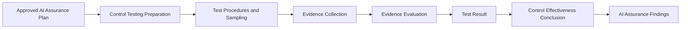

# AI Control Testing

## Executive Summary

AI Assurance begins with an approved plan, but objective confidence is created through testing.

AI Control Testing evaluates approved controls associated with the Megastar Intelligent Processor (MIP) to determine whether they are appropriately designed, implemented as approved, and operating effectively during the defined review period.

Testing is performed against the objectives, criteria, scope, and assurance dimensions established within the approved AI Assurance Plan. It combines documented test procedures, relevant and reliable evidence, appropriate sampling, and objective evaluation to produce a supported result for each control tested.

AI Control Testing produces control-level evidence and conclusions. It does not classify assurance findings, prescribe corrective actions, determine residual risk, or issue the overall assurance conclusion.

This document establishes the AI Control Testing approach used within the Enterprise AI Governance Program.

---

## Purpose

The purpose of this document is to establish a standardized approach for objectively testing approved AI governance controls.

AI Control Testing defines:

- how control-level testing is prepared;
- how applicable assurance dimensions are evaluated;
- how test procedures and sampling approaches are established;
- how assurance evidence is collected and assessed;
- how test results and control-effectiveness conclusions are determined;
- how testing limitations are documented; and
- how approved testing outcomes update the Enterprise AI Control Register.

Completion of AI Control Testing provides the evidence required for AI Assurance Findings and the subsequent overall assurance conclusion.

---

## Control Testing Process

Every control included within an approved AI Assurance Plan follows a consistent testing process.

Testing outcomes progressively enrich the corresponding record within the Enterprise AI Control Register.

---

## Control Testing Principles

Megastar Mortgage performs AI Control Testing according to the following principles:

- Every control test shall remain traceable to an approved AI Assurance Plan.
- Testing shall evaluate only the assurance dimensions included within the approved scope.
- Test procedures shall be appropriate to the control objective, design, operation, and associated risk.
- Conclusions shall be supported by sufficient, relevant, reliable, timely, and traceable evidence.
- Inquiry alone shall not provide sufficient support for an effectiveness conclusion.
- Sampling shall be risk-based, documented, and appropriate to the population being evaluated.
- Testing observations shall distinguish factual evidence from professional judgment.
- Material testing limitations shall be documented and considered when forming conclusions.
- Testing shall be performed with appropriate objectivity and segregation of duties.
- Test results shall not be presented as residual-risk decisions or formal risk acceptance.

---

## Testing Dimensions

Controls are evaluated across the assurance dimensions approved within the AI Assurance Plan.

| Assurance Dimension | Evaluation Question |
|---|---|
| Design Adequacy | Is the approved control design capable of achieving its stated AI Control Objective? |
| Implementation | Has the control been implemented in accordance with its approved design and implementation plan? |
| Operating Effectiveness | Did the implemented control operate consistently as intended throughout the defined review period? |

An engagement may evaluate one, two, or all three dimensions depending on control maturity, assurance scope, and governance priority.

A control cannot be concluded to be operating effectively when its design is inadequate or when it has not been implemented as approved.

---

## Testing Preparation

Before testing begins, the assurance team confirms that:

- the control is included within the approved AI Assurance Plan;
- the relevant assurance dimensions are defined;
- the approved AI Control Objective is available;
- the approved AI Control Design is available;
- the Enterprise AI Control Register record is current;
- applicable implementation information is available;
- authoritative assurance criteria have been identified;
- the review period and control population are defined;
- required systems, records, personnel, and evidence sources are accessible; and
- known limitations or dependencies have been documented.

Controls that are not ready for testing shall be deferred, excluded with approved rationale, or escalated through the assurance governance process.

---

## Control Testing Methods

One or more testing methods may be applied depending on the nature of the control.

| Testing Method | Purpose |
|---|---|
| Inspection | Reviews records, configurations, approvals, logs, reports, or other documented evidence. |
| Observation | Observes the control being performed within its operational environment. |
| Inquiry | Obtains contextual information from control owners or relevant stakeholders. |
| Reperformance | Independently executes or reconstructs the control procedure to verify its operation. |
| Data Analysis | Evaluates complete or sampled data populations for patterns, exceptions, or control performance. |
| Technical Validation | Reviews system configurations, access rules, workflows, thresholds, guardrails, or automated control logic. |
| Walkthrough | Traces a transaction, decision, or process through the control from initiation to completion. |

Inquiry may support testing but shall normally be corroborated by additional evidence.

---

## Test Procedure Design

Each control test shall define procedures that are directly linked to the applicable assurance criteria.

A complete test procedure identifies:

| Test Component | Purpose |
|---|---|
| Testing Objective | Defines what the procedure is intended to evaluate. |
| Assurance Dimension | Identifies whether the procedure addresses design, implementation, or operating effectiveness. |
| Assurance Criterion | Identifies the approved requirement against which the control is evaluated. |
| Testing Method | Defines how the evaluation will be performed. |
| Population | Defines the complete set of relevant control occurrences or records. |
| Sampling Approach | Defines how test items are selected where full-population testing is not performed. |
| Evidence Required | Identifies the information required to support the conclusion. |
| Expected Condition | Defines the condition that should exist when the control operates as intended. |

Test procedures shall not be changed retrospectively to support a preferred conclusion.

---

## Sampling

Where testing does not evaluate the complete population, the sampling approach shall be documented and proportionate to the control’s significance and associated risk.

Sampling considerations include:

- population size and completeness;
- frequency of control operation;
- control type and automation level;
- governance priority of the related risk;
- review period;
- expected variability;
- prior assurance results;
- known changes or incidents;
- reliance on third parties; and
- the level of confidence required.

The testing record shall document:

- the population evaluated;
- the sampling method;
- the sample size;
- the sampling rationale;
- the items selected; and
- any limitations affecting representativeness.

Where feasible and proportionate, complete-population testing or automated data analysis may provide stronger assurance than sample-based testing.

---

## Assurance Evidence

Evidence supports the control-level testing result and effectiveness conclusion.

Evidence may include:

- approved governance records;
- system configurations;
- access-control records;
- workflow histories;
- approval records;
- audit logs;
- monitoring reports;
- model-validation outputs;
- exception logs;
- incident records;
- change records;
- training records;
- vendor documentation;
- contractual records;
- screenshots or system extracts;
- data-analysis results; and
- independently re-performed test outputs.

Evidence shall be assessed against the following attributes:

| Evidence Attribute | Evaluation |
|---|---|
| Relevance | Does the evidence directly address the control and testing objective? |
| Reliability | Is the evidence obtained from a credible and authoritative source? |
| Sufficiency | Is the quantity and coverage adequate to support the conclusion? |
| Timeliness | Does the evidence relate to the applicable review period? |
| Traceability | Can the evidence be linked to the control, procedure, and result? |
| Integrity | Is the evidence complete and protected from unauthorized alteration? |

Evidence references shall be recorded in the Enterprise AI Control Register or linked supporting records. Sensitive evidence shall be handled according to applicable information-classification and access requirements.

---

## Test Results

Each completed control test receives a documented result.

| Test Result | Meaning |
|---|---|
| Pass | The evidence supports that the tested condition met the applicable assurance criteria. |
| Pass with Exceptions | The tested condition generally met the applicable criteria, but one or more exceptions require further evaluation. |
| Fail | The evidence demonstrates that the tested condition did not meet the applicable assurance criteria. |
| Not Tested | Testing could not be completed or was not performed, with documented rationale. |
| Inconclusive | Available evidence was insufficient or conflicting and did not support a reliable conclusion. |

Test results apply to the specific procedure and assurance dimension evaluated. They do not, by themselves, constitute the overall assurance conclusion for the control environment.

---

## Control Effectiveness Conclusion

After evaluating the completed procedures and supporting evidence, the assurance team records a control-level effectiveness conclusion.

| Effectiveness Conclusion | Meaning |
|---|---|
| Effective | The control is appropriately designed, implemented as approved, and operated consistently for the dimensions evaluated. |
| Partially Effective | The control provides some intended governance benefit, but limitations or exceptions reduce confidence in full effectiveness. |
| Ineffective | The control does not adequately achieve its stated objective for the dimensions evaluated. |
| Not Concluded | Sufficient evidence was not available to form a reliable effectiveness conclusion. |

The conclusion shall reflect only the assurance dimensions included within scope.

For example, a design-only review may conclude on design adequacy but shall not claim that the control is operating effectively.

---

## Testing Observations and Potential Findings

Testing may identify deviations, exceptions, limitations, or other observations requiring further evaluation.

The testing record documents the factual condition observed and the supporting evidence.

AI Control Testing does not make the final determination that an observation constitutes a formal assurance finding. Potential issues are transferred to **AI Assurance Findings**, where significance, cause, governance implication, and disposition are evaluated.

This separation preserves the distinction between:

- evidence produced through testing; and
- governance findings produced through assurance evaluation.

---

## Enterprise AI Control Register Enrichment

Approved AI Control Testing outcomes update the following fields within the living Enterprise AI Control Register:

| Control Register Field | Information Added |
|---|---|
| Assurance Status | Current status of assurance testing for the control. |
| Test Result | Approved result of the completed control test. |
| Control Effectiveness | Supported control-level effectiveness conclusion. |
| Evidence Reference | Traceable reference to the evidence supporting the test. |
| Assurance Notes | Relevant testing observations, limitations, and contextual information. |

The **Exceptions Identified** field is formally updated through AI Assurance Findings after testing observations have been evaluated and classified.

AI Control Testing does not update residual likelihood, residual impact, residual-risk rating, or formal risk-acceptance information within the Enterprise AI Risk Register.

---

## Testing Limitations

Testing limitations may include:

- incomplete or unavailable evidence;
- insufficient review-period coverage;
- inaccessible systems or records;
- unreliable or manually prepared data;
- incomplete control populations;
- inability to observe control execution;
- changes occurring during the testing period;
- third-party evidence restrictions;
- unresolved scope dependencies; or
- limitations affecting tester objectivity.

Material limitations shall be documented and considered when determining test results and effectiveness conclusions.

Where a limitation prevents a reliable conclusion, the result shall be recorded as **Not Tested** or **Inconclusive**, as appropriate.

---

## Testing Review and Approval

Completed testing shall undergo review before results are finalized.

The review confirms that:

- testing remained within the approved assurance scope;
- procedures addressed the defined assurance criteria;
- sampling was appropriate and documented;
- evidence was sufficient and reliable;
- results were supported by the documented work;
- limitations were appropriately considered;
- observations were stated objectively; and
- the effectiveness conclusion was consistent with the evidence.

Approved test results may then update the Enterprise AI Control Register and proceed to AI Assurance Findings.

---

## Testing Maintenance

Control testing shall be reconsidered when:

- material evidence becomes available after testing;
- the control design or implementation changes;
- the assurance scope or criteria change;
- a testing error is identified;
- an assurance finding requires additional procedures;
- the AI system changes materially; or
- the approved result no longer reflects the control’s current condition.

Any revised testing record shall preserve version history and traceability to the original work performed.

---

## Why This Document Matters

Assurance conclusions cannot be supported by policies, control descriptions, or management representations alone.

Organizations require objective testing that evaluates controls against approved criteria and produces sufficient, reliable, and traceable evidence.

AI Control Testing enables Megastar Mortgage to determine whether controls associated with MIP are appropriately designed, implemented as approved, and operating effectively. It provides the evidence base for assurance findings, residual-risk evaluation, corrective actions, and the overall assurance conclusion.

---

## Related Artifacts

This document supports:

- AI Control Testing Template
- AI Assurance Plan
- Enterprise AI Control Register
- AI Assurance Findings

---

## Document Control

| Field | Value |
|---|---|
| Document | AI Control Testing |
| Capability | AI Assurance |
| Repository | Enterprise AI Governance Playbook |
| Reference Organization | Megastar Mortgage |
| Reference AI System | Megastar Intelligent Processor (MIP) |
| Document Owner | AI Governance Lead |
| Version | 1.0 |
| Review Cycle | Annual |
| Status | Published Reference |

---

## Revision History

| Version | Date | Description |
|---|---|---|
| 1.0 | July 2026 | Initial release of the AI Control Testing artifact. |