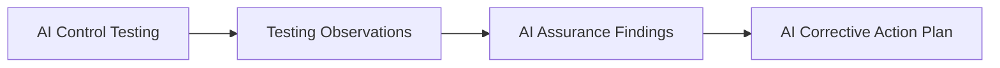

# AI Assurance Findings

## Executive Summary

AI Control Testing produces evidence, testing observations, and control-level conclusions. AI Assurance Findings evaluates those observations to determine whether they represent governance issues requiring formal documentation, escalation, management attention, or corrective action.

The AI Assurance Findings artifact establishes a consistent and objective approach for classifying assurance findings associated with the Megastar Intelligent Processor (MIP). It evaluates testing observations against approved assurance criteria, determines governance significance, identifies governance-related causes, assesses governance impact, and provides recommendations for management consideration.

AI Assurance Findings does not redesign controls, implement corrective actions, determine residual risk, or issue the overall assurance opinion. Those activities are performed by subsequent AI Assurance artifacts.

This document establishes the AI Assurance Findings approach used within the Enterprise AI Governance Program.

---

## Purpose

The purpose of this document is to establish a standardized approach for evaluating testing observations and determining whether they constitute formal assurance findings.

The AI Assurance Findings process defines:

- how testing observations are evaluated;
- how governance significance is determined;
- how findings are classified;
- how governance-related causes and impacts are documented;
- how recommendations are formulated; and
- how approved findings update the Enterprise AI Control Register.

Completion of this artifact provides the governed findings that serve as the basis for corrective action planning.

---

## Assurance Findings Process

Every completed control test follows a consistent findings evaluation process.

Testing observations become formal assurance findings only after governance evaluation.

---

## Findings Principles

Megastar Mortgage evaluates AI assurance findings according to the following principles:

- Every finding shall be supported by documented testing evidence.
- Governance findings shall remain traceable to approved assurance criteria.
- Findings shall distinguish factual observations from professional judgment.
- Governance significance shall be evaluated consistently.
- Governance causes shall focus on control and governance weaknesses rather than operational or technical failure causes.
- Recommendations shall address the governance issue identified.
- Findings shall not predetermine corrective actions or management responses.
- All approved findings shall remain traceable throughout their lifecycle.

---

## Finding Classification

Each finding is classified according to its governance significance.

| Classification | Meaning |
|---|---|
| Observation | A factual matter noted during assurance that does not require formal corrective action. |
| Minor Finding | A limited governance weakness with low impact on overall governance objectives. |
| Major Finding | A significant governance weakness requiring management attention and corrective action. |
| Critical Finding | A governance weakness creating unacceptable exposure that requires immediate escalation. |

Classification reflects governance significance rather than inherent or residual AI risk.

---

## Finding Components

Every assurance finding contains the following information.

| Component | Purpose |
|---|---|
| Finding Reference | Unique identifier for traceability. |
| Related Control | Links the finding to the approved AI control. |
| Related Risk | Links the finding to the relevant AI risk. |
| Assurance Criterion | Identifies the requirement against which the observation was evaluated. |
| Observation | Records the factual condition identified during testing. |
| Supporting Evidence | References the evidence supporting the observation. |
| Governance Cause | Explains the governance-related reason for the finding. |
| Governance Impact | Describes the effect of the finding on governance objectives. |
| Finding Classification | Records the approved governance significance. |
| Recommendation | Provides a governance recommendation for management consideration. |

---

## Governance Cause Analysis

Where appropriate, the assurance team identifies the governance-related cause contributing to the finding.

Examples include:

- incomplete governance procedures;
- inadequate control design;
- incomplete implementation;
- ineffective governance documentation;
- unclear ownership or accountability;
- insufficient oversight;
- inadequate training or awareness;
- policy non-conformance; or
- other governance weaknesses.

Governance Cause Analysis does not replace operational Root Cause Analysis performed within AI Incident Management.

---

## Governance Impact

The governance impact describes how the finding affects the organization's governance objectives.

Examples may include impacts on:

- governance effectiveness;
- compliance obligations;
- accountability;
- oversight;
- transparency;
- operational resilience;
- auditability;
- regulatory expectations; or
- organizational confidence.

Impact statements remain evidence-based and proportionate to the approved finding classification.

---

## Recommendations

Recommendations identify governance improvements that may address the approved finding.

Recommendations should:

- address the governance issue identified;
- remain proportionate to the finding;
- avoid prescribing implementation details;
- support management decision-making; and
- remain traceable to the related finding.

Corrective actions are established separately within the AI Corrective Action Plan.

---

## Enterprise AI Control Register Enrichment

Approved AI Assurance Findings update the following fields within the Enterprise AI Control Register:

| Control Register Field | Information Added |
|---|---|
| Exceptions Identified | Approved assurance exceptions requiring governance attention. |
| Assurance Notes | Additional context supporting the approved finding where appropriate. |

AI Assurance Findings does not update the Enterprise AI Risk Register.

Residual likelihood, residual impact, residual-risk rating, and assurance outcome are determined after the overall assurance conclusion has been formed.

---

## Findings Review and Approval

Every finding undergoes review before approval.

The review confirms that:

- the finding is supported by sufficient evidence;
- governance significance has been classified consistently;
- governance causes and impacts are reasonable;
- recommendations are appropriate; and
- the finding is ready for corrective action planning.

---

## Findings Maintenance

Findings shall be reviewed when:

- additional evidence becomes available;
- testing conclusions change;
- governance decisions require reassessment;
- recommendations are materially revised; or
- new information affects the approved finding.

All changes shall preserve traceability to the original testing record.

---

## Why This Document Matters

Objective testing alone does not provide governance direction.

Organizations require a structured process for determining which testing observations represent meaningful governance weaknesses requiring management attention.

AI Assurance Findings transforms objective testing evidence into governed assurance conclusions, supporting consistent corrective action planning while preserving traceability to approved governance records.

---

## Related Artifacts

This document supports:

- AI Assurance Findings Template
- AI Control Testing
- AI Corrective Action Plan
- Enterprise AI Control Register

---

## Document Control

| Field | Value |
|---|---|
| Document | AI Assurance Findings |
| Capability | AI Assurance |
| Repository | Enterprise AI Governance Playbook |
| Reference Organization | Megastar Mortgage |
| Reference AI System | Megastar Intelligent Processor (MIP) |
| Document Owner | AI Governance Lead |
| Version | 1.0 |
| Review Cycle | Annual |
| Status | Published Reference |

---

## Revision History

| Version | Date | Description |
|---|---|---|
| 1.0 | July 2026 | Initial release of the AI Assurance Findings artifact. |