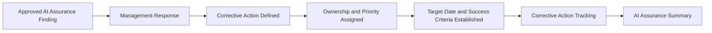

# AI Corrective Action Plan

## Executive Summary

AI Assurance Findings identifies governance weaknesses requiring management attention. The next step is to determine how those findings will be addressed.

The AI Corrective Action Plan establishes the formal management response to approved assurance findings associated with the Megastar Intelligent Processor (MIP). It documents the corrective actions that management commits to undertake, assigns accountability, establishes implementation priorities and target dates, defines completion criteria, and provides a structured basis for tracking remediation.

AI Assurance remains responsible for identifying and evaluating findings. Management remains responsible for designing and executing corrective actions. This separation preserves assurance independence and ensures that remediation accountability remains with the functions responsible for the affected control or process.

The plan does not verify corrective-action completion, close findings, recalculate residual risk, or determine whether remediation has been effective. Those activities occur through subsequent assurance, monitoring, and governance-review processes.

---

## Purpose

The purpose of this document is to establish a standardized approach for responding to approved AI Assurance Findings.

The AI Corrective Action Plan defines:

- management’s formal response to each finding;
- the corrective actions proposed to address the governance weakness;
- accountability for action implementation;
- remediation priority and target completion;
- dependencies and implementation constraints;
- completion and success criteria; and
- the mechanism used to track corrective-action progress.

Completion of this plan establishes a governed management commitment before corrective actions are implemented and later verified.

---

## Corrective Action Process

Every approved assurance finding requiring management action follows a consistent corrective-action process.

The plan records management’s intended response. It does not confirm that corrective actions have been implemented successfully.

---

## Corrective Action Principles

Megastar Mortgage establishes AI Corrective Action Plans according to the following principles:

- Every approved assurance finding requiring remediation shall have a documented management response.
- Management shall own the corrective actions arising from assurance findings.
- Assurance personnel shall not independently remediate findings they evaluated.
- Corrective actions shall address the governance weakness identified in the approved finding.
- Corrective actions shall be proportionate to the finding classification and governance impact.
- Ownership, priority, target dates, dependencies, and success criteria shall be documented.
- Disagreement with a finding shall be supported by documented rationale and approved through the appropriate governance process.
- Corrective-action completion shall not be treated as verified until an independent review or subsequent assurance activity confirms the result.
- Corrective-action status shall remain current and traceable throughout the remediation lifecycle.

---

## Management Response

Management records a formal response to each approved assurance finding.

| Management Response | Meaning |
|---|---|
| Agree | Management accepts the finding and commits to corrective action. |
| Partially Agree | Management accepts part of the finding or agrees with the issue but proposes a different scope or response. |
| Disagree | Management does not accept the finding and provides documented evidence and rationale. |
| Risk Acknowledged | Management acknowledges the finding but proposes no immediate remediation, subject to governance review and later residual-risk decision-making. |

A management response does not close the finding or constitute formal residual-risk acceptance.

Where management partially agrees, disagrees, or proposes no immediate corrective action, the matter shall be escalated according to established governance decision rights.

---

## Corrective Action Planning

Each corrective action shall clearly describe the governance improvement management intends to implement.

A corrective action may involve:

- revising a control design;
- completing or correcting control implementation;
- clarifying ownership or accountability;
- establishing or updating procedures;
- improving governance documentation;
- strengthening oversight or review;
- providing training or awareness;
- resolving evidence or recordkeeping weaknesses;
- addressing policy non-conformance;
- updating system configurations or workflows through approved change-management processes; or
- introducing additional governance measures.

The Corrective Action Plan defines the required action and accountable outcome. Detailed technical delivery or project-management plans may be maintained separately where necessary.

---

## Corrective Action Components

Each corrective action contains the following information.

| Component | Purpose |
|---|---|
| Finding Reference | Links the action to the approved assurance finding. |
| Management Response | Records management’s position on the finding. |
| Corrective Action | Defines the remediation commitment. |
| Action Owner | Assigns accountability for implementation. |
| Responsible Function | Identifies the function responsible for delivery. |
| Remediation Priority | Defines the urgency of the corrective action. |
| Target Completion Date | Establishes the expected completion date. |
| Dependencies | Identifies conditions or activities required for completion. |
| Implementation Constraints | Records factors that may delay or limit remediation. |
| Success Criteria | Defines the observable state indicating that the action has been completed as intended. |
| Action Status | Tracks progress throughout the remediation lifecycle. |
| Escalation Requirements | Identifies overdue, blocked, or disputed actions requiring governance attention. |

---

## Remediation Priority

Corrective actions are prioritized based on the approved finding classification, governance impact, affected control significance, and urgency of remediation.

| Remediation Priority | Meaning |
|---|---|
| Immediate | Action is required urgently because the finding creates unacceptable governance exposure. |
| High | Timely remediation is required due to a significant governance weakness. |
| Medium | Remediation is required through the standard corrective-action process. |
| Low | Improvement can be completed through routine governance activity. |

Remediation priority guides implementation urgency. It does not replace the finding classification or the underlying AI risk priority.

---

## Ownership and Accountability

Management retains accountability for corrective-action implementation.

Typical responsibilities include:

| Role | Responsibility |
|---|---|
| Action Owner | Accountable for ensuring the corrective action is completed. |
| Responsible Function | Performs or coordinates the remediation activity. |
| Control Owner | Ensures changes remain aligned with the related control objective and design. |
| AI Governance Lead | Oversees governance alignment, escalation, and progress reporting. |
| Assurance Function | Maintains independence and later verifies remediation where required. |
| Governance Authority | Resolves disputed, overdue, or materially constrained corrective actions. |

The individual or function responsible for assurance should not self-approve remediation completion where independence requirements apply.

---

## Success Criteria

Success criteria define the observable conditions management expects to achieve through the corrective action.

Appropriate success criteria should:

- directly address the approved finding;
- be specific and verifiable;
- remain traceable to the affected control or governance requirement;
- distinguish action completion from effectiveness verification;
- identify required documentation or governance-state changes; and
- provide a basis for later review or retesting.

A corrective action may be reported as completed when the planned remediation activity has been performed. It may be considered verified only after appropriate independent evaluation.

---

## Corrective Action Status

Corrective actions may progress through the following statuses.

| Status | Meaning |
|---|---|
| Planned | The action has been approved but implementation has not begun. |
| In Progress | Remediation activities are underway. |
| Blocked | Progress cannot continue because of an unresolved dependency or constraint. |
| Completed — Pending Verification | Management reports that implementation is complete, but independent verification has not occurred. |
| Verified | The corrective action has been independently evaluated and confirmed. |
| Closed | The related finding has been formally closed through the appropriate governance process. |
| Cancelled | The action has been withdrawn through an approved governance decision. |

Within this capability, management may update an action through **Completed — Pending Verification**. Verification and closure belong to later governance activity.

---

## Escalation

Corrective actions shall be escalated when:

- an Immediate or High-priority action is delayed;
- the action owner disputes the approved finding;
- required remediation cannot be completed within the approved timeframe;
- dependencies or constraints materially prevent progress;
- management proposes no remediation for a Major or Critical finding;
- implementation would require significant control redesign or system change; or
- corrective-action status is inaccurate, unsupported, or overdue.

Escalation does not replace management accountability for the action.

---

## Relationship to Governance Records

The AI Corrective Action Plan does not immediately update control effectiveness, residual risk, or finding closure within the living governance records.

At this stage, the plan records management commitments only.

Subsequent verification may update:

**Enterprise AI Control Register**

- Assurance Status
- Control Effectiveness
- Exceptions Identified
- Assurance Notes
- Improvement Actions
- Improvement Status

**Enterprise AI Risk Register**

- Assurance Outcome
- Residual Likelihood
- Residual Impact
- Residual Risk Rating

These updates occur only after appropriate assurance conclusions and governance decisions have been completed.

---

## Plan Maintenance

The AI Corrective Action Plan shall be reviewed when:

- management changes its response;
- corrective-action scope changes materially;
- ownership changes;
- target dates are revised;
- dependencies or constraints change;
- an action becomes overdue or blocked;
- implementation is reported as complete;
- additional assurance evidence affects the finding; or
- governance authorities require revised remediation.

All changes shall remain traceable to the approved assurance finding.

---

## Why This Document Matters

Assurance findings create governance value only when they lead to accountable and traceable action.

Without a structured Corrective Action Plan, findings may remain unresolved, responsibilities may become unclear, remediation may be delayed, and management may be unable to demonstrate that governance weaknesses are being addressed.

The AI Corrective Action Plan converts approved assurance findings into formal management commitments while preserving the independence of the assurance function and preparing remediation for later verification, monitoring, and governance review.

---

## Related Artifacts

This document supports:

- AI Corrective Action Plan Template
- AI Assurance Findings
- AI Assurance Summary
- Enterprise AI Control Register
- Continuous Monitoring

---

## Document Control

| Field | Value |
|---|---|
| Document | AI Corrective Action Plan |
| Capability | AI Assurance |
| Repository | Enterprise AI Governance Playbook |
| Reference Organization | Megastar Mortgage |
| Reference AI System | Megastar Intelligent Processor (MIP) |
| Document Owner | AI Governance Lead |
| Version | 1.0 |
| Review Cycle | Annual |
| Status | Published Reference |

---

## Revision History

| Version | Date | Description |
|---|---|---|
| 1.0 | July 2026 | Initial release of the AI Corrective Action Plan artifact. |