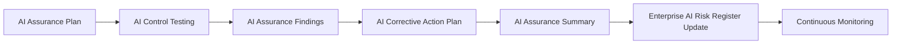

# AI Assurance Summary

## Executive Summary

AI Assurance evaluates whether approved governance controls for the Megastar Intelligent Processor (MIP) are appropriately designed, implemented as approved, and operating effectively.

The AI Assurance Summary consolidates the outcomes of assurance planning, control testing, assurance findings, and management corrective-action commitments into an executive-level conclusion regarding the overall AI governance control environment.

The summary provides Megastar Mortgage with a clear view of assurance coverage, control effectiveness, material findings, unresolved corrective actions, and the remaining risk after considering the effectiveness of implemented controls.

It also provides the formal basis for updating the Enterprise AI Risk Register with assurance outcomes and residual-risk information before governance proceeds to Continuous Monitoring.

The AI Assurance Summary does not formally accept residual risk, close unverified findings, or replace the detailed assurance records supporting its conclusions.

---

## Purpose

The purpose of this document is to establish a standardized approach for consolidating AI Assurance outcomes and communicating the overall assurance conclusion.

The AI Assurance Summary enables governance stakeholders to understand:

- the scope and coverage of assurance activities;
- the results of AI Control Testing;
- the effectiveness of the AI control environment;
- the number and significance of approved assurance findings;
- the status of management corrective-action commitments;
- the assurance opinion supported by the available evidence;
- the residual risk remaining after considering control effectiveness; and
- readiness to proceed into Continuous Monitoring.

The summary aggregates approved information without duplicating the detailed records maintained within supporting assurance artifacts and living governance records.

---

## Assurance Summary Process

The AI Assurance Summary is prepared after assurance testing, findings evaluation, and corrective-action planning have been completed.

The summary consolidates assurance evidence and governance conclusions before residual-risk information is recorded and monitoring begins.

---

## Summary Principles

Megastar Mortgage prepares AI Assurance Summaries according to the following principles:

- Every completed AI assurance engagement shall produce an approved AI Assurance Summary.
- Summary conclusions shall be supported by sufficient, relevant, reliable, timely, and traceable assurance evidence.
- Individual control-test records and findings shall not be duplicated within the summary.
- Assurance conclusions shall reflect only the scope and review period covered by the approved AI Assurance Plan.
- Control effectiveness conclusions shall remain distinguishable from residual-risk conclusions.
- Open findings and unverified corrective actions shall be considered when forming the assurance opinion.
- Residual risk shall be determined only after considering relevant control-effectiveness conclusions and assurance findings.
- Residual-risk information shall not constitute formal risk acceptance.
- Material limitations shall be clearly disclosed.
- The summary shall remain traceable to the Enterprise AI Control Register and Enterprise AI Risk Register.

---

## Summary Scope

The AI Assurance Summary consolidates the following information:

| Summary Area | Purpose |
|---|---|
| Assurance Portfolio Overview | Presents the overall scope and status of assurance activities performed. |
| Testing Coverage | Summarizes controls and assurance dimensions evaluated. |
| Control Effectiveness | Consolidates approved control-level effectiveness conclusions. |
| Findings Overview | Summarizes approved assurance findings by classification and status. |
| Corrective Action Overview | Summarizes management responses and remediation commitments. |
| Assurance Limitations | Records matters affecting the reliability or scope of the conclusion. |
| Assurance Opinion | Communicates the overall conclusion regarding the AI governance control environment. |
| Residual Risk Summary | Records the remaining risk after considering control effectiveness and assurance outcomes. |
| Monitoring Readiness | Confirms whether the control and risk environment is ready to enter Continuous Monitoring. |

---

## Assurance Portfolio Overview

The portfolio overview provides a consolidated view of the completed assurance engagement.

Typical information includes:

- Total controls included within scope.
- Total controls tested.
- Controls not tested or deferred.
- Assurance dimensions evaluated.
- Review period covered.
- Total testing procedures completed.
- Total approved findings.
- Total corrective actions established.
- Material limitations affecting the engagement.
- Overall assurance status.

The approved AI Assurance Plan, AI Control Testing records, AI Assurance Findings, and AI Corrective Action Plans remain the authoritative sources for detailed information.

---

## Testing Coverage

Testing coverage summarizes the extent to which approved controls and assurance dimensions were evaluated.

Coverage may include:

- Controls evaluated for design adequacy.
- Controls evaluated for implementation.
- Controls evaluated for operating effectiveness.
- Controls excluded or deferred.
- Control domains represented within the assurance scope.
- Related prioritized risks covered by the tested controls.
- Review-period coverage.
- Population and sampling limitations.
- Areas where insufficient evidence prevented a conclusion.

Testing coverage provides context for the assurance opinion and shall not imply evaluation beyond the approved scope.

---

## Control Effectiveness Summary

Approved control-level conclusions are consolidated using the following categories:

| Control Effectiveness | Meaning |
|---|---|
| Effective | The control achieved its intended objective for the assurance dimensions evaluated. |
| Partially Effective | The control provided some intended governance benefit, but limitations or exceptions reduced confidence in full effectiveness. |
| Ineffective | The control did not adequately achieve its intended objective for the assurance dimensions evaluated. |
| Not Concluded | Sufficient evidence was unavailable to support a reliable conclusion. |

The summary may present:

- Total controls assessed as Effective.
- Total controls assessed as Partially Effective.
- Total controls assessed as Ineffective.
- Total controls for which no conclusion could be formed.
- Concentrations of ineffective or partially effective controls by domain.
- Common control dependencies or systemic weaknesses.
- Controls requiring retesting or additional assurance work.

A control-level conclusion applies only to the dimensions and review period evaluated.

---

## Assurance Findings Overview

Approved assurance findings are summarized by governance classification.

| Finding Classification | Summary Purpose |
|---|---|
| Observation | Matters noted for awareness that do not require formal corrective action. |
| Minor Finding | Limited governance weaknesses requiring proportionate attention. |
| Major Finding | Significant governance weaknesses requiring management attention and corrective action. |
| Critical Finding | Governance failures creating unacceptable exposure and requiring immediate escalation. |

The summary may include:

- Total findings by classification.
- Findings associated with ineffective or partially effective controls.
- Findings affecting multiple controls or governance domains.
- Findings requiring executive or committee escalation.
- Findings for which management disagreed or partially agreed.
- Findings with overdue, blocked, or unverified corrective actions.
- Repeated or systemic findings.

Individual findings remain governed through the AI Assurance Findings records.

---

## Corrective Action Overview

The AI Assurance Summary consolidates management responses and corrective-action commitments without independently verifying their completion.

The overview may include:

- Findings with approved corrective-action plans.
- Findings without an approved management response.
- Immediate and High-priority corrective actions.
- Corrective actions in progress.
- Corrective actions reported as completed pending verification.
- Blocked or overdue corrective actions.
- Corrective actions requiring control redesign or formal change management.
- Actions requiring follow-up through Continuous Monitoring.

Management-reported completion does not establish that a corrective action is effective or that the related finding is closed.

---

## Assurance Limitations

The summary documents material limitations affecting the engagement or its conclusions.

Examples include:

- Incomplete or unavailable evidence.
- Controls not implemented for the full review period.
- Restricted access to systems, records, or personnel.
- Incomplete testing populations.
- Third-party evidence limitations.
- Significant changes during the assurance period.
- Inconclusive testing results.
- Scope exclusions.
- Limitations affecting assurance independence or objectivity.
- Corrective actions not yet verified.

Material limitations shall be considered when determining the assurance opinion and residual-risk information.

---

## Assurance Opinion

The assurance opinion communicates the overall level of confidence supported by the completed engagement.

| Assurance Opinion | Meaning |
|---|---|
| Reasonable Assurance | The control environment provides reasonable confidence that applicable governance objectives are being achieved, subject to any documented limitations or findings. |
| Limited Assurance | Important weaknesses, incomplete evidence, or control limitations reduce confidence that applicable governance objectives are being achieved consistently. |
| Adverse Assurance | Significant or pervasive governance weaknesses prevent reasonable confidence that applicable governance objectives are being achieved. |
| Unable to Conclude | Sufficient and appropriate evidence was not available to form a reliable overall assurance opinion. |

The assurance opinion shall:

- reflect the approved assurance scope;
- consider control-effectiveness conclusions;
- consider the number and significance of findings;
- consider unresolved corrective actions and limitations;
- distinguish isolated exceptions from systemic weaknesses; and
- be approved by the appropriate assurance authority.

The assurance opinion does not constitute formal residual-risk acceptance.

---

## Residual Risk Determination

Residual risk represents the risk remaining after considering the design, implementation, and operating effectiveness of relevant controls.

Residual-risk determination uses:

- the approved risk record;
- the pre-control likelihood and consequence analysis;
- the approved risk priority;
- the selected response strategy;
- the controls linked to the risk;
- control-effectiveness conclusions;
- assurance findings;
- unresolved corrective actions;
- assurance limitations; and
- changes identified during the assurance period.

For each applicable risk, the assurance process determines:

| Residual Risk Element | Purpose |
|---|---|
| Control Effectiveness | Records the overall effectiveness of controls associated with the risk. |
| Assurance Outcome | Records the assurance conclusion relevant to the risk. |
| Residual Likelihood | Estimates the likelihood remaining after considering the effectiveness of relevant controls. |
| Residual Impact | Estimates the consequence remaining after considering the effectiveness of relevant controls. |
| Residual Risk Rating | Records the resulting level of residual risk. |

Residual risk shall be supported by documented rationale and shall remain traceable to the relevant control-testing and assurance records.

Formal residual-risk acceptance occurs later through the appropriate governance authority.

---

## Enterprise AI Control Register Status

The Enterprise AI Control Register is progressively enriched during AI Control Testing and AI Assurance Findings.

By the time the AI Assurance Summary is prepared, the relevant control records should reflect:

- Assurance Status.
- Test Result.
- Control Effectiveness.
- Evidence Reference.
- Exceptions Identified.
- Assurance Notes.

The AI Assurance Summary does not recreate these control-level records. It consolidates their approved outcomes into an overall assurance conclusion.

---

## Enterprise AI Risk Register Enrichment

The approved AI Assurance Summary updates the following fields within the living Enterprise AI Risk Register:

| Risk Register Field | Information Added |
|---|---|
| Control Effectiveness | Consolidated effectiveness of controls associated with the risk. |
| Assurance Outcome | Approved assurance conclusion relevant to the risk. |
| Residual Likelihood | Likelihood remaining after considering control effectiveness. |
| Residual Impact | Consequence remaining after considering control effectiveness. |
| Residual Risk Rating | Overall residual-risk level after assurance. |

The Risk Acceptance Decision, acceptance authority, and acceptance date are not populated during AI Assurance.

---

## Readiness for Continuous Monitoring

MIP is ready to proceed into Continuous Monitoring when:

- assurance testing has been completed for the approved scope;
- control-level conclusions have been approved;
- assurance findings have been documented;
- management responses and corrective-action plans have been established where required;
- material limitations have been disclosed;
- the assurance opinion has been approved;
- residual-risk information has been updated within the Enterprise AI Risk Register;
- controls and corrective actions requiring ongoing observation have been identified; and
- monitoring priorities and dependencies are sufficiently clear.

Open findings and corrective actions do not automatically prevent progression where they are formally tracked, appropriately governed, and included within the monitoring scope.

---

## Handoff to Continuous Monitoring

AI Assurance establishes:

- whether controls were appropriately designed;
- whether controls were implemented as approved;
- whether controls operated effectively during the review period;
- which governance findings require management attention;
- what corrective actions management has committed to undertake;
- what overall assurance opinion is supported; and
- what residual risk remains.

Continuous Monitoring observes the ongoing condition of controls, risks, corrective actions, metrics, indicators, incidents, and governance thresholds throughout the operational lifecycle.

The AI Assurance Summary provides the formal transition between periodic assurance and ongoing governance visibility.

---

## Summary Maintenance

The AI Assurance Summary shall be reviewed when:

- a material testing result changes;
- an approved finding is revised;
- new evidence materially affects the assurance opinion;
- a corrective action is verified;
- a material control change occurs;
- the AI system or its risk profile changes significantly;
- residual-risk information is reassessed; or
- the existing summary no longer reflects the approved assurance records.

Updates shall preserve version history and traceability to the underlying assurance evidence.

---

## Why This Document Matters

Individual control tests provide evidence, but governance leaders require a consolidated conclusion regarding the control environment and the risk that remains.

Without an AI Assurance Summary, control results, findings, limitations, corrective actions, and residual-risk implications may remain fragmented across multiple records.

The AI Assurance Summary enables Megastar Mortgage to communicate assurance outcomes clearly, update its living risk record consistently, and enter Continuous Monitoring with an evidence-based understanding of control effectiveness and residual AI risk.

---

## Related Artifacts

This document supports:

- AI Assurance Summary Template
- AI Assurance Plan
- AI Control Testing
- AI Assurance Findings
- AI Corrective Action Plan
- Enterprise AI Control Register
- Enterprise AI Risk Register
- Continuous Monitoring

---

## Document Control

| Field | Value |
|---|---|
| Document | AI Assurance Summary |
| Capability | AI Assurance |
| Repository | Enterprise AI Governance Playbook |
| Reference Organization | Megastar Mortgage |
| Reference AI System | Megastar Intelligent Processor (MIP) |
| Document Owner | AI Governance Lead |
| Version | 1.0 |
| Review Cycle | Annual |
| Status | Published Reference |

---

## Revision History

| Version | Date | Description |
|---|---|---|
| 1.0 | July 2026 | Initial release of the AI Assurance Summary artifact. |