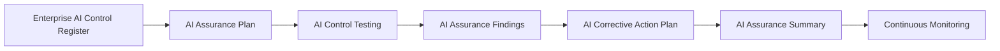

# AI Assurance

## Document Control

| Field | Value |
|--------|-------|
| Document Name | AI Assurance |
| Capability | AI Assurance |
| Repository | Enterprise AI Governance Playbook |
| Reference Organization | Megastar Mortgage |
| Reference AI System | Megastar Intelligent Processor (MIP) |
| Document Owner | AI Governance Lead |
| Version | 1.0 |
| Classification | Public Reference Implementation |
| Status | Published |
| Review Cycle | Annual |
| Last Updated | July 2026 |

---

# Executive Summary

AI Controls establish the governance measures intended to reduce prioritized AI risks.

AI Assurance provides objective confidence that those governance controls have been appropriately designed, implemented, and are operating as intended.

Building upon the outputs of AI Controls, this capability demonstrates how Megastar Mortgage plans assurance activities, evaluates approved AI controls, records assurance findings, establishes corrective actions, and communicates overall assurance conclusions for the Megastar Intelligent Processor (MIP).

Rather than creating a separate assurance register, AI Assurance progressively enriches the Enterprise AI Control Register with assurance results and the Enterprise AI Risk Register with residual risk information, preserving a single authoritative governance record for both controls and risks.

---

# Purpose

The purpose of this capability is to establish a standardized approach for obtaining objective assurance over AI governance controls.

This capability defines:

- how AI assurance activities are planned;
- how approved AI controls are evaluated;
- how assurance findings are documented;
- how corrective actions are established; and
- how overall assurance conclusions are communicated.

Completion of this capability provides the evidence-based governance conclusions required before Continuous Monitoring begins.

---

# Capability Scope

This capability establishes the governance processes for:

- planning AI assurance activities;
- evaluating approved AI controls;
- documenting assurance findings;
- planning corrective actions; and
- summarizing assurance conclusions.

The capability focuses on independent evaluation.

It does not redesign controls, implement controls, continuously monitor controls, or formally accept residual risk.

---

# Governance Artifacts

| Governance Artifact | Purpose |
|----------------------|---------|
| AI Assurance Plan | Defines the scope, objectives, and approach for evaluating approved AI controls. |
| AI Control Testing | Establishes how approved AI controls are objectively evaluated. |
| AI Assurance Findings | Documents the observations, conclusions, and exceptions identified during assurance activities. |
| AI Corrective Action Plan | Defines how approved assurance findings will be addressed. |
| AI Assurance Summary | Consolidates the overall assurance conclusion before Continuous Monitoring begins. |

Together, these artifacts provide objective evidence regarding the design, implementation, and operating effectiveness of AI governance controls.

---

# Governance Lifecycle

Every approved AI control progresses through a consistent assurance lifecycle.

Assurance activities progressively enrich both the Enterprise AI Control Register and the Enterprise AI Risk Register without creating additional governance records.

---

# Living Governance Records

AI Assurance does not establish a separate assurance register.

Instead, assurance activities progressively enrich the organization's existing living governance records.

**Enterprise AI Control Register**

AI Assurance updates information including:

- Assurance Status
- Test Result
- Control Effectiveness
- Evidence Reference
- Exceptions Identified
- Assurance Notes

**Enterprise AI Risk Register**

AI Assurance updates information including:

- Control Effectiveness
- Assurance Outcome
- Residual Likelihood
- Residual Impact
- Residual Risk Rating

This approach preserves a single authoritative governance record for controls and risks while maintaining complete traceability throughout the AI governance lifecycle.

---

# Capability Outcomes

Upon completion of this capability, Megastar Mortgage will have established:

- an approved AI Assurance Plan;
- completed AI Control Testing;
- documented AI Assurance Findings;
- approved AI Corrective Action Plans; and
- an AI Assurance Summary providing the overall assurance conclusion.

These deliverables provide objective evidence supporting governance decisions and prepare the organization for Continuous Monitoring.

---

# Why This Capability Matters

Designing and implementing governance controls does not, by itself, demonstrate that AI governance is effective.

Organizations require objective assurance that approved controls have been appropriately designed, successfully implemented, and are operating as intended.

The AI Assurance capability provides independent governance evaluation, strengthens organizational confidence, supports auditability, and enables informed governance decisions through evidence-based assurance conclusions.

---

# Relationship to Other Capabilities

This capability builds directly upon AI Controls.

It provides the governance foundation for:

- Continuous Monitoring
- Continuous Improvement
- Future governance decisions regarding residual AI risk

Each subsequent capability assumes that approved AI controls have been objectively evaluated through AI Assurance.

---

# Capability Completion Criteria

This capability is complete when:

- the AI Assurance Plan has been approved;
- AI Control Testing has been completed;
- AI Assurance Findings have been documented;
- AI Corrective Action Plans have been approved; and
- the AI Assurance Summary has been completed.

---

# Capability Completion Checklist

| Status | Deliverable |
|--------|-------------|
| ☐ | AI Assurance Plan completed |
| ☐ | AI Control Testing completed |
| ☐ | AI Assurance Findings documented |
| ☐ | AI Corrective Action Plans approved |
| ☐ | AI Assurance Summary completed |

---

# Next Capability

Following completion of AI Assurance, Megastar Mortgage proceeds to **Continuous Monitoring**, where approved AI controls and AI risks are continually observed, reviewed, and improved throughout the operational lifecycle.

---

# Related Capabilities

- AI Controls
- Continuous Monitoring

---

# Revision History

| Version | Date | Description |
|----------|------|-------------|
| 1.0 | July 2026 | Initial release of the AI Assurance capability. |