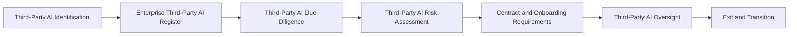

# Enterprise Third-Party AI Register

## Executive Summary

Identifying a third-party AI relationship establishes that an external dependency exists. Governing that relationship requires a single authoritative record that remains current throughout its lifecycle.

Following Third-Party AI Identification, Megastar Mortgage creates an Enterprise Third-Party AI Register record for every material external provider, product, service, model, platform, application programming interface, or supporting dependency associated with the Megastar Intelligent Processor (MIP).

The Enterprise Third-Party AI Register serves as the organization’s living governance record for each external AI relationship. It begins with provider and dependency information and is progressively enriched through due diligence, provider-risk assessment, contracting, onboarding, oversight, incident management, change management, renewal, exit, and closure.

The register records the current governed state of the relationship and provides traceability to supporting governance artifacts. It does not replace the specialist activities that assess, approve, contract for, monitor, investigate, change, or terminate the relationship.

---

## Purpose

The purpose of this document is to establish a standardized approach for creating, maintaining, and governing the Enterprise Third-Party AI Register.

The register enables Megastar Mortgage to:

- maintain an authoritative record of material third-party AI relationships;
- link each provider relationship to the AI systems it supports;
- establish ownership and accountability;
- preserve provider, service, and dependency information;
- record due-diligence and governance outcomes;
- link provider-originated risks to the Enterprise AI Risk Register;
- record contractual and onboarding status;
- maintain oversight, assurance, incident, and change references;
- track renewal, continuation, exit, and closure decisions; and
- preserve a complete and auditable relationship history.

The Enterprise Third-Party AI Register provides relationship visibility and governance traceability throughout the external-provider lifecycle.

---

## Register Process

Every material external AI dependency confirmed through Third-Party AI Identification is formally recorded within the Enterprise Third-Party AI Register.

The register is created early in the relationship lifecycle and progressively updated as governance activities are completed.

---

## Register Principles

Megastar Mortgage maintains the Enterprise Third-Party AI Register according to the following principles:

- Every material third-party AI relationship shall have one authoritative register record.
- Every register record shall have a unique Third-Party Relationship ID.
- The register shall be created after a material external AI relationship is identified.
- The register shall remain linked to all related Enterprise AI System Inventory records.
- Provider-originated risks shall be maintained in the Enterprise AI Risk Register rather than duplicated within this register.
- Controls addressing provider risks and obligations shall be maintained in the Enterprise AI Control Register.
- Detailed due-diligence, contractual, assurance, incident, and change records shall remain within their authoritative source artifacts.
- Register information shall remain accurate, complete, current, and traceable.
- Changes to register records shall be authorized and preserved through change history.
- A provider relationship shall not be considered closed until applicable contractual, data, access, operational, and governance obligations have been resolved.

---

## Living Governance Record

The Enterprise Third-Party AI Register is a living governance record.

It presents the complete lifecycle of the provider relationship, but individual fields are completed only when the governance activity responsible for that information has occurred.

| Governance Activity | Register Information Added |
|---|---|
| Third-Party AI Identification | Provider identity, product or service, related AI system, relationship owner, dependency structure, initial criticality, and relationship status |
| Enterprise Third-Party AI Register | Unique relationship ID, registration information, administrative ownership, and authoritative record status |
| Third-Party AI Due Diligence | Provider capability, governance documentation, privacy, security, resilience, transparency, assurance evidence, subprocessors, and due-diligence outcome |
| Third-Party AI Risk Assessment | Provider-originated risk references, assessment status, and material dependency concerns |
| Contract & Onboarding Requirements | Contract status, required provisions, onboarding conditions, approvals, and permitted-use status |
| Third-Party AI Oversight | Review history, provider performance, assurance status, unresolved issues, material dependencies, and continuation or renewal status |
| Continuous Monitoring | Provider-related indicators, thresholds, trends, and monitoring escalations where applicable |
| AI Incident Management | Provider-related incident references, notification status, and unresolved incident obligations |
| AI Change Management | Material provider, model, service, ownership, subprocessor, policy, or contract-change references |
| Exit & Transition Plan | Termination decision, transition status, data return or deletion, access revocation, continuity arrangements, and exit completion |
| Governance Oversight | Material continuation, escalation, exception, or relationship-governance decisions where required |

Each activity updates the existing provider relationship record rather than creating a disconnected substitute.

---

## Required Register Information

Each third-party AI relationship record contains standardized lifecycle information.

| Information Category | Purpose |
|---|---|
| Relationship Identification | Establishes the unique identity and administrative status of the provider relationship. |
| Provider and Service Profile | Records the provider, product, service, model, platform, or dependency being used. |
| Related AI Systems | Links the relationship to one or more governed AI systems. |
| Ownership and Accountability | Records responsibility for the business relationship and governance coordination. |
| Dependency Information | Records direct, indirect, subprocessor, fourth-party, concentration, and replacement dependencies. |
| Due Diligence | Records due-diligence status, outcome, material observations, and supporting references. |
| Provider-Originated Risk References | Links identified provider risks to the Enterprise AI Risk Register. |
| Contract and Onboarding | Records contractual status, governance conditions, approvals, and onboarding readiness. |
| Oversight and Assurance | Records provider reviews, assurance documentation, service performance, open issues, and governance status. |
| Incidents and Changes | Links material provider-related incidents and approved changes. |
| Renewal and Continuation | Records continuation, renewal, escalation, or reassessment decisions. |
| Exit and Transition | Records termination, replacement, data disposition, access revocation, transition, and closure status. |
| Register Administration | Maintains review dates, record ownership, update history, and authoritative status. |

Detailed fields are maintained within the **Enterprise Third-Party AI Register Template**.

---

## Relationship Lifecycle Status

Each register record maintains a current relationship status.

| Relationship Status | Meaning |
|---|---|
| Identified | A material third-party AI dependency has been identified and registered. |
| Under Due Diligence | Provider evaluation is in progress. |
| Pending Approval | Required governance, procurement, contractual, or onboarding decisions remain outstanding. |
| Approved for Onboarding | Required conditions have been approved and onboarding may proceed. |
| Active | The provider relationship is operational and subject to ongoing oversight. |
| Conditional | Continued or proposed use is subject to documented conditions, actions, or restrictions. |
| Under Review | The relationship is undergoing reassessment, escalation, renewal, or material-change review. |
| Suspended | Use has been temporarily restricted or paused pending governance resolution. |
| Exit Planned | Termination, replacement, or transition has been approved or initiated. |
| In Transition | Exit or replacement activities are underway. |
| Closed | Applicable relationship, data, access, contractual, operational, and governance obligations have been completed. |

The relationship status records the current governed state. It does not replace the detailed decision or approval artifact supporting that status.

---

## Relationship to Other Living Governance Records

The Enterprise Third-Party AI Register operates alongside the repository’s existing living governance records.

| Governance Record | Governed Object | Relationship to Third-Party AI Governance |
|---|---|---|
| Enterprise AI System Inventory | AI system | Records the AI system that uses or depends on the provider. |
| Enterprise Third-Party AI Register | External provider relationship | Records the provider, service, dependency, lifecycle, and relationship-governance state. |
| Enterprise AI Risk Register | AI risk | Records provider-originated risks identified through due diligence and risk assessment. |
| Enterprise AI Control Register | AI control | Records controls established to manage provider risks, contractual obligations, and oversight requirements. |

These records are linked rather than merged.

One provider may support multiple AI systems, and one AI system may rely on multiple providers. Each relationship must therefore preserve explicit cross-record references.

---

## Register Maintenance

The Enterprise Third-Party AI Register shall be reviewed and updated whenever:

- a new external AI dependency is identified;
- the provider, product, service, or intended use changes;
- a related AI system is added or removed;
- due-diligence information changes;
- new subprocessors or fourth parties are introduced;
- provider-originated risks are identified or revised;
- contractual or onboarding conditions change;
- provider assurance documentation is received or expires;
- material service-performance issues arise;
- a provider-related incident occurs;
- a material provider or service change is proposed;
- relationship ownership changes;
- renewal or continuation is considered;
- exit or transition is initiated;
- data-return, deletion, or access-revocation obligations are completed; or
- the relationship is formally closed.

Each update shall identify the responsible governance activity, update date, record owner, and supporting reference.

---

## Register Quality

The Enterprise Third-Party AI Register shall be maintained to support:

- **Completeness** — all material third-party AI relationships are recorded.
- **Accuracy** — information reflects the current provider relationship.
- **Timeliness** — material changes are recorded promptly.
- **Traceability** — register outcomes link to their authoritative source artifacts.
- **Consistency** — standardized fields and status values are used.
- **Accountability** — ownership and update responsibility are clear.
- **Auditability** — historical changes and governance decisions can be reconstructed.
- **Confidentiality** — sensitive provider and contractual information is appropriately protected.

---

## Relationship Closure

A third-party AI relationship may be recorded as Closed only after applicable closure requirements have been completed or formally resolved.

Closure requirements may include:

- termination or contract-expiry obligations completed;
- provider access revoked;
- integrations disabled or removed;
- data returned, transferred, deleted, or retained under an approved requirement;
- deletion confirmation received where required;
- replacement or continuity arrangements completed;
- unresolved incidents, findings, or corrective actions transferred or closed;
- required governance evidence retained;
- related AI System Inventory records updated;
- linked risk and control records updated; and
- final closure approval recorded.

Closing the provider relationship does not automatically close linked AI risks, controls, incidents, or change records.

---

## Why This Document Matters

Third-party AI relationships may extend across procurement systems, contracts, technical integrations, risk assessments, security reviews, assurance reports, incidents, provider changes, renewals, and exit activities.

Without one authoritative relationship record, governance information can become fragmented, ownership can become unclear, material dependencies can remain hidden, and the organization may struggle to demonstrate effective oversight.

The Enterprise Third-Party AI Register provides Megastar Mortgage with a complete and traceable view of each external AI relationship from initial identification through final closure.

It enables provider governance to remain connected to the AI system, risks, controls, contractual obligations, assurance evidence, incidents, changes, and exit decisions that define the relationship.

---

## Related Artifacts

This document supports:

- Enterprise Third-Party AI Register Template
- Third-Party AI Identification
- Third-Party AI Due Diligence
- Third-Party AI Risk Assessment
- Third-Party AI Contract & Onboarding Requirements
- Third-Party AI Oversight
- Third-Party AI Exit & Transition Plan
- Enterprise AI System Inventory
- Enterprise AI Risk Register
- Enterprise AI Control Register

---

## Document Control

| Field | Value |
|---|---|
| Document | Enterprise Third-Party AI Register |
| Capability | Third-Party AI Governance |
| Repository | Enterprise AI Governance Playbook |
| Reference Organization | Megastar Mortgage |
| Reference AI System | Megastar Intelligent Processor (MIP) |
| Document Owner | AI Governance Lead |
| Version | 1.0 |
| Review Cycle | Annual |
| Status | Published Reference |

---

## Revision History

| Version | Date | Description |
|---|---|---|
| 1.0 | July 2026 | Initial release of the Enterprise Third-Party AI Register artifact. |