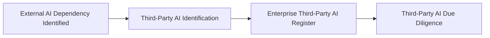

# Third-Party AI Identification

## Executive Summary

Enterprise AI systems may depend on external providers for models, platforms, application programming interfaces, cloud services, data processing, infrastructure, or specialized AI capabilities.

Before Megastar Mortgage can evaluate, contract for, oversee, or exit a third-party AI relationship, it must first establish that the relationship exists and understand the external dependency being introduced.

Third-Party AI Identification provides a standardized approach for identifying externally provided AI products, services, models, platforms, vendors, and material dependencies supporting the Megastar Intelligent Processor (MIP).

This activity creates the initial provider relationship record required for registration within the Enterprise Third-Party AI Register. It does not determine whether the provider is suitable, acceptable, compliant, or sufficiently governed. Those conclusions are established through subsequent due-diligence, risk, contractual, and oversight activities.

---

## Purpose

The purpose of this document is to establish a consistent approach for identifying third-party AI relationships supporting proposed or existing enterprise AI systems.

Third-Party AI Identification captures the minimum information required to:

- identify the external provider;
- identify the product, service, model, platform, or dependency involved;
- connect the relationship to the governed AI system;
- establish business ownership;
- describe the intended use;
- classify the nature of the external dependency;
- determine the initial level of operational dependency; and
- create the initial record within the Enterprise Third-Party AI Register.

Completion of this activity confirms that a third-party AI relationship exists and must enter the formal third-party governance lifecycle.

---

## Identification Process

Every proposed or existing external AI dependency follows a consistent identification process.

Identification establishes the relationship record before suitability, risk, contractual, or onboarding decisions are made.

---

## Identification Principles

Megastar Mortgage identifies third-party AI relationships according to the following principles:

- Every material external AI dependency shall be identified before onboarding or operational use.
- Identification shall occur whether the provider relationship is proposed, contracted, piloted, or already operational.
- One third-party relationship may support multiple governed AI systems.
- One governed AI system may depend on multiple third-party providers.
- Identification shall capture only the information required to recognize and register the relationship.
- Identification shall not determine provider suitability, risk, approval, or contractual acceptability.
- Provider relationships shall remain traceable to the relevant AI System Inventory record.
- Material indirect dependencies, including subprocessors and fourth parties, shall be recorded when known.
- Uncertain or incomplete information shall be documented and resolved through subsequent governance activities.

---

## Identification Scope

Third-Party AI Identification applies when Megastar Mortgage proposes to use or already relies upon an external party for:

- AI models or foundation models;
- AI-enabled application programming interfaces;
- software-as-a-service AI platforms;
- cloud-based AI capabilities;
- intelligent document-processing services;
- managed AI services;
- AI development, hosting, or support;
- external data services used by AI systems;
- model-training, validation, or evaluation services;
- AI infrastructure or inference services;
- model-monitoring or observability services;
- external human-review or annotation services supporting AI operations; or
- other material external dependencies required for an AI system to operate.

Traditional suppliers with no material connection to an AI system are governed through the organization’s broader third-party-risk process and do not enter this capability solely because they provide technology services.

---

## Third-Party AI Relationship Types

Third-party AI relationships are identified using a standardized relationship type.

| Relationship Type | Description |
|---|---|
| Foundation Model Provider | Provides a general-purpose or domain model used directly or through another service. |
| AI API Provider | Provides AI functionality through an external application programming interface. |
| SaaS AI Platform | Provides a hosted AI-enabled business application or platform. |
| Managed AI Service | Operates or manages an AI capability on behalf of Megastar Mortgage. |
| Cloud AI Service | Provides cloud-hosted AI development, deployment, or inference capabilities. |
| Intelligent Document Processing Provider | Provides OCR, extraction, classification, or document-intelligence capabilities. |
| AI Data Provider | Supplies external data, labels, benchmarks, or other data services used by the AI system. |
| AI Infrastructure Provider | Provides compute, model-hosting, inference, or specialized AI infrastructure. |
| AI Development or Support Provider | Develops, configures, validates, maintains, or supports AI systems. |
| Human Review or Annotation Provider | Provides external human review, annotation, validation, or quality-assurance services supporting AI operations. |
| Other Material AI Dependency | Provides another external capability materially supporting the AI system. |

A relationship may be assigned more than one type where the provider performs multiple roles.

---

## Relationship Context

Identification establishes the basic context of the external relationship.

The initial record includes:

| Information Area | Purpose |
|---|---|
| Provider Identity | Identifies the legal or commercial provider. |
| Product or Service | Identifies the externally provided AI capability. |
| Related AI System | Links the provider relationship to the Enterprise AI System Inventory. |
| Intended Use | Describes how the product or service will support the governed AI system. |
| Business Ownership | Identifies the business function accountable for the relationship. |
| Relationship Status | Identifies whether the relationship is proposed, under evaluation, contracted, active, or being exited. |
| Deployment Context | Describes at a high level how the external capability is accessed or delivered. |
| Dependency Type | Classifies the nature of the external AI dependency. |
| Initial Dependency Criticality | Records the initial level of operational reliance on the provider. |

These fields establish visibility only. They do not replace due diligence, risk assessment, or contract review.

---

## Initial Dependency Criticality

Initial dependency criticality describes how strongly the governed AI system relies upon the third-party product or service.

It is not a risk rating.

| Initial Dependency Criticality | Meaning |
|---|---|
| Low | The dependency is limited, non-essential, or readily replaceable with minimal disruption. |
| Moderate | The dependency supports important activity but can be replaced or bypassed with manageable effort. |
| High | The dependency supports significant operations, and disruption or replacement would materially affect the AI system or business process. |
| Critical | The AI system or supported business process cannot operate acceptably without the provider, and replacement or transition would be difficult or time-sensitive. |

Initial dependency criticality supports due-diligence depth, oversight planning, and exit preparation. It does not determine provider risk or approval.

---

## Direct and Indirect Dependencies

Third-party AI relationships may include both direct and indirect dependencies.

### Direct Dependency

A provider contracted or used directly by Megastar Mortgage.

Examples include:

- an external AI platform;
- a cloud AI service;
- a model provider;
- an AI API; or
- an intelligent document-processing vendor.

### Indirect Dependency

A subprocessor, fourth party, embedded model, infrastructure provider, or other external dependency introduced through the primary provider.

Known material indirect dependencies shall be recorded during identification. Additional dependencies discovered later shall be added through due diligence, oversight, or change-management activities.

---

## Relationship Ownership

Each identified third-party AI relationship shall have a designated business relationship owner.

The relationship owner is responsible for ensuring that:

- the relationship is registered;
- the intended use is documented;
- the related AI system is identified;
- required due diligence is initiated;
- governance stakeholders receive accurate relationship information; and
- material changes are reported through the appropriate governance process.

Relationship ownership does not replace the responsibilities of Procurement, Legal & Compliance, Privacy, Security, Technology, Risk, or AI Governance.

---

## Enterprise Third-Party AI Register Creation

Completion of Third-Party AI Identification creates the initial record within the Enterprise Third-Party AI Register.

The initial register record contains:

- Third-Party Relationship ID;
- provider name;
- product or service name;
- relationship type;
- related AI System Inventory ID;
- intended use;
- business relationship owner;
- business function;
- direct or indirect dependency status;
- deployment context;
- initial dependency criticality;
- relationship status;
- identification date; and
- known material subprocessors or fourth-party dependencies.

The register is progressively enriched through:

- Third-Party AI Due Diligence;
- Third-Party AI Risk Assessment;
- Contract and Onboarding Requirements;
- Third-Party AI Oversight; and
- Exit and Transition Planning.

Identification establishes that the relationship exists. It does not determine whether the relationship should proceed.

---

## Identification Review

The AI Governance Team reviews the identification record to confirm that:

- the relationship involves a material external AI dependency;
- the provider and product or service are sufficiently identified;
- the related AI system is known or appropriately referenced;
- the intended use is documented;
- a business relationship owner has been assigned;
- the dependency type has been identified;
- initial dependency criticality has been recorded; and
- sufficient information exists to create the Enterprise Third-Party AI Register record.

Incomplete records are returned for clarification before due diligence begins.

---

## Identification Outcomes

Third-Party AI Identification may result in one of the following outcomes.

| Outcome | Description |
|---|---|
| Register Relationship | The external AI dependency is material and proceeds into the Enterprise Third-Party AI Register. |
| Clarification Required | Additional information is required before the relationship can be registered. |
| Outside Scope | The supplier relationship does not involve a material external AI dependency and remains subject to the organization’s broader third-party-governance process. |
| Duplicate Relationship | An authoritative relationship record already exists and shall be linked or updated rather than recreated. |

No outcome in this artifact constitutes provider approval.

---

## Identification Maintenance

The identification record shall be reviewed when:

- a new third-party AI product or service is proposed;
- an existing provider introduces a new AI capability;
- a new model, API, platform, or material dependency is added;
- the intended use changes materially;
- the related AI system changes;
- the business relationship owner changes;
- a material subprocessor or fourth party is discovered;
- dependency criticality changes; or
- the relationship is renewed, replaced, or prepared for exit.

Updates shall be reflected in the Enterprise Third-Party AI Register.

---

## Why This Document Matters

Organizations cannot govern external AI dependencies they have not identified.

Third-party AI capabilities may be introduced through procurement, technology integration, business subscriptions, embedded software features, model APIs, managed services, or indirect provider dependencies. Without a formal identification process, these relationships may remain outside governance until a risk, incident, contractual issue, or service failure occurs.

Third-Party AI Identification gives Megastar Mortgage the visibility required to bring every material external AI relationship into governance before suitability, risk, contractual, onboarding, oversight, or exit decisions are made.

---

## Related Artifacts

This document supports:

- Third-Party AI Identification Template
- Enterprise Third-Party AI Register
- Enterprise AI System Inventory
- Third-Party AI Due Diligence

---

## Document Control

| Field | Value |
|---|---|
| Document | Third-Party AI Identification |
| Capability | Third-Party AI Governance |
| Repository | Enterprise AI Governance Playbook |
| Reference Organization | Megastar Mortgage |
| Reference AI System | Megastar Intelligent Processor (MIP) |
| Document Owner | AI Governance Lead |
| Version | 1.0 |
| Review Cycle | Annual |
| Status | Published Reference |

---

## Revision History

| Version | Date | Description |
|---|---|---|
| 1.0 | July 2026 | Initial release of the Third-Party AI Identification artifact. |