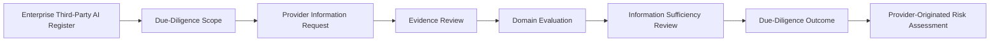
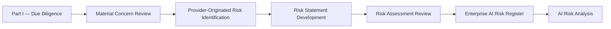

# Third-Party AI Due Diligence and Risk Assessment

## Document Control

| Field | Value |
|---|---|
| Document | Third-Party AI Due Diligence and Risk Assessment |
| Capability | Third-Party AI Governance |
| Repository | Enterprise AI Governance Playbook |
| Reference Organization | Megastar Mortgage |
| Reference AI System | Megastar Intelligent Processor (MIP) |
| Document Owner | AI Governance Lead |
| Version | 2.0 |
| Review Cycle | Annual |
| Status | Published Reference |

---

# Executive Summary

Selecting an external AI provider is not, by itself, a governance decision. Before a third-party AI product, service, platform, model, or managed capability supports the Megastar Intelligent Processor (MIP), Megastar Mortgage must determine whether the provider is suitable for the intended use and whether any identified concerns create enterprise AI risks requiring formal governance.

Third-Party AI Due Diligence and Risk Assessment establishes this two-stage evaluation process.

The first stage, **Due Diligence**, evaluates the provider's suitability by reviewing governance maturity, operational capability, privacy, security, resilience, transparency, assurance, legal and regulatory considerations, and other evidence relevant to the proposed relationship. The objective is to determine whether sufficient evidence exists to support an informed provider suitability decision and to identify any conditions, limitations, or unresolved concerns.

The second stage, **Provider-Originated Risk Assessment**, evaluates the concerns identified during due diligence to determine whether they represent enterprise AI risks that require formal registration within the Enterprise AI Risk Register. This assessment determines whether provider-related issues should become governed enterprise risks requiring ongoing management through the organization's AI Risk Management capability.

Together, these activities provide the governance bridge between identifying a suitable provider and governing the enterprise risks associated with that provider. They ensure that provider suitability and enterprise risk remain related but distinct governance decisions, preserving clear ownership, traceability, and accountability throughout the governance lifecycle.

This artifact does not perform enterprise risk analysis, likelihood assessment, risk prioritization, risk response selection, control design, residual-risk acceptance, procurement approval, contract negotiation, or onboarding authorization. Those activities remain within their respective governance capabilities.

---

# Purpose

The purpose of this document is to establish a standardized approach for evaluating third-party AI providers before operational use and determining whether provider-originated concerns require formal enterprise AI risk governance.

This artifact enables Megastar Mortgage to:

- evaluate provider suitability for the proposed AI relationship;
- assess the completeness, reliability, and sufficiency of provider evidence;
- review governance maturity across relevant operational, technical, legal, privacy, security, resilience, and compliance domains;
- identify material provider concerns, limitations, dependencies, and conditions that may affect the intended use;
- distinguish provider suitability from enterprise AI risk;
- determine whether identified provider concerns should become enterprise AI risks;
- create consistent provider-originated risk statements using a standardized assessment approach;
- determine whether identified risks require registration within the Enterprise AI Risk Register;
- transfer approved provider-originated risks into the Enterprise AI Risk Management lifecycle;
- update the Enterprise Third-Party AI Register with approved due diligence and risk assessment outcomes; and
- provide an evidence-based governance recommendation supporting subsequent contractual, onboarding, oversight, or reassessment activities.

Completion of this activity establishes whether the provider is suitable for the proposed relationship and whether identified provider concerns require formal enterprise AI risk governance.

---

# Part I — Due Diligence

## Due-Diligence Process

Every registered third-party AI relationship undergoes a proportionate due-diligence review before approved use begins.

The due-diligence outcome and supporting references progressively enrich the Enterprise Third-Party AI Register.

---

## Due-Diligence Principles

Megastar Mortgage performs Third-Party AI Due Diligence according to the following principles:

- Every material third-party AI relationship shall undergo due diligence before approved onboarding or operational use.
- Due-diligence depth shall be proportionate to the intended use, data involved, dependency criticality, customer or employee impact, and operational significance.
- Conclusions shall be supported by sufficient, relevant, reliable, current, and traceable evidence.
- Provider statements shall be corroborated where proportionate through authoritative documentation or independent assurance.
- Evidence limitations, unavailable information, and unresolved questions shall be documented explicitly.
- Due diligence shall evaluate the provider relationship against the intended use rather than treating provider capability as universally acceptable.
- Material subprocessors and fourth-party dependencies shall be included where relevant.
- Due diligence shall identify governance concerns without assigning enterprise risk ratings.
- Conditional suitability shall include clear, traceable, and time-bound conditions.
- Due-diligence outcomes shall be reviewed when material provider, service, ownership, model, data, subprocessor, regulatory, or operating changes occur.

---

## Due-Diligence Scope

The scope of due diligence is determined using information established through Third-Party AI Identification and the Enterprise Third-Party AI Register.

Scope considerations include:

- intended use of the third-party AI capability;
- relationship type;
- initial dependency criticality;
- data categories expected to be processed;
- customer, employee, operational, or regulatory impact;
- hosting and delivery model;
- geographic and jurisdictional exposure;
- reliance on subprocessors or fourth parties;
- degree of provider access to Megastar Mortgage systems or information;
- availability of alternative providers or internal capabilities;
- maturity of the provider relationship;
- existing enterprise vendor assessments; and
- prior incidents, findings, regulatory matters, or assurance limitations.

Existing enterprise reviews may be reused where they remain current, relevant, and sufficiently specific to the intended AI use.

---

## Evidence Collection

The provider may be requested to supply information and evidence relevant to the due-diligence scope.

Evidence may include:

- corporate and organizational information;
- AI governance policies and accountability structures;
- product, model, service, and technical documentation;
- intended-use and prohibited-use documentation;
- privacy notices and data-processing documentation;
- security architecture and control descriptions;
- data-retention, deletion, and residency information;
- model-performance, validation, robustness, and limitation information;
- incident-response and notification procedures;
- change-management and release-notification procedures;
- subprocessor and fourth-party information;
- business-continuity and disaster-recovery documentation;
- service-level information;
- independent assurance reports;
- certifications and attestations;
- regulatory or legal disclosures;
- insurance information where relevant;
- customer references or service-history information;
- exit, portability, migration, and deletion capabilities; and
- documented responses to due-diligence questionnaires.

The due-diligence record shall identify the source, date, coverage period, and any restrictions affecting the use of evidence.

---

## Evidence Quality

Provider evidence is evaluated using the following attributes:

| Evidence Attribute | Evaluation Question |
|---|---|
| Relevance | Does the evidence address the provider, service, intended use, and review domain? |
| Reliability | Does the evidence originate from an authoritative and credible source? |
| Sufficiency | Is the evidence adequate to support a reasonable conclusion? |
| Timeliness | Is the evidence current and applicable to the proposed or active relationship? |
| Coverage | Does the evidence cover the relevant product, service, location, system, and review period? |
| Traceability | Can the evidence be linked to the reviewed requirement and due-diligence conclusion? |
| Independence | Has the evidence been independently assessed or validated where appropriate? |
| Integrity | Is the evidence complete and protected from unauthorized alteration? |

Marketing material or unsupported provider representations shall not, by themselves, support a positive due-diligence conclusion.

---

## Due-Diligence Review Domains

Third-party AI providers are evaluated across standardized governance domains.

### 1. Provider Organization and Stability

The review considers:

- legal identity and ownership;
- operating history and relevant experience;
- financial and organizational stability;
- leadership and accountability;
- geographic presence;
- regulatory history;
- material litigation or enforcement matters;
- insurance coverage where relevant;
- business continuity; and
- ability to support the intended relationship over time.

### 2. AI Governance and Accountability

The review considers:

- AI governance policies;
- accountable roles and decision rights;
- model or service governance;
- acceptable-use controls;
- human-oversight expectations;
- risk-management practices;
- documentation standards;
- governance review forums;
- internal assurance or audit practices; and
- escalation and exception management.

### 3. Product, Model, and Service Transparency

The review considers whether the provider supplies sufficient information regarding:

- product or service purpose;
- intended and prohibited uses;
- model or service capabilities;
- known limitations;
- model or service dependencies;
- training or development information where available;
- evaluation and validation approach;
- performance measures;
- explainability or interpretability support;
- versioning;
- material model or service changes; and
- customer responsibilities for appropriate use.

### 4. Privacy and Data Governance

The review considers:

- personal, confidential, and sensitive information handling;
- lawful and authorized data use;
- data ownership;
- data minimization;
- data retention;
- data deletion;
- data residency;
- cross-border transfers;
- secondary use;
- training on customer data;
- de-identification or anonymization;
- data-subject rights support;
- data lineage and provenance;
- data-quality practices; and
- privacy incident management.

### 5. Security and Access Control

The review considers:

- information-security governance;
- access-control design;
- identity and authentication;
- privileged-access management;
- encryption;
- vulnerability management;
- secure development;
- logging and monitoring;
- tenant isolation;
- network and infrastructure security;
- penetration testing or technical assurance;
- security incident response; and
- protection of customer data, models, configurations, and credentials.

### 6. Reliability, Resilience, and Continuity

The review considers:

- service availability;
- reliability commitments;
- operational resilience;
- failure handling;
- backup and recovery;
- disaster recovery;
- business-continuity planning;
- capacity and scalability;
- dependency resilience;
- recovery objectives;
- outage communication; and
- historical service disruptions.

### 7. Model Performance and Validation

Where applicable, the review considers:

- performance criteria;
- evaluation methodology;
- validation evidence;
- robustness testing;
- drift management;
- known performance limitations;
- benchmark relevance;
- data representativeness;
- fairness evaluation;
- false-positive and false-negative considerations;
- model monitoring support; and
- customer access to performance information.

### 8. Incident Management

The review considers:

- incident identification and classification;
- response and containment capability;
- customer notification;
- regulatory notification support;
- incident timelines;
- investigation practices;
- evidence preservation;
- corrective-action processes;
- post-incident review;
- cooperation with customers; and
- historical material incidents.

### 9. Change Management

The review considers:

- model, product, service, and platform versioning;
- change approval;
- change testing;
- customer notification;
- release notes;
- material-change criteria;
- emergency changes;
- backward compatibility;
- subprocessor changes;
- data-processing changes;
- ownership changes; and
- the ability of Megastar Mortgage to assess changes before continued use.

### 10. Subprocessors and Fourth Parties

The review considers:

- identification of material subprocessors;
- services performed;
- access to data and systems;
- geographic location;
- approval or notification mechanisms;
- provider oversight;
- contractual flow-down;
- concentration exposure;
- fourth-party dependencies; and
- the ability to replace or restrict material dependencies.

### 11. Independent Assurance

The review considers the availability, scope, relevance, and currency of:

- SOC reports;
- ISO certifications;
- penetration-test summaries;
- independent AI or model assurance;
- regulatory examinations;
- internal audit reports;
- control attestations;
- vulnerability assessments; and
- other independent evidence.

Independent assurance shall be assessed for scope and relevance rather than accepted solely because a report or certification exists.

### 12. Legal, Regulatory, and Contractual Readiness

The review considers:

- ability to comply with applicable legal and regulatory obligations;
- willingness to provide required documentation;
- regulatory cooperation;
- intellectual-property position;
- licensing restrictions;
- customer-use restrictions;
- data-processing obligations;
- liability limitations;
- audit rights;
- record-retention requirements; and
- readiness to support required contractual protections.

Detailed contract negotiation occurs within Third-Party AI Contract & Onboarding Requirements.

### 13. Exit and Transition Capability

The review considers:

- data portability;
- model, configuration, prompt, and documentation portability;
- data return and deletion;
- deletion certification;
- transition support;
- access revocation;
- migration assistance;
- replacement-provider support;
- operational continuity;
- licensing constraints;
- exit charges;
- dependency closure; and
- retention of governance evidence.

---

## Domain Review Outcomes

Each due-diligence domain receives an evidence-based review outcome.

| Domain Outcome | Meaning |
|---|---|
| Satisfactory | Available evidence supports the provider's suitability in the reviewed domain. |
| Satisfactory with Conditions | Evidence is generally acceptable, but documented conditions or follow-up actions are required. |
| Unsatisfactory | Material weaknesses or limitations prevent a satisfactory conclusion in the reviewed domain. |
| Unable to Conclude | Available evidence is insufficient, unavailable, unreliable, or not applicable to the intended use. |
| Not Applicable | The domain is not relevant to the relationship, with documented rationale. |

Domain outcomes do not constitute enterprise risk ratings.

---

## Due-Diligence Concerns

Due diligence may identify concerns requiring subsequent governance action.

Examples include:

- incomplete provider documentation;
- insufficient model or service transparency;
- unresolved privacy or security questions;
- limited independent assurance;
- inadequate subprocessor disclosure;
- weak incident-notification capability;
- insufficient change-notification commitments;
- material business-continuity limitations;
- regulatory or legal concerns;
- vendor lock-in;
- concentration risk;
- inadequate data deletion capability;
- insufficient exit support; or
- evidence that does not cover the relevant service or review period.

Each material concern shall be documented and transferred to Part II — Provider-Originated Risk Assessment where risk evaluation is required.

---

## Due-Diligence Outcome

The overall due-diligence outcome reflects the evidence available across all applicable domains.

| Due-Diligence Outcome | Meaning |
|---|---|
| Suitable | Evidence supports proceeding to provider-risk assessment and contractual governance without material unresolved suitability concerns. |
| Conditionally Suitable | The provider may proceed subject to documented conditions, restrictions, additional evidence, remediation, or enhanced oversight. |
| Not Suitable | Material weaknesses, unacceptable limitations, or unresolved concerns indicate that the relationship should not proceed in its current form. |
| Unable to Conclude | Available evidence is insufficient to support a reliable suitability determination. |

A Suitable or Conditionally Suitable outcome does not constitute procurement approval, contract approval, onboarding approval, or formal risk acceptance.

---

## Due-Diligence Conditions

Where the outcome is Conditionally Suitable, conditions shall be:

- specific;
- proportionate;
- assigned to an accountable owner;
- linked to the relevant concern;
- time-bound where appropriate;
- traceable to contractual, control, risk, or oversight requirements; and
- verified before or after onboarding according to the approved condition.

Examples include:

- obtain updated assurance documentation;
- require additional contractual protection;
- restrict permitted data or use;
- prohibit specific subprocessors;
- complete a security or privacy review;
- establish enhanced oversight;
- obtain provider remediation;
- perform additional validation;
- require a transition contingency; or
- prevent production use until the condition is satisfied.

---

## Information Sufficiency Review

Before approving the overall outcome, Megastar Mortgage confirms that:

- all applicable due-diligence domains have been reviewed;
- material evidence has been obtained or its absence documented;
- evidence quality has been evaluated;
- unresolved questions are recorded;
- domain outcomes are supported;
- material concerns are identified;
- conditions are clearly defined;
- risk-assessment handoff items are documented; and
- the overall conclusion is proportionate to the intended use and dependency criticality.

Where evidence gaps prevent a defensible conclusion, the outcome shall be Unable to Conclude rather than assumed suitable.

---

## Due-Diligence Review and Approval

The due-diligence record shall be reviewed before the outcome is approved.

The review confirms that:

- the scope was appropriate;
- evidence was sufficient and relevant;
- domain conclusions were supported;
- material gaps and limitations were disclosed;
- concerns were transferred for risk assessment where required;
- conditions were specific and traceable;
- the overall outcome was proportionate; and
- the Enterprise Third-Party AI Register update was complete.

The due-diligence outcome shall be approved by the appropriate governance authority according to the relationship's criticality and organizational decision rights.

---

## Due-Diligence Reassessment

Due diligence shall be repeated or refreshed when:

- the existing review expires;
- the intended use changes materially;
- a new product, service, model, or AI capability is introduced;
- material subprocessors or fourth parties change;
- provider ownership or control changes;
- material privacy, security, regulatory, resilience, or assurance information changes;
- a significant provider incident occurs;
- assurance evidence becomes unavailable, qualified, or outdated;
- a material contract renewal occurs;
- monitoring identifies deterioration;
- change management triggers reassessment; or
- the existing outcome no longer reflects the provider relationship.

Reassessment may be full or targeted depending on the nature of the change.

---

# Part II — Provider-Originated Risk Assessment

## Risk Assessment Process

Every material due-diligence concern is evaluated through a consistent provider-risk identification process.

This stage determines whether a provider-related concern should become an authoritative enterprise risk record.

---

## Risk Assessment Principles

Megastar Mortgage performs Provider-Originated Risk Assessments according to the following principles:

- Provider-originated risks shall be supported by documented concerns, evidence, dependencies, or known limitations.
- Due-diligence observations shall not automatically become formal risks.
- Risks shall describe a plausible future event and potential consequence rather than restating an existing condition.
- Provider-originated risks shall use the established enterprise AI risk taxonomy.
- Provider-specific themes may be recorded as supporting classifications without creating a separate risk taxonomy.
- Each risk shall remain traceable to the relevant Third-Party Relationship ID, AI System Inventory ID, due-diligence concern, and supporting evidence.
- One provider concern may create multiple distinct risks where different events or consequences could arise.
- Multiple related concerns may be consolidated into one risk where they contribute to the same risk event.
- Risks shall be registered before likelihood analysis, prioritization, or response-strategy selection occurs.
- This assessment shall not create a separate third-party AI risk register.
- Approved provider-originated risks shall enter the existing Enterprise AI Risk Register.

---

## Assessment Inputs

Provider-Originated Risk Assessment uses approved information from relevant governance sources.

Inputs may include:

- Third-Party AI Identification records;
- Enterprise Third-Party AI Register information;
- Part I due-diligence outcomes;
- material due-diligence concerns;
- provider documentation and disclosures;
- independent assurance limitations;
- known subprocessors and fourth-party dependencies;
- existing Enterprise AI System Inventory information;
- AI Classification and AI Impact Assessment outcomes;
- historical provider incidents or service failures;
- existing enterprise vendor-risk information;
- contractual limitations;
- known regulatory or jurisdictional concerns;
- concentration and dependency information;
- exit and transition constraints; and
- governance conditions attached to a Conditionally Suitable outcome.

The assessment uses these inputs to identify risks. It does not repeat the underlying due-diligence review.

---

## Concern-to-Risk Conversion

A due-diligence concern describes an observed condition, evidence gap, limitation, or dependency.

A risk describes what may happen because of that condition and the consequences that may follow.

### Due-Diligence Concern

> The provider does not provide advance notification of material model changes.

### Provider-Originated Risk

> Because the provider may introduce material model changes without advance notification, Megastar Mortgage may continue using a changed AI service before completing required impact, risk, control, and assurance reviews, resulting in unmanaged operational, compliance, model-performance, or customer-outcome consequences.

A concern becomes a formal provider-originated risk when:

- a plausible risk event can be identified;
- the event may affect an enterprise objective, stakeholder, obligation, process, AI system, or governance outcome;
- the concern is relevant to the intended use;
- the potential consequence is sufficiently meaningful to require governance; and
- the risk requires ongoing enterprise visibility or management.

A concern may remain an information gap, onboarding condition, contractual requirement, or oversight item where no distinct enterprise risk event exists.

---

## Provider-Originated Risk Statement Method

Each provider-originated risk should be expressed using the following structure:

> **Because of** a provider-related cause, condition, limitation, or dependency,
> **there is a possibility that** a defined risk event may occur,
> **which may result in** an organizational or stakeholder consequence.

A complete risk statement therefore contains:

| Risk Element | Purpose |
|---|---|
| Provider-Related Cause or Condition | Identifies the external factor creating exposure. |
| Risk Event | Describes the uncertain event that may occur. |
| Potential Consequence | Describes what may result if the event occurs. |

The statement should be specific enough to support later analysis but should not include likelihood, consequence ratings, priority, treatment, or controls.

---

## Enterprise AI Risk Categories

Provider-originated risks are classified using the enterprise AI risk taxonomy already established within AI Risk Management.

| Enterprise Risk Category | Provider-Related Application |
|---|---|
| Fairness & Bias | Risks arising from insufficient provider evaluation, biased model behavior, unrepresentative data, or limited fairness evidence. |
| Transparency & Explainability | Risks arising from provider opacity, inadequate documentation, limited disclosure, or insufficient explainability support. |
| Privacy | Risks involving unauthorized data use, secondary use, retention, deletion, residency, cross-border transfer, or privacy-rights limitations. |
| Security | Risks involving provider access controls, vulnerabilities, credential exposure, tenant isolation, cyber incidents, or insecure integrations. |
| Safety | Risks where provider-controlled AI behavior or service failure may contribute to physical or operational harm. |
| Human Oversight | Risks arising from provider limitations that prevent effective human review, intervention, override, or accountability. |
| Reliability & Robustness | Risks involving service instability, inadequate resilience, failure handling, adversarial weakness, or inconsistent provider operation. |
| Model Performance | Risks involving accuracy, error rates, validation limitations, drift, calibration, or provider-controlled model performance. |
| Regulatory & Compliance | Risks arising from jurisdictional obligations, regulatory non-conformance, licensing restrictions, or insufficient cooperation. |
| Operational | Risks involving service disruption, process failure, dependency, continuity, support, or operational degradation. |
| Third-Party & Vendor | Risks arising directly from provider governance, contractual limitations, ownership, financial stability, oversight, or external dependency. |
| Data | Risks involving data quality, lineage, provenance, integrity, availability, representativeness, or governance. |

The primary enterprise risk category shall be selected according to the principal nature of the risk.

---

## Provider Risk Themes

Provider risk themes provide additional relationship-specific context without replacing the enterprise risk category.

Applicable themes may include:

- Provider Transparency
- Subprocessor or Fourth-Party Dependency
- Data Use and Retention
- Data Residency
- Provider Security
- Service Continuity
- Provider Financial Stability
- Concentration Risk
- Vendor Lock-In
- Material Change Notification
- Incident Notification
- Independent Assurance
- Contractual Governability
- Regulatory or Jurisdictional Exposure
- Model or Service Performance
- Exit and Portability
- Intellectual Property or Licensing
- Provider Oversight
- Other Provider Dependency

A risk may have one primary enterprise category and one or more provider risk themes.

---

## Common Provider-Originated Risk Areas

The assessment may consider risks arising from:

### Provider Transparency

- inadequate model or service documentation;
- unknown model dependencies;
- limited access to performance information;
- insufficient explainability support;
- inability to verify provider representations; or
- unclear customer responsibilities.

### Data and Privacy

- unauthorized secondary use of data;
- retention beyond approved periods;
- inability to confirm deletion;
- unclear data residency;
- cross-border processing;
- training on customer information;
- insufficient data lineage; or
- weak subprocessor-data governance.

### Security

- inadequate provider access controls;
- insecure API or integration practices;
- weak tenant isolation;
- insufficient encryption;
- poor vulnerability management;
- inadequate security evidence; or
- delayed security-incident notification.

### Model and Service Performance

- provider-controlled model drift;
- insufficient validation;
- unreliable outputs;
- performance degradation;
- inappropriate benchmarks;
- undisclosed model substitutions;
- inadequate robustness; or
- inability to independently assess model limitations.

### Operational Resilience

- service interruption;
- inadequate disaster recovery;
- provider capacity constraints;
- dependency on critical subprocessors;
- insufficient recovery commitments;
- provider financial instability; or
- inadequate business-continuity support.

### Governance and Contractual Limitations

- inadequate audit rights;
- limited regulatory cooperation;
- insufficient incident-notification obligations;
- unannounced service changes;
- restricted access to governance evidence;
- unfavorable liability allocation;
- prohibited assurance activity; or
- contractual restrictions preventing appropriate governance.

### Dependency and Concentration

- sole-provider dependency;
- reliance on a dominant foundation-model provider;
- multiple AI systems depending on one provider;
- inability to replace the service quickly;
- material fourth-party concentration; or
- dependence on proprietary formats or interfaces.

### Exit and Portability

- inadequate data portability;
- inability to migrate prompts, configurations, or records;
- unresolved licensing restrictions;
- limited transition assistance;
- excessive exit cost;
- inability to verify data deletion; or
- operational disruption during replacement.

---

## Risk Identification Record

Each provider-originated risk contains:

| Information Element | Purpose |
|---|---|
| Risk Title | Provides a concise name for the risk. |
| Risk Description | Records the complete provider-originated risk statement. |
| Enterprise Risk Category | Classifies the risk using the approved enterprise taxonomy. |
| Provider Risk Theme | Provides additional third-party context. |
| Risk Source | Identifies the provider, dependency, condition, or evidence gap creating the risk. |
| Risk Event | Describes the uncertain event that may occur. |
| Initial Potential Consequence | Describes the potential effect if the event occurs. |
| Third-Party Relationship ID | Links the risk to the provider relationship. |
| AI System Inventory ID | Links the risk to the affected AI system. |
| Due-Diligence Concern Reference | Links the risk to the source concern. |
| Supporting Evidence Reference | Preserves evidence traceability. |
| Affected Stakeholders or Processes | Identifies relevant organizational or stakeholder exposure. |
| Register Decision | Determines whether the risk enters the Enterprise AI Risk Register. |

The detailed record is maintained within the Third-Party AI Risk Assessment Template.

---

## Risk Registration Decision

Each evaluated provider concern results in one of the following decisions.

| Decision | Meaning |
|---|---|
| Register as Enterprise AI Risk | The concern represents a distinct provider-originated risk requiring formal enterprise management. |
| Consolidate with Existing Risk | The concern is already represented by an authoritative Enterprise AI Risk Register record and should be linked rather than duplicated. |
| Retain as Due-Diligence Condition | The concern requires evidence, restriction, remediation, or contractual action but does not currently represent a separate enterprise risk. |
| Retain as Oversight Item | The concern requires ongoing provider review but does not currently require formal risk registration. |
| No Further Action | Available evidence does not support a material governance concern or risk. |
| Clarification Required | Additional information is required before a defensible decision can be made. |

The rationale for each decision shall be documented.

---

## Enterprise AI Risk Register Handoff

Risks assigned a Register decision of "Register as Enterprise AI Risk" are transferred into the Enterprise AI Risk Register as authoritative records, where they enter the AI Risk Management lifecycle for likelihood analysis, prioritization, response-strategy selection, control design, and residual-risk acceptance.

This handoff marks the architectural boundary between Third-Party AI Governance and Enterprise AI Risk Management. Once transferred, a risk record is owned and maintained by AI Risk Management; this document retains only the traceability reference back to the originating due-diligence concern and provider relationship.

The handoff record shall include:

- confirmation of the Register Decision;
- the date of transfer;
- the receiving Enterprise AI Risk Register record ID;
- the accountable AI Risk Management owner; and
- any provider-specific context needed for ongoing risk management.

---

# Enterprise Third-Party AI Register Enrichment

Approved outcomes from this document update the following fields within the Enterprise Third-Party AI Register:

## Due-Diligence Fields (Part I)

| Register Field | Information Added |
|---|---|
| Due-Diligence Reference ID | Reference to the authoritative due-diligence record. |
| Due-Diligence Status | Current status of the review. |
| Due-Diligence Completion Date | Date the review was completed. |
| Provider Governance Maturity Outcome | Consolidated governance-capability conclusion. |
| Privacy Review Outcome | Approved privacy-domain outcome. |
| Security Review Outcome | Approved security-domain outcome. |
| Data Governance Review Outcome | Approved data-governance outcome. |
| Resilience and Continuity Outcome | Approved resilience-domain outcome. |
| Model or Service Transparency Outcome | Approved transparency-domain outcome. |
| Incident Management Capability Outcome | Approved incident-management outcome. |
| Change-Notification Capability Outcome | Approved change-management outcome. |
| Subprocessor Review Outcome | Approved dependency-review outcome. |
| Independent Assurance Reviewed | Whether relevant independent evidence was reviewed. |
| Assurance Documentation Reference | Traceable reference to reviewed assurance material. |
| Due-Diligence Outcome | Suitable, Conditionally Suitable, Not Suitable, or Unable to Conclude. |
| Due-Diligence Conditions | Approved conditions or restrictions. |
| Next Due-Diligence Review Date | Date by which review or reassessment is required. |

## Risk Assessment Fields (Part II)

| Register Field | Information Added |
|---|---|
| Provider-Originated Risk Reference | Reference to the authoritative risk identification record(s) for this provider. |
| Enterprise AI Risk Register Link | Link to the corresponding record(s) in the Enterprise AI Risk Register following handoff. |
| Risk Registration Decision | Approved decision for each evaluated concern (Register, Consolidate, Retain as Condition, Retain as Oversight Item, No Further Action, Clarification Required). |
| Risk Assessment Date | Date the provider-originated risk assessment was completed. |

Detailed evidence, analysis, and domain or risk conclusions remain within the underlying due-diligence and risk-assessment records.

---

# Why This Document Matters

Third-party AI providers may influence model behavior, data processing, service availability, system security, regulatory compliance, customer outcomes, and operational continuity.

Organizations cannot govern these dependencies through contractual terms or provider reputation alone. They require evidence that the provider's capabilities, practices, and limitations are sufficiently understood before reliance begins.

Third-Party AI Due Diligence and Risk Assessment enables Megastar Mortgage to make an informed suitability determination, identify provider-related concerns early, establish proportionate conditions, and create a defensible foundation for provider-risk assessment, contracting, onboarding, and ongoing oversight.

---

# Related Artifacts

This document supports:

- Third-Party AI Due Diligence Template
- Third-Party AI Risk Assessment Template
- Enterprise Third-Party AI Register
- Third-Party AI Identification
- Third-Party AI Contract & Onboarding Requirements
- Enterprise AI Risk Register

---

# Revision History

| Version | Date | Description |
|---|---|---|
| 1.0 | July 2026 | Initial release of the Third-Party AI Due Diligence artifact. |
| 2.0 | July 2026 | Merged Third-Party AI Due Diligence and Third-Party AI Risk Assessment into a single lifecycle artifact aligned with the standard Part I / Part II governance structure, corrected section ordering, and added Enterprise AI Risk Register handoff and register-enrichment fields. |