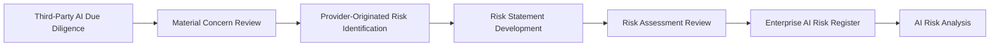

# Third-Party AI Risk Assessment

## Executive Summary

Third-Party AI Due Diligence establishes whether sufficient evidence exists to understand the capabilities, practices, limitations, and dependencies of an external AI provider.

Where due diligence identifies material concerns, those concerns must be evaluated to determine whether they represent provider-originated risks requiring formal enterprise governance.

The Third-Party AI Risk Assessment converts relevant due-diligence concerns into clearly defined risk statements associated with the external provider relationship supporting the Megastar Intelligent Processor (MIP). It documents the provider-related condition, potential risk event, and initial consequences before approved risks enter the Enterprise AI Risk Register.

This activity identifies and frames provider-originated risks. It does not analyze likelihood, assign consequence ratings, prioritize risks, select response strategies, design controls, calculate residual risk, or approve risk acceptance. Those activities remain governed through the established AI Risk Management lifecycle.

---

## Purpose

The purpose of this document is to establish a standardized approach for identifying provider-originated AI risks arising from third-party AI relationships.

Third-Party AI Risk Assessment enables Megastar Mortgage to:

- evaluate material concerns identified through due diligence;
- distinguish information gaps and observations from formal enterprise risks;
- identify provider-related causes, conditions, and dependencies;
- formulate consistent and traceable provider-originated risk statements;
- classify risks using the established enterprise AI risk taxonomy;
- link each risk to the affected third-party relationship and AI system;
- determine which risks require entry into the Enterprise AI Risk Register;
- update the Enterprise Third-Party AI Register with approved risk references; and
- preserve a clean handoff into AI Risk Analysis, AI Risk Prioritization, and AI Risk Response Strategy.

Completion of this activity ensures that material provider-related exposure enters the same enterprise risk-management lifecycle as every other governed AI risk.

---

## Risk Assessment Process

Every material due-diligence concern is evaluated through a consistent provider-risk identification process.



The Third-Party AI Risk Assessment determines whether a provider-related concern should become an authoritative enterprise risk record.

---

## Risk Assessment Principles

Megastar Mortgage performs Third-Party AI Risk Assessments according to the following principles:

- Provider-originated risks shall be supported by documented concerns, evidence, dependencies, or known limitations.
- Due-diligence observations shall not automatically become formal risks.
- Risks shall describe a plausible future event and potential consequence rather than restating an existing condition.
- Provider-originated risks shall use the established enterprise AI risk taxonomy.
- Provider-specific themes may be recorded as supporting classifications without creating a separate risk taxonomy.
- Each risk shall remain traceable to the relevant Third-Party Relationship ID, AI System Inventory ID, due-diligence concern, and supporting evidence.
- One provider concern may create multiple distinct risks where different events or consequences could arise.
- Multiple related concerns may be consolidated into one risk where they contribute to the same risk event.
- Risks shall be registered before likelihood analysis, prioritization, or response-strategy selection occurs.
- This assessment shall not create a separate third-party AI risk register.
- Approved provider-originated risks shall enter the existing Enterprise AI Risk Register.

---

## Assessment Inputs

Third-Party AI Risk Assessment uses approved information from relevant governance sources.

Inputs may include:

- Third-Party AI Identification records;
- Enterprise Third-Party AI Register information;
- Third-Party AI Due Diligence outcomes;
- material due-diligence concerns;
- provider documentation and disclosures;
- independent assurance limitations;
- known subprocessors and fourth-party dependencies;
- existing Enterprise AI System Inventory information;
- AI Classification and AI Impact Assessment outcomes;
- historical provider incidents or service failures;
- existing enterprise vendor-risk information;
- contractual limitations;
- known regulatory or jurisdictional concerns;
- concentration and dependency information;
- exit and transition constraints; and
- governance conditions attached to a Conditionally Suitable outcome.

The assessment uses these inputs to identify risks. It does not repeat the underlying due-diligence review.

---

## Concern-to-Risk Conversion

A due-diligence concern describes an observed condition, evidence gap, limitation, or dependency.

A risk describes what may happen because of that condition and the consequences that may follow.

### Due-Diligence Concern

> The provider does not provide advance notification of material model changes.

### Provider-Originated Risk

> Because the provider may introduce material model changes without advance notification, Megastar Mortgage may continue using a changed AI service before completing required impact, risk, control, and assurance reviews, resulting in unmanaged operational, compliance, model-performance, or customer-outcome consequences.

A concern becomes a formal provider-originated risk when:

- a plausible risk event can be identified;
- the event may affect an enterprise objective, stakeholder, obligation, process, AI system, or governance outcome;
- the concern is relevant to the intended use;
- the potential consequence is sufficiently meaningful to require governance; and
- the risk requires ongoing enterprise visibility or management.

A concern may remain an information gap, onboarding condition, contractual requirement, or oversight item where no distinct enterprise risk event exists.

---

## Provider-Originated Risk Statement Method

Each provider-originated risk should be expressed using the following structure:

> **Because of** a provider-related cause, condition, limitation, or dependency,  
> **there is a possibility that** a defined risk event may occur,  
> **which may result in** an organizational or stakeholder consequence.

A complete risk statement therefore contains:

| Risk Element | Purpose |
|---|---|
| Provider-Related Cause or Condition | Identifies the external factor creating exposure. |
| Risk Event | Describes the uncertain event that may occur. |
| Potential Consequence | Describes what may result if the event occurs. |

The statement should be specific enough to support later analysis but should not include likelihood, consequence ratings, priority, treatment, or controls.

---

## Enterprise AI Risk Categories

Provider-originated risks are classified using the enterprise AI risk taxonomy already established within AI Risk Management.

| Enterprise Risk Category | Provider-Related Application |
|---|---|
| Fairness & Bias | Risks arising from insufficient provider evaluation, biased model behavior, unrepresentative data, or limited fairness evidence. |
| Transparency & Explainability | Risks arising from provider opacity, inadequate documentation, limited disclosure, or insufficient explainability support. |
| Privacy | Risks involving unauthorized data use, secondary use, retention, deletion, residency, cross-border transfer, or privacy-rights limitations. |
| Security | Risks involving provider access controls, vulnerabilities, credential exposure, tenant isolation, cyber incidents, or insecure integrations. |
| Safety | Risks where provider-controlled AI behavior or service failure may contribute to physical or operational harm. |
| Human Oversight | Risks arising from provider limitations that prevent effective human review, intervention, override, or accountability. |
| Reliability & Robustness | Risks involving service instability, inadequate resilience, failure handling, adversarial weakness, or inconsistent provider operation. |
| Model Performance | Risks involving accuracy, error rates, validation limitations, drift, calibration, or provider-controlled model performance. |
| Regulatory & Compliance | Risks arising from jurisdictional obligations, regulatory non-conformance, licensing restrictions, or insufficient cooperation. |
| Operational | Risks involving service disruption, process failure, dependency, continuity, support, or operational degradation. |
| Third-Party & Vendor | Risks arising directly from provider governance, contractual limitations, ownership, financial stability, oversight, or external dependency. |
| Data | Risks involving data quality, lineage, provenance, integrity, availability, representativeness, or governance. |

The primary enterprise risk category shall be selected according to the principal nature of the risk.

---

## Provider Risk Themes

Provider risk themes provide additional relationship-specific context without replacing the enterprise risk category.

Applicable themes may include:

- Provider Transparency
- Subprocessor or Fourth-Party Dependency
- Data Use and Retention
- Data Residency
- Provider Security
- Service Continuity
- Provider Financial Stability
- Concentration Risk
- Vendor Lock-In
- Material Change Notification
- Incident Notification
- Independent Assurance
- Contractual Governability
- Regulatory or Jurisdictional Exposure
- Model or Service Performance
- Exit and Portability
- Intellectual Property or Licensing
- Provider Oversight
- Other Provider Dependency

A risk may have one primary enterprise category and one or more provider risk themes.

---

## Common Provider-Originated Risk Areas

The assessment may consider risks arising from:

### Provider Transparency

- inadequate model or service documentation;
- unknown model dependencies;
- limited access to performance information;
- insufficient explainability support;
- inability to verify provider representations; or
- unclear customer responsibilities.

### Data and Privacy

- unauthorized secondary use of data;
- retention beyond approved periods;
- inability to confirm deletion;
- unclear data residency;
- cross-border processing;
- training on customer information;
- insufficient data lineage; or
- weak subprocessor-data governance.

### Security

- inadequate provider access controls;
- insecure API or integration practices;
- weak tenant isolation;
- insufficient encryption;
- poor vulnerability management;
- inadequate security evidence; or
- delayed security-incident notification.

### Model and Service Performance

- provider-controlled model drift;
- insufficient validation;
- unreliable outputs;
- performance degradation;
- inappropriate benchmarks;
- undisclosed model substitutions;
- inadequate robustness; or
- inability to independently assess model limitations.

### Operational Resilience

- service interruption;
- inadequate disaster recovery;
- provider capacity constraints;
- dependency on critical subprocessors;
- insufficient recovery commitments;
- provider financial instability; or
- inadequate business-continuity support.

### Governance and Contractual Limitations

- inadequate audit rights;
- limited regulatory cooperation;
- insufficient incident-notification obligations;
- unannounced service changes;
- restricted access to governance evidence;
- unfavorable liability allocation;
- prohibited assurance activity; or
- contractual restrictions preventing appropriate governance.

### Dependency and Concentration

- sole-provider dependency;
- reliance on a dominant foundation-model provider;
- multiple AI systems depending on one provider;
- inability to replace the service quickly;
- material fourth-party concentration; or
- dependence on proprietary formats or interfaces.

### Exit and Portability

- inadequate data portability;
- inability to migrate prompts, configurations, or records;
- unresolved licensing restrictions;
- limited transition assistance;
- excessive exit cost;
- inability to verify data deletion; or
- operational disruption during replacement.

---

## Risk Identification Record

Each provider-originated risk contains:

| Information Element | Purpose |
|---|---|
| Risk Title | Provides a concise name for the risk. |
| Risk Description | Records the complete provider-originated risk statement. |
| Enterprise Risk Category | Classifies the risk using the approved enterprise taxonomy. |
| Provider Risk Theme | Provides additional third-party context. |
| Risk Source | Identifies the provider, dependency, condition, or evidence gap creating the risk. |
| Risk Event | Describes the uncertain event that may occur. |
| Initial Potential Consequence | Describes the potential effect if the event occurs. |
| Third-Party Relationship ID | Links the risk to the provider relationship. |
| AI System Inventory ID | Links the risk to the affected AI system. |
| Due-Diligence Concern Reference | Links the risk to the source concern. |
| Supporting Evidence Reference | Preserves evidence traceability. |
| Affected Stakeholders or Processes | Identifies relevant organizational or stakeholder exposure. |
| Register Decision | Determines whether the risk enters the Enterprise AI Risk Register. |

The detailed record is maintained within the Third-Party AI Risk Assessment Template.

---

## Risk Registration Decision

Each evaluated provider concern results in one of the following decisions.

| Decision | Meaning |
|---|---|
| Register as Enterprise AI Risk | The concern represents a distinct provider-originated risk requiring formal enterprise management. |
| Consolidate with Existing Risk | The concern is already represented by an authoritative Enterprise AI Risk Register record and should be linked rather than duplicated. |
| Retain as Due-Diligence Condition | The concern requires evidence, restriction, remediation, or contractual action but does not currently represent a separate enterprise risk. |
| Retain as Oversight Item | The concern requires ongoing provider review but does not currently require formal risk registration. |
| No Further Action | Available evidence does not support a material governance concern or risk. |
| Clarification Required | Additional information is required before a defensible decision can be made. |

The rationale for each decision shall be documented.

---

## Enterprise AI Risk Register Handoff

Provider-originated risks approved for registration are transferred into the Enterprise AI Risk Register.

The handoff includes:

| Enterprise AI Risk Register Field | Information Transferred |
|---|---|
| Risk Title | Approved provider-originated risk title. |
| Risk Description | Complete cause-event-consequence statement. |
| Risk Category | Approved enterprise AI risk category. |
| Risk Source | Provider-related condition or dependency. |
| Risk Event | Defined uncertain event. |
| Initial Potential Consequence | Potential organizational or stakeholder consequence. |
| Related Third-Party Relationship ID | Authoritative provider-relationship reference. |
| Related AI System Inventory ID | Affected AI-system reference. |
| Due-Diligence Concern Reference | Source concern or evidence-gap reference. |
| Supporting Evidence Reference | Traceable evidence supporting identification. |

After registration, the risk proceeds through the existing AI Risk Management lifecycle:

```text
Enterprise AI Risk Register
        ↓
AI Risk Analysis
        ↓
AI Risk Prioritization
        ↓
AI Risk Response Strategy
        ↓
AI Controls
        ↓
AI Assurance
        ↓
Residual Risk
```

Third-Party AI Governance does not create a parallel risk-analysis or treatment process.

---

## Enterprise Third-Party AI Register Enrichment

Approved Third-Party AI Risk Assessment outcomes update the following fields within the Enterprise Third-Party AI Register:

| Register Field | Information Added |
|---|---|
| Third-Party AI Risk Assessment Reference | Reference to the authoritative provider-risk assessment. |
| Risk Assessment Status | Current assessment status. |
| Material Provider Risk Identified | Whether one or more material provider-originated risks were identified. |
| Number of Linked Provider Risks | Number of related Enterprise AI Risk Register records. |
| Risk Assessment Completion Date | Date the assessment was approved. |
| Linked Enterprise AI Risk Register Records | References to registered provider-originated risks. |

The following register fields are updated later through AI Risk Management:

| Register Field | Completed Later During |
|---|---|
| Highest Linked Risk Priority | AI Risk Prioritization |
| Provider Risk Escalation Required | AI Risk Prioritization / Governance Decision |
| Current Risk Response Status | AI Risk Response Strategy |
| Residual Provider Risk Status | AI Assurance / Governance Oversight |

This preserves the living-record principle without prematurely performing downstream risk-management activities.

---

## Assessment Review and Approval

The Third-Party AI Risk Assessment shall be reviewed before risks are transferred into the Enterprise AI Risk Register.

The review confirms that:

- due-diligence concerns and supporting evidence are traceable;
- concern-to-risk conversion is appropriate;
- risk statements identify a clear cause, event, and potential consequence;
- enterprise risk categories are applied consistently;
- provider risk themes provide useful additional context;
- duplicate risks have been avoided;
- risk-registration decisions are supported;
- affected provider and AI-system references are accurate;
- no likelihood, consequence rating, priority, response, control, or residual-risk conclusion has been introduced; and
- required register updates are complete.

Approved assessments proceed to Enterprise AI Risk Register creation or linkage.

---

## Reassessment Triggers

Third-Party AI Risk Assessment shall be reviewed when:

- new due-diligence concerns are identified;
- the intended use changes materially;
- the provider introduces a new model, service, feature, or platform;
- a material subprocessor or fourth party changes;
- provider ownership or financial condition changes;
- new regulatory or jurisdictional exposure arises;
- a provider-related incident occurs;
- provider assurance evidence changes or expires;
- material contractual limitations are identified;
- service performance or resilience deteriorates;
- concentration or dependency increases;
- exit capability changes;
- Continuous Monitoring identifies a material trend or threshold breach;
- AI Change Management triggers reassessment; or
- the existing assessment no longer reflects the provider relationship.

New risks shall be registered, and existing linked risks shall be updated through the Enterprise AI Risk Register.

---

## Why This Document Matters

Third-party due diligence may reveal missing evidence, provider limitations, external dependencies, contractual constraints, or governance weaknesses. These concerns do not manage themselves.

Without a structured provider-risk assessment, material third-party exposure may remain buried inside questionnaires, security reviews, contracts, or provider documentation without entering the enterprise risk-management process.

Third-Party AI Risk Assessment enables Megastar Mortgage to convert provider-related concerns into clear and traceable enterprise risks while preserving the boundaries of AI Risk Management.

It ensures that provider-originated risks are not assessed through a weaker or separate process merely because the underlying capability is externally supplied.

---

## Related Artifacts

This document supports:

- Third-Party AI Risk Assessment Template
- Third-Party AI Due Diligence
- Enterprise Third-Party AI Register
- Enterprise AI Risk Register
- AI Risk Analysis
- AI Risk Prioritization
- AI Risk Response Strategy
- Third-Party AI Contract & Onboarding Requirements

---

## Document Control

| Field | Value |
|---|---|
| Document | Third-Party AI Risk Assessment |
| Capability | Third-Party AI Governance |
| Repository | Enterprise AI Governance Playbook |
| Reference Organization | Megastar Mortgage |
| Reference AI System | Megastar Intelligent Processor (MIP) |
| Document Owner | AI Governance Lead |
| Version | 1.0 |
| Review Cycle | Annual |
| Status | Published Reference |

---

## Revision History

| Version | Date | Description |
|---|---|---|
| 1.0 | July 2026 | Initial release of the Third-Party AI Risk Assessment artifact. |