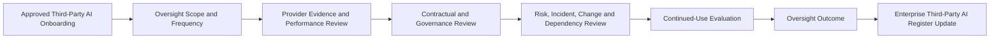
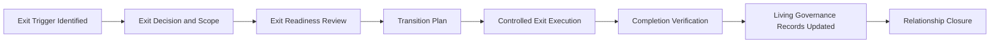

# Third-Party AI Oversight and Exit

## Document Control

| Field | Value |
|---|---|
| Document | Third-Party AI Oversight and Exit |
| Capability | Third-Party AI Governance |
| Repository | Enterprise AI Governance Playbook |
| Reference Organization | Megastar Mortgage |
| Reference AI System | Megastar Intelligent Processor (MIP) |
| Document Owner | AI Governance Lead |
| Version | 2.0 |
| Review Cycle | Annual |
| Status | Published Reference |

---

## Executive Summary

Third-Party AI Contract & Onboarding Requirements establish the governance conditions under which an external AI provider may begin supporting the Megastar Intelligent Processor (MIP). Approval at onboarding does not establish that the provider relationship will remain suitable throughout its lifecycle. Provider services, assurance evidence, ownership, subprocessors, operating conditions, contractual performance, regulatory exposure, and external dependencies may change after operational use begins.

Third-Party AI Oversight and Exit establishes the two-stage governance approach that covers the remainder of the third-party AI relationship lifecycle, from active-use monitoring through controlled retirement.

The first stage, **Oversight**, governs how Megastar Mortgage periodically reviews active third-party AI relationships to determine whether the provider continues to satisfy approved governance, contractual, performance, assurance, dependency, and operational requirements. This produces a relationship-level continued-use recommendation and initiates appropriate governance handoffs where reassessment, restriction, suspension, renegotiation, escalation, or exit is required.

The second stage, **Exit & Transition**, governs how Megastar Mortgage safely terminates, replaces, or transitions a third-party AI relationship once continuation is no longer appropriate — without creating unmanaged operational, privacy, security, regulatory, contractual, or governance exposure. Exit is not complete merely because a contract ends or provider access is disabled; Megastar Mortgage must confirm that affected AI systems and business processes remain appropriately governed, required data has been returned or deleted, credentials and integrations have been removed, unresolved obligations have been closed or transferred, linked governance records have been updated, and sufficient evidence exists to support formal relationship closure.

Together, these stages ensure that continued use is an active, evidence-based governance decision throughout the relationship's operational life, and that the relationship, once retired, is closed in a controlled and auditable manner.

This artifact does not replace Continuous Monitoring, AI Incident Management, AI Change Management, AI Assurance, enterprise risk management, formal residual-risk acceptance, contract termination negotiation, replacement-provider onboarding approval, incident investigation, material system-change approval, or control-effectiveness testing. Those activities remain within their respective governance capabilities.

---

## Purpose

The purpose of this document is to establish a standardized approach for overseeing active third-party AI relationships and for terminating, replacing, or transitioning them when continuation is no longer appropriate.

This artifact enables Megastar Mortgage to:

- establish a proportionate oversight scope and review frequency;
- confirm that contractual and onboarding obligations remain satisfied;
- review provider service performance and operational resilience;
- evaluate the currency and relevance of provider assurance evidence;
- determine whether prior due diligence remains current;
- review provider-originated risks, material dependencies, incidents, changes, and corrective actions;
- assess concentration, replaceability, and exit readiness on an ongoing basis;
- determine whether continued use remains appropriate;
- identify and document the reason for exit when continuation ends;
- define the systems, services, data, processes, users, controls, and dependencies affected by an exit;
- maintain business and service continuity during transition;
- coordinate replacement-provider or internal-capability readiness;
- govern migration of data, models, prompts, configurations, workflows, interfaces, and documentation;
- confirm data return, retention, deletion, and deletion certification;
- revoke provider access, credentials, accounts, integrations, and technical dependencies;
- verify completion of exit obligations and confirm relationship closure readiness;
- trigger reassessment or other governance capabilities where required; and
- update the Enterprise Third-Party AI Register with current oversight and exit outcomes.

Completion of this activity provides an evidence-based relationship-governance decision across the full active-use and exit lifecycle, without duplicating the specialist activities owned by other governance capabilities.

---

# Part I — Third-Party AI Oversight

## Oversight Process

Every active third-party AI relationship follows a proportionate oversight process.



Where material concerns are identified, Third-Party AI Oversight initiates the appropriate downstream governance activity, including Part II — Exit & Transition where continuation is no longer appropriate.

---

## Oversight Principles

Megastar Mortgage performs Third-Party AI Oversight according to the following principles:

- Every active material third-party AI relationship shall be subject to ongoing oversight.
- Oversight depth and frequency shall be proportionate to dependency criticality, linked risks, intended use, data exposure, operational significance, and prior governance outcomes.
- Oversight conclusions shall be supported by current, relevant, reliable, and traceable information.
- Provider self-reporting shall be corroborated where proportionate through contractual records, independent assurance, performance information, or other authoritative evidence.
- Oversight shall evaluate the provider relationship against the approved use and current operating context.
- Material changes, incidents, evidence limitations, expired assurance, and unresolved conditions shall not be treated as routine administrative matters.
- Continued-use recommendations shall remain distinct from formal residual-risk acceptance.
- Oversight shall trigger specialist governance activities rather than duplicate them.
- Relationship restrictions, suspensions, or exit recommendations shall be documented and escalated according to established decision rights.
- Oversight outcomes shall remain traceable within the Enterprise Third-Party AI Register.

---

## Oversight Scope

The oversight scope is determined using the current relationship record and relevant governance information.

The scope may include:

- provider legal entity and ownership;
- contracted product or service;
- approved intended use;
- related AI systems;
- provider-hosted or externally managed AI capabilities;
- material subprocessors and fourth parties;
- linked provider-originated risks;
- related provider controls;
- contractual and onboarding conditions;
- service-level commitments;
- assurance evidence;
- provider incidents and changes;
- corrective actions;
- concentration and dependency exposure;
- renewal readiness; and
- exit and transition assumptions.

The review shall identify explicit exclusions and any limitations affecting the oversight conclusion.

---

## Oversight Frequency

Oversight frequency shall be risk-based and proportionate.

Factors influencing frequency include:

- initial dependency criticality;
- highest linked risk priority;
- residual-risk status where available;
- due-diligence outcome;
- conditional onboarding requirements;
- data sensitivity;
- customer or employee impact;
- operational criticality;
- provider assurance availability;
- incident history;
- unresolved corrective actions;
- material provider changes;
- regulatory exposure;
- concentration risk;
- vendor lock-in;
- service-performance deterioration; and
- proximity to renewal or contract expiry.

Typical oversight frequencies may include:

| Oversight Frequency | Typical Application |
|---|---|
| Continuous or Event-Driven | Critical dependencies, significant incidents, material changes, or severe contractual concerns. |
| Quarterly | High-dependency relationships, High or Critical linked risks, conditional onboarding, or elevated oversight. |
| Semi-Annual | Moderate-to-High dependency relationships requiring structured recurring review. |
| Annual | Stable relationships with current evidence, satisfactory performance, and no material unresolved concerns. |
| Triggered Review | Material change, incident, evidence expiry, regulatory development, significant service failure, or reassessment trigger. |

The selected frequency shall be documented within the Enterprise Third-Party AI Register.

---

## Oversight Evidence and Information Sources

Oversight may use information from:

- Enterprise Third-Party AI Register records;
- current contracts, order forms, and data-processing agreements;
- provider service reports;
- service-level reports;
- independent assurance reports and certifications;
- updated due-diligence evidence;
- provider governance documentation;
- security and privacy notifications;
- performance and reliability information;
- incident notifications;
- change notifications;
- release notes and model-version information;
- subprocessor disclosures;
- regulatory or legal disclosures;
- financial and operational stability information;
- linked Enterprise AI Risk Register records;
- linked Enterprise AI Control Register records;
- open corrective-action records;
- Continuous Monitoring outputs;
- AI Incident Management records;
- AI Change Management records;
- internal business-user feedback; and
- renewal and exit-readiness information.

Evidence quality and limitations shall be considered when forming the oversight outcome.

---

## Oversight Review Domains

### 1. Provider Governance Status

The review considers whether:

- provider governance contacts remain current;
- AI governance responsibilities remain clear;
- accountability and escalation arrangements remain effective;
- provider policies and governance commitments remain current;
- provider documentation remains accurate;
- governance cooperation remains satisfactory; and
- material governance weaknesses have emerged.

---

### 2. Contractual Compliance

The review considers whether the provider continues to meet applicable obligations concerning:

- permitted and prohibited use;
- privacy and data governance;
- security;
- audit and assurance rights;
- incident notification;
- material change notification;
- subprocessors;
- performance and service levels;
- resilience and continuity;
- regulatory cooperation;
- intellectual property;
- record retention; and
- exit support.

Contractual deficiencies requiring revision proceed to the appropriate Legal & Compliance, Procurement, or Contract & Onboarding governance process.

---

### 3. Service Performance

The review considers:

- service availability;
- reliability;
- quality and error rates;
- support responsiveness;
- performance against service-level commitments;
- capacity and scalability;
- recurring service degradation;
- outage history;
- unresolved service issues;
- recovery performance; and
- operational impact on related AI systems and business processes.

Service-performance review does not replace enterprise KPI or KRI governance within Continuous Monitoring.

---

### 4. Assurance Status

The review considers:

- availability of required assurance reports;
- relevance of assurance scope;
- currency of certifications and attestations;
- qualified or adverse assurance conclusions;
- control exceptions;
- remediation commitments;
- evidence restrictions;
- expired or unavailable assurance;
- material changes since the last assurance period; and
- whether additional assurance is required.

Independent assurance shall be evaluated for applicability rather than accepted solely because it exists.

---

### 5. Due-Diligence Currency

The review considers whether:

- the previous due-diligence scope remains relevant;
- due-diligence evidence remains current;
- material evidence gaps have been resolved;
- conditional suitability requirements remain satisfied;
- new review domains have become applicable;
- material changes require targeted reassessment; and
- the next due-diligence review date remains appropriate.

Where the prior review is no longer reliable, oversight shall trigger Third-Party AI Due Diligence reassessment.

---

### 6. Provider-Originated Risks

The review considers:

- linked provider-originated risks;
- changes to known risk conditions;
- newly identified provider concerns;
- current risk priority;
- response-strategy status;
- control coverage;
- assurance results;
- residual-risk status where available;
- overdue risk actions;
- escalation requirements; and
- whether new risks require entry into the Enterprise AI Risk Register.

Oversight observes and escalates provider-risk changes. It does not perform enterprise risk analysis, reprioritization, or acceptance.

---

### 7. Subprocessors and Fourth Parties

The review considers:

- new or changed subprocessors;
- services performed;
- locations;
- access to data and systems;
- provider oversight;
- contractual flow-down;
- concentration exposure;
- incident history;
- assurance coverage;
- notification and approval compliance;
- unresolved objections; and
- material fourth-party dependencies.

Material changes proceed through AI Change Management and may trigger due diligence or risk reassessment.

---

### 8. Provider Incidents

The review considers:

- provider-related incidents occurring since the previous review;
- timeliness and adequacy of provider notification;
- containment and recovery performance;
- regulatory or stakeholder implications;
- unresolved incident obligations;
- provider corrective actions;
- repeated incident patterns; and
- whether the incident affects continued-use suitability.

Detailed investigation, operational root-cause analysis, response, and closure remain within AI Incident Management.

---

### 9. Material Provider Changes

The review considers changes involving:

- provider ownership or control;
- model or service versions;
- material features;
- hosting arrangements;
- data processing;
- security architecture;
- subprocessors;
- licensing;
- policies;
- assurance status;
- geographic or jurisdictional exposure;
- product discontinuation; and
- contractual terms.

Oversight identifies whether the relationship remains governable after the change. Detailed impact assessment and approval remain within AI Change Management.

---

### 10. Provider Corrective Actions and Conditions

The review considers:

- due-diligence conditions;
- onboarding conditions;
- contractual remediation;
- provider corrective actions;
- assurance findings;
- incident-driven actions;
- overdue or blocked actions;
- evidence of completion;
- verification status;
- repeat weaknesses; and
- whether enhanced oversight remains necessary.

Management- or provider-reported completion does not establish effectiveness unless appropriate verification has occurred.

---

### 11. Concentration and Dependency

The review considers:

- sole-provider dependency;
- multiple AI systems relying on the same provider;
- reliance on the same foundation model or infrastructure provider;
- fourth-party concentration;
- switching complexity;
- availability of alternative providers;
- availability of internal alternatives;
- data and configuration portability;
- licensing restrictions;
- replacement timelines;
- operational continuity; and
- vendor lock-in.

Material deterioration may trigger risk reassessment, restriction, renegotiation, or exit planning under Part II.

---

### 12. Regulatory and External Developments

The review considers:

- new legal or regulatory obligations;
- provider enforcement actions;
- relevant litigation;
- regulator findings;
- material public incidents;
- sanctions or jurisdictional restrictions;
- market withdrawal;
- changes in provider financial condition;
- changes in insurance coverage; and
- developments affecting the provider's ability to meet contractual or governance obligations.

---

### 13. Ongoing Exit Readiness

The review considers whether:

- exit triggers remain appropriate;
- alternative providers remain available;
- internal alternatives remain feasible;
- data portability remains achievable;
- model, configuration, prompt, and documentation portability remains adequate;
- contractual exit assistance remains enforceable;
- provider access can be revoked;
- service continuity can be maintained;
- data return and deletion can be verified; and
- transition assumptions remain realistic.

Exit readiness is reviewed throughout the relationship rather than only after termination has been decided. Where exit readiness has materially deteriorated, or an exit trigger under Part II has occurred, oversight shall initiate exit and transition planning.

---

## Oversight Issues

Oversight issues may include:

- contractual non-compliance;
- service-level failure;
- expired assurance;
- insufficient provider evidence;
- unresolved due-diligence conditions;
- unresolved onboarding conditions;
- provider-risk deterioration;
- repeated incidents;
- unapproved material changes;
- undisclosed subprocessors;
- provider financial instability;
- regulatory concerns;
- increased concentration;
- reduced portability;
- overdue corrective actions; or
- deterioration in exit readiness.

Each issue shall be recorded with an owner, required action, target date, status, and escalation requirement.

---

## Continued-Use Evaluation

The continued-use evaluation determines whether the provider relationship remains appropriate under current conditions.

The evaluation considers:

- current intended use;
- dependency criticality;
- due-diligence currency;
- provider-risk status;
- contractual compliance;
- service performance;
- assurance status;
- incidents;
- material changes;
- open corrective actions;
- concentration and dependency;
- regulatory concerns;
- exit readiness; and
- evidence limitations.

The evaluation shall distinguish current facts from governance judgment.

---

## Oversight Outcomes

Each oversight review results in one or more approved outcomes.

| Oversight Outcome | Meaning |
|---|---|
| Continue | The relationship remains suitable for continued use under current approved conditions. |
| Continue with Conditions | Use may continue subject to additional actions, restrictions, evidence, or enhanced oversight. |
| Reassess | Material information requires renewed due diligence, risk assessment, assurance, or specialist review. |
| Renegotiate | Contractual protections, obligations, or commercial arrangements require revision. |
| Restrict | Approved use must be narrowed pending resolution of material concerns. |
| Suspend | Operational use must be temporarily paused because required governance conditions are not satisfied. |
| Exit | The relationship should proceed into Part II — Exit & Transition planning. |
| Escalate | A higher governance authority must determine the appropriate course of action. |

An oversight outcome does not constitute formal residual-risk acceptance.

---

## Renewal and Continuation Review

Before contract renewal or material continuation, Megastar Mortgage confirms that:

- due diligence remains current;
- linked provider risks have been reviewed;
- contractual obligations remain sufficient;
- assurance information remains current;
- service performance remains acceptable;
- material incidents and changes have been considered;
- corrective actions and conditions are appropriately governed;
- concentration and dependency remain acceptable;
- exit readiness has been reviewed;
- no unresolved matter prevents continuation; and
- the continuation recommendation is approved by the appropriate authority.

Renewal shall not occur automatically where material governance concerns remain unresolved.

---

## Oversight Cross-Capability Handoffs

Oversight may initiate the following governance activities:

| Oversight Trigger | Capability Owner |
|---|---|
| New provider-originated risk | AI Risk Management |
| Material change to an existing provider risk | AI Risk Management |
| Expired or insufficient provider evidence | Third-Party AI Due Diligence |
| Contractual deficiency | Third-Party AI Contract & Onboarding Requirements |
| Provider-related incident | AI Incident Management |
| Material provider, model, service, ownership, hosting, or subprocessor change | AI Change Management |
| Control weakness | AI Controls |
| Need for independent evaluation | AI Assurance |
| KPI, KRI, threshold, or trend deterioration | Continuous Monitoring |
| Provider relationship no longer suitable | Part II — Exit & Transition (this document) |
| Residual-risk or executive continuation decision | Governance Oversight & Continual Improvement |

Oversight initiates and tracks these handoffs but does not perform the specialist activity itself.

---

## Oversight Review and Approval

Before an oversight outcome is approved, Megastar Mortgage confirms that:

- the oversight scope was appropriate;
- required evidence was obtained or limitations were documented;
- contractual, performance, assurance, risk, incident, change, corrective-action, dependency, and exit matters were considered;
- cross-capability triggers were identified;
- the continued-use recommendation was evidence-based;
- restrictions, conditions, or escalations were clearly documented;
- the next review date and frequency were appropriate;
- required Enterprise Third-Party AI Register updates were completed; and
- the outcome was approved by the appropriate governance authority.

---

## Oversight Maintenance

Oversight shall be refreshed when:

- the scheduled review date occurs;
- a material provider incident occurs;
- a material provider change is identified;
- due-diligence or assurance evidence expires;
- service performance deteriorates;
- a contractual breach occurs;
- a provider corrective action becomes overdue;
- a new material subprocessor is introduced;
- provider ownership or financial condition changes;
- regulatory exposure changes;
- dependency or concentration increases;
- renewal approaches;
- exit readiness deteriorates; or
- the existing oversight conclusion no longer reflects the relationship.

Triggered oversight may be targeted or comprehensive depending on the event.

---

# Part II — Third-Party AI Exit & Transition

## Exit and Transition Process

Every approved third-party AI exit follows a structured governance process.



An Exit outcome from Part I — Oversight is a common entry point into this process. Where replacement capability is required, the replacement relationship or internal solution must complete the governance activities owned by its applicable lifecycle before operational reliance is transferred.

---

## Exit and Transition Principles

Megastar Mortgage manages third-party AI exits according to the following principles:

- Every material third-party AI relationship shall have an exit approach proportionate to its dependency criticality and operational significance.
- Exit planning shall begin before termination becomes unavoidable.
- Business continuity, customer outcomes, regulatory obligations, privacy, security, and governance integrity shall be protected throughout the transition.
- A provider relationship shall not be recorded as Closed merely because the contract has expired or been terminated.
- Data return, retention, migration, deletion, and deletion verification shall follow approved legal, regulatory, contractual, privacy, and records-management requirements.
- Provider access, credentials, secrets, accounts, interfaces, and integrations shall be revoked or removed through authorized processes.
- Replacement providers shall not inherit operational use without completing applicable third-party AI governance requirements.
- Material system or control changes arising from transition shall proceed through AI Change Management.
- Exit-related incidents shall proceed through AI Incident Management.
- New or changed risks shall proceed through AI Risk Management.
- Open obligations shall be closed, formally transferred, or escalated before relationship closure.
- Completion verification shall confirm that required exit activities occurred; it shall not be represented as broader control-effectiveness assurance.
- Exit decisions, exceptions, limitations, and evidence shall remain traceable.
- Formal residual-risk acceptance shall remain with Governance Oversight & Continual Improvement.

---

## Exit Triggers

Exit and transition planning may be initiated by:

- contract expiry or non-renewal;
- strategic business decision;
- replacement by an internal capability;
- replacement by another provider;
- product or service discontinuation;
- provider market withdrawal;
- provider acquisition, ownership change, or restructuring;
- provider financial instability;
- persistent service-performance failure;
- repeated contractual non-compliance;
- material privacy or security weakness;
- significant or repeated provider incidents;
- inability to obtain sufficient assurance evidence;
- unacceptable provider-originated risk;
- unapproved or unmanaged material changes;
- regulatory prohibition or restriction;
- material jurisdictional concern;
- excessive concentration or dependency;
- vendor lock-in reduction;
- inadequate portability or exit support;
- unresolved corrective actions;
- suspension that cannot be resolved;
- change in the intended AI use;
- retirement of the related AI system; or
- an Exit outcome from Part I — Oversight or another governance decision requiring termination or transition.

The exit trigger shall be documented together with the supporting governance decision and applicable authority.

---

## Exit Types

The plan shall identify the type of exit being performed.

| Exit Type | Meaning |
|---|---|
| Provider Replacement | The external capability will move to another provider. |
| Internal Replacement | The capability will be brought in-house or replaced by an internal solution. |
| Service Retirement | The capability or supported AI use will be discontinued. |
| Partial Exit | Only selected products, services, models, data flows, use cases, or jurisdictions will be removed. |
| Emergency Exit | Accelerated termination or suspension is required because of a material incident, legal prohibition, security event, or unacceptable exposure. |
| Contractual Exit | The relationship ends through expiry, termination, or non-renewal. |
| Strategic Transition | The relationship is replaced as part of a planned architecture, operating-model, or sourcing change. |

The exit type affects the transition approach, decision rights, timing, evidence, and continuity requirements.

---

## Exit Scope

The exit scope shall identify everything affected by the transition.

The scope may include:

- provider legal entities;
- contracted products and services;
- external models or foundation models;
- APIs and integrations;
- cloud environments;
- intelligent document-processing services;
- data-processing activities;
- training, validation, or evaluation services;
- model-monitoring services;
- external human-review services;
- related AI systems;
- affected business processes;
- affected customer or employee interactions;
- approved users and roles;
- provider and internal support teams;
- data stores and data transfers;
- prompts, configurations, workflows, and business rules;
- model artifacts and versions;
- credentials, tokens, keys, secrets, and service accounts;
- monitoring and logging dependencies;
- linked controls;
- linked risks;
- linked incidents, findings, corrective actions, and changes;
- relevant contracts and licenses;
- subprocessors and fourth parties; and
- governance, assurance, and audit evidence.

Explicit exclusions and assumptions shall be documented.

---

## Exit Governance Roles

Exit and transition responsibilities shall be assigned clearly.

| Role | Responsibility |
|---|---|
| Business Relationship Owner | Accountable for the provider relationship and business exit outcome. |
| Exit or Transition Lead | Coordinates the exit plan, dependencies, milestones, evidence, and completion status. |
| AI System Business Owner | Confirms business continuity and acceptable future-state operation. |
| AI System Technical Owner | Coordinates technical migration, integration removal, access revocation, and system updates. |
| Procurement | Supports commercial disengagement, renewal prevention, and supplier offboarding. |
| Legal & Compliance | Confirms contractual, legal, regulatory, intellectual-property, and surviving obligations. |
| Privacy | Confirms lawful data disposition, return, retention, transfer, and deletion requirements. |
| Security | Confirms access revocation, credential removal, technical disengagement, and security evidence. |
| Records Management | Confirms evidence and record-retention requirements. |
| Enterprise Risk | Coordinates new or changed risk evaluation where required. |
| AI Governance Lead | Maintains governance alignment, record updates, escalation, and closure readiness. |
| Assurance Function | Performs independent verification where required by risk, policy, or governance decision. |
| Governance Authority | Approves material exit decisions, exceptions, extensions, and final closure. |

Segregation of duties shall be preserved where independent verification or approval is required.

---

## Exit Readiness Review

Before controlled exit execution begins, Megastar Mortgage confirms that:

- the exit decision and authority are documented;
- the exit trigger and scope are clear;
- affected AI systems and business processes are identified;
- affected stakeholders and users are identified;
- direct, indirect, subprocessor, and fourth-party dependencies are understood;
- contractual termination and surviving obligations are understood;
- required notice periods are known;
- replacement or retirement strategy is defined;
- business-continuity arrangements are approved;
- transition risks are identified and transferred to AI Risk Management where required;
- material system and control changes are identified;
- data-return, migration, retention, and deletion requirements are approved;
- access-revocation requirements are defined;
- integration-removal requirements are defined;
- governance-documentation and evidence-retention requirements are defined;
- provider cooperation and transition support are confirmed;
- unresolved provider issues and obligations are known;
- transition acceptance and rollback criteria are established where applicable; and
- sufficient resources and authority exist to execute the plan.

Where readiness is insufficient, execution shall be delayed, restricted, escalated, or managed through an approved emergency-exit approach.

---

## Transition Planning and Provider Replacement

The transition strategy defines the future state following exit.

| Transition Strategy | Description |
|---|---|
| Alternative Provider | The capability will move to another external provider. |
| Internal Capability | Megastar Mortgage will operate the replacement capability internally. |
| Service Discontinued | The business process or AI capability will be retired. |
| Temporary Manual Process | A controlled manual process will support continuity during transition. |
| Hybrid Transition | Multiple internal, external, or manual solutions will replace the current service. |
| Undetermined | The future state requires governance resolution before execution. |

Where an alternative provider is selected, that provider shall complete:

```text
Third-Party AI Identification
→ Enterprise Third-Party AI Register
→ Third-Party AI Due Diligence
→ Third-Party AI Risk Assessment
→ Contract & Onboarding Requirements
```

Operational reliance shall not transfer solely because the prior provider is exiting.

---

## Business Continuity During Transition

The exit plan shall protect essential business operations throughout the transition.

Continuity planning may address:

- critical business services;
- maximum tolerable disruption;
- transition sequencing;
- parallel operation;
- fallback processes;
- temporary manual controls;
- customer and employee impacts;
- regulatory deadlines;
- service availability;
- staffing and support;
- backlog management;
- recovery procedures;
- escalation routes;
- rollback criteria;
- contingency capacity;
- communication plans; and
- executive decision points.

Business continuity arrangements shall remain proportionate to the dependency criticality and consequence of service disruption.

---

## Transition Risk Identification

Exit and transition activities may introduce new risks.

Examples include:

- operational disruption;
- incomplete data migration;
- data loss or corruption;
- inconsistent model or service behavior;
- degraded performance;
- inaccurate outputs during migration;
- loss of audit history;
- temporary control gaps;
- unauthorized residual access;
- delayed credential revocation;
- unremoved integrations;
- unresolved licensing restrictions;
- failure to meet regulatory obligations;
- incomplete knowledge transfer;
- inadequate replacement-provider readiness;
- security exposure during data movement;
- privacy exposure during transfer;
- customer or employee harm;
- contractual disputes; and
- extended dependency on the outgoing provider.

Material transition risks shall be entered into or linked within the Enterprise AI Risk Register and governed through the established AI Risk Management lifecycle.

---

## Technical Transition

Technical transition planning may address:

- API replacement;
- interface migration;
- model replacement;
- model-version compatibility;
- workflow migration;
- prompt migration;
- configuration migration;
- business-rule migration;
- identity and access integration;
- service-account replacement;
- secrets and key rotation;
- logging and monitoring continuity;
- data-pipeline changes;
- hosting changes;
- infrastructure changes;
- environment separation;
- testing environments;
- rollback capability;
- technical documentation;
- dependency removal; and
- decommissioning of obsolete components.

Material technical changes shall proceed through AI Change Management.

---

## Data Return, Migration, Retention, and Deletion

The exit plan shall govern all data associated with the provider relationship.

The plan shall identify:

- data categories held or processed by the provider;
- data locations;
- data ownership;
- data needed for migration;
- migration format;
- transfer method;
- integrity and completeness validation;
- data-return requirements;
- legal or regulatory retention requirements;
- records subject to legal hold;
- provider retention obligations;
- deletion scope;
- backup and replica deletion;
- subprocessor deletion;
- deletion timelines;
- deletion evidence;
- deletion certification;
- unresolved data disputes; and
- responsibilities surviving termination.

Data shall not be deleted where retention is legally or contractually required. Data shall not be retained merely because deletion has not been actively governed.

---

## Access Revocation and Technical Disengagement

Exit shall include controlled removal of provider and internal access associated with the relationship.

Activities may include:

- disable provider user accounts;
- disable internal accounts used only for the service;
- revoke privileged access;
- revoke API keys;
- revoke access tokens;
- rotate credentials and secrets;
- remove certificates;
- remove SSO integration;
- remove federation or trust relationships;
- revoke remote access;
- disable service accounts;
- remove network connectivity;
- terminate data feeds;
- disable interfaces;
- remove webhooks;
- remove provider monitoring access;
- disable support access;
- remove test and non-production access;
- archive necessary logs; and
- confirm no unauthorized residual access remains.

Security shall verify completion according to organizational requirements.

---

## Model, Prompt, Configuration, and Workflow Portability

Where the outgoing provider supports models, prompts, configurations, rules, or workflows, the exit plan shall determine:

- what artifacts Megastar Mortgage owns;
- what artifacts may be exported;
- export formats;
- licensing restrictions;
- intellectual-property limitations;
- portability of fine-tuned models;
- portability of prompts;
- portability of workflow configurations;
- portability of validation rules;
- portability of evaluation results;
- portability of performance history;
- portability of model or service documentation;
- required transformation or redevelopment;
- compatibility with the replacement capability; and
- evidence that migrated artifacts remain complete and usable.

Inability to achieve acceptable portability shall be treated as a material transition dependency or risk.

---

## Documentation and Knowledge Transfer

The outgoing provider shall provide or support the transfer of required knowledge and documentation, where contractually applicable.

Relevant materials may include:

- architecture documentation;
- configuration documentation;
- interface specifications;
- data dictionaries;
- model or service documentation;
- version history;
- release history;
- operating procedures;
- support procedures;
- known limitations;
- open issue history;
- incident history;
- performance history;
- assurance documentation;
- control evidence;
- subprocessor information;
- business-continuity documentation;
- migration guidance;
- data-deletion evidence; and
- transition-support records.

Megastar Mortgage shall confirm that required knowledge has been transferred to accountable internal or replacement-provider stakeholders.

---

## Contractual and Legal Closure

Legal & Compliance and Procurement shall confirm the status of:

- termination notice;
- contract expiry;
- termination rights;
- termination charges;
- outstanding payments;
- licensing obligations;
- intellectual-property rights;
- surviving confidentiality obligations;
- surviving privacy and data obligations;
- record-retention obligations;
- audit and assurance rights;
- regulatory cooperation;
- open disputes;
- warranties and indemnities;
- incident and corrective-action obligations;
- transition-support obligations;
- subprocessor obligations; and
- post-termination assistance.

Contractual closure does not, by itself, establish governance closure.

---

## Open Obligations

Before closure, all material open obligations shall be:

- completed;
- verified where required;
- transferred to an accountable owner;
- accepted through an authorized governance decision; or
- escalated as a closure blocker.

Open obligations may include:

- incidents;
- assurance findings;
- corrective actions;
- provider remediation;
- contractual disputes;
- data-deletion evidence;
- regulatory notifications;
- unresolved risks;
- control updates;
- change activities;
- transition actions;
- outstanding evidence requests; and
- financial or legal obligations.

The exit plan shall identify how each obligation will be governed after provider operations cease.

---

## Exit Completion and Closure Verification

Exit completion verification confirms whether planned exit activities have been performed and documented.

Verification may include confirmation that:

- replacement or retirement arrangements are operational;
- business continuity requirements were met;
- required data was returned;
- migrated data is complete and usable;
- required data was deleted;
- deletion certification was received where applicable;
- provider and internal access was revoked;
- credentials, keys, tokens, and secrets were revoked or rotated;
- integrations and interfaces were disabled or removed;
- provider-hosted environments were decommissioned where applicable;
- prompts, configurations, workflows, models, and documentation were transferred where required;
- contractual obligations were resolved;
- governance and assurance evidence was retained;
- open obligations were completed or formally transferred;
- affected AI System Inventory records were updated;
- linked risk records were updated;
- linked control records were updated;
- linked incident and change records were resolved or transferred;
- monitoring and oversight arrangements were updated;
- the Enterprise Third-Party AI Register reflects the exit state; and
- closure blockers have been resolved or formally escalated.

Verification of exit activities does not establish that all replacement controls are operating effectively unless separately evaluated through AI Assurance.

---

## Exit Exceptions and Limitations

Where an exit requirement cannot be completed, the limitation shall document:

- the unmet requirement;
- reason for non-completion;
- related risk;
- affected systems, data, stakeholders, or obligations;
- compensating measure;
- responsible owner;
- target resolution date;
- monitoring requirement;
- escalation authority;
- expiry or review date; and
- effect on closure readiness.

A relationship with unresolved material obligations shall not be recorded as fully Closed unless an authorized governance decision permits closure with documented follow-up.

---

## Exit Outcomes

The exit and transition process results in one of the following outcomes.

| Exit Outcome | Meaning |
|---|---|
| Successfully Completed | Required exit, transition, verification, record-update, and closure activities have been completed. |
| Completed with Follow-Up Actions | Operational reliance has ended and closure is approved, but limited documented administrative or governance actions remain under assigned ownership. |
| Transition Extended | Continued transition activity is required before operational reliance or closure can end. |
| Exit Suspended | Exit activity is paused pending resolution of a material dependency, incident, legal matter, or governance decision. |
| Exit Cancelled | The exit decision has been withdrawn and continued use has been reapproved through Part I — Oversight. |
| Closure Blocked | Material obligations prevent formal relationship closure. |

The outcome shall be supported by documented evidence and appropriate approval.

---

## Exit Cross-Capability Handoffs

Exit & Transition may initiate or depend upon:

| Exit Trigger or Requirement | Capability Owner |
|---|---|
| Replacement provider required | Third-Party AI Governance |
| New or changed transition risk | AI Risk Management |
| New or redesigned transition control | AI Controls |
| Independent verification required | AI Assurance |
| Migration or exit incident | AI Incident Management |
| Material system, model, data, integration, or control change | AI Change Management |
| Ongoing transition metric or threshold | Continuous Monitoring |
| Executive decision or residual-risk acceptance required | Governance Oversight & Continual Improvement |
| Related AI system retired or materially changed | AI Inventory & Assessment |
| Governance framework evidence updated | Framework Alignment |

The exit plan coordinates these handoffs but does not perform specialist work owned by another capability.

---

## Relationship Closure Criteria

A third-party AI relationship is ready for closure when:

- the approved exit scope has been completed;
- operational reliance has ended or transferred;
- replacement or retirement arrangements are stable;
- business-continuity obligations are satisfied;
- required data return, migration, retention, and deletion activities are complete;
- required deletion evidence has been obtained;
- provider and service access has been revoked;
- credentials and integrations have been removed;
- contractual and surviving obligations are resolved;
- required documentation and evidence have been retained;
- unresolved obligations are closed or formally transferred;
- affected living governance records have been updated;
- material exit limitations have been resolved or approved;
- completion verification has been performed;
- closure readiness has been reviewed; and
- the appropriate governance authority has approved closure.

---

## Exit Review and Approval

Before closure is approved, Megastar Mortgage confirms that:

- the exit decision and scope were authorized;
- readiness and transition risks were addressed;
- business continuity was maintained;
- required provider cooperation was obtained;
- data obligations were completed;
- access and technical disengagement were completed;
- contractual and legal obligations were reviewed;
- open obligations were closed or transferred;
- completion evidence was sufficient;
- cross-capability handoffs were completed;
- living governance records were updated;
- closure limitations were disclosed; and
- the proposed exit outcome was supported.

Formal closure shall be approved according to the relationship's criticality, impact, and organizational decision rights.

---

## Plan Maintenance

The Exit & Transition Plan shall be reviewed when:

- the exit trigger changes;
- the transition strategy changes;
- replacement-provider readiness changes;
- contractual obligations change;
- transition risks change materially;
- a migration incident occurs;
- data-disposition requirements change;
- a new dependency is discovered;
- transition timelines change;
- the provider fails to cooperate;
- exit support becomes unavailable;
- continuity assumptions change;
- a material governance exception is requested;
- the exit is suspended or cancelled; or
- the plan no longer reflects the actual transition.

Updates shall preserve version history and traceability.

---

## Living Governance Record Updates (Exit)

### Enterprise AI System Inventory

The related AI system record shall be updated where:

- the provider is removed;
- the system is replaced;
- the system is retired;
- the deployment model changes;
- the operating environment changes;
- ownership or dependencies change; or
- the system enters reassessment.

### Enterprise AI Risk Register

Linked risk records shall be reviewed where:

- provider-originated risks no longer apply;
- transition risks are introduced;
- risk conditions change;
- controls change;
- residual risk changes; or
- risk closure or continued treatment requires a governance decision.

### Enterprise AI Control Register

Linked control records shall be reviewed where:

- provider controls are retired;
- replacement controls are introduced;
- control ownership changes;
- control evidence sources change;
- monitoring changes; or
- assurance is required.

Closure of the provider relationship does not automatically close linked system, risk, control, incident, or change records.

---

# Enterprise Third-Party AI Register Enrichment

Approved outcomes from this document update the following fields within the Enterprise Third-Party AI Register.

## Oversight Fields (Part I)

| Register Field | Information Added |
|---|---|
| Oversight Status | Current relationship-oversight status. |
| Oversight Frequency | Approved recurring review frequency. |
| Last Provider Review Date | Date of the most recent completed oversight review. |
| Next Provider Review Date | Planned date of the next review. |
| Service Performance Status | Current provider-service performance conclusion. |
| Contractual Compliance Status | Current contractual-compliance conclusion. |
| Current Assurance Status | Currency and sufficiency of provider assurance evidence. |
| Open Provider Issues | Material unresolved provider-governance issues. |
| Open Provider Corrective Actions | Current provider or management remediation commitments. |
| Material Dependency Status | Current dependency and concentration condition. |
| Provider Financial or Operational Concern | Whether material stability concerns exist. |
| Regulatory Concern Identified | Whether material regulatory concerns exist. |
| Continued Use Supported | Current continued-use recommendation. |
| Oversight Notes | Relevant review context, limitations, and decisions. |
| Oversight Review History | Traceable history of completed oversight reviews. |
| Renewal and Continuation Status | Current renewal or continuation decision where applicable. |

## Exit & Transition Fields (Part II)

| Register Field | Information Added |
|---|---|
| Exit and Transition Plan Reference | Authoritative plan reference. |
| Exit Trigger | Reason the relationship is being exited. |
| Exit Decision Date | Date the exit decision was approved. |
| Exit Decision Authority | Authority approving the exit. |
| Replacement Strategy | Approved future-state approach. |
| Transition Status | Current transition lifecycle status. |
| Operational Continuity Addressed | Whether continuity requirements have been completed. |
| Data Return Completed | Whether required data return is complete. |
| Data Migration Completed | Whether required data migration is complete. |
| Data Deletion Completed | Whether required deletion is complete. |
| Deletion Confirmation Received | Whether required deletion evidence has been received. |
| Provider Access Revoked | Whether provider access has been removed. |
| Integrations Disabled or Removed | Whether provider integrations have been disengaged. |
| Governance Evidence Retained | Whether required records and evidence are preserved. |
| Unresolved Obligations Transferred or Closed | Whether open matters remain governed. |
| Transition Completion Date | Date transition activities were completed. |
| Exit Notes | Material context, limitations, and decisions. |
| Closure Readiness Confirmed | Whether closure criteria are satisfied. |
| Final Relationship Status | Closed, Archived, or Closure Blocked. |
| Closure Approved By | Authority approving closure. |
| Closure Date | Date formal closure was approved. |
| Closure Reference | Authoritative closure evidence reference. |

Detailed supporting evidence remains within the oversight and exit records and authoritative specialist artifacts.

---

# Why This Document Matters

Third-party AI governance does not end when the contract is signed or the provider is onboarded, and it is not complete when a contract simply expires or provider access is disabled.

External AI providers may change models, services, ownership, subprocessors, policies, hosting, performance, assurance coverage, or operational conditions after approval. Contractual obligations may be missed, incidents may occur, dependencies may deepen, and exit options may weaken over time. When continuation is no longer appropriate, exits can expose hidden dependencies, inaccessible data, proprietary configurations, unavailable documentation, unresolved incidents, weak portability, operational disruption, retained provider access, and incomplete deletion if not governed with the same discipline as onboarding.

Third-Party AI Oversight and Exit enables Megastar Mortgage to determine whether each provider relationship remains governable, suitable, and aligned with approved conditions throughout its operational lifecycle, and to end relationships in a controlled, evidence-based, and auditable manner that protects continuity and preserves the integrity of the wider AI governance system.

---

# Related Artifacts

This document supports:

- Enterprise Third-Party AI Register
- Third-Party AI Identification
- Third-Party AI Due Diligence & Risk Assessment
- Third-Party AI Contract & Onboarding Requirements
- Enterprise AI System Inventory
- Enterprise AI Risk Register
- Enterprise AI Control Register
- Third-Party AI Governance Summary
- AI Assurance
- Continuous Monitoring
- AI Incident Management
- AI Change Management

---

# Revision History

| Version | Date | Description |
|---|---|---|
| 1.0 | July 2026 | Initial release of the Third-Party AI Oversight artifact. |
| 1.0 | July 2026 | Initial release of the Third-Party AI Exit & Transition Plan artifact. |
| 2.0 | July 2026 | Merged Third-Party AI Oversight and Third-Party AI Exit & Transition Plan into a single lifecycle artifact (Part I — Oversight, Part II — Exit & Transition), removed duplicate front/back matter, consolidated register enrichment and related artifacts, and aligned cross-references between the two stages. |