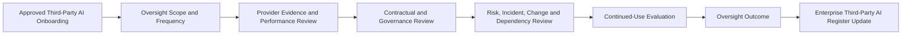

# Third-Party AI Oversight

## Executive Summary

Third-Party AI Contract & Onboarding Requirements establish the governance conditions under which an external AI provider may begin supporting the Megastar Intelligent Processor (MIP).

Approval at onboarding does not establish that the provider relationship will remain suitable throughout its lifecycle. Provider services, assurance evidence, ownership, subprocessors, operating conditions, contractual performance, regulatory exposure, and external dependencies may change after operational use begins.

Third-Party AI Oversight establishes how Megastar Mortgage periodically reviews active third-party AI relationships to determine whether the provider continues to satisfy approved governance, contractual, performance, assurance, dependency, and operational requirements.

This activity produces a relationship-level continued-use recommendation and initiates appropriate governance handoffs where reassessment, restriction, suspension, renegotiation, escalation, or exit is required.

Third-Party AI Oversight does not replace Continuous Monitoring, AI Incident Management, AI Change Management, AI Assurance, enterprise risk management, or formal residual-risk acceptance.

---

## Purpose

The purpose of this document is to establish a standardized approach for overseeing active third-party AI relationships.

Third-Party AI Oversight enables Megastar Mortgage to:

- establish a proportionate oversight scope and review frequency;
- confirm that contractual and onboarding obligations remain satisfied;
- review provider service performance and operational resilience;
- evaluate the currency and relevance of provider assurance evidence;
- determine whether prior due diligence remains current;
- review provider-originated risks, material dependencies, incidents, changes, and corrective actions;
- assess concentration, replaceability, and exit readiness;
- determine whether continued use remains appropriate;
- trigger reassessment or other governance capabilities where required; and
- update the Enterprise Third-Party AI Register with current oversight outcomes.

Completion of this activity provides an evidence-based relationship-governance decision without duplicating the specialist activities owned by other governance capabilities.

---

## Oversight Process

Every active third-party AI relationship follows a proportionate oversight process.

Where material concerns are identified, Third-Party AI Oversight initiates the appropriate downstream governance activity.

---

## Oversight Principles

Megastar Mortgage performs Third-Party AI Oversight according to the following principles:

- Every active material third-party AI relationship shall be subject to ongoing oversight.
- Oversight depth and frequency shall be proportionate to dependency criticality, linked risks, intended use, data exposure, operational significance, and prior governance outcomes.
- Oversight conclusions shall be supported by current, relevant, reliable, and traceable information.
- Provider self-reporting shall be corroborated where proportionate through contractual records, independent assurance, performance information, or other authoritative evidence.
- Oversight shall evaluate the provider relationship against the approved use and current operating context.
- Material changes, incidents, evidence limitations, expired assurance, and unresolved conditions shall not be treated as routine administrative matters.
- Continued-use recommendations shall remain distinct from formal residual-risk acceptance.
- Oversight shall trigger specialist governance activities rather than duplicate them.
- Relationship restrictions, suspensions, or exit recommendations shall be documented and escalated according to established decision rights.
- Oversight outcomes shall remain traceable within the Enterprise Third-Party AI Register.

---

## Oversight Scope

The oversight scope is determined using the current relationship record and relevant governance information.

The scope may include:

- provider legal entity and ownership;
- contracted product or service;
- approved intended use;
- related AI systems;
- provider-hosted or externally managed AI capabilities;
- material subprocessors and fourth parties;
- linked provider-originated risks;
- related provider controls;
- contractual and onboarding conditions;
- service-level commitments;
- assurance evidence;
- provider incidents and changes;
- corrective actions;
- concentration and dependency exposure;
- renewal readiness; and
- exit and transition assumptions.

The review shall identify explicit exclusions and any limitations affecting the oversight conclusion.

---

## Oversight Frequency

Oversight frequency shall be risk-based and proportionate.

Factors influencing frequency include:

- initial dependency criticality;
- highest linked risk priority;
- residual-risk status where available;
- due-diligence outcome;
- conditional onboarding requirements;
- data sensitivity;
- customer or employee impact;
- operational criticality;
- provider assurance availability;
- incident history;
- unresolved corrective actions;
- material provider changes;
- regulatory exposure;
- concentration risk;
- vendor lock-in;
- service-performance deterioration; and
- proximity to renewal or contract expiry.

Typical oversight frequencies may include:

| Oversight Frequency | Typical Application |
|---|---|
| Continuous or Event-Driven | Critical dependencies, significant incidents, material changes, or severe contractual concerns. |
| Quarterly | High-dependency relationships, High or Critical linked risks, conditional onboarding, or elevated oversight. |
| Semi-Annual | Moderate-to-High dependency relationships requiring structured recurring review. |
| Annual | Stable relationships with current evidence, satisfactory performance, and no material unresolved concerns. |
| Triggered Review | Material change, incident, evidence expiry, regulatory development, significant service failure, or reassessment trigger. |

The selected frequency shall be documented within the Enterprise Third-Party AI Register.

---

## Oversight Evidence and Information Sources

Oversight may use information from:

- Enterprise Third-Party AI Register records;
- current contracts, order forms, and data-processing agreements;
- provider service reports;
- service-level reports;
- independent assurance reports and certifications;
- updated due-diligence evidence;
- provider governance documentation;
- security and privacy notifications;
- performance and reliability information;
- incident notifications;
- change notifications;
- release notes and model-version information;
- subprocessor disclosures;
- regulatory or legal disclosures;
- financial and operational stability information;
- linked Enterprise AI Risk Register records;
- linked Enterprise AI Control Register records;
- open corrective-action records;
- Continuous Monitoring outputs;
- AI Incident Management records;
- AI Change Management records;
- internal business-user feedback; and
- renewal and exit-readiness information.

Evidence quality and limitations shall be considered when forming the oversight outcome.

---

## Oversight Review Domains

### 1. Provider Governance Status

The review considers whether:

- provider governance contacts remain current;
- AI governance responsibilities remain clear;
- accountability and escalation arrangements remain effective;
- provider policies and governance commitments remain current;
- provider documentation remains accurate;
- governance cooperation remains satisfactory; and
- material governance weaknesses have emerged.

---

### 2. Contractual Compliance

The review considers whether the provider continues to meet applicable obligations concerning:

- permitted and prohibited use;
- privacy and data governance;
- security;
- audit and assurance rights;
- incident notification;
- material change notification;
- subprocessors;
- performance and service levels;
- resilience and continuity;
- regulatory cooperation;
- intellectual property;
- record retention; and
- exit support.

Contractual deficiencies requiring revision proceed to the appropriate Legal & Compliance, Procurement, or Contract & Onboarding governance process.

---

### 3. Service Performance

The review considers:

- service availability;
- reliability;
- quality and error rates;
- support responsiveness;
- performance against service-level commitments;
- capacity and scalability;
- recurring service degradation;
- outage history;
- unresolved service issues;
- recovery performance; and
- operational impact on related AI systems and business processes.

Service-performance review does not replace enterprise KPI or KRI governance within Continuous Monitoring.

---

### 4. Assurance Status

The review considers:

- availability of required assurance reports;
- relevance of assurance scope;
- currency of certifications and attestations;
- qualified or adverse assurance conclusions;
- control exceptions;
- remediation commitments;
- evidence restrictions;
- expired or unavailable assurance;
- material changes since the last assurance period; and
- whether additional assurance is required.

Independent assurance shall be evaluated for applicability rather than accepted solely because it exists.

---

### 5. Due-Diligence Currency

The review considers whether:

- the previous due-diligence scope remains relevant;
- due-diligence evidence remains current;
- material evidence gaps have been resolved;
- conditional suitability requirements remain satisfied;
- new review domains have become applicable;
- material changes require targeted reassessment; and
- the next due-diligence review date remains appropriate.

Where the prior review is no longer reliable, oversight shall trigger Third-Party AI Due Diligence reassessment.

---

### 6. Provider-Originated Risks

The review considers:

- linked provider-originated risks;
- changes to known risk conditions;
- newly identified provider concerns;
- current risk priority;
- response-strategy status;
- control coverage;
- assurance results;
- residual-risk status where available;
- overdue risk actions;
- escalation requirements; and
- whether new risks require entry into the Enterprise AI Risk Register.

Third-Party AI Oversight observes and escalates provider-risk changes. It does not perform enterprise risk analysis, reprioritization, or acceptance.

---

### 7. Subprocessors and Fourth Parties

The review considers:

- new or changed subprocessors;
- services performed;
- locations;
- access to data and systems;
- provider oversight;
- contractual flow-down;
- concentration exposure;
- incident history;
- assurance coverage;
- notification and approval compliance;
- unresolved objections; and
- material fourth-party dependencies.

Material changes proceed through AI Change Management and may trigger due diligence or risk reassessment.

---

### 8. Provider Incidents

The review considers:

- provider-related incidents occurring since the previous review;
- timeliness and adequacy of provider notification;
- containment and recovery performance;
- regulatory or stakeholder implications;
- unresolved incident obligations;
- provider corrective actions;
- repeated incident patterns; and
- whether the incident affects continued-use suitability.

Detailed investigation, operational root-cause analysis, response, and closure remain within AI Incident Management.

---

### 9. Material Provider Changes

The review considers changes involving:

- provider ownership or control;
- model or service versions;
- material features;
- hosting arrangements;
- data processing;
- security architecture;
- subprocessors;
- licensing;
- policies;
- assurance status;
- geographic or jurisdictional exposure;
- product discontinuation; and
- contractual terms.

Third-Party AI Oversight identifies whether the relationship remains governable after the change. Detailed impact assessment and approval remain within AI Change Management.

---

### 10. Provider Corrective Actions and Conditions

The review considers:

- due-diligence conditions;
- onboarding conditions;
- contractual remediation;
- provider corrective actions;
- assurance findings;
- incident-driven actions;
- overdue or blocked actions;
- evidence of completion;
- verification status;
- repeat weaknesses; and
- whether enhanced oversight remains necessary.

Management- or provider-reported completion does not establish effectiveness unless appropriate verification has occurred.

---

### 11. Concentration and Dependency

The review considers:

- sole-provider dependency;
- multiple AI systems relying on the same provider;
- reliance on the same foundation model or infrastructure provider;
- fourth-party concentration;
- switching complexity;
- availability of alternative providers;
- availability of internal alternatives;
- data and configuration portability;
- licensing restrictions;
- replacement timelines;
- operational continuity; and
- vendor lock-in.

Material deterioration may trigger risk reassessment, restriction, renegotiation, or exit planning.

---

### 12. Regulatory and External Developments

The review considers:

- new legal or regulatory obligations;
- provider enforcement actions;
- relevant litigation;
- regulator findings;
- material public incidents;
- sanctions or jurisdictional restrictions;
- market withdrawal;
- changes in provider financial condition;
- changes in insurance coverage; and
- developments affecting the provider’s ability to meet contractual or governance obligations.

---

### 13. Exit Readiness

The review considers whether:

- exit triggers remain appropriate;
- alternative providers remain available;
- internal alternatives remain feasible;
- data portability remains achievable;
- model, configuration, prompt, and documentation portability remains adequate;
- contractual exit assistance remains enforceable;
- provider access can be revoked;
- service continuity can be maintained;
- data return and deletion can be verified; and
- transition assumptions remain realistic.

Exit readiness is reviewed throughout the relationship rather than only after termination has been decided.

---

## Oversight Issues

Oversight issues may include:

- contractual non-compliance;
- service-level failure;
- expired assurance;
- insufficient provider evidence;
- unresolved due-diligence conditions;
- unresolved onboarding conditions;
- provider-risk deterioration;
- repeated incidents;
- unapproved material changes;
- undisclosed subprocessors;
- provider financial instability;
- regulatory concerns;
- increased concentration;
- reduced portability;
- overdue corrective actions; or
- deterioration in exit readiness.

Each issue shall be recorded with an owner, required action, target date, status, and escalation requirement.

---

## Continued-Use Evaluation

The continued-use evaluation determines whether the provider relationship remains appropriate under current conditions.

The evaluation considers:

- current intended use;
- dependency criticality;
- due-diligence currency;
- provider-risk status;
- contractual compliance;
- service performance;
- assurance status;
- incidents;
- material changes;
- open corrective actions;
- concentration and dependency;
- regulatory concerns;
- exit readiness; and
- evidence limitations.

The evaluation shall distinguish current facts from governance judgment.

---

## Oversight Outcomes

Each oversight review results in one or more approved outcomes.

| Oversight Outcome | Meaning |
|---|---|
| Continue | The relationship remains suitable for continued use under current approved conditions. |
| Continue with Conditions | Use may continue subject to additional actions, restrictions, evidence, or enhanced oversight. |
| Reassess | Material information requires renewed due diligence, risk assessment, assurance, or specialist review. |
| Renegotiate | Contractual protections, obligations, or commercial arrangements require revision. |
| Restrict | Approved use must be narrowed pending resolution of material concerns. |
| Suspend | Operational use must be temporarily paused because required governance conditions are not satisfied. |
| Exit | The relationship should proceed into formal exit and transition planning. |
| Escalate | A higher governance authority must determine the appropriate course of action. |

An oversight outcome does not constitute formal residual-risk acceptance.

---

## Renewal and Continuation Review

Before contract renewal or material continuation, Megastar Mortgage confirms that:

- due diligence remains current;
- linked provider risks have been reviewed;
- contractual obligations remain sufficient;
- assurance information remains current;
- service performance remains acceptable;
- material incidents and changes have been considered;
- corrective actions and conditions are appropriately governed;
- concentration and dependency remain acceptable;
- exit readiness has been reviewed;
- no unresolved matter prevents continuation; and
- the continuation recommendation is approved by the appropriate authority.

Renewal shall not occur automatically where material governance concerns remain unresolved.

---

## Cross-Capability Handoffs

Third-Party AI Oversight may initiate the following governance activities:

| Oversight Trigger | Capability Owner |
|---|---|
| New provider-originated risk | AI Risk Management |
| Material change to an existing provider risk | AI Risk Management |
| Expired or insufficient provider evidence | Third-Party AI Due Diligence |
| Contractual deficiency | Third-Party AI Contract & Onboarding Requirements |
| Provider-related incident | AI Incident Management |
| Material provider, model, service, ownership, hosting, or subprocessor change | AI Change Management |
| Control weakness | AI Controls |
| Need for independent evaluation | AI Assurance |
| KPI, KRI, threshold, or trend deterioration | Continuous Monitoring |
| Provider relationship no longer suitable | Third-Party AI Exit & Transition Plan |
| Residual-risk or executive continuation decision | Governance Oversight & Continual Improvement |

Third-Party AI Oversight initiates and tracks these handoffs but does not perform the specialist activity itself.

---

## Enterprise Third-Party AI Register Enrichment

Approved oversight outcomes update the following fields within the Enterprise Third-Party AI Register:

| Register Field | Information Added |
|---|---|
| Oversight Status | Current relationship-oversight status. |
| Oversight Frequency | Approved recurring review frequency. |
| Last Provider Review Date | Date of the most recent completed oversight review. |
| Next Provider Review Date | Planned date of the next review. |
| Service Performance Status | Current provider-service performance conclusion. |
| Contractual Compliance Status | Current contractual-compliance conclusion. |
| Current Assurance Status | Currency and sufficiency of provider assurance evidence. |
| Open Provider Issues | Material unresolved provider-governance issues. |
| Open Provider Corrective Actions | Current provider or management remediation commitments. |
| Material Dependency Status | Current dependency and concentration condition. |
| Provider Financial or Operational Concern | Whether material stability concerns exist. |
| Regulatory Concern Identified | Whether material regulatory concerns exist. |
| Continued Use Supported | Current continued-use recommendation. |
| Oversight Notes | Relevant review context, limitations, and decisions. |
| Oversight Review History | Traceable history of completed oversight reviews. |
| Renewal and Continuation Status | Current renewal or continuation decision where applicable. |

Detailed supporting evidence remains within the oversight record and authoritative specialist artifacts.

---

## Oversight Review and Approval

Before an oversight outcome is approved, Megastar Mortgage confirms that:

- the oversight scope was appropriate;
- required evidence was obtained or limitations were documented;
- contractual, performance, assurance, risk, incident, change, corrective-action, dependency, and exit matters were considered;
- cross-capability triggers were identified;
- the continued-use recommendation was evidence-based;
- restrictions, conditions, or escalations were clearly documented;
- the next review date and frequency were appropriate;
- required Enterprise Third-Party AI Register updates were completed; and
- the outcome was approved by the appropriate governance authority.

---

## Oversight Maintenance

Third-Party AI Oversight shall be refreshed when:

- the scheduled review date occurs;
- a material provider incident occurs;
- a material provider change is identified;
- due-diligence or assurance evidence expires;
- service performance deteriorates;
- a contractual breach occurs;
- a provider corrective action becomes overdue;
- a new material subprocessor is introduced;
- provider ownership or financial condition changes;
- regulatory exposure changes;
- dependency or concentration increases;
- renewal approaches;
- exit readiness deteriorates; or
- the existing oversight conclusion no longer reflects the relationship.

Triggered oversight may be targeted or comprehensive depending on the event.

---

## Why This Document Matters

Third-party AI governance does not end when the contract is signed or the provider is onboarded.

External AI providers may change models, services, ownership, subprocessors, policies, hosting, performance, assurance coverage, or operational conditions after approval. Contractual obligations may be missed, incidents may occur, dependencies may deepen, and exit options may weaken over time.

Third-Party AI Oversight enables Megastar Mortgage to determine whether each provider relationship remains governable, suitable, and aligned with approved conditions throughout its operational lifecycle.

It ensures that continued use is an active governance decision supported by current evidence rather than an assumption inherited from the original onboarding approval.

---

## Related Artifacts

This document supports:

- Third-Party AI Oversight Template
- Enterprise Third-Party AI Register
- Third-Party AI Due Diligence
- Third-Party AI Risk Assessment
- Third-Party AI Contract & Onboarding Requirements
- Third-Party AI Exit & Transition Plan
- Enterprise AI Risk Register
- Enterprise AI Control Register
- AI Assurance
- Continuous Monitoring
- AI Incident Management
- AI Change Management

---

## Document Control

| Field | Value |
|---|---|
| Document | Third-Party AI Oversight |
| Capability | Third-Party AI Governance |
| Repository | Enterprise AI Governance Playbook |
| Reference Organization | Megastar Mortgage |
| Reference AI System | Megastar Intelligent Processor (MIP) |
| Document Owner | AI Governance Lead |
| Version | 1.0 |
| Review Cycle | Annual |
| Status | Published Reference |

---

## Revision History

| Version | Date | Description |
|---|---|---|
| 1.0 | July 2026 | Initial release of the Third-Party AI Oversight artifact. |