# Third-Party AI Governance Summary

## Executive Summary

Third-Party AI Governance enables Megastar Mortgage to identify, evaluate, govern, oversee, and exit external AI provider relationships supporting the Megastar Intelligent Processor (MIP).

The Third-Party AI Governance Summary consolidates the approved outcomes of Third-Party AI Identification, the Enterprise Third-Party AI Register, Third-Party AI Due Diligence, Third-Party AI Risk Assessment, Contract & Onboarding Requirements, Third-Party AI Oversight, and Exit & Transition Planning.

It provides governance stakeholders with an executive-level view of the provider relationship, related AI-system dependencies, due-diligence outcome, provider-originated risks, contractual and onboarding readiness, oversight status, unresolved conditions, continuation or exit posture, and required cross-capability actions.

The summary does not replace the Enterprise Third-Party AI Register or the detailed artifacts supporting the relationship. It consolidates authoritative information to support a clear relationship-level governance conclusion and the formal handoff into Continuous Monitoring.

---

## Purpose

The purpose of this document is to establish a standardized approach for consolidating the outcomes of the Third-Party AI Governance capability.

The Third-Party AI Governance Summary enables Megastar Mortgage to determine:

- whether the third-party AI relationship has been identified and registered;
- whether due diligence has produced a defensible suitability conclusion;
- whether provider-originated risks have entered the Enterprise AI Risk Register;
- whether contractual and onboarding requirements have been satisfied;
- whether approved conditions, restrictions, and obligations remain current;
- whether the provider relationship is receiving appropriate oversight;
- whether material provider issues, incidents, changes, or dependencies require action;
- whether the relationship is suitable for onboarding or continued use;
- whether restriction, suspension, reassessment, renegotiation, escalation, or exit is required;
- whether completed exit activities support formal relationship closure; and
- what information must proceed into Continuous Monitoring or another governance capability.

The summary provides an executive relationship-level conclusion without duplicating detailed assessments, risk records, contracts, controls, incidents, changes, evidence, or exit records.

---

## Governance Summary Process

The Third-Party AI Governance Summary is prepared after the applicable provider-governance activities have been completed.

```mermaid
flowchart LR

A[Third-Party AI Identification]
--> B[Enterprise Third-Party AI Register]
--> C[Third-Party AI Due Diligence]
--> D[Third-Party AI Risk Assessment]
--> E[Contract and Onboarding Requirements]
--> F[Third-Party AI Oversight]
--> G[Exit and Transition Plan]
--> H[Third-Party AI Governance Summary]
--> I[Continuous Monitoring]
```

The summary reflects the relationship’s current lifecycle stage.

An active provider relationship may be summarized before exit planning begins. Exit and closure information is included where termination, replacement, or transition is applicable.

---

## Summary Principles

Megastar Mortgage prepares Third-Party AI Governance Summaries according to the following principles:

- Every material third-party AI relationship shall have a current governance summary before approved onboarding, material renewal, significant continuation decision, or formal closure.
- Summary information shall be derived from approved and authoritative governance records.
- The Enterprise Third-Party AI Register shall remain the authoritative living record for the provider relationship.
- Detailed due-diligence, risk, contract, oversight, incident, change, control, assurance, and exit records shall not be duplicated within the summary.
- Relationship-level conclusions shall reflect the current intended use, dependency criticality, lifecycle stage, and available evidence.
- Provider suitability shall remain distinct from enterprise risk priority.
- Continued-use conclusions shall remain distinct from formal residual-risk acceptance.
- Open conditions, restrictions, issues, corrective actions, and evidence limitations shall be disclosed.
- Material cross-capability actions shall have clear ownership and traceable references.
- A relationship shall not be presented as fully governed where mandatory records or decisions remain incomplete.
- Formal relationship closure shall require completion or authorized transfer of applicable contractual, data, access, operational, and governance obligations.
- The summary shall be reviewed when material information changes.

---

## Summary Scope

The Third-Party AI Governance Summary consolidates the following areas:

| Summary Area | Purpose |
|---|---|
| Relationship Profile | Identifies the provider, product or service, intended use, ownership, lifecycle status, and dependency criticality. |
| Related AI Systems | Identifies the governed AI systems supported by the provider relationship. |
| Due-Diligence Position | Summarizes provider suitability, evidence sufficiency, material concerns, and conditions. |
| Provider-Risk Position | Summarizes provider-originated risks and their linkage to the Enterprise AI Risk Register. |
| Contract and Onboarding Position | Summarizes contractual coverage, onboarding readiness, approved use, restrictions, and exceptions. |
| Oversight Position | Summarizes provider performance, contractual compliance, assurance status, dependencies, issues, and continued-use recommendation. |
| Incident and Change Position | Identifies material provider incidents and changes requiring governance attention. |
| Corrective Actions and Conditions | Summarizes unresolved provider obligations, remediation, and governance conditions. |
| Concentration and Exit Readiness | Summarizes dependency, replaceability, portability, and transition readiness. |
| Exit and Closure Position | Summarizes approved exit activities and closure readiness where applicable. |
| Governance Conclusion | Records the approved relationship-level outcome. |
| Continuous Monitoring Handoff | Identifies metrics, indicators, thresholds, obligations, and issues requiring ongoing visibility. |

---

## Relationship Profile

The relationship profile provides a concise view of the external AI dependency.

Typical information includes:

- Third-Party Relationship ID.
- Provider legal name.
- Product or service name.
- Relationship type.
- Related AI System Inventory ID.
- Intended use.
- Business relationship owner.
- Responsible business function.
- Direct or indirect dependency status.
- Initial dependency criticality.
- Current relationship status.
- Contract status.
- Approved-use status.
- Oversight status.
- Current lifecycle stage.

The Enterprise Third-Party AI Register remains the authoritative source for the complete relationship record.

---

## Related AI Systems and Dependencies

The summary identifies all governed AI systems materially supported by the relationship.

The review considers:

- primary related AI system;
- additional related AI systems;
- business processes supported;
- critical technical dependencies;
- material subprocessors and fourth parties;
- sole-provider dependency;
- alternative-provider availability;
- internal replacement capability;
- concentration exposure;
- replacement complexity; and
- vendor lock-in.

Where one provider supports multiple AI systems, the summary shall identify whether provider failure, change, or exit may create enterprise-wide concentration exposure.

---

## Due-Diligence Position

The summary consolidates approved due-diligence outcomes without repeating the underlying domain analysis.

It may include:

- due-diligence status;
- due-diligence completion date;
- overall due-diligence outcome;
- evidence sufficiency;
- provider-governance maturity conclusion;
- privacy and data-governance outcome;
- security outcome;
- transparency outcome;
- resilience and continuity outcome;
- incident-management capability outcome;
- change-notification capability outcome;
- subprocessor-review outcome;
- independent assurance status;
- material due-diligence concerns;
- approved conditions or restrictions; and
- next due-diligence review date.

A Suitable or Conditionally Suitable outcome does not, by itself, establish onboarding or continued-use approval.

---

## Provider-Risk Position

The summary consolidates provider-originated risk information recorded through the Enterprise AI Risk Register.

It may include:

- number of linked provider-originated risks;
- highest linked risk priority;
- material provider-risk themes;
- current risk-response status;
- linked control coverage;
- assurance status;
- residual-risk status where available;
- overdue risk actions;
- risks requiring escalation;
- newly identified provider-risk conditions; and
- risks requiring reassessment.

The summary does not independently determine likelihood, consequence, priority, response strategy, residual risk, or formal risk acceptance.

---

## Contract and Onboarding Position

The summary confirms whether the contractual and onboarding governance gate has been completed.

It may include:

- contract status;
- contract effective and expiry dates;
- permitted and prohibited uses;
- approved users, systems, environments, and data categories;
- privacy and data-use obligations;
- security obligations;
- audit and assurance rights;
- incident-notification obligations;
- material-change notification requirements;
- subprocessor rights;
- service-level commitments;
- regulatory-cooperation obligations;
- exit and portability requirements;
- onboarding conditions;
- contractual exceptions;
- onboarding-readiness outcome;
- approved-use date;
- approved-use scope; and
- enhanced-oversight requirements.

Contract execution alone does not establish onboarding readiness.

---

## Oversight Position

For active provider relationships, the summary consolidates the current oversight position.

It may include:

- oversight status and frequency;
- last and next provider-review dates;
- service-performance status;
- contractual-compliance status;
- current assurance status;
- due-diligence currency;
- open provider issues;
- open corrective actions;
- material dependency status;
- financial or operational concerns;
- regulatory concerns;
- material subprocessor changes;
- provider-incident status;
- material-change status;
- renewal or continuation status;
- exit-readiness status; and
- current continued-use recommendation.

The summary shall identify whether the provider remains governable under the approved use and current operating conditions.

---

## Incident and Change Position

The summary identifies provider-related incidents and changes that materially affect the relationship.

The incident position may include:

- open provider-related incidents;
- incident severity;
- notification timeliness;
- unresolved provider obligations;
- repeated incident patterns;
- incident-related corrective actions; and
- effect on continued-use suitability.

The change position may include:

- model or service changes;
- provider-ownership changes;
- hosting or processing changes;
- security changes;
- material subprocessor changes;
- licensing or policy changes;
- assurance-status changes;
- unannounced provider changes;
- change-management status; and
- required reassessment.

Detailed incident investigation remains within AI Incident Management. Detailed change assessment and approval remain within AI Change Management.

---

## Corrective Actions, Conditions, and Exceptions

The summary consolidates material unresolved obligations associated with the provider relationship.

These may include:

- due-diligence conditions;
- onboarding conditions;
- contract remediation;
- provider corrective actions;
- assurance findings;
- incident-driven actions;
- change-related conditions;
- enhanced-oversight requirements;
- contractual exceptions;
- overdue obligations;
- blocked actions; and
- actions awaiting verification.

For each material matter, the summary shall identify:

- reference;
- source;
- owner;
- target date;
- current status;
- escalation requirement; and
- effect on onboarding, continued use, renewal, or closure.

An approved exception does not constitute formal residual-risk acceptance.

---

## Concentration and Dependency Position

The summary provides an executive view of the organization’s reliance on the provider.

It may include:

- number of AI systems supported;
- critical services supported;
- sole-provider dependency;
- foundation-model concentration;
- infrastructure concentration;
- fourth-party concentration;
- alternative-provider availability;
- internal alternative availability;
- switching complexity;
- data portability;
- prompt and configuration portability;
- operational continuity during replacement;
- vendor lock-in;
- transition lead time; and
- exit-readiness status.

Material concentration or dependency concerns shall be linked to the Enterprise AI Risk Register and Continuous Monitoring where appropriate.

---

## Exit and Closure Position

Where exit or transition is applicable, the summary consolidates:

- exit trigger;
- exit decision;
- transition strategy;
- operational-reliance status;
- replacement or retirement status;
- data-return status;
- data-migration status;
- data-deletion status;
- deletion-confirmation status;
- provider-access revocation;
- integration removal;
- evidence-retention status;
- unresolved obligations;
- living-governance-record updates;
- completion-verification status;
- closure readiness;
- exit outcome; and
- final relationship status.

A relationship is not considered Closed solely because the contract has ended or service use has stopped.

---

## Governance Observations

The summary may highlight material relationship-level observations, including:

- provider opacity affecting governance confidence;
- reliance on conditional suitability;
- unresolved contractual protection gaps;
- repeated service or incident issues;
- assurance evidence that is unavailable, expired, or limited;
- concentration across multiple AI systems;
- heavy reliance on provider-controlled models or infrastructure;
- material subprocessor dependence;
- inadequate change-notification practices;
- persistent corrective-action delays;
- weak portability or exit readiness;
- unresolved regulatory or jurisdictional exposure;
- conditional continued use;
- relationship suspension or restriction; and
- matters requiring executive governance attention.

Governance observations provide context for the relationship decision without replacing authoritative source records.

---

## Third-Party Governance Outcomes

The Third-Party AI Governance Summary records the approved relationship-level outcome appropriate to the current lifecycle stage.

| Governance Outcome | Meaning |
|---|---|
| Ready for Onboarding | Required provider-governance, contractual, risk, control, and onboarding conditions support approved operational use. |
| Conditionally Ready | Limited or restricted onboarding may proceed subject to approved conditions, actions, restrictions, and enhanced oversight. |
| Not Ready for Onboarding | Mandatory governance or onboarding conditions remain incomplete and operational use shall not begin. |
| Suitable for Continued Use | The active relationship remains governable under current approved conditions. |
| Continue with Conditions | Use may continue subject to documented actions, restrictions, reassessment, renegotiation, or enhanced oversight. |
| Reassessment Required | Material information requires renewed due diligence, risk assessment, assurance, contract review, or change assessment. |
| Restrict Use | Approved use must be narrowed pending resolution of material concerns. |
| Suspend Use | Operational use must be temporarily paused because required governance conditions are not satisfied. |
| Proceed to Exit | The relationship shall enter or continue formal exit and transition planning. |
| Relationship Closed | Exit, transition, verification, record-update, and closure requirements have been completed and approved. |
| Escalation Required | The available evidence or delegated authority is insufficient to support a final relationship-level decision. |

The outcome does not constitute formal residual-risk acceptance.

---

## Governance Conclusion

The governance conclusion shall consider:

- the intended use;
- dependency criticality;
- related AI-system impact;
- due-diligence outcome;
- provider-risk position;
- control coverage;
- assurance information;
- contractual readiness;
- onboarding conditions;
- oversight results;
- incidents and changes;
- open corrective actions;
- concentration and dependency;
- exit readiness;
- evidence limitations; and
- applicable governance decision rights.

The conclusion shall identify:

- approved relationship outcome;
- approved-use scope;
- conditions or restrictions;
- required actions;
- decision authority;
- decision date;
- escalation requirements;
- next review date; and
- next governance activity.

---

## Relationship to Living Governance Records

The Third-Party AI Governance Summary confirms the current state of the connected governance records.

### Enterprise Third-Party AI Register

The register should reflect:

- relationship identity;
- related AI systems;
- ownership;
- due-diligence outcome;
- linked provider risks;
- contract and onboarding status;
- oversight status;
- incidents and changes;
- renewal or continuation status;
- exit and transition status; and
- final relationship disposition.

### Enterprise AI System Inventory

The inventory should reflect:

- the external provider dependency;
- current deployment and operating model;
- provider change or removal;
- system reassessment where required; and
- system retirement where applicable.

### Enterprise AI Risk Register

The risk register should reflect:

- provider-originated risks;
- transition risks;
- current risk status;
- response strategies;
- control effectiveness;
- assurance outcomes;
- residual risk where available; and
- unresolved governance decisions.

### Enterprise AI Control Register

The control register should reflect:

- provider-related controls;
- contractual controls;
- due-diligence conditions translated into controls;
- oversight controls;
- assurance status;
- monitoring requirements;
- retired controls; and
- replacement controls where applicable.

The summary does not recreate these records. It confirms their current state and identifies outstanding updates.

---

## Readiness for Continuous Monitoring

An active third-party AI relationship is ready to proceed into Continuous Monitoring when:

- the provider relationship is registered;
- the related AI system is recorded;
- due diligence is complete and current;
- provider-originated risks are registered or linked;
- required risk decisions are complete;
- contractual and onboarding requirements are approved;
- approved-use boundaries are documented;
- required provider controls are established;
- oversight frequency is defined;
- current assurance expectations are documented;
- provider KPIs and KRIs requiring monitoring are identified;
- thresholds and escalation triggers are defined or ready for definition;
- material conditions, issues, and corrective actions are formally tracked;
- provider incidents and material changes have defined handoff routes;
- concentration and dependency considerations are documented;
- exit-readiness requirements are established; and
- the governance outcome supports operational use or conditional continued use.

Open issues do not automatically prevent progression where they are formally governed, assigned, time-bound, and subject to appropriate monitoring.

---

## Continuous Monitoring Handoff

The Third-Party AI Governance Summary provides Continuous Monitoring with the provider-specific matters requiring ongoing visibility.

These may include:

- service availability;
- performance and quality commitments;
- incident-notification timeliness;
- material-change notification;
- assurance-report currency;
- due-diligence review dates;
- contract expiry and renewal dates;
- corrective-action status;
- onboarding-condition status;
- provider-risk indicators;
- concentration indicators;
- subprocessor changes;
- regulatory developments;
- financial or operational stability concerns;
- exit-readiness indicators;
- portability constraints;
- repeated incidents;
- contractual non-compliance; and
- continued-use conditions.

Continuous Monitoring owns the metrics, indicators, thresholds, alerts, dashboards, trend analysis, and recurring governance visibility applied to these matters.

---

## Cross-Capability Handoffs

The Third-Party AI Governance Summary may initiate or confirm the following handoffs:

| Governance Matter | Capability Owner |
|---|---|
| New or changed provider-originated risk | AI Risk Management |
| New or redesigned provider control | AI Controls |
| Independent control or provider evaluation | AI Assurance |
| Ongoing provider metrics, indicators, thresholds, and trends | Continuous Monitoring |
| Provider-related incident | AI Incident Management |
| Material provider, service, model, ownership, hosting, contract, or subprocessor change | AI Change Management |
| Residual-risk or executive continuation decision | Governance Oversight & Continual Improvement |
| Related AI system reassessment or retirement | AI Inventory & Assessment |
| Provider replacement | Third-Party AI Governance |
| Framework or regulatory mapping update | Framework Alignment |

The summary records the required handoff and its status without performing the downstream activity.

---

## Summary Maintenance

The Third-Party AI Governance Summary shall be reviewed when:

- due-diligence outcomes change;
- new provider-originated risks are identified;
- linked risk priorities or response strategies change materially;
- contractual or onboarding conditions change;
- operational use changes;
- a material provider incident occurs;
- a material provider change occurs;
- assurance information changes or expires;
- provider performance deteriorates;
- a corrective action becomes overdue or is verified;
- concentration or dependency changes;
- renewal or continuation is considered;
- exit planning begins;
- exit completion status changes;
- relationship closure is approved; or
- the current summary no longer reflects the authoritative provider-governance records.

Updates shall preserve version history and traceability.

---

## Why This Document Matters

Third-party AI relationships generate governance information across identification records, due-diligence reviews, risk records, contracts, controls, assurance reports, oversight reviews, incidents, changes, corrective actions, renewals, and exit activities.

Without a consolidated governance summary, decision-makers may be unable to determine whether the provider relationship is suitable, sufficiently governed, appropriately restricted, ready for continued use, or prepared for exit.

The Third-Party AI Governance Summary enables Megastar Mortgage to communicate the provider relationship’s current governance posture clearly, preserve traceability to authoritative records, and make evidence-based lifecycle decisions without duplicating the specialist work underlying those decisions.

---

## Related Artifacts

This document supports:

- Third-Party AI Governance Summary Template
- Third-Party AI Identification
- Enterprise Third-Party AI Register
- Third-Party AI Due Diligence
- Third-Party AI Risk Assessment
- Third-Party AI Contract & Onboarding Requirements
- Third-Party AI Oversight
- Third-Party AI Exit & Transition Plan
- Enterprise AI System Inventory
- Enterprise AI Risk Register
- Enterprise AI Control Register
- Continuous Monitoring

---

## Document Control

| Field | Value |
|---|---|
| Document | Third-Party AI Governance Summary |
| Capability | Third-Party AI Governance |
| Repository | Enterprise AI Governance Playbook |
| Reference Organization | Megastar Mortgage |
| Reference AI System | Megastar Intelligent Processor (MIP) |
| Document Owner | AI Governance Lead |
| Version | 1.0 |
| Review Cycle | Annual |
| Status | Published Reference |

---

## Revision History

| Version | Date | Description |
|---|---|---|
| 1.0 | July 2026 | Initial release of the Third-Party AI Governance Summary artifact. |