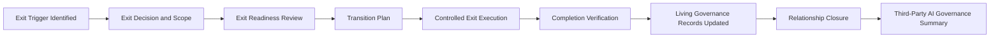

# Third-Party AI Exit & Transition Plan

## Executive Summary

Third-Party AI Oversight determines whether an active external AI relationship remains suitable for continued use. Where continuation is no longer appropriate, Megastar Mortgage must terminate, replace, or transition the relationship without creating unmanaged operational, privacy, security, regulatory, contractual, or governance exposure.

The Third-Party AI Exit & Transition Plan establishes the structured approach for safely retiring or replacing a third-party AI provider supporting the Megastar Intelligent Processor (MIP). It defines the exit trigger, transition scope, responsibilities, dependencies, continuity requirements, data disposition, access revocation, technical disengagement, knowledge transfer, evidence retention, completion verification, and relationship-closure requirements.

Exit is not complete merely because a contract ends or provider access is disabled. Megastar Mortgage must confirm that affected AI systems and business processes remain appropriately governed, required data has been returned or deleted, credentials and integrations have been removed, unresolved obligations have been closed or transferred, linked governance records have been updated, and sufficient evidence exists to support formal relationship closure.

This artifact governs exit and transition planning and completion. It does not negotiate contract termination, approve replacement-provider onboarding, perform enterprise risk analysis, investigate incidents, approve material system changes, test control effectiveness, or formally accept residual risk.

---

## Purpose

The purpose of this document is to establish a standardized approach for terminating, replacing, or transitioning third-party AI relationships.

The Third-Party AI Exit & Transition Plan enables Megastar Mortgage to:

- identify and document the reason for exit;
- define the systems, services, data, processes, users, controls, and dependencies affected;
- establish accountability for exit and transition activities;
- maintain business and service continuity during transition;
- coordinate replacement-provider or internal-capability readiness;
- govern migration of data, models, prompts, configurations, workflows, interfaces, and documentation;
- confirm data return, retention, deletion, and deletion certification;
- revoke provider access, credentials, accounts, integrations, and technical dependencies;
- retain governance, contractual, audit, and assurance evidence;
- resolve or transfer open risks, controls, incidents, findings, changes, conditions, and corrective actions;
- verify completion of exit obligations;
- update all affected living governance records;
- determine whether the provider relationship is ready for formal closure; and
- provide an accurate handoff to the Third-Party AI Governance Summary.

Completion of this activity establishes whether the provider relationship has been exited in a controlled and auditable manner.

---

## Exit and Transition Process

Every approved third-party AI exit follows a structured governance process.



Where replacement capability is required, the replacement relationship or internal solution must complete the governance activities owned by its applicable lifecycle before operational reliance is transferred.

---

## Exit and Transition Principles

Megastar Mortgage manages third-party AI exits according to the following principles:

- Every material third-party AI relationship shall have an exit approach proportionate to its dependency criticality and operational significance.
- Exit planning shall begin before termination becomes unavoidable.
- Business continuity, customer outcomes, regulatory obligations, privacy, security, and governance integrity shall be protected throughout the transition.
- A provider relationship shall not be recorded as Closed merely because the contract has expired or been terminated.
- Data return, retention, migration, deletion, and deletion verification shall follow approved legal, regulatory, contractual, privacy, and records-management requirements.
- Provider access, credentials, secrets, accounts, interfaces, and integrations shall be revoked or removed through authorized processes.
- Replacement providers shall not inherit operational use without completing applicable third-party AI governance requirements.
- Material system or control changes arising from transition shall proceed through AI Change Management.
- Exit-related incidents shall proceed through AI Incident Management.
- New or changed risks shall proceed through AI Risk Management.
- Open obligations shall be closed, formally transferred, or escalated before relationship closure.
- Completion verification shall confirm that required exit activities occurred; it shall not be represented as broader control-effectiveness assurance.
- Exit decisions, exceptions, limitations, and evidence shall remain traceable.
- Formal residual-risk acceptance shall remain with Governance Oversight & Continual Improvement.

---

## Exit Triggers

Exit and transition planning may be initiated by:

- contract expiry or non-renewal;
- strategic business decision;
- replacement by an internal capability;
- replacement by another provider;
- product or service discontinuation;
- provider market withdrawal;
- provider acquisition, ownership change, or restructuring;
- provider financial instability;
- persistent service-performance failure;
- repeated contractual non-compliance;
- material privacy or security weakness;
- significant or repeated provider incidents;
- inability to obtain sufficient assurance evidence;
- unacceptable provider-originated risk;
- unapproved or unmanaged material changes;
- regulatory prohibition or restriction;
- material jurisdictional concern;
- excessive concentration or dependency;
- vendor lock-in reduction;
- inadequate portability or exit support;
- unresolved corrective actions;
- suspension that cannot be resolved;
- change in the intended AI use;
- retirement of the related AI system; or
- another governance decision requiring termination or transition.

The exit trigger shall be documented together with the supporting governance decision and applicable authority.

---

## Exit Types

The plan shall identify the type of exit being performed.

| Exit Type | Meaning |
|---|---|
| Provider Replacement | The external capability will move to another provider. |
| Internal Replacement | The capability will be brought in-house or replaced by an internal solution. |
| Service Retirement | The capability or supported AI use will be discontinued. |
| Partial Exit | Only selected products, services, models, data flows, use cases, or jurisdictions will be removed. |
| Emergency Exit | Accelerated termination or suspension is required because of a material incident, legal prohibition, security event, or unacceptable exposure. |
| Contractual Exit | The relationship ends through expiry, termination, or non-renewal. |
| Strategic Transition | The relationship is replaced as part of a planned architecture, operating-model, or sourcing change. |

The exit type affects the transition approach, decision rights, timing, evidence, and continuity requirements.

---

## Exit Scope

The exit scope shall identify everything affected by the transition.

The scope may include:

- provider legal entities;
- contracted products and services;
- external models or foundation models;
- APIs and integrations;
- cloud environments;
- intelligent document-processing services;
- data-processing activities;
- training, validation, or evaluation services;
- model-monitoring services;
- external human-review services;
- related AI systems;
- affected business processes;
- affected customer or employee interactions;
- approved users and roles;
- provider and internal support teams;
- data stores and data transfers;
- prompts, configurations, workflows, and business rules;
- model artifacts and versions;
- credentials, tokens, keys, secrets, and service accounts;
- monitoring and logging dependencies;
- linked controls;
- linked risks;
- linked incidents, findings, corrective actions, and changes;
- relevant contracts and licenses;
- subprocessors and fourth parties; and
- governance, assurance, and audit evidence.

Explicit exclusions and assumptions shall be documented.

---

## Exit Governance Roles

Exit and transition responsibilities shall be assigned clearly.

| Role | Responsibility |
|---|---|
| Business Relationship Owner | Accountable for the provider relationship and business exit outcome. |
| Exit or Transition Lead | Coordinates the exit plan, dependencies, milestones, evidence, and completion status. |
| AI System Business Owner | Confirms business continuity and acceptable future-state operation. |
| AI System Technical Owner | Coordinates technical migration, integration removal, access revocation, and system updates. |
| Procurement | Supports commercial disengagement, renewal prevention, and supplier offboarding. |
| Legal & Compliance | Confirms contractual, legal, regulatory, intellectual-property, and surviving obligations. |
| Privacy | Confirms lawful data disposition, return, retention, transfer, and deletion requirements. |
| Security | Confirms access revocation, credential removal, technical disengagement, and security evidence. |
| Records Management | Confirms evidence and record-retention requirements. |
| Enterprise Risk | Coordinates new or changed risk evaluation where required. |
| AI Governance Lead | Maintains governance alignment, record updates, escalation, and closure readiness. |
| Assurance Function | Performs independent verification where required by risk, policy, or governance decision. |
| Governance Authority | Approves material exit decisions, exceptions, extensions, and final closure. |

Segregation of duties shall be preserved where independent verification or approval is required.

---

## Exit Readiness Review

Before controlled exit execution begins, Megastar Mortgage confirms that:

- the exit decision and authority are documented;
- the exit trigger and scope are clear;
- affected AI systems and business processes are identified;
- affected stakeholders and users are identified;
- direct, indirect, subprocessor, and fourth-party dependencies are understood;
- contractual termination and surviving obligations are understood;
- required notice periods are known;
- replacement or retirement strategy is defined;
- business-continuity arrangements are approved;
- transition risks are identified and transferred to AI Risk Management where required;
- material system and control changes are identified;
- data-return, migration, retention, and deletion requirements are approved;
- access-revocation requirements are defined;
- integration-removal requirements are defined;
- governance-documentation and evidence-retention requirements are defined;
- provider cooperation and transition support are confirmed;
- unresolved provider issues and obligations are known;
- transition acceptance and rollback criteria are established where applicable; and
- sufficient resources and authority exist to execute the plan.

Where readiness is insufficient, execution shall be delayed, restricted, escalated, or managed through an approved emergency-exit approach.

---

## Transition Strategy

The transition strategy defines the future state following exit.

| Transition Strategy | Description |
|---|---|
| Alternative Provider | The capability will move to another external provider. |
| Internal Capability | Megastar Mortgage will operate the replacement capability internally. |
| Service Discontinued | The business process or AI capability will be retired. |
| Temporary Manual Process | A controlled manual process will support continuity during transition. |
| Hybrid Transition | Multiple internal, external, or manual solutions will replace the current service. |
| Undetermined | The future state requires governance resolution before execution. |

Where an alternative provider is selected, that provider shall complete:

```text
Third-Party AI Identification
→ Enterprise Third-Party AI Register
→ Third-Party AI Due Diligence
→ Third-Party AI Risk Assessment
→ Contract & Onboarding Requirements
```

Operational reliance shall not transfer solely because the prior provider is exiting.

---

## Business Continuity During Transition

The exit plan shall protect essential business operations throughout the transition.

Continuity planning may address:

- critical business services;
- maximum tolerable disruption;
- transition sequencing;
- parallel operation;
- fallback processes;
- temporary manual controls;
- customer and employee impacts;
- regulatory deadlines;
- service availability;
- staffing and support;
- backlog management;
- recovery procedures;
- escalation routes;
- rollback criteria;
- contingency capacity;
- communication plans; and
- executive decision points.

Business continuity arrangements shall remain proportionate to the dependency criticality and consequence of service disruption.

---

## Transition Risk Identification

Exit and transition activities may introduce new risks.

Examples include:

- operational disruption;
- incomplete data migration;
- data loss or corruption;
- inconsistent model or service behavior;
- degraded performance;
- inaccurate outputs during migration;
- loss of audit history;
- temporary control gaps;
- unauthorized residual access;
- delayed credential revocation;
- unremoved integrations;
- unresolved licensing restrictions;
- failure to meet regulatory obligations;
- incomplete knowledge transfer;
- inadequate replacement-provider readiness;
- security exposure during data movement;
- privacy exposure during transfer;
- customer or employee harm;
- contractual disputes; and
- extended dependency on the outgoing provider.

Material transition risks shall be entered into or linked within the Enterprise AI Risk Register and governed through the established AI Risk Management lifecycle.

---

## Technical Transition

Technical transition planning may address:

- API replacement;
- interface migration;
- model replacement;
- model-version compatibility;
- workflow migration;
- prompt migration;
- configuration migration;
- business-rule migration;
- identity and access integration;
- service-account replacement;
- secrets and key rotation;
- logging and monitoring continuity;
- data-pipeline changes;
- hosting changes;
- infrastructure changes;
- environment separation;
- testing environments;
- rollback capability;
- technical documentation;
- dependency removal; and
- decommissioning of obsolete components.

Material technical changes shall proceed through AI Change Management.

---

## Data Return, Migration, Retention, and Deletion

The exit plan shall govern all data associated with the provider relationship.

The plan shall identify:

- data categories held or processed by the provider;
- data locations;
- data ownership;
- data needed for migration;
- migration format;
- transfer method;
- integrity and completeness validation;
- data-return requirements;
- legal or regulatory retention requirements;
- records subject to legal hold;
- provider retention obligations;
- deletion scope;
- backup and replica deletion;
- subprocessor deletion;
- deletion timelines;
- deletion evidence;
- deletion certification;
- unresolved data disputes; and
- responsibilities surviving termination.

Data shall not be deleted where retention is legally or contractually required. Data shall not be retained merely because deletion has not been actively governed.

---

## Access Revocation and Technical Disengagement

Exit shall include controlled removal of provider and internal access associated with the relationship.

Activities may include:

- disable provider user accounts;
- disable internal accounts used only for the service;
- revoke privileged access;
- revoke API keys;
- revoke access tokens;
- rotate credentials and secrets;
- remove certificates;
- remove SSO integration;
- remove federation or trust relationships;
- revoke remote access;
- disable service accounts;
- remove network connectivity;
- terminate data feeds;
- disable interfaces;
- remove webhooks;
- remove provider monitoring access;
- disable support access;
- remove test and non-production access;
- archive necessary logs; and
- confirm no unauthorized residual access remains.

Security shall verify completion according to organizational requirements.

---

## Model, Prompt, Configuration, and Workflow Portability

Where the outgoing provider supports models, prompts, configurations, rules, or workflows, the exit plan shall determine:

- what artifacts Megastar Mortgage owns;
- what artifacts may be exported;
- export formats;
- licensing restrictions;
- intellectual-property limitations;
- portability of fine-tuned models;
- portability of prompts;
- portability of workflow configurations;
- portability of validation rules;
- portability of evaluation results;
- portability of performance history;
- portability of model or service documentation;
- required transformation or redevelopment;
- compatibility with the replacement capability; and
- evidence that migrated artifacts remain complete and usable.

Inability to achieve acceptable portability shall be treated as a material transition dependency or risk.

---

## Documentation and Knowledge Transfer

The outgoing provider shall provide or support the transfer of required knowledge and documentation, where contractually applicable.

Relevant materials may include:

- architecture documentation;
- configuration documentation;
- interface specifications;
- data dictionaries;
- model or service documentation;
- version history;
- release history;
- operating procedures;
- support procedures;
- known limitations;
- open issue history;
- incident history;
- performance history;
- assurance documentation;
- control evidence;
- subprocessor information;
- business-continuity documentation;
- migration guidance;
- data-deletion evidence; and
- transition-support records.

Megastar Mortgage shall confirm that required knowledge has been transferred to accountable internal or replacement-provider stakeholders.

---

## Contractual and Legal Closure

Legal & Compliance and Procurement shall confirm the status of:

- termination notice;
- contract expiry;
- termination rights;
- termination charges;
- outstanding payments;
- licensing obligations;
- intellectual-property rights;
- surviving confidentiality obligations;
- surviving privacy and data obligations;
- record-retention obligations;
- audit and assurance rights;
- regulatory cooperation;
- open disputes;
- warranties and indemnities;
- incident and corrective-action obligations;
- transition-support obligations;
- subprocessor obligations; and
- post-termination assistance.

Contractual closure does not, by itself, establish governance closure.

---

## Open Obligations

Before closure, all material open obligations shall be:

- completed;
- verified where required;
- transferred to an accountable owner;
- accepted through an authorized governance decision; or
- escalated as a closure blocker.

Open obligations may include:

- incidents;
- assurance findings;
- corrective actions;
- provider remediation;
- contractual disputes;
- data-deletion evidence;
- regulatory notifications;
- unresolved risks;
- control updates;
- change activities;
- transition actions;
- outstanding evidence requests; and
- financial or legal obligations.

The exit plan shall identify how each obligation will be governed after provider operations cease.

---

## Exit Completion Verification

Exit completion verification confirms whether planned exit activities have been performed and documented.

Verification may include confirmation that:

- replacement or retirement arrangements are operational;
- business continuity requirements were met;
- required data was returned;
- migrated data is complete and usable;
- required data was deleted;
- deletion certification was received where applicable;
- provider and internal access was revoked;
- credentials, keys, tokens, and secrets were revoked or rotated;
- integrations and interfaces were disabled or removed;
- provider-hosted environments were decommissioned where applicable;
- prompts, configurations, workflows, models, and documentation were transferred where required;
- contractual obligations were resolved;
- governance and assurance evidence was retained;
- open obligations were completed or formally transferred;
- affected AI System Inventory records were updated;
- linked risk records were updated;
- linked control records were updated;
- linked incident and change records were resolved or transferred;
- monitoring and oversight arrangements were updated;
- the Enterprise Third-Party AI Register reflects the exit state; and
- closure blockers have been resolved or formally escalated.

Verification of exit activities does not establish that all replacement controls are operating effectively unless separately evaluated through AI Assurance.

---

## Exit Exceptions and Limitations

Where an exit requirement cannot be completed, the limitation shall document:

- the unmet requirement;
- reason for non-completion;
- related risk;
- affected systems, data, stakeholders, or obligations;
- compensating measure;
- responsible owner;
- target resolution date;
- monitoring requirement;
- escalation authority;
- expiry or review date; and
- effect on closure readiness.

A relationship with unresolved material obligations shall not be recorded as fully Closed unless an authorized governance decision permits closure with documented follow-up.

---

## Exit Outcomes

The exit and transition process results in one of the following outcomes.

| Exit Outcome | Meaning |
|---|---|
| Successfully Completed | Required exit, transition, verification, record-update, and closure activities have been completed. |
| Completed with Follow-Up Actions | Operational reliance has ended and closure is approved, but limited documented administrative or governance actions remain under assigned ownership. |
| Transition Extended | Continued transition activity is required before operational reliance or closure can end. |
| Exit Suspended | Exit activity is paused pending resolution of a material dependency, incident, legal matter, or governance decision. |
| Exit Cancelled | The exit decision has been withdrawn and continued use has been reapproved through the appropriate governance process. |
| Closure Blocked | Material obligations prevent formal relationship closure. |

The outcome shall be supported by documented evidence and appropriate approval.

---

## Cross-Capability Handoffs

Third-Party AI Exit & Transition may initiate or depend upon:

| Exit Trigger or Requirement | Capability Owner |
|---|---|
| Replacement provider required | Third-Party AI Governance |
| New or changed transition risk | AI Risk Management |
| New or redesigned transition control | AI Controls |
| Independent verification required | AI Assurance |
| Migration or exit incident | AI Incident Management |
| Material system, model, data, integration, or control change | AI Change Management |
| Ongoing transition metric or threshold | Continuous Monitoring |
| Executive decision or residual-risk acceptance required | Governance Oversight & Continual Improvement |
| Related AI system retired or materially changed | AI Inventory & Assessment |
| Governance framework evidence updated | Framework Alignment |

The exit plan coordinates these handoffs but does not perform specialist work owned by another capability.

---

## Living Governance Record Updates

### Enterprise Third-Party AI Register

Approved exit and transition outcomes update:

| Register Field | Information Added |
|---|---|
| Exit and Transition Plan Reference | Authoritative plan reference. |
| Exit Trigger | Reason the relationship is being exited. |
| Exit Decision Date | Date the exit decision was approved. |
| Exit Decision Authority | Authority approving the exit. |
| Replacement Strategy | Approved future-state approach. |
| Transition Status | Current transition lifecycle status. |
| Operational Continuity Addressed | Whether continuity requirements have been completed. |
| Data Return Completed | Whether required data return is complete. |
| Data Migration Completed | Whether required data migration is complete. |
| Data Deletion Completed | Whether required deletion is complete. |
| Deletion Confirmation Received | Whether required deletion evidence has been received. |
| Provider Access Revoked | Whether provider access has been removed. |
| Integrations Disabled or Removed | Whether provider integrations have been disengaged. |
| Governance Evidence Retained | Whether required records and evidence are preserved. |
| Unresolved Obligations Transferred or Closed | Whether open matters remain governed. |
| Transition Completion Date | Date transition activities were completed. |
| Exit Notes | Material context, limitations, and decisions. |
| Closure Readiness Confirmed | Whether closure criteria are satisfied. |
| Final Relationship Status | Closed, Archived, or Closure Blocked. |
| Closure Approved By | Authority approving closure. |
| Closure Date | Date formal closure was approved. |
| Closure Reference | Authoritative closure evidence reference. |

### Enterprise AI System Inventory

The related AI system record shall be updated where:

- the provider is removed;
- the system is replaced;
- the system is retired;
- the deployment model changes;
- the operating environment changes;
- ownership or dependencies change; or
- the system enters reassessment.

### Enterprise AI Risk Register

Linked risk records shall be reviewed where:

- provider-originated risks no longer apply;
- transition risks are introduced;
- risk conditions change;
- controls change;
- residual risk changes; or
- risk closure or continued treatment requires a governance decision.

### Enterprise AI Control Register

Linked control records shall be reviewed where:

- provider controls are retired;
- replacement controls are introduced;
- control ownership changes;
- control evidence sources change;
- monitoring changes; or
- assurance is required.

Closure of the provider relationship does not automatically close linked system, risk, control, incident, or change records.

---

## Relationship Closure Criteria

A third-party AI relationship is ready for closure when:

- the approved exit scope has been completed;
- operational reliance has ended or transferred;
- replacement or retirement arrangements are stable;
- business-continuity obligations are satisfied;
- required data return, migration, retention, and deletion activities are complete;
- required deletion evidence has been obtained;
- provider and service access has been revoked;
- credentials and integrations have been removed;
- contractual and surviving obligations are resolved;
- required documentation and evidence have been retained;
- unresolved obligations are closed or formally transferred;
- affected living governance records have been updated;
- material exit limitations have been resolved or approved;
- completion verification has been performed;
- closure readiness has been reviewed; and
- the appropriate governance authority has approved closure.

---

## Exit Review and Approval

Before closure is approved, Megastar Mortgage confirms that:

- the exit decision and scope were authorized;
- readiness and transition risks were addressed;
- business continuity was maintained;
- required provider cooperation was obtained;
- data obligations were completed;
- access and technical disengagement were completed;
- contractual and legal obligations were reviewed;
- open obligations were closed or transferred;
- completion evidence was sufficient;
- cross-capability handoffs were completed;
- living governance records were updated;
- closure limitations were disclosed; and
- the proposed exit outcome was supported.

Formal closure shall be approved according to the relationship’s criticality, impact, and organizational decision rights.

---

## Plan Maintenance

The Exit & Transition Plan shall be reviewed when:

- the exit trigger changes;
- the transition strategy changes;
- replacement-provider readiness changes;
- contractual obligations change;
- transition risks change materially;
- a migration incident occurs;
- data-disposition requirements change;
- a new dependency is discovered;
- transition timelines change;
- the provider fails to cooperate;
- exit support becomes unavailable;
- continuity assumptions change;
- a material governance exception is requested;
- the exit is suspended or cancelled; or
- the plan no longer reflects the actual transition.

Updates shall preserve version history and traceability.

---

## Why This Document Matters

Organizations often plan how to onboard AI providers more carefully than how to leave them.

Third-party AI exits can expose hidden dependencies, inaccessible data, proprietary configurations, unavailable documentation, unresolved incidents, weak portability, operational disruption, retained provider access, and incomplete deletion.

Without disciplined exit governance, a terminated relationship may continue to create privacy, security, compliance, operational, and accountability exposure long after contractual use has ended.

The Third-Party AI Exit & Transition Plan enables Megastar Mortgage to end external AI relationships in a controlled, evidence-based, and auditable manner while protecting continuity and preserving the integrity of the wider AI governance system.

---

## Related Artifacts

This document supports:

- Third-Party AI Exit & Transition Plan Template
- Enterprise Third-Party AI Register
- Third-Party AI Identification
- Third-Party AI Due Diligence
- Third-Party AI Risk Assessment
- Third-Party AI Contract & Onboarding Requirements
- Third-Party AI Oversight
- Enterprise AI System Inventory
- Enterprise AI Risk Register
- Enterprise AI Control Register
- Third-Party AI Governance Summary
- AI Incident Management
- AI Change Management
- Continuous Monitoring

---

## Document Control

| Field | Value |
|---|---|
| Document | Third-Party AI Exit & Transition Plan |
| Capability | Third-Party AI Governance |
| Repository | Enterprise AI Governance Playbook |
| Reference Organization | Megastar Mortgage |
| Reference AI System | Megastar Intelligent Processor (MIP) |
| Document Owner | AI Governance Lead |
| Version | 1.0 |
| Review Cycle | Annual |
| Status | Published Reference |

---

## Revision History

| Version | Date | Description |
|---|---|---|
| 1.0 | July 2026 | Initial release of the Third-Party AI Exit & Transition Plan artifact. |