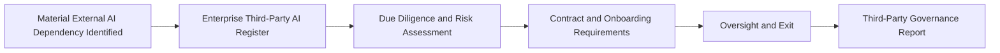

# Third-Party AI Governance

## Document Control

| Field | Value |
|--------|-------|
| Document Name | Third-Party AI Governance |
| Capability | Third-Party AI Governance |
| Repository | Enterprise AI Governance Playbook |
| Reference Organization | Megastar Mortgage |
| Reference AI System | Megastar Intelligent Processor (MIP) |
| Document Owner | AI Governance Lead |
| Version | 3.0 |
| Classification | Public Reference Implementation |
| Status | Published |
| Review Cycle | Annual |
| Last Updated | July 2026 |

---

# Executive Summary

Many enterprise AI systems depend on external providers for foundation models, AI platforms, APIs, cloud infrastructure, intelligent document processing, managed AI services, data providers, or other critical capabilities.

Third-Party AI Governance establishes how Megastar Mortgage governs these external relationships throughout their lifecycle. The capability ensures every material provider relationship is identified, recorded, evaluated, onboarded, monitored, and, where necessary, exited in a controlled and auditable manner.

The Enterprise Third-Party AI Register serves as the authoritative record for every governed provider relationship. Due diligence and provider-originated risk assessment determine whether the provider is suitable for the intended use and whether identified concerns require entry into the Enterprise AI Risk Register. Contract and onboarding requirements establish the governance conditions required before operational use. Ongoing oversight determines whether the relationship remains appropriate throughout its lifecycle and whether restriction, reassessment, renewal, or exit is required.

Rather than creating parallel governance records, this capability contributes approved information to the organization's authoritative governance records through controlled governance processes, preserving clear ownership, traceability, and accountability.

---

# Purpose

The purpose of the Third-Party AI Governance capability is to establish a standardized lifecycle for governing material external AI providers and dependencies.

This capability enables Megastar Mortgage to:

- identify material third-party AI relationships;
- establish authoritative provider relationship records;
- evaluate provider suitability through evidence-based due diligence;
- determine whether provider-originated concerns require enterprise AI risk registration;
- establish contractual and onboarding governance requirements;
- oversee active provider relationships throughout their operational lifecycle;
- govern provider transition, replacement, and exit; and
- provide management with decision-ready visibility into the organization's third-party AI landscape.

---

# Governance Scope

This capability applies whenever Megastar Mortgage proposes to use or already relies upon an external party for:

- foundation models;
- AI-enabled APIs;
- software-as-a-service AI platforms;
- cloud-based AI capabilities;
- intelligent document processing services;
- managed AI services;
- AI development, hosting, or operational support;
- external data services used by AI systems;
- model training, validation, or evaluation services;
- AI infrastructure or inference services;
- AI monitoring or observability services;
- external human-review or annotation services supporting AI operations; or
- any other material external dependency required for an AI system to operate.

Traditional suppliers with no material connection to an AI system remain governed through the organization's broader third-party risk management process.

---

# Governance Entry

A third-party AI relationship enters this capability when a material external AI dependency is identified.

Identification establishes governance visibility only. It confirms that the relationship exists and should enter the formal governance lifecycle. Identification does **not** determine provider suitability, assign enterprise risk, approve onboarding, negotiate contractual terms, or authorize operational use.

The minimum information required to establish governance includes:

- provider identity;
- product or service;
- related AI System Inventory record;
- intended business use;
- Business Relationship Owner;
- business function;
- relationship type;
- deployment context;
- direct or indirect dependency;
- initial dependency criticality;
- relationship status; and
- known material subprocessors or fourth-party dependencies.

Each relationship is assigned a Business Relationship Owner responsible for ensuring the provider enters the organization's formal governance process.

---

# Relationship Types

Material third-party AI relationships may include:

- Foundation Model Provider
- AI API Provider
- SaaS AI Platform
- Managed AI Service
- Cloud AI Service
- Intelligent Document Processing Provider
- AI Data Provider
- AI Infrastructure Provider
- AI Development or Support Provider
- Human Review or Annotation Provider
- Other Material AI Dependency

A provider may perform multiple roles within a single relationship.

---

# Governance Principles

Megastar Mortgage governs third-party AI relationships according to the following principles:

- Every material external AI dependency shall enter governance before approved operational use.
- Every governed provider relationship shall have one authoritative register record.
- Governance activities shall remain proportionate to the provider's operational significance and dependency criticality.
- Provider suitability, enterprise risk, contractual readiness, oversight, and exit shall remain distinct governance decisions.
- Specialist governance activities shall contribute approved information to authoritative enterprise records rather than creating parallel repositories.
- Material provider changes, incidents, deterioration, and emerging risks shall trigger reassessment through the appropriate governance capability.
- Relationship decisions shall remain evidence-based, traceable, and accountable throughout the provider lifecycle.

---

# Governance Lifecycle

Every material third-party AI relationship follows an integrated governance lifecycle.

Each governance activity contributes approved outcomes to the organization's authoritative governance records while preserving clear ownership boundaries.

---

# Core Deliverables

| Governance Artifact | Purpose |
|----------------------|---------|
| Enterprise Third-Party AI Register | Maintains the authoritative lifecycle record for every governed provider relationship. |
| Third-Party Due Diligence and Risk Assessment | Evaluates provider suitability and determines whether provider-originated concerns require entry into the Enterprise AI Risk Register. |
| Third-Party Contract and Onboarding Requirements | Establishes the governance conditions that must be satisfied before approved operational use. |
| Third-Party Oversight and Exit | Governs ongoing oversight, continuation decisions, transition, replacement, and controlled relationship closure. |
| Third-Party Governance Report | Provides management with a decision-ready view of the organization's third-party AI governance position and required actions. |

---

# Authoritative Governance Records

Third-Party AI Governance contributes approved information to the organization's existing governance records.

| Governance Record | Governed Object |
|-------------------|-----------------|
| Enterprise AI System Inventory | AI system |
| Enterprise Third-Party AI Register | External provider relationship |
| Enterprise AI Risk Register | AI risk |
| Enterprise AI Control Register | AI control |
| Enterprise AI Incident Register | AI incident |
| Enterprise AI Change Register | AI change |

These records remain linked rather than duplicated.

---

# Expected Outcomes

Completion of this capability enables Megastar Mortgage to establish:

- complete visibility of material third-party AI relationships;
- an authoritative provider relationship register;
- evidence-based provider suitability conclusions;
- consistent identification of provider-originated enterprise risks;
- governed contractual and onboarding requirements;
- proportionate ongoing provider oversight;
- structured provider transition and exit governance;
- decision-ready management reporting; and
- traceable governance throughout the provider lifecycle.

---

# Why This Capability Matters

Organizations increasingly rely on external AI providers to deliver business-critical capabilities.

Without structured governance, provider dependencies may remain invisible, contractual protections may be insufficient, provider-originated risks may never enter enterprise governance, and organizations may struggle to respond effectively to provider changes, service deterioration, regulatory developments, or exit events.

Third-Party AI Governance provides a consistent enterprise approach for governing external AI relationships throughout their lifecycle while preserving accountability, traceability, and informed governance decision-making.

---

# Framework Alignment

The activities performed within this capability support internationally recognized governance practices, including:

- NIST AI Risk Management Framework (Govern, Map, Measure, Manage)
- ISO/IEC 42001 – Artificial Intelligence Management System
- ISO 31000 – Risk Management
- ISO/IEC 23894 – AI Risk Management
- Third-party and supplier governance practices commonly adopted within enterprise risk management programs

Rather than reproducing framework requirements, this capability demonstrates how external AI relationships are governed within an operational AI governance program.

---

# Completion Criteria

This capability is considered operational when:

- material third-party AI relationships have been identified;
- authoritative provider relationship records have been established;
- required due diligence and provider risk assessment have been completed;
- contractual and onboarding governance requirements have been satisfied before approved operational use;
- active provider relationships are subject to ongoing oversight;
- provider exit requirements are established where applicable; and
- management reporting provides current visibility into material third-party AI governance matters.

Provider exit is performed only when triggered by the relationship lifecycle and is not a prerequisite for capability completion.

---

# Validation Checklist

| Status | Deliverable |
|--------|-------------|
| ☐ | Enterprise Third-Party AI Register established |
| ☐ | Due Diligence and Risk Assessment completed |
| ☐ | Contract and Onboarding Requirements completed |
| ☐ | Oversight arrangements established |
| ☐ | Exit requirements defined where applicable |
| ☐ | Third-Party Governance Report completed |

---

# Next Capability

Following establishment of Third-Party AI Governance, governed provider relationships continue through Continuous Monitoring, AI Assurance, AI Incident Management, AI Change Management, and Governance Oversight & Continual Improvement as appropriate throughout their operational lifecycle.

---

# Related Capabilities

- AI Inventory & Assessment
- AI Risk Management
- AI Controls
- AI Assurance
- Continuous Monitoring
- AI Incident Management
- AI Change Management
- Governance Oversight & Continual Improvement

---

# Revision History

| Version | Date | Description |
|----------|------|-------------|
| 3.0 | July 2026 | Consolidated third-party AI identification into the capability README, aligned the capability with the five-artifact architecture, and simplified lifecycle ownership. |
| 2.0 | July 2026 | Updated to align with repository governance architecture, clarify lifecycle ownership, and align with standardized capability README structure. |
| 1.0 | July 2026 | Initial release of the Third-Party AI Governance capability. |