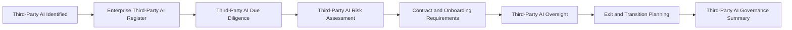

# Third-Party AI Governance

## Document Control

| Field | Value |
|---|---|
| Document Name | Third-Party AI Governance |
| Capability | Third-Party AI Governance |
| Repository | Enterprise AI Governance Playbook |
| Reference Organization | Megastar Mortgage |
| Reference AI System | Megastar Intelligent Processor (MIP) |
| Document Owner | AI Governance Lead |
| Version | 1.0 |
| Classification | Public Reference Implementation |
| Status | Published |
| Review Cycle | Annual |
| Last Updated | July 2026 |

---

# Executive Summary

Enterprise AI systems increasingly depend on external providers, including AI platforms, models, application programming interfaces, cloud services, data-processing services, and specialized technology vendors.

These relationships can introduce dependencies and governance obligations that cannot be addressed through internal AI governance activities alone. Organizations must understand which external providers support their AI systems, evaluate whether those providers are sufficiently governable, establish appropriate contractual protections, oversee provider performance and changes, and prepare for an orderly exit where the relationship no longer remains suitable.

The Third-Party AI Governance capability establishes how Megastar Mortgage governs external AI provider relationships supporting the Megastar Intelligent Processor (MIP).

This capability does not create a separate governance lifecycle for third-party AI systems. Third-party AI systems remain subject to the Enterprise AI System Inventory, AI Inventory & Assessment, AI Risk Management, AI Controls, AI Assurance, and Continuous Monitoring. Third-Party AI Governance adds the provider-specific governance activities required to manage the external relationship throughout its lifecycle.

---

# Purpose

The purpose of this capability is to establish a standardized approach for identifying, evaluating, contracting for, onboarding, overseeing, and exiting third-party AI relationships.

This capability defines:

- how third-party AI providers, products, services, models, and dependencies are identified;
- how third-party AI relationships are maintained within an authoritative enterprise register;
- how provider due diligence is performed;
- how provider-originated AI risks are identified and linked to enterprise risk management;
- how contractual and onboarding requirements are established;
- how provider obligations, changes, assurance information, and dependencies are overseen;
- how termination, replacement, and transition activities are planned; and
- how the overall third-party AI governance position is consolidated.

Completion of this capability enables Megastar Mortgage to use externally provided AI capabilities without transferring or weakening its own governance accountability.

---

# Capability Scope

This capability governs external relationships involving:

- AI platforms and software-as-a-service solutions;
- externally provided AI models and foundation models;
- AI-enabled application programming interfaces;
- cloud-based AI services;
- intelligent document-processing providers;
- external data-processing and model-support services;
- third-party AI development or managed-service providers;
- subprocessors and material fourth-party dependencies; and
- vendors providing technology essential to the operation of an enterprise AI system.

The capability focuses on the external provider relationship.

It does not replace:

- the Enterprise AI System Inventory;
- enterprise AI risk assessment and prioritization;
- internal AI control design;
- AI control testing;
- enterprise continuous monitoring;
- AI incident investigation;
- AI change approval; or
- formal residual-risk acceptance.

Those activities remain owned by their established governance capabilities.

---

# Governance Artifacts

| Governance Artifact | Purpose |
|---|---|
| Third-Party AI Identification | Identifies external AI providers, products, services, models, and dependencies supporting governed AI systems. |
| Enterprise Third-Party AI Register | Maintains the authoritative enterprise record of third-party AI provider relationships throughout their lifecycle. |
| Third-Party AI Due Diligence | Evaluates whether the provider demonstrates sufficient capability, transparency, security, privacy, compliance, resilience, and governance maturity. |
| Third-Party AI Risk Assessment | Identifies provider-originated risks and dependencies requiring entry into the Enterprise AI Risk Register. |
| Third-Party AI Contract & Onboarding Requirements | Defines the contractual protections, governance conditions, and onboarding requirements that must be established before approved use begins. |
| Third-Party AI Oversight | Establishes how provider obligations, assurance information, service performance, material changes, and dependencies are reviewed throughout the relationship. |
| Third-Party AI Exit & Transition Plan | Defines how Megastar Mortgage will terminate, replace, or transition away from a provider while protecting data, operations, governance evidence, and service continuity. |
| Third-Party AI Governance Summary | Consolidates the overall provider-governance position, outstanding matters, and relationship readiness or continuation decision. |

Together, these artifacts establish an end-to-end governance lifecycle for external AI provider relationships.

---

# Governance Lifecycle

Every third-party AI relationship follows a consistent governance lifecycle.

The provider relationship is registered when it is identified and progressively enriched as due diligence, risk assessment, contracting, onboarding, oversight, renewal, and exit activities are completed.

---

# Enterprise Third-Party AI Register

The Enterprise Third-Party AI Register serves as the authoritative living governance record for external AI provider relationships.

A third-party relationship enters the register when an external provider, product, model, service, or material dependency supporting a governed AI initiative is identified.

The register is progressively enriched with:

- provider and service identification information;
- related AI System Inventory references;
- relationship ownership;
- due-diligence outcomes;
- provider-governance documentation;
- material subprocessors and fourth-party dependencies;
- provider-specific risk references;
- contractual and onboarding requirements;
- assurance and oversight information;
- renewal and review status;
- material provider changes;
- exit obligations;
- transition status; and
- final relationship disposition.

Maintaining one living provider record preserves traceability and avoids disconnected due-diligence, contract, oversight, and exit records.

---

# Relationship to Existing Living Governance Records

Third-Party AI Governance operates through the repository’s established governance-record architecture.

| Living Governance Record | Third-Party AI Governance Relationship |
|---|---|
| Enterprise AI System Inventory | Records the governed AI system using or depending upon the third-party product or service. |
| Enterprise Third-Party AI Register | Records the external provider relationship supporting the governed AI system. |
| Enterprise AI Risk Register | Records provider-originated risks identified through due diligence and third-party AI risk assessment. |
| Enterprise AI Control Register | Records controls established to manage third-party AI risks and contractual obligations. |

The records are linked rather than merged.

One AI system may depend on multiple providers, and one provider may support multiple AI systems. Maintaining separate but connected records preserves accurate governance ownership and traceability.

---

# Third-Party AI Risk Boundary

Third-Party AI Risk Assessment identifies risks arising specifically from the external provider relationship.

Examples include:

- insufficient provider transparency;
- limited access to model or service documentation;
- data-use, retention, residency, or deletion uncertainty;
- inadequate privacy or security practices;
- unapproved subprocessors or fourth-party dependencies;
- concentration and vendor dependency;
- service disruption or financial instability;
- weak audit or assurance rights;
- inadequate incident-notification obligations;
- unannounced model, service, or policy changes;
- limited explainability or validation information;
- contractual restrictions affecting governance;
- vendor lock-in; and
- inadequate exit or transition support.

Approved provider-originated risks are entered into the existing Enterprise AI Risk Register. This capability does not establish a separate third-party AI risk register.

---

# Due Diligence

Third-Party AI Due Diligence evaluates whether the provider relationship can be governed appropriately before onboarding or material use begins.

Due diligence may consider:

- provider ownership, experience, and organizational stability;
- AI governance policies and accountability;
- model and service documentation;
- intended-use and prohibited-use restrictions;
- privacy and data-governance practices;
- security architecture and access controls;
- data retention, deletion, and residency;
- model-performance and reliability information;
- human-oversight support;
- incident-management capability;
- change-notification practices;
- business-continuity and disaster-recovery arrangements;
- subprocessors and supply-chain dependencies;
- independent assurance reports and certifications;
- regulatory history;
- contractual willingness; and
- exit and transition capability.

Due diligence determines provider suitability and identifies matters requiring risk treatment, contractual protection, escalation, or rejection.

---

# Contract and Onboarding Governance

Third-party AI use shall not begin until applicable contractual and governance requirements have been established.

Requirements may address:

- permitted and prohibited uses;
- data ownership and authorized data use;
- confidentiality and privacy obligations;
- data residency, retention, return, and deletion;
- security and access-control obligations;
- subprocessor disclosure and approval;
- model and service documentation;
- audit, inspection, and assurance rights;
- performance and service-level commitments;
- incident-notification requirements;
- regulatory-cooperation obligations;
- material-change notification;
- intellectual-property responsibilities;
- business-continuity requirements;
- liability and indemnification;
- termination rights;
- exit assistance; and
- transition and data-portability obligations.

Contractual provisions support governance but do not transfer Megastar Mortgage’s accountability for the AI systems it uses.

---

# Third-Party AI Oversight

Approved providers remain subject to governance throughout the relationship.

Third-Party AI Oversight may include:

- periodic provider reviews;
- review of updated assurance reports and certifications;
- service-level and contractual-performance review;
- monitoring of provider incidents and regulatory developments;
- review of material model, service, policy, ownership, or subprocessor changes;
- confirmation of data-use and retention obligations;
- review of unresolved provider risks and findings;
- concentration and dependency review;
- renewal readiness;
- escalation of material provider issues; and
- confirmation that continued use remains appropriate.

This capability owns relationship-specific provider oversight.

Enterprise governance metrics, dashboards, control-health reporting, and continuous organizational monitoring remain within the Continuous Monitoring capability.

---

# Exit and Transition Governance

Every material third-party AI relationship shall have an exit and transition approach proportionate to its operational significance.

Exit and transition planning may address:

- termination triggers;
- replacement-provider or internal-service options;
- operational continuity;
- data return, migration, deletion, and certification;
- access revocation;
- model, configuration, prompt, and documentation portability;
- intellectual-property and licensing constraints;
- retention of governance and assurance evidence;
- unresolved incident, finding, or corrective-action obligations;
- transition responsibilities;
- stakeholder communication;
- dependency closure; and
- final register updates.

A relationship is not considered closed until applicable data, access, operational, contractual, and governance obligations have been resolved or formally transferred.

---

# Capability Outcomes

Upon completion of this capability, Megastar Mortgage will have established:

- visibility of third-party AI providers and material external dependencies;
- a living Enterprise Third-Party AI Register;
- a standardized third-party AI due-diligence process;
- provider-originated risks linked to the Enterprise AI Risk Register;
- defined contractual and onboarding governance requirements;
- structured oversight of provider obligations and material changes;
- documented exit and transition arrangements; and
- a consolidated Third-Party AI Governance Summary.

These deliverables enable Megastar Mortgage to govern externally provided AI capabilities while maintaining internal accountability and enterprise traceability.

---

# Why This Capability Matters

Using a third-party AI provider does not transfer responsibility for the consequences of the AI system.

External providers may control critical technology, data processing, model updates, service continuity, documentation, or assurance evidence. Without dedicated third-party AI governance, organizations may depend on providers they cannot adequately evaluate, oversee, audit, change, or exit.

The Third-Party AI Governance capability enables Megastar Mortgage to establish visibility, contractual accountability, risk traceability, ongoing oversight, and exit readiness across external AI relationships.

It ensures that third-party AI use remains subject to the same enterprise governance expectations as internally developed or operated AI systems, while addressing the additional risks created by external dependency.

---

# Relationship to Other Capabilities

This capability applies a third-party provider lens across the existing AI governance lifecycle.

It relies upon:

- Foundations;
- Governance Operating Model;
- AI Inventory & Assessment;
- AI Risk Management;
- AI Controls; and
- AI Assurance.

It provides inputs to:

- Continuous Monitoring;
- AI Incident Management;
- AI Change Management;
- Governance Oversight & Continual Improvement; and
- Framework Alignment.

A material provider event may trigger reassessment, new risk analysis, control changes, assurance activity, incident response, or exit planning through the capability that owns that activity.

---

# Capability Completion Criteria

This capability is complete when:

- all material third-party AI providers and dependencies have been identified;
- each provider relationship has an authoritative register record;
- required due diligence has been completed;
- provider-originated risks have been entered into the Enterprise AI Risk Register;
- contractual and onboarding requirements have been approved;
- required governance conditions have been satisfied before use;
- ongoing provider-oversight requirements have been established;
- exit and transition requirements have been documented; and
- the Third-Party AI Governance Summary has been completed.

---

# Capability Completion Checklist

| Status | Deliverable |
|---|---|
| ☐ | Third-Party AI Identification completed |
| ☐ | Enterprise Third-Party AI Register established |
| ☐ | Third-Party AI Due Diligence completed |
| ☐ | Third-Party AI Risk Assessment completed |
| ☐ | Contract & Onboarding Requirements approved |
| ☐ | Third-Party AI Oversight established |
| ☐ | Exit & Transition Plan completed |
| ☐ | Third-Party AI Governance Summary completed |

---

# Next Capability

Following completion of Third-Party AI Governance, Megastar Mortgage proceeds to **Continuous Monitoring**, where AI risks, controls, corrective actions, provider obligations, governance metrics, indicators, thresholds, and operational trends are continually observed throughout the AI system lifecycle.

---

# Related Capabilities

- AI Inventory & Assessment
- AI Risk Management
- AI Controls
- AI Assurance
- Continuous Monitoring
- AI Incident Management
- AI Change Management

---

# Revision History

| Version | Date | Description |
|---|---|---|
| 1.0 | July 2026 | Initial release of the Third-Party AI Governance capability. |