# Continuous Monitoring Strategy

## Executive Summary

AI Assurance provides objective confidence regarding AI governance controls during a defined review period. Third-Party AI Governance establishes the obligations and oversight requirements applicable to external AI provider relationships.

Those conclusions remain useful only while the underlying operating conditions remain materially unchanged.

The Continuous Monitoring Strategy establishes how Megastar Mortgage maintains ongoing visibility into the Megastar Intelligent Processor (MIP), its risks, controls, third-party dependencies, corrective actions, governance obligations, and material operating conditions throughout the AI lifecycle.

The strategy defines the monitoring objectives, scope, governance domains, responsibilities, methods, sources, cadence, quality requirements, review structure, and cross-capability handoffs that guide the Continuous Monitoring capability.

It does not define individual metrics, KPI or KRI formulas, threshold values, dashboard layouts, monitoring findings, or escalation decisions. Those are established through the subsequent artifacts within this capability.

---

## Purpose

The purpose of this document is to establish a standardized, risk-based operating strategy for Continuous Monitoring.

The Continuous Monitoring Strategy enables Megastar Mortgage to:

- define why ongoing monitoring is required;
- identify the governed objects and conditions within scope;
- determine which monitoring domains apply;
- assign ownership and accountability;
- establish proportionate monitoring frequencies;
- define approved monitoring methods;
- identify authoritative monitoring sources;
- establish minimum data-quality and traceability requirements;
- document monitoring limitations and blind spots;
- define how monitoring observations are reviewed;
- establish cross-capability handoff principles; and
- maintain the strategy as AI systems and governance conditions change.

Completion of this strategy provides the operating foundation for the Governance Metrics Catalogue, KPI & KRI Framework, Continuous Control Monitoring, Governance Dashboard, Monitoring Findings & Escalation, and Continuous Monitoring Summary.

---

## Monitoring Strategy Lifecycle

Continuous Monitoring follows a structured lifecycle.

```mermaid
flowchart LR

A[Assurance and Governance Handoffs]
--> B[Monitoring Objectives]
--> C[Monitoring Scope]
--> D[Governance Objects and Domains]
--> E[Ownership and Responsibilities]
--> F[Methods and Frequency]
--> G[Sources and Data Quality]
--> H[Monitoring Execution]
--> I[Review and Specialist Handoffs]
--> J[Strategy Maintenance]
```

The strategy establishes how monitoring will operate. Detailed measures, thresholds, reporting views, findings, and escalations are defined through later artifacts.

---

## Monitoring Principles

Megastar Mortgage performs Continuous Monitoring according to the following principles:

- Monitoring shall support a defined governance objective, risk, control, obligation, condition, or decision.
- Monitoring scope shall be proportionate to the significance, volatility, dependency, and potential consequences of the condition being observed.
- Monitoring shall use authoritative and traceable information wherever available.
- Every monitored condition shall have an accountable owner.
- Monitoring frequency shall reflect how quickly the condition may materially change.
- Monitoring shall distinguish operational observation from formal assurance, risk, incident, change, or executive-governance conclusions.
- Monitoring data shall be assessed for completeness, accuracy, timeliness, consistency, lineage, reliability, and relevance.
- Monitoring blind spots and evidence limitations shall be disclosed.
- Monitoring shall not create duplicate governance registers.
- Monitoring observations shall enrich existing living governance records where appropriate.
- Monitoring shall trigger the specialist capability that owns the required response.
- Monitoring shall not replace periodic AI Assurance.
- Monitoring shall not imply that the absence of a breach proves governance effectiveness.
- Thresholds, metrics, and dashboard views shall remain decision-useful and subject to periodic review.
- Continuous Monitoring shall support early intervention before deterioration becomes unmanaged exposure.

---

## Monitoring Objectives

The Continuous Monitoring Strategy supports the following objectives:

### 1. Maintain Current Governance Visibility

Provide timely information regarding the condition of governed AI systems, risks, controls, providers, obligations, corrective actions, incidents, changes, and governance commitments.

### 2. Detect Deterioration

Identify worsening performance, control health, risk conditions, provider obligations, evidence quality, corrective-action status, or approved-use compliance.

### 3. Detect Emerging Exposure

Identify changes in use, data, models, providers, dependencies, regulations, operating context, or stakeholder impact that may require reassessment.

### 4. Support Timely Escalation

Ensure that material monitoring observations are directed to the correct owner and governance authority.

### 5. Preserve Living Governance Records

Keep authoritative system, risk, control, and third-party records aligned with current monitored conditions.

### 6. Support Assurance and Oversight

Provide recurring evidence and trend information for renewed assurance, management review, residual-risk decisions, and continual improvement.

### 7. Strengthen Accountability

Make monitoring ownership, review responsibilities, follow-up obligations, and decision timelines visible and traceable.

---

## Monitoring Scope

The Continuous Monitoring Strategy applies to governed AI systems in active, conditional, restricted, suspended, transition, or retirement states where ongoing visibility remains necessary.

Monitoring scope may include:

- AI systems;
- AI use cases;
- business processes using AI;
- data sources and data flows;
- model and service performance;
- AI risks;
- risk-response actions;
- AI controls;
- control-health signals;
- assurance findings;
- corrective actions;
- third-party AI providers;
- provider obligations and conditions;
- human-oversight activities;
- privacy and data-governance obligations;
- security and access conditions;
- reliability and resilience conditions;
- model-lifecycle obligations;
- incident indicators;
- change indicators;
- regulatory obligations;
- policy exceptions;
- approved restrictions;
- review and expiry dates;
- concentration and dependency conditions;
- exit-readiness conditions; and
- governance reporting commitments.

The monitoring scope shall identify:

- governed objects included;
- business functions included;
- AI systems included;
- jurisdictions included;
- review periods;
- monitoring sources;
- known exclusions;
- limitations; and
- dependencies on other governance activities.

---

## Governance Objects Monitored

Continuous Monitoring observes existing governed objects rather than creating new ones.

| Governed Object | Authoritative Record | Monitoring Purpose |
|---|---|---|
| AI System | Enterprise AI System Inventory | Observe current use, lifecycle status, ownership, deployment, provider dependency, and reassessment triggers. |
| AI Risk | Enterprise AI Risk Register | Observe current risk conditions, KRI status, trends, emerging changes, and escalation requirements. |
| AI Control | Enterprise AI Control Register | Observe control status, control-health signals, review dates, exceptions, and improvement actions. |
| Third-Party AI Relationship | Enterprise Third-Party AI Register | Observe provider performance, assurance currency, contractual obligations, conditions, dependencies, and continued-use signals. |
| Corrective Action | Authoritative corrective-action record | Observe ownership, progress, target dates, blockers, overdue status, and verification readiness. |
| Assurance Finding | AI Assurance Findings record | Observe remediation status, recurrence, aging, and escalation requirements. |
| AI Incident | Future AI Incident Register | Observe incident status and recurring patterns after the incident capability is established. |
| AI Change | Future AI Change record | Observe approved change status and unresolved implementation or verification conditions after the change capability is established. |

No separate Enterprise Monitoring Register is created.

---

## Monitoring Domains

Continuous Monitoring may operate across the following domains.

### AI System Governance

Monitors:

- current business use;
- approved-use boundaries;
- user population;
- lifecycle status;
- ownership;
- deployment environment;
- business-process dependency;
- provider dependency;
- review status;
- reassessment status; and
- retirement or suspension conditions.

### Risk Conditions

Monitors:

- known risk drivers;
- current risk condition;
- KRI status;
- threshold breaches;
- risk trends;
- emerging changes;
- linked control deterioration;
- overdue risk actions;
- repeated incidents; and
- escalation status.

### Control Health

Monitors:

- control availability;
- control execution;
- missed control activities;
- evidence availability;
- exceptions;
- configuration deviations;
- ownership changes;
- overdue reviews;
- improvement actions; and
- control-health trends.

### Model and Service Performance

Monitors, where applicable:

- accuracy;
- error rates;
- false-positive and false-negative rates;
- performance drift;
- output consistency;
- robustness indicators;
- service availability;
- latency;
- capacity;
- reliability; and
- failure patterns.

Formal model validation and control assurance remain outside this strategy.

### Data Quality and Data Governance

Monitors:

- completeness;
- accuracy;
- validity;
- timeliness;
- lineage;
- provenance;
- duplication;
- missing fields;
- data drift;
- unauthorized data use;
- retention;
- deletion;
- access; and
- approved data categories.

### Privacy

Monitors:

- personal-data usage;
- approved processing purposes;
- data minimization;
- retention obligations;
- deletion requirements;
- data-subject request support;
- privacy incidents;
- cross-border processing;
- secondary use; and
- provider privacy conditions.

### Security and Access

Monitors:

- access-control exceptions;
- privileged access;
- failed authentication;
- inactive accounts;
- access-review completion;
- segregation-of-duties conflicts;
- credential status;
- logging;
- security alerts;
- vulnerability status; and
- provider-access conditions.

### Human Oversight

Monitors:

- required human-review completion;
- override volume;
- override quality;
- unreviewed outputs;
- escalation usage;
- reviewer workload;
- reviewer error;
- exception handling;
- training currency; and
- human-oversight coverage.

### Third-Party AI

Monitors:

- provider service levels;
- assurance-report currency;
- due-diligence expiry;
- contract expiry;
- onboarding conditions;
- provider corrective actions;
- incident-notification timeliness;
- material-change notifications;
- subprocessor changes;
- concentration;
- vendor lock-in;
- provider stability; and
- exit readiness.

### Corrective Actions and Governance Commitments

Monitors:

- assigned owner;
- target date;
- current status;
- progress;
- blockers;
- overdue status;
- reported completion;
- verification requirement;
- escalation; and
- effect on related risks, controls, providers, or approved use.

### Incident and Change Signals

Monitors signals that may indicate:

- a potential AI incident;
- repeated near misses;
- unapproved changes;
- emergency changes;
- model or data changes;
- provider changes;
- configuration drift;
- policy changes; or
- reassessment needs.

Detailed incident and change governance remain within their future capabilities.

---

## Monitoring Ownership and Responsibilities

Continuous Monitoring requires clear accountability.

| Role | Responsibility |
|---|---|
| AI Governance Lead | Owns the monitoring strategy, governance alignment, review structure, and cross-capability coordination. |
| AI System Owner | Ensures system-specific monitoring requirements are defined and supported. |
| Risk Owner | Reviews risk-condition information and initiates reassessment or escalation where required. |
| Control Owner | Ensures control-health information is available and responds to control deterioration. |
| Metric Owner | Owns the definition, interpretation, and review of an approved metric. |
| Data Owner | Ensures the source data used for monitoring is governed and fit for purpose. |
| Technical Owner | Supports system, integration, logging, performance, and technical monitoring sources. |
| Business Process Owner | Reviews operational and business-impact signals. |
| Third-Party Relationship Owner | Reviews provider-related monitoring and ensures provider follow-up. |
| Privacy | Reviews privacy-related monitoring conditions. |
| Security | Reviews security and access-related monitoring conditions. |
| Legal & Compliance | Reviews regulatory, policy, contractual, and compliance-related monitoring matters. |
| Assurance Function | Uses monitoring outputs to inform assurance planning and renewed testing. |
| Governance Committee | Reviews material trends, escalations, and conditions requiring collective governance action. |
| Executive Management | Reviews significant governance deterioration and matters requiring strategic decision-making. |

One individual may perform more than one role where appropriate, but accountability and segregation-of-duties expectations shall remain clear.

---

## Monitoring Methods

Monitoring may use one or more methods depending on the monitored condition.

| Monitoring Method | Application |
|---|---|
| Automated System Monitoring | Uses system-generated data, alerts, logs, or telemetry. |
| Control-Execution Monitoring | Observes whether required control activities occurred as expected. |
| Data Analysis | Reviews complete or selected datasets for exceptions, patterns, and trends. |
| Metric and Indicator Review | Reviews approved governance metrics, KPIs, and KRIs. |
| Exception Monitoring | Tracks deviations from approved conditions, thresholds, or obligations. |
| Deadline and Expiry Monitoring | Tracks review dates, contract dates, assurance expiry, condition deadlines, and corrective-action dates. |
| Provider Reporting | Uses provider service, assurance, incident, change, and contractual reports. |
| Manual Attestation | Uses documented confirmation from accountable owners where automated data is unavailable. |
| Periodic Governance Review | Uses recurring reviews to evaluate monitoring information collectively. |
| Event-Driven Monitoring | Initiates review after a material incident, change, breach, regulatory event, or provider development. |
| External Intelligence Monitoring | Reviews relevant regulatory, legal, market, provider, and technology developments. |

Manual monitoring shall be documented clearly and should not be represented as automated or continuous where it is not.

---

## Monitoring Frequency

Monitoring frequency shall reflect the speed and significance of possible change.

Factors include:

- AI system impact;
- risk priority;
- residual-risk level where available;
- control significance;
- control automation;
- operating volatility;
- data sensitivity;
- model-change frequency;
- provider dependency;
- incident history;
- change volume;
- regulatory exposure;
- corrective-action priority;
- evidence availability; and
- the time required to prevent or reduce harm.

Typical frequencies include:

| Frequency | Typical Use |
|---|---|
| Real Time or Near Real Time | Critical security, access, service, safety, or automated-control conditions. |
| Daily | High-volume operational conditions, critical queues, error rates, or data-quality signals. |
| Weekly | Rapidly changing performance, control, provider, or corrective-action conditions. |
| Monthly | Standard governance metrics, risks, controls, provider obligations, and action tracking. |
| Quarterly | Portfolio trends, governance coverage, assurance follow-up, concentration, and executive reporting. |
| Annual | Stable strategic measures and low-volatility governance conditions. |
| Event-Driven | Material incident, change, provider development, breach, regulatory event, or threshold crossing. |

The monitoring cadence for each measure is defined later within the Governance Metrics Catalogue and KPI & KRI Framework.

---

## Monitoring Sources

Monitoring shall use sources appropriate to the monitored condition.

Sources may include:

- Enterprise AI System Inventory;
- Enterprise AI Risk Register;
- Enterprise AI Control Register;
- Enterprise Third-Party AI Register;
- assurance records;
- corrective-action records;
- model-performance reports;
- system logs;
- workflow logs;
- access logs;
- security monitoring tools;
- data-quality reports;
- human-review records;
- override records;
- exception logs;
- incident records;
- change records;
- service-management systems;
- ticketing systems;
- GRC platforms;
- provider reports;
- contracts;
- due-diligence evidence;
- assurance reports;
- business-continuity reports;
- training records;
- regulatory sources;
- internal management information; and
- approved manual attestations.

Every monitoring source shall have an identified owner and reference.

---

## Monitoring Data Quality

Monitoring information shall be assessed before it is used for governance decisions.

| Data-Quality Attribute | Evaluation Question |
|---|---|
| Completeness | Does the source include all relevant records, events, systems, or periods? |
| Accuracy | Does the information reflect the underlying condition correctly? |
| Timeliness | Is the information available soon enough to support action? |
| Consistency | Is the measure produced consistently across periods and entities? |
| Lineage | Can the information be traced from source to reported result? |
| Reliability | Is the source sufficiently authoritative and controlled? |
| Relevance | Does the information support the stated governance purpose? |
| Coverage | Does it include the required systems, users, providers, controls, and periods? |
| Integrity | Is the information protected from unauthorized alteration? |
| Accessibility | Can authorized stakeholders obtain the information when required? |

Where monitoring information is incomplete or unreliable:

- the limitation shall be recorded;
- the measure may be qualified or suspended;
- alternative sources may be required;
- corrective action may be initiated; and
- decisions shall not rely on unsupported precision.

---

## Monitoring Coverage

Monitoring coverage describes the extent to which the approved monitoring scope is supported by reliable measures and sources.

Coverage review may consider:

- governed AI systems with defined monitoring;
- High or Critical risks with KRIs;
- key controls with control-health monitoring;
- critical providers with provider indicators;
- assurance findings with remediation tracking;
- corrective actions with current status;
- approved conditions with monitoring;
- material data flows with data-quality monitoring;
- critical human-oversight activities with coverage;
- material incident and change signals; and
- governance obligations with review or expiry monitoring.

Coverage gaps shall be documented and assigned for resolution.

---

## Monitoring Limitations and Blind Spots

Monitoring limitations may include:

- unavailable source data;
- incomplete system logs;
- delayed provider reports;
- missing lineage;
- manual data collection;
- inconsistent definitions;
- unreliable population data;
- unmonitored subprocessors;
- inability to observe provider-controlled models;
- limited access to assurance evidence;
- incomplete control telemetry;
- rapidly changing operating conditions;
- newly deployed systems;
- temporary transition states;
- unsupported legacy systems; or
- insufficient ownership.

Each material limitation shall document:

- the affected monitoring area;
- the reason for the limitation;
- the potential governance effect;
- compensating monitoring;
- owner;
- remediation action;
- target date; and
- escalation requirement.

A monitoring blind spot affecting a critical AI system, risk, control, or provider shall be escalated.

---

## Monitoring Review Structure

Monitoring information shall be reviewed through forums appropriate to the significance and audience.

Possible review levels include:

### Operational Review

Focuses on:

- current exceptions;
- performance;
- control execution;
- corrective-action progress;
- provider issues;
- data quality;
- immediate follow-up; and
- unresolved operational matters.

### AI Governance Review

Focuses on:

- cross-domain trends;
- material threshold breaches;
- monitoring findings;
- specialist handoffs;
- coverage gaps;
- overdue obligations;
- provider deterioration;
- emerging risks; and
- governance-record updates.

### Executive or Committee Review

Focuses on:

- Critical or repeated breaches;
- systemic control weakness;
- significant residual-risk concerns;
- major provider dependencies;
- material incidents;
- strategic changes;
- restrictions or suspensions;
- policy decisions; and
- matters requiring management review.

Detailed dashboard design and monitoring escalation workflows are established through later artifacts.

---

## Monitoring Observations

Monitoring may produce:

- normal-condition results;
- warning conditions;
- threshold breaches;
- data-quality concerns;
- control-health deterioration;
- performance deterioration;
- provider concerns;
- overdue actions;
- repeated deviations;
- monitoring gaps;
- emerging risks;
- potential incident signals;
- change signals; or
- matters requiring executive attention.

A monitoring observation does not automatically constitute:

- a new enterprise risk;
- a formal control failure;
- an assurance finding;
- an AI incident;
- an approved change;
- a residual-risk decision; or
- a strategic governance conclusion.

The Monitoring Findings & Escalation artifact determines the appropriate disposition.

---

## Cross-Capability Handoffs

Continuous Monitoring initiates specialist governance activity when the observed condition requires more than monitoring.

| Monitoring Condition | Required Handoff |
|---|---|
| New AI use or material operating-context change | AI Inventory & Assessment |
| New or materially changed risk condition | AI Risk Management |
| Control weakness, gap, or redesign need | AI Controls |
| Independent evaluation or retesting required | AI Assurance |
| Provider deterioration or condition breach | Third-Party AI Governance |
| Potential or confirmed incident | AI Incident Management |
| Material system, model, data, prompt, provider, control, or policy change | AI Change Management |
| Executive decision, residual-risk acceptance, strategic restriction, or policy intervention | Governance Oversight & Continual Improvement |
| Framework or regulatory-mapping change | Framework Alignment |

The monitoring record shall preserve the trigger, supporting evidence, owner, handoff date, receiving capability, and current status.

---

## Relationship to Living Governance Records

Continuous Monitoring progressively enriches existing living governance records.

### Enterprise AI System Inventory

Monitoring may update or trigger updates to:

- current use;
- lifecycle status;
- deployment;
- ownership;
- provider dependency;
- suspension;
- retirement;
- reassessment status; and
- last review information.

### Enterprise AI Risk Register

Monitoring may update:

- Monitoring Status;
- Current Risk Condition;
- Last Monitoring Date;
- Next Monitoring Date;
- KRI Status;
- Threshold Breach;
- Risk Trend;
- Emerging Change;
- Monitoring Escalation;
- Monitoring Notes; and
- Monitoring Reference.

### Enterprise AI Control Register

Monitoring may update:

- Current Control Status;
- Monitoring Status;
- Last Review Date;
- Next Review Date;
- Control Health;
- KPI or KRI Status;
- Threshold Breach;
- Improvement Actions;
- Improvement Status;
- Monitoring Notes; and
- Monitoring Reference.

### Enterprise Third-Party AI Register

Monitoring may update:

- Provider Monitoring Status;
- Provider KPI Status;
- Provider KRI Status;
- Threshold Breach;
- Material Trend;
- Monitoring Escalation;
- Last Monitoring Review Date;
- Monitoring Reference; and
- monitored condition status.

The strategy defines the update model. Detailed transfer fields are established in later artifacts.

---

## Monitoring Evidence and Retention

Monitoring records shall preserve sufficient evidence to support:

- reported metrics;
- trend analysis;
- threshold determinations;
- dashboard status;
- observations;
- findings;
- escalations;
- register updates;
- specialist handoffs; and
- governance decisions.

Retention shall consider:

- legal and regulatory requirements;
- internal records policy;
- assurance needs;
- incident investigations;
- change history;
- provider obligations;
- auditability;
- privacy and confidentiality; and
- the need to reconstruct historical governance conditions.

Sensitive monitoring information shall be protected according to approved access and classification requirements.

---

## Strategy Review

The Continuous Monitoring Strategy shall be reviewed when:

- a new material AI system is introduced;
- AI-system impact or classification changes;
- risk priorities change materially;
- new controls are introduced;
- assurance identifies material weaknesses;
- a critical provider is onboarded or exited;
- monitoring findings reveal systemic gaps;
- a significant AI incident occurs;
- material change volume increases;
- regulatory obligations change;
- dashboard or metric users change;
- source systems change;
- monitoring data becomes unreliable;
- automation opportunities emerge;
- governance oversight requires additional visibility; or
- the current strategy no longer supports effective decision-making.

The strategy shall also undergo periodic review according to the Document Control requirements.

---

## Strategy Approval

Before the strategy is approved, Megastar Mortgage confirms that:

- monitoring objectives are clear;
- scope is proportionate;
- governed objects are identified;
- monitoring domains are appropriate;
- ownership is assigned;
- methods are suitable;
- frequency principles are defined;
- authoritative sources are identified;
- data-quality requirements are established;
- monitoring limitations are documented;
- review forums are defined;
- cross-capability handoffs are clear;
- living-record enrichment is aligned; and
- sufficient governance authority exists to operate the strategy.

Approval authorizes development of the detailed monitoring measures and supporting artifacts.

---

## Why This Document Matters

Governance conclusions become stale when operating conditions change faster than the organization reviews them.

An AI system may remain in the inventory while its use expands. A risk may remain documented while its drivers worsen. A control may remain approved while execution deteriorates. A provider may remain contracted while assurance expires or service quality declines. A corrective action may remain open long after its target date.

Without a defined monitoring strategy, organizations may collect large volumes of data without knowing what matters, who must act, or when escalation is required.

The Continuous Monitoring Strategy gives Megastar Mortgage a disciplined operating model for maintaining current governance visibility, detecting deterioration, preserving accountability, and directing material observations to the capability best equipped to respond.

---

## Related Artifacts

This document supports:

- Continuous Monitoring Strategy Template
- Governance Metrics Catalogue
- KPI & KRI Framework
- Continuous Control Monitoring
- Governance Dashboard
- Monitoring Findings & Escalation
- Continuous Monitoring Summary
- Enterprise AI System Inventory
- Enterprise AI Risk Register
- Enterprise AI Control Register
- Enterprise Third-Party AI Register

---

## Document Control

| Field | Value |
|---|---|
| Document | Continuous Monitoring Strategy |
| Capability | Continuous Monitoring |
| Repository | Enterprise AI Governance Playbook |
| Reference Organization | Megastar Mortgage |
| Reference AI System | Megastar Intelligent Processor (MIP) |
| Document Owner | AI Governance Lead |
| Version | 1.0 |
| Review Cycle | Annual |
| Status | Published Reference |

---

## Revision History

| Version | Date | Description |
|---|---|---|
| 1.0 | July 2026 | Initial release of the Continuous Monitoring Strategy artifact. |