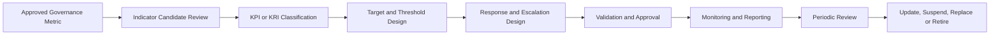

# KPI & KRI Framework

## Executive Summary

The Governance Metrics Catalogue establishes the authoritative definitions, formulas, sources, ownership, quality requirements, and reporting characteristics of approved AI governance measures.

The KPI & KRI Framework determines which of those approved measures are sufficiently important to operate as Key Performance Indicators or Key Risk Indicators within the Continuous Monitoring capability.

KPIs provide decision-useful information about whether governance activities, controls, obligations, and operating objectives are being achieved as intended.

KRIs provide early warning that AI-related exposure may be increasing, approved conditions may be deteriorating, or governance intervention may be required.

The framework establishes how KPIs and KRIs are selected, classified, targeted, thresholded, interpreted, reviewed, escalated, and maintained for the Megastar Intelligent Processor (MIP).

This artifact does not create new metric definitions, perform risk assessment, determine control effectiveness, investigate incidents, approve changes, make third-party continuation decisions, accept residual risk, or conduct management review. It applies key-indicator governance to approved measures already maintained in the Governance Metrics Catalogue.

---

## Purpose

The purpose of this document is to establish a standardized approach for designing, approving, and maintaining AI governance KPIs and KRIs.

The KPI & KRI Framework enables Megastar Mortgage to:

- determine which approved governance metrics require key-indicator status;
- distinguish performance indicators from risk indicators;
- link indicators to governance objectives, risks, controls, providers, obligations, and decisions;
- define targets, tolerances, warning thresholds, breach thresholds, and critical thresholds;
- establish indicator direction and interpretation;
- define threshold-response and escalation requirements;
- assign clear ownership;
- identify indicator dependencies and context measures;
- establish aggregation and segmentation requirements;
- prevent activity measures from being misrepresented as effectiveness measures;
- review indicator quality and decision usefulness;
- support Continuous Control Monitoring and Governance Dashboard design;
- enrich applicable living governance records; and
- maintain indicators as operating conditions and governance priorities change.

Completion of this artifact establishes the decision boundaries required to interpret approved governance metrics consistently.

---

## KPI & KRI Lifecycle

Every KPI and KRI follows a controlled lifecycle.

Only approved metrics from the Governance Metrics Catalogue may become formal KPIs or KRIs.

---

## Framework Principles

Megastar Mortgage manages KPIs and KRIs according to the following principles:

- Every KPI or KRI shall originate from an approved Governance Metrics Catalogue entry.
- Every indicator shall support a defined governance objective, risk, control, obligation, provider condition, or decision.
- KPIs shall measure progress or performance against an approved objective.
- KRIs shall indicate increasing exposure, deterioration, or proximity to an approved risk boundary.
- A measure shall not be designated as key merely because it is easy to calculate or frequently reported.
- Targets and thresholds shall be evidence-based where possible and proportionate to impact, volatility, and decision needs.
- Thresholds shall distinguish normal variation from conditions requiring review, action, or escalation.
- Indicator direction shall be explicit.
- Indicator results shall be interpreted together with relevant context measures.
- Data quality shall be visible alongside indicator status.
- A favourable KPI result shall not override an adverse KRI.
- A favourable aggregate result shall not conceal material deterioration in a critical segment.
- A threshold breach shall not automatically constitute an incident, control failure, or formal risk-rating change.
- Required responses and escalation routes shall be defined before formal use.
- Indicator changes shall preserve version history and comparability.
- KPIs and KRIs shall remain traceable to authoritative source records.
- Key indicators shall be reviewed periodically for continued relevance and decision usefulness.

---

## KPI and KRI Distinction

KPIs and KRIs serve different governance purposes.

| Indicator Type | Primary Question |
|---|---|
| KPI | Are approved governance objectives, activities, controls, and obligations being achieved as intended? |
| KRI | Is exposure increasing, or are conditions moving toward an unacceptable level? |

### KPI Example

> Percentage of High-priority AI risks with an approved response strategy.

This measures completion against a governance expectation.

### KRI Example

> Percentage of High-priority AI risks with overdue treatment actions.

This provides early warning that exposure may remain unmanaged.

The two indicators may use related data but support different decisions.

---

## Indicator Classification

Approved governance metrics may receive one of the following classifications.

| Indicator Classification | Meaning |
|---|---|
| KPI | Measures performance against an approved governance objective, target, service standard, control expectation, or obligation. |
| KRI | Measures exposure, deterioration, volatility, concentration, or proximity to an approved risk boundary. |
| Dual-Purpose Indicator | Serves both performance and risk purposes, with distinct interpretation and thresholds documented. |
| Supporting Context Measure | Provides necessary context but is not sufficiently important to operate as a key indicator. |
| Not Designated | Remains an approved base metric without key-indicator status. |

Dual-purpose indicators shall define separate KPI and KRI interpretations where necessary.

---

## Indicator Selection Criteria

A metric may be designated as a KPI or KRI when it meets the following criteria:

- it supports a material governance objective or decision;
- it is relevant to a significant AI system, risk, control, provider, obligation, or portfolio;
- the result can influence action;
- the source and calculation are sufficiently reliable;
- the measure can be interpreted consistently;
- ownership is clear;
- the monitoring frequency is proportionate;
- meaningful targets or thresholds can be established;
- the measure is not duplicative;
- segmentation can reveal hidden deterioration where required;
- the result can be produced in time to support intervention; and
- the measure remains useful when operating conditions change.

A metric should not become a KPI or KRI where:

- the purpose is unclear;
- the result does not influence a governance decision;
- data quality is materially unreliable;
- the measure duplicates another approved indicator;
- the result is too delayed to support action;
- the population is not defined;
- interpretation depends on unsupported assumptions; or
- the indicator encourages undesirable behaviour.

---

## KPI Design

A KPI measures whether approved governance performance is being achieved.

KPIs may address:

- completion;
- timeliness;
- coverage;
- conformance;
- implementation;
- remediation;
- review discipline;
- service performance;
- operating consistency;
- responsiveness; and
- governance process effectiveness.

Examples include:

- percentage of AI systems with current inventory records;
- percentage of required impact assessments completed on time;
- percentage of High-priority risks with approved response strategies;
- percentage of approved controls implemented by target date;
- percentage of key controls monitored according to plan;
- percentage of scheduled assurance activities completed;
- percentage of corrective actions completed by target date;
- percentage of required provider reviews completed on time;
- percentage of material changes assessed before implementation;
- percentage of required human reviews completed;
- percentage of monitoring measures supported by reliable data; and
- percentage of governance escalations resolved within the approved timeframe.

A KPI shall not be presented as proof of effectiveness where it measures only activity or completion.

---

## KRI Design

A KRI provides early warning of increasing exposure or deteriorating governance conditions.

KRIs may address:

- rising error rates;
- control-health deterioration;
- unresolved exposure;
- overdue obligations;
- repeated exceptions;
- incident recurrence;
- provider deterioration;
- concentration;
- change volatility;
- data-quality degradation;
- human-oversight failure;
- assurance expiry;
- unresolved corrective actions;
- monitoring blind spots; and
- proximity to unacceptable use.

Examples include:

- percentage of High or Critical risks with overdue treatment actions;
- number of ineffective controls linked to High-priority risks;
- increase in model error rate over the approved baseline;
- increase in unreviewed AI outputs;
- increase in override error rate;
- number of repeated threshold breaches;
- number of providers with expired assurance reports;
- percentage of Critical providers with unresolved contractual gaps;
- increase in emergency or unapproved changes;
- number of overdue High-priority corrective actions;
- number of material provider incidents in the review period;
- concentration of Critical AI systems on one provider;
- percentage of critical monitoring measures with unreliable data;
- number of material data-quality failures;
- number of unauthorized uses outside approved scope; and
- reduction in exit readiness for Critical provider relationships.

A KRI indicates potential exposure. It does not independently establish a new enterprise risk or formal residual-risk rating.

---

## Indicator Components

Each KPI or KRI shall contain the following information.

| Indicator Component | Purpose |
|---|---|
| Indicator ID | Provides a unique identifier. |
| Metric ID | Links the indicator to the approved Governance Metrics Catalogue entry. |
| Indicator Name | Provides the standardized name. |
| Indicator Type | Identifies KPI, KRI, or Dual-Purpose Indicator. |
| Governance Purpose | Explains why the indicator is key. |
| Related Governance Objective | Links the KPI to an approved performance objective. |
| Related Risk | Links the KRI to one or more Enterprise AI Risk Register records. |
| Related Control | Links the indicator to relevant controls where applicable. |
| Related Provider | Links provider-specific indicators to the Enterprise Third-Party AI Register. |
| Indicator Direction | Defines whether higher, lower, stable, or range-based performance is preferred. |
| Target | Defines the desired performance level. |
| Tolerance | Defines acceptable variation around the target. |
| Warning Threshold | Defines emerging deterioration requiring review. |
| Breach Threshold | Defines a condition requiring action or escalation. |
| Critical Threshold | Defines severe deterioration requiring immediate intervention. |
| Calculation Frequency | Defines how often the indicator is calculated. |
| Review Frequency | Defines how often the result is formally reviewed. |
| Indicator Owner | Owns definition and interpretation. |
| Response Owner | Owns action following threshold status. |
| Escalation Authority | Receives material escalation. |
| Required Response | Defines action for each threshold state. |
| Data-Quality Requirement | Defines the minimum quality needed for use. |
| Context Measures | Identifies supporting measures required for interpretation. |
| Segmentation | Defines required breakdowns. |
| Approval Status | Records indicator-governance status. |

---

## Indicator Direction

Indicator direction shall be defined explicitly.

| Direction | Meaning |
|---|---|
| Higher Is Better | Increasing values generally indicate improved performance. |
| Lower Is Better | Decreasing values generally indicate improved performance or reduced exposure. |
| Maintain Within Range | Values should remain within an approved operating range. |
| Stable Is Better | Significant movement in either direction may require review. |
| Context Dependent | Interpretation depends on related metrics, segments, or operating conditions. |

Examples:

- Percentage of required controls implemented: Higher Is Better.
- Number of overdue Critical corrective actions: Lower Is Better.
- Human override rate: Context Dependent.
- Model error rate: Lower Is Better.
- Transaction volume: Context Dependent.
- Service latency: Maintain Within Range or Lower Is Better.

---

## Targets, Tolerances, and Thresholds

Each indicator shall use decision boundaries appropriate to its purpose.

| Boundary | Purpose |
|---|---|
| Target | Defines the desired or expected level. |
| Tolerance | Defines acceptable variation around the target. |
| Warning Threshold | Indicates emerging deterioration requiring review or preventive action. |
| Breach Threshold | Indicates an approved limit has been exceeded and corrective action or formal escalation is required. |
| Critical Threshold | Indicates severe or potentially unacceptable deterioration requiring urgent intervention. |

Not every indicator requires all five boundaries.

The design shall identify which boundaries apply and why.

---

## Threshold Design Principles

Thresholds shall be designed using one or more of the following sources:

- approved risk appetite or tolerance;
- control objective;
- contractual obligation;
- policy requirement;
- regulatory requirement;
- service-level agreement;
- historical performance;
- validated baseline;
- model-performance expectation;
- assurance conclusion;
- provider obligation;
- operational capacity;
- impact classification;
- incident history;
- peer or benchmark information where appropriate;
- expert judgment; and
- governance decision.

Thresholds shall not be selected solely to produce favourable status.

---

## Threshold Design Methods

### Fixed Threshold

Uses an approved numeric or categorical boundary.

Example:

> Critical threshold: More than 5% of required human-review cases remain unreviewed beyond the approved timeframe.

### Range-Based Threshold

Uses an approved operating band.

Example:

> Warning status applies where extraction accuracy falls below 96% but remains at or above 94%.

### Baseline Deviation

Uses variation from an approved baseline.

Example:

> Warning threshold: Error rate increases by more than 15% compared with the trailing three-month baseline.

### Trend-Based Threshold

Uses sustained direction across multiple periods.

Example:

> Breach threshold: Three consecutive monthly increases in unresolved control exceptions.

### Event-Based Threshold

Uses a defined event.

Example:

> Critical threshold: Provider introduces a material model change without required notification.

### Deadline-Based Threshold

Uses aging or expiry.

Example:

> Breach threshold: High-priority corrective action exceeds its approved target date by more than 30 days.

### Composite Threshold

Uses multiple approved indicators.

Composite thresholds shall document:

- component indicators;
- weighting;
- scoring logic;
- interaction rules;
- missing-data treatment;
- validation;
- limitations; and
- escalation logic.

---

## Indicator Status

A standard status model supports consistent interpretation.

| Status | Meaning |
|---|---|
| Green | Indicator is within approved target or tolerance. |
| Amber | Warning threshold has been reached or emerging deterioration requires attention. |
| Red | Breach threshold has been exceeded and formal action is required. |
| Critical | Critical threshold has been exceeded and immediate escalation or intervention is required. |
| Grey | Data is unavailable, unreliable, incomplete, or not yet assessed. |
| Not Applicable | The indicator does not apply to the current scope, with documented rationale. |

Grey shall not be treated as Green.

Unavailable or unreliable data may itself create a monitoring finding or escalation where the indicator supports a critical governance decision.

---

## Threshold Response Model

Each status shall have a pre-defined response.

| Status | Minimum Expected Response |
|---|---|
| Green | Continue monitoring according to the approved cadence. |
| Amber | Review the driver, confirm data quality, assign preventive action where required, and increase attention or frequency where appropriate. |
| Red | Assign corrective action, notify the accountable owner, assess cross-capability handoff, and escalate according to approved decision rights. |
| Critical | Initiate immediate escalation, consider restriction or suspension, assess potential incident or material change, and notify the appropriate governance authority. |
| Grey | Resolve data-quality or source limitations, qualify reporting, and escalate where the blind spot affects a material decision. |

The exact response shall be indicator-specific.

---

## Escalation Design

Each indicator shall define:

- escalation trigger;
- response timeframe;
- response owner;
- escalation authority;
- evidence required;
- interim restrictions;
- required specialist handoff;
- communication audience;
- decision deadline;
- closure or de-escalation criteria; and
- record-update requirements.

Possible escalation authorities include:

- AI System Owner;
- Risk Owner;
- Control Owner;
- Third-Party Relationship Owner;
- AI Governance Lead;
- Privacy;
- Security;
- Legal & Compliance;
- Technology;
- Business Leadership;
- Governance Committee; and
- Executive Management.

---

## Cross-Capability Response Mapping

Thresholds may trigger the following specialist governance activities:

| Indicator Condition | Capability Owner |
|---|---|
| New or materially changed risk exposure | AI Risk Management |
| Control-health deterioration or control gap | AI Controls |
| Independent evaluation or retesting required | AI Assurance |
| Provider deterioration or contractual-condition breach | Third-Party AI Governance |
| Potential or confirmed AI incident | AI Incident Management |
| Material system, model, data, prompt, provider, control, or policy change | AI Change Management |
| System reassessment or approved-use review | AI Inventory & Assessment |
| Executive intervention or residual-risk decision | Governance Oversight & Continual Improvement |
| Framework or regulatory mapping change | Framework Alignment |

The KPI & KRI Framework defines the handoff trigger but does not perform the receiving capability’s work.

---

## Indicator Segmentation

Indicators shall be segmented where aggregation could conceal material conditions.

Potential dimensions include:

- AI system;
- business unit;
- business process;
- impact classification;
- lifecycle stage;
- risk category;
- risk priority;
- control domain;
- control owner;
- provider;
- provider criticality;
- geography;
- jurisdiction;
- data category;
- user group;
- human-review team;
- model version;
- incident severity;
- change type;
- corrective-action priority; and
- reporting period.

Example:

A portfolio-level model accuracy KPI may remain Green while one high-impact AI system falls below its minimum approved performance level.

The system-level breach shall not be hidden by portfolio aggregation.

---

## Indicator Dependencies and Context Measures

KPIs and KRIs shall identify related context measures needed for correct interpretation.

Examples:

| Primary Indicator | Required Context |
|---|---|
| Human override rate | Transaction volume, system changes, error rate, reviewer accuracy, and approved-use changes. |
| Percentage of controls tested | Number of controls in scope, excluded controls, testing limitations, and control effectiveness outcomes. |
| Incident volume | AI-system usage volume, severity, recurrence, reporting maturity, and change volume. |
| Provider service availability | Business criticality, outage duration, fallback capability, and service-level commitment. |
| Corrective-action completion rate | Priority, aging, verification status, and repeated findings. |
| Model accuracy | Dataset composition, confidence threshold, document type, model version, and human-review outcomes. |

No indicator should be interpreted in isolation where contextual factors materially affect meaning.

---

## Leading and Lagging Indicators

Indicators may also be classified by timing.

| Indicator Timing | Meaning |
|---|---|
| Leading Indicator | Provides early warning before a material outcome occurs. |
| Lagging Indicator | Measures an outcome or event after it has occurred. |
| Hybrid Indicator | Provides both early-warning and outcome information depending on use. |

Examples:

- Increase in overdue access reviews: Leading KRI.
- Confirmed unauthorized-access incident: Lagging indicator.
- Human-override error rate: Hybrid indicator.
- Provider assurance-report expiry: Leading KRI.
- Repeated provider incident count: Lagging KRI.

A balanced indicator set should not rely only on lagging outcomes.

---

## Portfolio and Object-Level Indicators

Indicators may operate at different levels.

| Indicator Level | Purpose |
|---|---|
| Object Level | Monitors one AI system, risk, control, provider, action, or obligation. |
| Domain Level | Monitors a control domain, risk category, provider class, or governance process. |
| Business-Unit Level | Monitors governance performance within a business function. |
| Portfolio Level | Provides enterprise-wide visibility across governed AI systems. |
| Executive Level | Provides a limited set of material indicators requiring senior oversight. |

Portfolio and executive indicators shall remain traceable to object-level data.

---

## Indicator Quality

An indicator shall not be relied upon beyond the quality of its underlying metric.

Indicator quality considers:

- source completeness;
- formula stability;
- population coverage;
- timeliness;
- lineage;
- reconciliation;
- manual adjustment;
- data latency;
- definition consistency;
- segmentation quality;
- threshold validity; and
- known blind spots.

Indicator quality may be recorded as:

| Quality Status | Meaning |
|---|---|
| Reliable | Supports normal governance use. |
| Reliable with Limitation | Supports use with a documented qualification. |
| Provisional | Requires additional validation. |
| Unreliable | Should not support material governance decisions. |
| Unavailable | Cannot currently be produced. |

A Critical indicator with Unreliable or Unavailable data shall be escalated as a monitoring blind spot.

---

## Indicator Validation

Before approval, every KPI and KRI shall be validated to confirm that:

- the underlying metric is approved;
- the indicator has a material governance purpose;
- the KPI or KRI classification is appropriate;
- the direction is defined;
- the target is supported;
- tolerances and thresholds are proportionate;
- responses are practical;
- escalation routes are clear;
- the source can support the required frequency;
- data-quality requirements are met;
- context measures are identified;
- segmentation is sufficient;
- the indicator is not duplicative;
- the indicator does not encourage undesirable behaviour;
- historical or scenario testing supports the boundaries where possible; and
- the indicator can support a timely decision.

---

## Backtesting and Calibration

Where sufficient historical information exists, thresholds should be tested against prior periods or realistic scenarios.

Calibration may consider:

- frequency of historical breaches;
- whether prior material events would have been detected;
- false-positive rate;
- false-negative rate;
- alert fatigue;
- decision usefulness;
- required response capacity;
- threshold stability;
- seasonality;
- changes in system scale;
- changes in user behaviour; and
- changes in operating context.

Thresholds that produce excessive noise or fail to detect material deterioration shall be recalibrated.

---

## Indicator Approval Status

Indicators may progress through the following statuses:

| Indicator Status | Meaning |
|---|---|
| Draft | Indicator design is in development. |
| Under Validation | Target, thresholds, quality, and response logic are being tested. |
| Approved | Indicator is authorized for monitoring and governance reporting. |
| Approved with Limitation | Indicator may be used subject to documented qualifications. |
| Suspended | Use is paused because of data, threshold, ownership, or interpretation concerns. |
| Retired | Indicator is no longer used. |
| Replaced | Indicator has been superseded by a revised or alternative indicator. |

Only Approved or Approved with Limitation indicators should appear as formal KPIs or KRIs in governance dashboards.

---

## Indicator Review

Indicators shall be reviewed when:

- governance objectives change;
- risk conditions change;
- control design changes;
- assurance findings indicate threshold weakness;
- a material incident occurs;
- a material change occurs;
- provider conditions change;
- data quality deteriorates;
- source systems change;
- a threshold produces excessive false positives;
- a threshold fails to identify material deterioration;
- operating scale changes;
- regulatory requirements change;
- risk appetite or tolerance changes;
- the indicator becomes duplicative;
- the measure no longer supports action; or
- the approved review date occurs.

---

## Living Governance Record Enrichment

KPIs and KRIs may enrich existing living governance records.

### Enterprise AI Risk Register

KRI-related updates may include:

- KRI ID;
- KRI Status;
- Warning Threshold Breach;
- Breach Threshold;
- Critical Threshold;
- Risk Trend;
- Last Monitoring Date;
- Next Monitoring Date;
- Monitoring Escalation;
- Monitoring Notes; and
- Monitoring Reference.

Formal risk analysis, prioritization, residual-risk determination, and acceptance remain outside this artifact.

### Enterprise AI Control Register

KPI or KRI-related updates may include:

- Indicator ID;
- KPI or KRI Status;
- Control Health;
- Threshold Breach;
- Monitoring Status;
- Last Review Date;
- Next Review Date;
- Improvement Action;
- Monitoring Escalation; and
- Monitoring Reference.

Formal control-effectiveness conclusions remain subject to AI Assurance where required.

### Enterprise Third-Party AI Register

Provider indicator updates may include:

- Provider KPI Status;
- Provider KRI Status;
- Threshold Breach;
- Material Trend;
- Monitoring Escalation;
- Last Monitoring Review Date;
- Monitoring Reference; and
- condition-status updates.

### Enterprise AI System Inventory

Indicators may trigger updates to:

- current use;
- lifecycle status;
- reassessment status;
- suspension;
- restriction;
- retirement;
- provider dependency; and
- operating context.

---

## Relationship to Continuous Control Monitoring

Continuous Control Monitoring applies approved indicators to control-health conditions.

The KPI & KRI Framework defines:

- indicator classification;
- target;
- tolerance;
- warning threshold;
- breach threshold;
- critical threshold;
- required response; and
- escalation.

Continuous Control Monitoring evaluates how these indicators are used to observe control status and deterioration over time.

---

## Relationship to the Governance Dashboard

The Governance Dashboard presents approved KPI and KRI results.

Dashboard presentation shall include:

- Indicator ID;
- indicator name;
- indicator type;
- current value;
- reporting period;
- target;
- tolerance;
- threshold status;
- trend;
- quality status;
- accountable owner;
- required response;
- escalation status; and
- source reference.

The dashboard shall not redefine targets or thresholds.

---

## Why This Document Matters

Organizations often collect metrics without defining which ones are truly important, what acceptable performance looks like, when deterioration becomes material, or who must act.

Without a KPI and KRI framework, the same result may be interpreted differently across teams. Green status may reflect arbitrary targets. Thresholds may be adjusted after a breach. Indicators may generate noise without action. Performance measures may be mistaken for risk measures. Portfolio averages may hide critical local failures.

The KPI & KRI Framework gives Megastar Mortgage a disciplined way to distinguish key performance from key risk, establish clear decision boundaries, and connect every material indicator to ownership, action, escalation, and authoritative governance records.

---

## Related Artifacts

This document supports:

- KPI & KRI Framework Template
- Continuous Monitoring Strategy
- Governance Metrics Catalogue
- Continuous Control Monitoring
- Governance Dashboard
- Monitoring Findings & Escalation
- Continuous Monitoring Summary
- Enterprise AI Risk Register
- Enterprise AI Control Register
- Enterprise Third-Party AI Register
- Enterprise AI System Inventory

---

## Document Control

| Field | Value |
|---|---|
| Document | KPI & KRI Framework |
| Capability | Continuous Monitoring |
| Repository | Enterprise AI Governance Playbook |
| Reference Organization | Megastar Mortgage |
| Reference AI System | Megastar Intelligent Processor (MIP) |
| Document Owner | AI Governance Lead |
| Version | 1.0 |
| Review Cycle | Annual |
| Status | Published Reference |

---

## Revision History

| Version | Date | Description |
|---|---|---|
| 1.0 | July 2026 | Initial release of the KPI & KRI Framework artifact. |