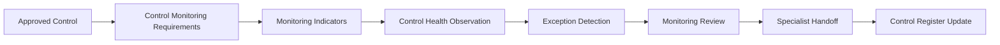

# Continuous Control Monitoring Framework

## Executive Summary

The Continuous Monitoring Strategy establishes how governance visibility is maintained. The Governance Metrics Catalogue defines approved governance measures. The KPI & KRI Framework establishes decision boundaries through approved indicators.

The Continuous Control Monitoring (CCM) Framework applies those approved indicators to the ongoing observation of AI governance controls.

Its purpose is to determine whether implemented controls continue to operate, remain available, produce expected evidence, and show signs of deterioration requiring attention.

Continuous Control Monitoring complements, but does not replace, AI Assurance. It observes control conditions between formal assurance activities and provides early warning when governance controls require review, improvement, reassessment, or escalation.

---

## Purpose

This framework establishes how Megastar Mortgage continuously monitors implemented AI governance controls throughout their operational lifecycle.

The framework enables the organization to:

- observe control execution;
- observe control availability;
- identify deteriorating control health;
- detect repeated control exceptions;
- identify overdue reviews;
- monitor evidence availability;
- monitor corrective-action completion;
- detect monitoring blind spots;
- support AI Assurance planning;
- enrich the Enterprise AI Control Register;
- provide inputs to governance dashboards; and
- trigger specialist governance capabilities when required.

---

## Scope

Continuous Control Monitoring applies only to approved controls recorded within the Enterprise AI Control Register.

The framework covers:

- preventive controls;
- detective controls;
- corrective controls;
- automated controls;
- manual controls;
- hybrid controls;
- technical controls;
- operational controls;
- governance controls;
- privacy controls;
- security controls;
- human oversight controls;
- third-party controls; and
- monitoring controls.

The framework does not redesign controls or determine whether controls are effective from an assurance perspective.

---

## Control Monitoring Lifecycle

---

## Monitoring Principles

Continuous Control Monitoring follows these principles:

- every monitored control shall exist within the Enterprise AI Control Register;
- every monitored control shall have an accountable owner;
- monitoring shall use approved indicators only;
- monitoring shall distinguish execution from effectiveness;
- monitoring shall identify deterioration before failure where possible;
- monitoring shall preserve evidence supporting observations;
- monitoring shall identify monitoring limitations;
- monitoring shall enrich existing governance records rather than create duplicates;
- monitoring shall trigger specialist capabilities where required; and
- monitoring shall remain independent from assurance conclusions.

---

## Control Categories

Monitoring may apply to:

| Control Category | Example |
|---|---|
| Preventive | Access approvals |
| Detective | Exception monitoring |
| Corrective | Corrective-action verification |
| Automated | Automated policy enforcement |
| Manual | Human review |
| Hybrid | Automated routing with manual approval |
| Governance | Risk review |
| Security | MFA enforcement |
| Privacy | Data-retention review |
| Third-Party | Provider assurance review |
| Human Oversight | Mandatory reviewer approval |

---

## Control Health Dimensions

Control health considers:

- availability;
- execution;
- timeliness;
- evidence;
- ownership;
- exception frequency;
- configuration integrity;
- review currency;
- monitoring coverage;
- dependency condition; and
- corrective-action status.

Control health is not equivalent to control effectiveness.

---

## Control Health Status

| Status | Meaning |
|---|---|
| Healthy | Operating normally |
| Attention Required | Early deterioration observed |
| Degraded | Material deterioration requiring action |
| Failed | Unable to operate as intended |
| Unknown | Insufficient monitoring evidence |

---

## Monitoring Activities

Continuous Control Monitoring may include:

- execution monitoring;
- completion monitoring;
- evidence monitoring;
- exception monitoring;
- overdue-review monitoring;
- configuration monitoring;
- ownership monitoring;
- dependency monitoring;
- automation monitoring;
- manual-attestation monitoring; and
- trend monitoring.

---

## Monitoring Sources

Sources may include:

- Enterprise AI Control Register;
- Governance Metrics Catalogue;
- KPI & KRI Framework;
- workflow logs;
- audit logs;
- ticketing systems;
- configuration repositories;
- provider reports;
- human-review records;
- exception logs;
- corrective-action records;
- assurance observations; and
- approved manual attestations.

---

## Monitoring Frequency

Monitoring frequency depends upon:

- control criticality;
- automation level;
- operating volatility;
- risk priority;
- provider dependency;
- regulatory obligations;
- business impact; and
- historical control deterioration.

Possible frequencies:

- Real Time
- Daily
- Weekly
- Monthly
- Quarterly
- Event Driven

---

## Exception Categories

Exceptions may include:

- missed execution;
- overdue execution;
- unavailable evidence;
- repeated exception;
- ownership gap;
- configuration deviation;
- monitoring gap;
- dependency issue;
- provider issue;
- manual review omission;
- policy deviation; and
- monitoring blind spot.

---

## Response Model

| Observation | Required Response |
|---|---|
| Healthy | Continue monitoring |
| Attention Required | Review control condition |
| Degraded | Assign corrective action |
| Failed | Escalate and assess specialist handoff |
| Unknown | Resolve monitoring limitation |

---

## Cross-Capability Handoffs

| Observation | Receiving Capability |
|---|---|
| New control required | AI Controls |
| Control redesign required | AI Controls |
| Independent testing required | AI Assurance |
| Risk exposure increased | AI Risk Management |
| Provider-related issue | Third-Party AI Governance |
| Potential incident | AI Incident Management |
| Material operational change | AI Change Management |
| Executive intervention | Governance Oversight |

---

## Enterprise AI Control Register Updates

Monitoring may update:

- Monitoring Status;
- Control Health;
- Last Monitoring Date;
- Next Monitoring Date;
- Exception Status;
- Improvement Status;
- Monitoring Notes;
- Monitoring Reference.

---

## Limitations

Continuous Control Monitoring does not:

- redesign controls;
- determine assurance effectiveness;
- assign residual risk;
- approve risk acceptance;
- investigate incidents;
- approve changes;
- replace management review;
- replace AI Assurance.

---

## Why This Document Matters

Controls that are never observed gradually become assumptions.

A control may exist in documentation while no longer operating in practice. Evidence may stop being produced. Ownership may change. Automation may silently fail. Exceptions may become normal.

Continuous Control Monitoring ensures governance controls remain visible between formal assurance reviews and enables early intervention before deterioration becomes material.

---

## Related Artifacts

- Continuous Monitoring Strategy
- Governance Metrics Catalogue
- KPI & KRI Framework
- Governance Dashboard
- Monitoring Findings & Escalation
- Continuous Monitoring Summary
- Enterprise AI Control Register

---

## Document Control

| Field | Value |
|---|---|
| Document | Continuous Control Monitoring Framework |
| Capability | Continuous Monitoring |
| Version | 1.0 |
| Owner | AI Governance Lead |
| Status | Published Reference |

---

## Revision History

| Version | Description |
|---|---|
| 1.0 | Initial release |