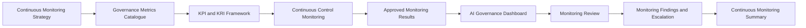

# AI Governance Dashboard

## Executive Summary

The Continuous Monitoring Strategy establishes how Megastar Mortgage maintains ongoing visibility across the Megastar Intelligent Processor (MIP), its risks, controls, third-party dependencies, corrective actions, and governance obligations.

The Governance Metrics Catalogue defines approved measures. The KPI & KRI Framework establishes targets, tolerances, thresholds, status logic, and escalation requirements. Continuous Control Monitoring produces current control-health observations.

The AI Governance Dashboard consolidates these approved monitoring outputs into a structured presentation layer for operational, governance, and executive stakeholders.

The dashboard communicates current governance status, trends, threshold conditions, material exceptions, corrective-action progress, provider concerns, and monitoring limitations while preserving traceability to authoritative source records.

The dashboard does not define metrics, calculate risk ratings, determine control effectiveness, create findings, investigate incidents, approve changes, accept residual risk, or conduct management review. It presents approved information so accountable stakeholders can identify where attention or action is required.

---

## Purpose

The purpose of this document is to establish a standardized approach for designing, maintaining, and governing AI governance dashboards.

The AI Governance Dashboard enables Megastar Mortgage to:

- consolidate approved governance metrics, KPIs, KRIs, and control-health information;
- present current status and trends across governed AI systems;
- distinguish normal conditions from warnings, breaches, critical conditions, and unavailable data;
- provide role-appropriate views for operational, governance, and executive audiences;
- highlight material risks, control deterioration, provider issues, corrective actions, incidents, changes, and monitoring gaps;
- preserve traceability from dashboard results to approved metric definitions and authoritative records;
- communicate data-quality limitations visibly;
- support timely review and escalation;
- prevent dashboard logic from redefining approved metrics or thresholds;
- maintain consistent reporting across periods; and
- provide structured inputs to Monitoring Findings & Escalation and the Continuous Monitoring Summary.

Completion of this artifact establishes the communication layer for the Continuous Monitoring capability.

---

## Dashboard Process

The dashboard is produced only from approved monitoring information.



The dashboard displays approved results. It does not change the meaning, formula, target, threshold, owner, or source of any measure.

---

## Dashboard Principles

Megastar Mortgage manages AI governance dashboards according to the following principles:

- Every dashboard measure shall originate from an approved Governance Metrics Catalogue entry.
- Every KPI or KRI displayed shall have an approved KPI & KRI Framework record.
- Every control-health result shall be traceable to the relevant Continuous Control Monitoring record.
- Dashboard values shall preserve the approved metric definition and reporting period.
- Dashboard status shall follow approved target, tolerance, threshold, and quality logic.
- Grey, unavailable, incomplete, or unreliable information shall not be presented as Green.
- Dashboard aggregation shall not conceal material object-level deterioration.
- Critical systems, risks, controls, providers, incidents, or actions shall remain visible even where portfolio averages appear satisfactory.
- Dashboard audiences shall receive only information relevant to their accountability and decision rights.
- Sensitive, confidential, personal, security, contractual, or provider information shall be protected through appropriate access controls.
- Dashboard presentation shall distinguish performance from risk.
- Dashboard presentation shall distinguish monitoring observations from formal assurance conclusions.
- Dashboard presentation shall distinguish current status from trend.
- Dashboard presentation shall distinguish open action from verified closure.
- Dashboard design shall not create a parallel system of record.
- Every material dashboard result shall remain traceable to authoritative source information.
- Dashboard changes shall be controlled and documented.
- The dashboard shall support action, not merely presentation.

---

## Dashboard Boundary

The AI Governance Dashboard is a presentation and communication artifact.

### The dashboard owns

- approved dashboard structure;
- reporting views;
- audience-specific presentation;
- status visualization;
- trend presentation;
- threshold presentation;
- material issue visibility;
- action and escalation visibility;
- source traceability;
- data-quality visibility;
- reporting cadence;
- dashboard change control; and
- dashboard review.

### The dashboard does not own

- metric definitions;
- KPI or KRI designation;
- formulas;
- targets;
- tolerances;
- thresholds;
- risk assessment;
- risk prioritization;
- control design;
- control-effectiveness conclusions;
- assurance testing;
- monitoring finding classification;
- incident investigation;
- change approval;
- provider continuation decisions;
- residual-risk acceptance;
- management review; or
- strategic governance decisions.

Those activities remain within their established governance capabilities.

---

## Dashboard Audiences

Dashboard views shall be tailored to stakeholder responsibilities.

| Dashboard Audience | Primary Information Need |
|---|---|
| Operational Teams | Current exceptions, control execution, service conditions, backlogs, and required actions. |
| AI System Owners | System-specific performance, risks, controls, incidents, changes, providers, and approved-use conditions. |
| Risk Owners | KRI status, risk trends, overdue treatment actions, control deterioration, and escalation. |
| Control Owners | Control health, exceptions, evidence gaps, review status, and improvement actions. |
| Third-Party Relationship Owners | Provider performance, obligations, assurance currency, incidents, changes, conditions, and renewal concerns. |
| AI Governance | Cross-domain status, threshold breaches, systemic themes, handoffs, monitoring gaps, and unresolved escalations. |
| Privacy and Security | Relevant data, privacy, access, security, incident, and control conditions. |
| Legal & Compliance | Regulatory, contractual, policy, exception, and obligation status. |
| Assurance Function | Control-health trends, evidence limitations, repeated findings, and areas requiring renewed testing. |
| Governance Committee | Material portfolio risks, critical control issues, provider concentration, incidents, changes, and unresolved actions. |
| Executive Management | Strategic exposure, critical breaches, systemic deterioration, major dependencies, and decisions requiring intervention. |

Audience-specific views shall preserve a common source of truth.

---

## Dashboard Levels

The dashboard may contain several levels of reporting.

### 1. Object-Level View

Provides detailed visibility for a specific:

- AI system;
- risk;
- control;
- provider;
- corrective action;
- assurance finding;
- incident;
- change; or
- governance obligation.

### 2. Domain-Level View

Consolidates information by:

- risk category;
- control domain;
- provider type;
- governance process;
- business function;
- data domain;
- human-oversight activity;
- privacy domain;
- security domain; or
- model-performance domain.

### 3. Business-Unit View

Provides governance visibility for a defined business function or operating area.

### 4. Portfolio View

Provides enterprise-wide monitoring across governed AI systems.

### 5. Executive View

Provides a limited set of material indicators, trends, breaches, dependencies, and required decisions.

Every higher-level view shall remain traceable to the underlying object-level records.

---

## Core Dashboard Components

The AI Governance Dashboard may include the following components.

| Dashboard Component | Purpose |
|---|---|
| Portfolio Overview | Summarizes governed AI systems, lifecycle status, and monitoring coverage. |
| Risk Position | Presents KRI status, risk trends, High and Critical risks, and overdue risk actions. |
| Control Position | Presents control health, implementation status, exceptions, review status, and assurance-related concerns. |
| Assurance and Corrective Actions | Presents findings, corrective-action status, verification backlog, and repeated weaknesses. |
| Third-Party AI Position | Presents provider performance, assurance currency, contractual compliance, concentration, and open provider issues. |
| Model and Service Performance | Presents approved performance, reliability, drift, error, and service indicators. |
| Data, Privacy, and Security | Presents approved data-quality, privacy, access, and security monitoring information. |
| Human Oversight | Presents review coverage, override information, backlog, errors, and escalation indicators. |
| Incident Signals | Presents potential and confirmed incident information received from authoritative incident records. |
| Change Signals | Presents material, emergency, unapproved, pending, and verified change information. |
| Corrective-Action Position | Presents open, overdue, blocked, completed-pending-verification, and verified actions. |
| Monitoring Coverage and Quality | Presents monitoring coverage, metric reliability, blind spots, and unavailable information. |
| Threshold and Escalation Position | Presents Amber, Red, Critical, Grey, and unresolved escalated conditions. |
| Governance Decision Queue | Presents matters awaiting accountable owner, committee, or executive action. |

The dashboard shall include only components relevant to its approved audience and purpose.

---

## Portfolio Overview

The portfolio overview may present:

- total governed AI systems;
- systems by lifecycle stage;
- systems by impact classification;
- systems by approved-use status;
- systems under reassessment;
- restricted or suspended systems;
- systems with overdue review;
- systems with incomplete monitoring;
- systems dependent on third-party providers;
- systems with Critical or Red indicators;
- systems with unresolved incidents;
- systems with unapproved changes; and
- systems approaching retirement or exit.

Portfolio counts shall be traceable to the Enterprise AI System Inventory.

---

## Risk Dashboard

The risk dashboard may present:

- total open AI risks;
- risks by category;
- risks by priority;
- risks by current condition;
- KRI status;
- warning, breach, and critical threshold counts;
- worsening risk trends;
- risks without approved response strategy;
- overdue risk actions;
- risks without adequate control coverage;
- risks with ineffective controls;
- risks awaiting assurance;
- risks awaiting residual-risk decision;
- provider-originated risks;
- transition risks;
- emerging changes;
- monitoring escalations; and
- concentration of High or Critical risks.

Dashboard risk information shall not replace the Enterprise AI Risk Register.

---

## Control Dashboard

The control dashboard may present:

- total approved controls;
- controls by domain;
- controls by type;
- implementation status;
- current control status;
- control-health status;
- monitoring status;
- review status;
- overdue reviews;
- evidence gaps;
- open exceptions;
- repeated exceptions;
- improvement-action status;
- assurance status;
- effective, partially effective, ineffective, and not-concluded controls;
- controls requiring retesting;
- controls requiring redesign;
- controls without assigned owner;
- controls without monitoring; and
- controls linked to High or Critical risks.

Monitoring control health shall remain distinguishable from assurance control effectiveness.

---

## Assurance and Corrective-Action Dashboard

The dashboard may present:

- assurance activities completed;
- controls tested;
- assurance coverage;
- findings by classification;
- open findings;
- repeated findings;
- findings awaiting management response;
- corrective actions by priority;
- corrective actions by status;
- overdue corrective actions;
- blocked corrective actions;
- actions completed pending verification;
- verified actions;
- closure backlog;
- retesting requirements; and
- findings affecting multiple AI systems or control domains.

Management-reported completion shall not be shown as verified closure unless the applicable verification process is complete.

---

## Third-Party AI Dashboard

The provider dashboard may present:

- active third-party AI relationships;
- providers by dependency criticality;
- provider due-diligence status;
- provider suitability outcome;
- expired or expiring due diligence;
- provider assurance status;
- expired or qualified assurance reports;
- contractual compliance status;
- service-performance status;
- provider KPI and KRI status;
- threshold breaches;
- open provider issues;
- open provider corrective actions;
- material provider incidents;
- material provider changes;
- subprocessor changes;
- concentration exposure;
- vendor lock-in;
- renewal dates;
- continuation conditions;
- exit-readiness status; and
- relationships under restriction, suspension, or exit.

The Enterprise Third-Party AI Register remains authoritative for provider relationship status.

---

## Model and Service Performance Dashboard

Where applicable, the dashboard may present approved measures relating to:

- accuracy;
- extraction accuracy;
- precision;
- recall;
- false-positive rate;
- false-negative rate;
- rejection rate;
- override rate;
- correct-override rate;
- drift indicator;
- performance by document type;
- performance by population;
- service availability;
- latency;
- throughput;
- processing failure rate;
- fallback usage;
- queue backlog;
- capacity;
- resilience;
- recovery performance; and
- model-version comparison.

Performance information shall be segmented where aggregate results could conceal material deterioration.

---

## Data, Privacy, and Security Dashboard

The dashboard may present approved indicators relating to:

### Data Quality

- completeness;
- validity;
- accuracy;
- missing-field rate;
- duplicate rate;
- data drift;
- lineage coverage;
- unresolved data-quality issues; and
- data-quality threshold breaches.

### Privacy

- systems processing personal information;
- privacy-review status;
- retention exceptions;
- deletion failures;
- unauthorized secondary-use concerns;
- cross-border processing exceptions;
- privacy incidents;
- unresolved privacy conditions; and
- provider privacy concerns.

### Security and Access

- privileged AI accounts;
- overdue access reviews;
- inactive accounts;
- unauthorized-access attempts;
- access-control exceptions;
- segregation-of-duties conflicts;
- unrotated credentials;
- logging coverage;
- unresolved vulnerabilities;
- security incidents; and
- provider security issues.

Sensitive information shall be restricted to authorized dashboard audiences.

---

## Human-Oversight Dashboard

The dashboard may present:

- required human-review volume;
- human-review completion rate;
- unreviewed output volume;
- override volume;
- override rate;
- correct-override rate;
- reviewer error rate;
- reviewer backlog;
- escalation rate;
- exception volume;
- workload capacity;
- training currency;
- quality-review results;
- repeated review failures; and
- human-oversight coverage gaps.

A high or low override rate shall not be interpreted without relevant context.

---

## Incident and Change Dashboard

The dashboard may present information from authoritative incident and change records.

### Incident Information

- potential incident signals;
- confirmed incidents;
- incidents by severity;
- incidents by AI system;
- incidents by cause category;
- repeated incidents;
- open incidents;
- aging;
- response status;
- unresolved regulatory or provider obligations;
- incident-related corrective actions; and
- incident-related control failures.

### Change Information

- material changes identified;
- changes by type;
- changes awaiting assessment;
- changes awaiting approval;
- emergency changes;
- unapproved changes;
- changes implemented;
- changes awaiting verification;
- provider changes;
- model-version changes;
- data-source changes;
- control changes; and
- changes requiring reassessment.

The dashboard does not classify incidents or approve changes.

---

## Corrective-Action Dashboard

The dashboard may present:

- total open actions;
- actions by source;
- actions by priority;
- actions by owner;
- actions by AI system;
- actions by provider;
- actions by risk or control;
- planned actions;
- actions in progress;
- blocked actions;
- overdue actions;
- actions completed pending verification;
- verified actions;
- closed actions;
- action aging;
- repeated extensions;
- verification backlog; and
- actions requiring escalation.

The dashboard shall distinguish:

```text
Action Completed
from
Action Verified
from
Finding Closed
```

---

## Monitoring Coverage and Quality Dashboard

The dashboard shall make monitoring reliability visible.

It may present:

- governed AI systems with approved monitoring;
- High or Critical risks with KRIs;
- key controls with control-health monitoring;
- critical providers with approved indicators;
- corrective actions with current status;
- measures with reliable data;
- measures with limitations;
- provisional measures;
- unavailable measures;
- source failures;
- missing data;
- monitoring blind spots;
- overdue metric reviews;
- indicators requiring recalibration;
- dashboard data latency; and
- unresolved monitoring gaps.

A dashboard shall not communicate false confidence where monitoring coverage is incomplete.

---

## Status Model

The dashboard shall use the status model approved through the KPI & KRI Framework.

| Status | Meaning |
|---|---|
| Green | Within approved target or tolerance. |
| Amber | Warning condition requiring attention or preventive action. |
| Red | Approved threshold breach requiring formal action. |
| Critical | Severe deterioration requiring immediate escalation or intervention. |
| Grey | Information unavailable, unreliable, incomplete, or not assessed. |
| Not Applicable | Measure does not apply to the current scope, with documented rationale. |

The dashboard shall display the status legend clearly.

---

## Trend Model

Dashboard trends may be presented as:

- Improving;
- Stable;
- Deteriorating;
- Volatile;
- Newly Observed;
- Insufficient History; or
- Not Assessed.

Trend logic shall be defined within the approved metric or KPI/KRI record.

The dashboard shall not infer trend solely from visual appearance.

---

## Time Periods

Dashboard information shall identify:

- reporting date;
- reporting period;
- comparison period;
- baseline period;
- source refresh date;
- last successful data load;
- data latency; and
- next reporting date.

Measures from different periods shall not be compared without appropriate qualification.

---

## Dashboard Filters and Segmentation

Dashboard views may allow filtering by:

- AI system;
- business unit;
- business process;
- lifecycle stage;
- impact classification;
- risk category;
- risk priority;
- control domain;
- control owner;
- control health;
- control effectiveness;
- provider;
- provider criticality;
- geography;
- jurisdiction;
- model version;
- data category;
- incident severity;
- change type;
- action priority;
- status;
- trend; and
- reporting period.

Filters shall not alter the approved metric definition.

---

## Traceability Requirements

Every dashboard item shall preserve sufficient traceability.

The display or supporting detail shall include:

- Metric ID or Indicator ID;
- measure name;
- current value;
- unit;
- reporting period;
- status;
- trend;
- target or threshold where applicable;
- quality status;
- accountable owner;
- source;
- authoritative record reference;
- last updated date;
- required action;
- escalation status; and
- supporting monitoring reference.

Users shall be able to navigate from summarized dashboard information to the authoritative underlying record where permitted.

---

## Dashboard Data Quality

Dashboard values shall be subject to validation before publication.

Validation shall confirm:

- approved measure used;
- correct reporting period;
- correct source;
- calculation completed successfully;
- reconciliation completed where required;
- data-quality status applied;
- threshold logic applied correctly;
- trend logic applied correctly;
- owner and source current;
- limitations disclosed;
- stale data identified;
- unauthorized manual adjustment prevented or approved; and
- sensitive information appropriately protected.

Where a measure is unreliable or unavailable, the dashboard shall present Grey or another approved qualified status.

---

## Dashboard Refresh and Publication

Each dashboard view shall define:

- source refresh frequency;
- calculation frequency;
- publication frequency;
- reporting cut-off;
- validation deadline;
- publication owner;
- review owner;
- escalation deadline;
- correction process; and
- evidence-retention requirement.

Real-time presentation shall be used only where the source, calculation, quality, and response model support real-time governance use.

---

## Dashboard Review

Dashboard review shall occur at the level appropriate to the audience.

### Operational Review

Focuses on:

- current Amber, Red, Critical, and Grey items;
- exceptions;
- corrective actions;
- service conditions;
- control-health issues;
- backlogs; and
- immediate owner actions.

### AI Governance Review

Focuses on:

- cross-domain trends;
- repeated threshold breaches;
- systemic deterioration;
- monitoring findings;
- monitoring gaps;
- provider concerns;
- cross-capability handoffs;
- overdue decisions; and
- living-record updates.

### Governance Committee or Executive Review

Focuses on:

- Critical conditions;
- material risk deterioration;
- systemic control failure;
- significant provider dependency;
- major incidents;
- material unapproved changes;
- restriction or suspension decisions;
- residual-risk decisions;
- strategic intervention; and
- governance-improvement priorities.

The dashboard supports these reviews but does not itself make the decision.

---

## Dashboard Observations

Dashboard results may identify:

- normal conditions;
- warning conditions;
- threshold breaches;
- critical conditions;
- deteriorating trends;
- repeated exceptions;
- data-quality limitations;
- monitoring blind spots;
- overdue corrective actions;
- provider deterioration;
- potential incidents;
- change signals;
- systemic themes;
- unresolved escalations; or
- matters requiring executive attention.

A dashboard observation does not automatically become a formal monitoring finding.

Monitoring Findings & Escalation determines the disposition.

---

## Action and Escalation Visibility

The dashboard shall display material action and escalation information where relevant.

This may include:

- action owner;
- required action;
- target date;
- current status;
- overdue status;
- blocker;
- escalation authority;
- escalation date;
- response deadline;
- specialist handoff;
- interim restriction;
- verification status; and
- closure status.

Dashboard status shall not replace the authoritative action, incident, change, risk, control, or provider record.

---

## Executive Dashboard Design

The executive view should be limited to material governance information.

It may include:

- governed AI portfolio status;
- Critical systems;
- High and Critical risk position;
- Red and Critical KRIs;
- ineffective or failed key controls;
- material provider dependencies;
- major incidents;
- significant unapproved changes;
- overdue High-priority corrective actions;
- material monitoring blind spots;
- portfolio trend;
- matters requiring executive decision;
- restrictions or suspensions;
- residual-risk decisions pending; and
- top governance priorities.

Executive reporting shall not rely solely on composite scores.

Material underlying issues shall remain visible.

---

## Composite Scores and Heatmaps

Composite governance scores or heatmaps may be used only where:

- the component measures are approved;
- the methodology is documented;
- weighting is justified;
- missing-data treatment is defined;
- threshold logic is validated;
- limitations are disclosed;
- object-level Critical conditions remain visible;
- the score does not replace authoritative risk or control ratings; and
- the score supports a defined governance decision.

A favourable composite score shall not override:

- a Critical threshold breach;
- a Critical risk;
- an ineffective key control;
- a major provider concern;
- a significant incident;
- an unapproved material change; or
- an unavailable critical indicator.

---

## Dashboard Access and Confidentiality

Dashboard access shall be governed according to:

- stakeholder role;
- need to know;
- data classification;
- personal-information exposure;
- security sensitivity;
- contractual confidentiality;
- provider restrictions;
- legal privilege;
- investigation sensitivity; and
- regulatory obligations.

Access controls may include:

- role-based access;
- field-level masking;
- audience-specific views;
- restricted drill-down;
- export limitations;
- download restrictions;
- audit logging;
- review of privileged access; and
- periodic access recertification.

---

## Dashboard Evidence and Retention

The dashboard shall retain sufficient evidence to reconstruct:

- reported value;
- source;
- calculation;
- reporting period;
- threshold status;
- trend;
- data-quality status;
- owner;
- publication date;
- review decision;
- action;
- escalation; and
- subsequent correction.

Historical dashboard versions shall be retained according to applicable records requirements.

---

## Dashboard Change Control

Dashboard changes shall be controlled where they affect:

- displayed metrics;
- KPI or KRI status;
- source systems;
- calculation logic;
- filters;
- aggregation;
- threshold presentation;
- audience;
- access;
- refresh frequency;
- status logic;
- trend logic;
- composite scoring; or
- decision use.

The dashboard shall not implement a material metric or threshold change before the owning Governance Metrics Catalogue or KPI & KRI Framework record is updated and approved.

---

## Dashboard Quality Review

The dashboard shall be reviewed to confirm:

- all displayed measures are approved;
- all KPI and KRI boundaries are current;
- source and lineage remain valid;
- data-quality status is visible;
- stale information is identified;
- material object-level issues are not hidden by aggregation;
- action and escalation information is current;
- access remains appropriate;
- drill-down references are functional;
- sensitive information is protected;
- definitions are consistent across views;
- changes are documented; and
- the dashboard supports the intended governance decisions.

---

## Living Governance Record Relationship

The dashboard presents information from existing authoritative records.

### Enterprise AI System Inventory

May supply:

- AI-system profile;
- lifecycle status;
- ownership;
- impact classification;
- approved-use status;
- provider dependency;
- reassessment status; and
- retirement status.

### Enterprise AI Risk Register

May supply:

- risk priority;
- current risk condition;
- KRI status;
- threshold breach;
- risk trend;
- risk response;
- control effectiveness;
- assurance outcome;
- residual risk;
- monitoring escalation; and
- overdue actions.

### Enterprise AI Control Register

May supply:

- control status;
- implementation status;
- control health;
- assurance status;
- control effectiveness;
- exceptions;
- monitoring status;
- threshold breach;
- improvement actions; and
- review dates.

### Enterprise Third-Party AI Register

May supply:

- relationship status;
- provider criticality;
- due-diligence outcome;
- contract status;
- provider KPI and KRI status;
- service-performance status;
- assurance status;
- provider issues;
- continuation status;
- threshold breaches;
- material trends;
- renewal; and
- exit readiness.

The dashboard shall not overwrite these records unless a separate approved process performs the update.

---

## Relationship to Monitoring Findings & Escalation

The dashboard identifies conditions requiring review.

Monitoring Findings & Escalation determines whether a condition becomes:

- a monitoring observation;
- a monitoring finding;
- a corrective action;
- a risk handoff;
- a control handoff;
- an assurance handoff;
- a provider-governance handoff;
- an incident handoff;
- a change handoff;
- an executive escalation; or
- no further action.

The dashboard communicates the condition but does not make the formal disposition.

---

## Why This Document Matters

Governance information can become fragmented across inventories, registers, testing records, provider reviews, logs, reports, and corrective-action trackers.

Without a governed dashboard, decision-makers may receive inconsistent definitions, stale values, unsupported status colours, incomplete trends, or portfolio averages that conceal material object-level failures.

The AI Governance Dashboard gives Megastar Mortgage a controlled and traceable presentation layer for AI governance.

It enables stakeholders to see what is operating as expected, what is deteriorating, what is unknown, who owns the response, and which matters require escalation without replacing the authoritative governance records or specialist decision processes underneath the dashboard.

---

## Related Artifacts

This document supports:

- AI Governance Dashboard Template
- Continuous Monitoring Strategy
- Governance Metrics Catalogue
- KPI & KRI Framework
- Continuous Control Monitoring Framework
- Monitoring Findings & Escalation
- Continuous Monitoring Summary
- Enterprise AI System Inventory
- Enterprise AI Risk Register
- Enterprise AI Control Register
- Enterprise Third-Party AI Register

---

## Document Control

| Field | Value |
|---|---|
| Document | AI Governance Dashboard |
| Capability | Continuous Monitoring |
| Repository | Enterprise AI Governance Playbook |
| Reference Organization | Megastar Mortgage |
| Reference AI System | Megastar Intelligent Processor (MIP) |
| Document Owner | AI Governance Lead |
| Version | 1.0 |
| Review Cycle | Annual |
| Status | Published Reference |

---

## Revision History

| Version | Date | Description |
|---|---|---|
| 1.0 | July 2026 | Initial release of the AI Governance Dashboard artifact. |