# Monitoring Findings & Escalation

## Executive Summary

The Continuous Monitoring Strategy establishes how Megastar Mortgage maintains ongoing governance visibility. The Governance Metrics Catalogue defines approved measures. The KPI & KRI Framework establishes targets, tolerances, thresholds, and response expectations. Continuous Control Monitoring observes control-health conditions, while the AI Governance Dashboard consolidates approved monitoring information for review.

Monitoring Findings & Escalation determines what happens when those monitoring activities identify a condition requiring formal governance attention.

This artifact establishes how Megastar Mortgage validates monitoring observations, evaluates materiality, determines appropriate disposition, creates formal monitoring findings, assigns severity and ownership, establishes corrective actions, initiates specialist-governance handoffs, escalates unresolved or critical matters, and confirms closure.

A monitoring finding is not automatically an AI risk, control-effectiveness conclusion, incident, change, provider-continuation decision, or residual-risk decision. It is a validated monitoring condition requiring accountable action, formal tracking, escalation, or transfer to the governance capability that owns the required response.

---

## Purpose

The purpose of this document is to establish a standardized approach for reviewing, classifying, escalating, tracking, and closing material observations identified through Continuous Monitoring.

Monitoring Findings & Escalation enables Megastar Mortgage to:

- distinguish routine monitoring observations from formal findings;
- validate the accuracy and relevance of observed conditions;
- evaluate materiality using consistent criteria;
- assign an appropriate observation disposition;
- create traceable monitoring findings where required;
- assign monitoring severity without replacing enterprise risk or incident classifications;
- establish accountable ownership and target dates;
- define corrective-action requirements;
- initiate specialist-governance handoffs;
- determine escalation level and timing;
- track finding progress and unresolved dependencies;
- distinguish reported completion from verified closure;
- update applicable living governance records;
- identify repeated or systemic monitoring themes; and
- provide structured inputs to the Continuous Monitoring Summary.

Completion of this activity ensures that material monitoring conditions lead to appropriate governance action rather than remaining unresolved within dashboards, reports, alerts, or operational discussions.

---

## Findings and Escalation Lifecycle

Every material monitoring observation follows a controlled review process.

```mermaid
flowchart LR

A[Monitoring Observation]
--> B[Observation Validation]
--> C[Materiality Assessment]
--> D[Disposition Decision]
--> E[Monitoring Finding, if Required]
--> F[Action and Escalation]
--> G[Specialist Governance Handoff]
--> H[Progress Tracking]
--> I[Verification]
--> J[Finding Closure]
--> K[Continuous Monitoring Summary]
```



An observation may be resolved without becoming a formal finding where it is immaterial, unsupported, duplicated, or sufficiently addressed through routine monitoring.

---

## Findings Principles

Megastar Mortgage manages monitoring findings and escalations according to the following principles:

- Every material monitoring observation shall receive a documented disposition.
- Observations shall be validated before formal finding creation.
- Findings shall be supported by traceable monitoring evidence.
- Finding severity shall reflect monitoring significance and urgency, not replace enterprise risk priority or incident severity.
- A threshold breach shall not automatically become a formal finding without validation and materiality review.
- A material condition may require multiple specialist-governance handoffs.
- Monitoring findings shall identify clear ownership, action, target date, and escalation requirements.
- Monitoring findings shall not duplicate authoritative risk, control, incident, change, provider, or assurance records.
- Corrective-action completion shall remain distinct from verification and finding closure.
- Findings shall remain open until required handoffs are accepted and closure criteria are satisfied.
- Repeated or systemic observations shall be evaluated for broader governance significance.
- Grey, unreliable, incomplete, or unavailable monitoring information may itself become a finding where it creates a material governance blind spot.
- Escalation shall be proportionate to severity, duration, recurrence, scale, and potential consequence.
- Critical findings shall not remain within routine operational channels where immediate governance intervention is required.
- Closure shall be supported by evidence and approved by the appropriate authority.
- Finding history shall remain traceable after closure.

---

## Monitoring Observation

A monitoring observation is a factual condition identified through an approved monitoring activity.

Examples include:

- a KPI reaching its warning threshold;
- a KRI exceeding its breach threshold;
- a control-health result changing from Healthy to Degraded;
- a provider assurance report expiring;
- a corrective action becoming overdue;
- a required human-review rate declining;
- a data-quality source becoming unreliable;
- a model-performance measure deteriorating;
- a material provider change being reported;
- a monitoring source failing;
- a repeated operational exception;
- an approved-use boundary being exceeded; or
- a governance review date passing without completion.

An observation is not automatically a formal finding.

---

## Monitoring Finding

A monitoring finding is a validated and material monitoring condition requiring one or more of the following:

- formal accountable action;
- corrective action;
- escalation;
- specialist-governance handoff;
- restriction or suspension consideration;
- increased monitoring;
- renewed assurance;
- governance decision; or
- formal tracking until verified closure.

### Example Observation

> Human-review completion fell below the approved warning threshold during the current reporting period.

### Example Finding

> Required human-review completion has remained below the approved threshold for three consecutive reporting periods, creating a sustained gap in mandatory human oversight and requiring corrective action, control review, and escalation to the AI System Owner.

The finding describes the material governance condition. It does not independently conclude that an incident occurred, that the control is ineffective, or that enterprise risk priority changed.

---

## Observation Sources

Monitoring observations may originate from:

- Governance Metrics Catalogue measures;
- KPI and KRI results;
- Continuous Control Monitoring;
- AI Governance Dashboard reviews;
- system or workflow alerts;
- model-performance reports;
- data-quality monitoring;
- privacy monitoring;
- security and access monitoring;
- human-oversight monitoring;
- provider monitoring;
- assurance-finding follow-up;
- corrective-action monitoring;
- incident signals;
- change signals;
- review-date or expiry monitoring;
- manual attestation;
- operational review;
- governance committee review;
- executive review; or
- external regulatory, legal, provider, or market developments.

Each observation shall retain its source reference and reporting period.

---

## Observation Validation

Before determining disposition, the observation shall be validated.

Validation considers whether:

- the source is approved;
- the source data is current;
- the source data is sufficiently reliable;
- the metric or indicator definition is current;
- the correct reporting period was used;
- the approved target or threshold was applied;
- the observation is reproducible;
- required segmentation was considered;
- duplicate records were excluded;
- contextual information was reviewed;
- the observation reflects a real condition rather than a calculation or source error;
- the affected governance object is identified;
- the accountable owner is known; and
- sufficient evidence exists to support a disposition decision.

Where the observation cannot be validated, it may be classified as:

- data-quality remediation required;
- clarification required;
- monitoring limitation;
- monitoring blind spot; or
- no further action.

An inability to validate a Critical monitoring condition shall itself be escalated.

---

## Materiality Assessment

Validated observations are assessed for governance materiality.

Materiality factors may include:

- AI-system impact classification;
- affected business process;
- affected customer, employee, or stakeholder population;
- linked risk priority;
- control criticality;
- provider dependency criticality;
- threshold level;
- duration;
- recurrence;
- scale;
- trend direction;
- operational impact;
- data sensitivity;
- privacy implications;
- security implications;
- regulatory implications;
- contractual implications;
- service-continuity implications;
- human-oversight implications;
- assurance implications;
- concentration exposure;
- monitoring blind spots;
- unresolved dependencies;
- action urgency; and
- potential for escalation or harm.

Materiality shall be based on the condition and its governance significance, not solely on the numeric size of the observation.

---

## Observation Dispositions

Each observation shall receive one or more documented dispositions.

| Disposition | Meaning |
|---|---|
| Continue Monitoring | The condition remains within approved expectations and requires no additional action. |
| Watch Item | Emerging deterioration requires closer observation or increased review frequency. |
| Monitoring Finding | A material condition requires formal action, tracking, and closure. |
| Corrective Action Required | A defined remediation activity must be assigned and tracked. |
| Data-Quality Remediation | The monitoring source, lineage, calculation, or reporting process must be corrected. |
| Risk Handoff | The condition requires risk identification, analysis, reassessment, reprioritization, or response review. |
| Control Handoff | The condition requires control repair, redesign, implementation, or ownership review. |
| Assurance Handoff | Independent evaluation, testing, or retesting is required. |
| Third-Party Governance Handoff | Provider suitability, obligation, oversight, continuation, restriction, suspension, or exit requires review. |
| Incident Handoff | The condition may represent an AI incident requiring formal evaluation. |
| Change Handoff | The condition may require formal change assessment, approval, implementation, or verification. |
| Inventory or Assessment Handoff | The AI system, approved use, impact, classification, or operating context requires reassessment. |
| Governance Oversight Escalation | The matter requires committee, executive, residual-risk, policy, or strategic decision. |
| Framework Alignment Handoff | The matter affects regulatory, framework, policy, or control-mapping requirements. |
| Duplicate or Existing Matter | The condition is already governed through an authoritative record and should be linked rather than recreated. |
| No Further Action | The observation is immaterial, resolved, unsupported, or not relevant to the approved monitoring purpose. |
| Clarification Required | Additional information is required before disposition can be determined. |

A single observation may result in multiple dispositions.

---

## Finding Classification

Formal monitoring findings shall be classified using a consistent finding category.

| Finding Category | Description |
|---|---|
| Threshold Breach | Approved warning, breach, or critical boundary has been reached or exceeded. |
| Control-Health Deterioration | A control shows missed execution, unavailable evidence, degraded operation, failure, or unknown health. |
| Risk-Condition Deterioration | A known risk driver, condition, or trend has worsened materially. |
| Provider Deterioration | Provider performance, assurance, obligation, dependency, or stability has deteriorated. |
| Corrective-Action Delay | An approved action is overdue, blocked, repeatedly extended, or insufficiently evidenced. |
| Data-Quality Failure | Monitoring or operational data is incomplete, inaccurate, delayed, inconsistent, or unreliable. |
| Monitoring Coverage Gap | A material AI system, risk, control, provider, or obligation lacks sufficient monitoring. |
| Monitoring Blind Spot | A material condition cannot be observed reliably. |
| Approved-Use Deviation | Actual use differs from approved purpose, user, data, environment, or operating boundary. |
| Potential Incident Signal | The observed condition may represent an AI incident. |
| Material Change Signal | The observed condition may represent or require a formal material change. |
| Regulatory or Contractual Concern | A legal, regulatory, policy, or contractual obligation may not be satisfied. |
| Repeated or Systemic Pattern | Recurring observations indicate a broader governance weakness. |
| Governance Decision Delay | A required governance decision is overdue or unresolved. |
| Other | Another material monitoring condition requiring formal governance action. |

A primary category shall be selected, with secondary themes recorded where appropriate.

---

## Finding Severity

Finding severity reflects the urgency and governance significance of the monitoring condition.

| Finding Severity | Meaning |
|---|---|
| Low | Limited governance significance. Routine correction and standard tracking are sufficient. |
| Moderate | Material issue requiring assigned action, target date, and tracked resolution. |
| High | Significant deterioration affecting an important AI system, risk, control, provider, obligation, or stakeholder outcome. Prompt escalation and specialist handoff are required. |
| Critical | Severe or potentially unacceptable condition requiring immediate escalation, urgent action, and consideration of restriction, suspension, incident response, or executive intervention. |

Finding severity shall not replace:

- enterprise risk priority;
- residual-risk rating;
- incident severity;
- change criticality;
- assurance finding classification; or
- provider relationship decision.

Those remain within their owning capabilities.

---

## Severity Considerations

Finding severity may consider:

- affected AI-system impact;
- warning, breach, or critical threshold level;
- duration of the condition;
- recurrence;
- scale of affected transactions, users, data, or systems;
- customer or employee impact;
- regulatory exposure;
- privacy or security exposure;
- linked risk priority;
- control significance;
- provider criticality;
- service-continuity impact;
- human-oversight impact;
- data-quality impact;
- assurance limitations;
- corrective-action delay;
- ability to detect or contain the condition;
- effectiveness of compensating measures;
- potential for rapid deterioration; and
- need for immediate decision-making.

---

## Severity Review

Severity shall be reviewed when:

- new information becomes available;
- the condition worsens;
- the condition persists;
- additional systems or stakeholders become affected;
- a specialist capability classifies the issue differently;
- an incident is confirmed;
- a material change is identified;
- a control is formally assessed;
- risk priority changes;
- a provider condition changes;
- compensating measures are introduced; or
- the condition is partially resolved.

Severity may increase or decrease, but every change shall be documented.

---

## Finding Record

Each monitoring finding shall contain:

| Finding Element | Purpose |
|---|---|
| Finding ID | Provides a unique reference. |
| Observation Reference | Links the finding to the originating monitoring observation. |
| Finding Title | Provides a concise description. |
| Finding Description | Describes the validated monitoring condition. |
| Finding Category | Classifies the primary monitoring issue. |
| Finding Severity | Records Low, Moderate, High, or Critical. |
| Affected Governance Object | Identifies the system, risk, control, provider, action, obligation, incident, or change. |
| Source Evidence | Links to supporting monitoring evidence. |
| First Observed Date | Records when the condition was first identified. |
| Finding Date | Records when the formal finding was established. |
| Duration | Records how long the condition has existed. |
| Recurrence | Records whether the condition is repeated. |
| Owner | Identifies the accountable finding owner. |
| Required Action | Defines what must occur. |
| Target Date | Establishes expected resolution timing. |
| Escalation Level | Records the required governance authority. |
| Specialist Handoff | Identifies receiving capabilities. |
| Verification Requirement | Identifies how completion will be verified. |
| Current Status | Records the finding lifecycle state. |
| Closure Criteria | Defines the conditions required for closure. |

---

## Finding Status

Monitoring findings progress through controlled statuses.

| Finding Status | Meaning |
|---|---|
| Draft | Finding is being documented. |
| Under Validation | Evidence and materiality are being confirmed. |
| Open | Finding has been approved and assigned. |
| Action Planned | Remediation or governance response has been defined. |
| In Progress | Required action is underway. |
| Blocked | Progress cannot continue because of a documented dependency or constraint. |
| Escalated | The matter has been referred to a higher governance authority. |
| Handoff in Progress | A specialist capability is reviewing or accepting the matter. |
| Action Completed | The responsible owner reports that required action is complete. |
| Verification Pending | Completion evidence awaits validation or independent verification. |
| Closure Pending | Verification is complete and closure approval is pending. |
| Closed | Closure criteria have been satisfied and approved. |
| Reopened | The condition recurred or closure evidence was insufficient. |
| Cancelled | The finding was withdrawn because it was unsupported, duplicated, or no longer applicable, with rationale. |

---

## Corrective-Action Requirements

A monitoring finding may require one or more corrective actions.

Each corrective action shall identify:

- Action ID.
- Related Finding ID.
- Required action.
- Action owner.
- Priority.
- Target date.
- Dependencies.
- Required resources.
- Interim measure.
- Current status.
- Progress update.
- Evidence requirement.
- Verification owner.
- Escalation trigger.
- Revised date, where approved.
- Closure status.

Corrective actions shall be specific and actionable.

Examples include:

- restore required control execution;
- correct a monitoring-data source;
- complete an overdue review;
- remediate a provider contractual gap;
- reduce a processing backlog;
- increase human-review capacity;
- investigate a performance decline;
- implement compensating monitoring;
- update an approved-use restriction;
- revise a threshold;
- initiate formal reassessment;
- suspend affected activity; or
- complete independent assurance.

---

## Corrective-Action Boundary

Monitoring Findings & Escalation may determine that corrective action is required and track its progress.

It does not independently:

- redesign the control;
- approve a material change;
- perform assurance testing;
- confirm incident closure;
- determine risk acceptance;
- determine provider continuation;
- approve policy exceptions; or
- verify effectiveness where independent evaluation is required.

The owning governance capability determines the specialist response.

---

## Escalation Model

Escalation shall be proportionate to severity, recurrence, duration, scale, and potential consequence.

| Escalation Level | Typical Authority | Typical Matters |
|---|---|---|
| Operational | Metric Owner, Process Owner, Control Owner, System Owner | Low or Moderate routine issues within delegated authority. |
| Functional Governance | AI Governance, Risk, Privacy, Security, Legal & Compliance, Technology, Third-Party Governance | Material cross-functional matters requiring specialist review. |
| Governance Committee | Cross-functional governance committee or equivalent authority | High issues, repeated deterioration, unresolved exceptions, restrictions, or material decisions. |
| Executive | Executive Management or designated senior authority | Critical, systemic, strategic, potentially unacceptable, or delegated-authority matters. |

Escalation level may be increased where the condition is repeated, unresolved, expanding, or affecting multiple AI systems.

---

## Escalation Timing

Indicative escalation expectations may include:

| Severity | Expected Escalation |
|---|---|
| Low | According to the standard operational review cycle. |
| Moderate | Within the defined governance review period or sooner where the condition is time-sensitive. |
| High | Promptly, within the approved High-severity escalation timeframe. |
| Critical | Immediately or as soon as practicable under the approved critical-response process. |

The exact timeframe shall be defined within the finding record and applicable policy.

---

## Escalation Information

Every formal escalation shall include:

- Finding ID.
- Finding title.
- Severity.
- Affected AI system, risk, control, provider, obligation, or stakeholder.
- Source and supporting evidence.
- Threshold or trigger.
- First observed date.
- Duration and recurrence.
- Current condition.
- Actions already taken.
- Interim controls or restrictions.
- Specialist handoffs initiated.
- Decision required.
- Decision deadline.
- Escalation owner.
- Escalation authority.
- Potential consequence of delay.
- Required living-record updates.

---

## Interim Measures

High or Critical findings may require interim measures while the final response is being determined.

Interim measures may include:

- increased human review;
- reduced automation;
- restricted user access;
- narrower approved use;
- reduced data scope;
- increased monitoring frequency;
- provider escalation;
- temporary manual control;
- additional approval;
- transaction hold;
- model rollback;
- service fallback;
- change freeze;
- temporary suspension; or
- emergency incident evaluation.

Interim measures shall be proportionate, time-bound, assigned, and reviewed.

---

## Specialist-Governance Handoffs

Monitoring findings shall be transferred to the capability that owns the required specialist response.

| Finding Condition | Receiving Capability | Typical Required Response |
|---|---|---|
| New AI use, scope expansion, or operating-context change | AI Inventory & Assessment | Intake, inventory update, classification, impact reassessment, or approved-use review. |
| New or materially changed AI risk | AI Risk Management | Risk identification, analysis, prioritization, response, or escalation. |
| Missing, weak, failed, or degraded control | AI Controls | Control repair, redesign, implementation, ownership, or documentation. |
| Independent evaluation required | AI Assurance | Testing, retesting, evidence review, finding verification, or assurance conclusion. |
| Provider performance, assurance, obligation, or dependency concern | Third-Party AI Governance | Due-diligence refresh, provider review, contract action, restriction, suspension, or exit review. |
| Potential or confirmed AI incident | AI Incident Management | Incident triage, classification, containment, investigation, recovery, and closure. |
| Material system, model, data, prompt, provider, control, or policy change | AI Change Management | Change assessment, approval, implementation, and verification. |
| Executive, policy, strategic, residual-risk, or exception decision | Governance Oversight & Continual Improvement | Management review, decision, acceptance, intervention, or improvement prioritization. |
| Regulatory, framework, or mapping impact | Framework Alignment | Requirement mapping, control alignment, or evidence update. |

The finding remains open until the handoff is accepted and the resulting governance action is sufficiently tracked.

---

## Handoff Acceptance

A specialist handoff is considered accepted when:

- the receiving capability confirms ownership;
- an authoritative record or case reference is created or linked;
- an accountable owner is assigned;
- the required activity is defined;
- the expected timeline is recorded; and
- the monitoring finding references the receiving record.

A finding shall not be closed merely because the handoff was sent.

---

## Repeated and Systemic Findings

Repeated observations or findings shall be evaluated for broader significance.

A pattern may indicate:

- ineffective corrective action;
- control-design weakness;
- control circumvention;
- insufficient ownership;
- inadequate capacity;
- weak provider governance;
- poor data quality;
- inadequate human oversight;
- unresolved model-performance deterioration;
- repeated unauthorized changes;
- monitoring-design weakness;
- governance-process failure; or
- broader enterprise exposure.

Repeated or systemic findings may trigger:

- enterprise risk reassessment;
- control redesign;
- thematic assurance;
- broader provider review;
- policy change;
- process transformation;
- management review; or
- continual-improvement action.

---

## Monitoring-Finding Tracking

Open findings shall be reviewed according to severity and required governance cadence.

Tracking shall consider:

- current status;
- elapsed time;
- target date;
- overdue status;
- action progress;
- blocker;
- dependency;
- specialist-handoff status;
- interim measures;
- evidence received;
- verification readiness;
- escalation status;
- severity change;
- recurrence;
- related findings; and
- effect on approved use.

High and Critical findings shall receive enhanced visibility.

---

## Verification

Verification determines whether the required action was completed and whether the monitored condition has been addressed sufficiently for closure consideration.

Verification may be performed through:

- source-data review;
- metric recalculation;
- threshold retesting;
- control-owner evidence review;
- system-log review;
- access review;
- provider-remediation evidence;
- change-verification evidence;
- incident-closure evidence;
- repeated-period monitoring;
- independent assurance;
- management confirmation supported by evidence; or
- another approved validation method.

Verification depth shall be proportionate to finding severity and the nature of the required action.

---

## Verification Boundary

Verification of a monitoring finding confirms whether the finding’s closure criteria are satisfied.

It does not automatically establish:

- enterprise-wide control effectiveness;
- residual-risk acceptability;
- provider suitability;
- incident closure;
- change success;
- policy compliance across the entire population; or
- strategic governance effectiveness.

Where broader confidence is required, AI Assurance or another specialist capability shall perform the necessary evaluation.

---

## Closure Criteria

A monitoring finding may close only when:

- required actions are completed;
- required specialist handoffs are accepted;
- supporting evidence is available;
- verification is completed where required;
- the monitored condition has returned to an approved state or a newly approved state has been established;
- interim restrictions are removed, retained, or formally transferred;
- applicable living governance records are updated;
- unresolved risks, controls, incidents, changes, provider issues, or actions remain governed through authoritative records;
- escalation is resolved;
- recurrence monitoring is established where required;
- closure criteria are documented as satisfied; and
- closure is approved by the appropriate authority.

Reported completion is not the same as verified closure.

---

## Closure Outcomes

| Closure Outcome | Meaning |
|---|---|
| Closed — Resolved | The condition was corrected and closure criteria were satisfied. |
| Closed — Transferred | The monitoring finding is closed because the matter is now governed through an accepted authoritative specialist record. |
| Closed — Risk Accepted Elsewhere | The finding is closed after an authorized residual-risk or governance decision is recorded within the owning capability. |
| Closed — No Longer Applicable | The monitored condition no longer applies because the system, service, use, control, or obligation changed through an approved process. |
| Closed with Ongoing Monitoring | Immediate action is complete, but continued observation is required. |
| Closure Deferred | Verification, evidence, or governance decision remains outstanding. |
| Reopened | The condition recurred or the prior closure was not sustained. |

The closure rationale and supporting references shall be recorded.

---

## Living Governance Record Enrichment

Monitoring findings may enrich existing living governance records.

### Enterprise AI System Inventory

Potential updates include:

- Monitoring Finding Reference;
- Reassessment Status;
- Approved-Use Review Status;
- Restriction or Suspension Status;
- Lifecycle Status;
- Operating Context;
- Last Monitoring Review Date; and
- Monitoring Notes.

### Enterprise AI Risk Register

Potential updates include:

- Monitoring Finding Reference;
- Current Risk Condition;
- KRI Status;
- Threshold Breach;
- Risk Trend;
- Emerging Change;
- Monitoring Escalation;
- Monitoring Notes; and
- Monitoring Reference.

Formal risk scoring and residual-risk decisions remain within AI Risk Management and Governance Oversight.

### Enterprise AI Control Register

Potential updates include:

- Monitoring Finding Reference;
- Control Health;
- Exception Status;
- Improvement Action;
- Improvement Status;
- Monitoring Escalation;
- Monitoring Notes;
- Monitoring Reference; and
- Assurance Required.

Formal control-effectiveness conclusions remain within AI Assurance.

### Enterprise Third-Party AI Register

Potential updates include:

- Monitoring Finding Reference;
- Provider KPI Status;
- Provider KRI Status;
- Threshold Breach;
- Material Trend;
- Provider Issue Status;
- Monitoring Escalation;
- Corrective-Action Status;
- Last Monitoring Review Date; and
- Monitoring Reference.

The provider relationship decision remains within Third-Party AI Governance.

---

## No Separate Monitoring-Finding Register

Monitoring findings do not require a new enterprise living register within the current repository architecture.

The authoritative traceability model is:

```text
Monitoring Finding Record
        ↓
Corrective Action and Specialist Handoff References
        ↓
Applicable Living Governance Record Updates
        ↓
Continuous Monitoring Summary
```

The finding artifact and template provide formal tracking, while existing living governance records preserve the current state of the governed object.

A separate monitoring-finding register should be introduced only if monitoring findings later become an enterprise-wide governed object with an independent lifecycle beyond this capability.

---

## Finding Review and Approval

Before a formal finding is approved, Megastar Mortgage confirms that:

- the observation has been validated;
- supporting evidence is traceable;
- materiality has been assessed;
- the finding category is appropriate;
- severity is supported;
- the affected governance objects are identified;
- the accountable owner is assigned;
- required actions are clear;
- target dates are proportionate;
- specialist handoffs are identified;
- escalation requirements are defined;
- interim measures are established where required;
- verification requirements are defined;
- closure criteria are clear; and
- applicable living-record updates are identified.

---

## Finding Maintenance

Monitoring findings shall be updated when:

- severity changes;
- scope changes;
- the condition worsens or improves;
- a specialist handoff is accepted;
- action ownership changes;
- target dates change;
- blockers arise;
- interim measures change;
- new evidence becomes available;
- verification begins;
- closure criteria change;
- the condition recurs; or
- the finding is reopened.

Every material update shall preserve history and rationale.

---

## Portfolio Review

Monitoring findings shall be reviewed collectively to identify:

- repeated themes;
- systemic weaknesses;
- concentration by AI system;
- concentration by business function;
- concentration by risk category;
- concentration by control domain;
- concentration by provider;
- recurring data-quality failures;
- recurring human-oversight failures;
- recurring threshold breaches;
- repeated overdue actions;
- ineffective remediation;
- recurring unapproved changes;
- repeated incidents;
- monitoring blind spots;
- bottlenecks in specialist handoffs;
- verification backlog; and
- governance decisions awaiting escalation.

Portfolio themes provide direct input to the Continuous Monitoring Summary and Governance Oversight & Continual Improvement.

---

## Why This Document Matters

Continuous Monitoring creates visibility, but visibility alone does not create governance action.

A dashboard may show a Red indicator. A control may appear Degraded. A provider report may expire. A corrective action may remain overdue. A monitoring source may become unreliable. Without a disciplined findings and escalation process, these conditions can remain visible but unresolved.

Monitoring Findings & Escalation converts material monitoring observations into accountable governance action.

It ensures that each material condition is validated, classified, assigned, routed, escalated, tracked, verified, and closed without duplicating the specialist capabilities responsible for risk, controls, assurance, providers, incidents, changes, or executive decisions.

---

## Related Artifacts

This document supports:

- Monitoring Findings & Escalation Template
- Continuous Monitoring Strategy
- Governance Metrics Catalogue
- KPI & KRI Framework
- Continuous Control Monitoring Framework
- AI Governance Dashboard
- Continuous Monitoring Summary
- Enterprise AI System Inventory
- Enterprise AI Risk Register
- Enterprise AI Control Register
- Enterprise Third-Party AI Register

---

## Document Control

| Field | Value |
|---|---|
| Document | Monitoring Findings & Escalation |
| Capability | Continuous Monitoring |
| Repository | Enterprise AI Governance Playbook |
| Reference Organization | Megastar Mortgage |
| Reference AI System | Megastar Intelligent Processor (MIP) |
| Document Owner | AI Governance Lead |
| Version | 1.0 |
| Review Cycle | Annual |
| Status | Published Reference |

---

## Revision History

| Version | Date | Description |
|---|---|---|
| 1.0 | July 2026 | Initial release of the Monitoring Findings & Escalation artifact. |