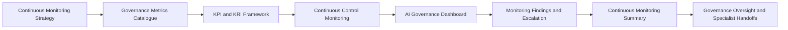

# Continuous Monitoring Summary

## Executive Summary

The Continuous Monitoring capability establishes how Megastar Mortgage maintains ongoing visibility into the Megastar Intelligent Processor (MIP), its governed AI systems, risks, controls, third-party dependencies, corrective actions, monitoring findings, incidents, changes, and governance obligations.

The Continuous Monitoring Summary consolidates the approved outputs of the Continuous Monitoring Strategy, Governance Metrics Catalogue, KPI & KRI Framework, Continuous Control Monitoring Framework, AI Governance Dashboard, and Monitoring Findings & Escalation.

It provides a current, evidence-based view of monitoring coverage, indicator quality, KPI and KRI status, control health, material trends, threshold breaches, provider conditions, corrective-action progress, open findings, monitoring limitations, and required cross-capability handoffs.

The summary does not replace the Enterprise AI System Inventory, Enterprise AI Risk Register, Enterprise AI Control Register, Enterprise Third-Party AI Register, corrective-action records, incident records, change records, or monitoring-finding records. It consolidates approved monitoring information so governance stakeholders can understand the present condition of the AI governance environment and determine what requires attention next.

The summary produces an overall monitoring conclusion. It does not perform risk reassessment, determine control effectiveness, classify incidents, approve changes, make provider continuation decisions, accept residual risk, conduct management review, or approve strategic continual-improvement actions.

---

## Purpose

The purpose of this document is to establish a standardized approach for consolidating and communicating the overall Continuous Monitoring position.

The Continuous Monitoring Summary enables Megastar Mortgage to:

- define the monitoring period and scope;
- confirm the extent of monitoring coverage;
- assess the reliability and completeness of monitoring information;
- consolidate KPI and KRI status;
- summarize control-health conditions;
- identify material AI-system and provider trends;
- summarize threshold breaches and monitoring findings;
- assess corrective-action progress;
- identify potential incident and material-change signals;
- disclose monitoring blind spots and evidence limitations;
- confirm specialist-governance handoffs;
- identify matters requiring governance or executive attention;
- determine the overall monitoring conclusion;
- confirm that applicable living governance records are current; and
- provide a formal handoff to Governance Oversight & Continual Improvement.

Completion of this summary closes the reporting cycle for the Continuous Monitoring capability while preserving the ownership boundaries of downstream governance activities.

---

## Continuous Monitoring Summary Process

The summary consolidates approved monitoring outputs from the complete capability.



The summary reflects the monitoring condition during a defined reporting period and shall identify any material developments occurring after the reporting cut-off where they affect the conclusion.

---

## Summary Principles

Megastar Mortgage prepares Continuous Monitoring Summaries according to the following principles:

- Summary information shall originate from approved monitoring measures and authoritative governance records.
- The reporting period, data cut-off, source-refresh dates, and material post-period events shall be clear.
- Monitoring coverage and information quality shall be visible alongside reported results.
- Grey, unavailable, incomplete, or unreliable information shall not be treated as satisfactory.
- Material object-level deterioration shall not be concealed by portfolio averages.
- KPI performance and KRI exposure shall remain distinguishable.
- Control health shall remain distinguishable from formal control effectiveness.
- Monitoring findings shall remain distinguishable from risks, assurance findings, incidents, and changes.
- Corrective-action completion shall remain distinguishable from verification and closure.
- Monitoring conclusions shall remain distinct from management-review and residual-risk decisions.
- Repeated and systemic conditions shall receive greater attention than isolated deviations.
- Material limitations and blind spots shall be disclosed.
- Cross-capability handoffs shall identify an accountable owner, receiving capability, and current status.
- Living governance records shall be updated before the summary is approved, or outstanding updates shall be disclosed.
- The summary shall support action and decision-making rather than merely restating dashboard information.
- Historical comparability shall be preserved where definitions, scope, sources, or thresholds change.

---

## Summary Scope

The summary may cover:

- one AI system;
- a business function;
- a governance domain;
- a portfolio of AI systems;
- one or more providers;
- a defined monitoring period;
- a material-event review; or
- an enterprise-wide monitoring position.

The scope shall identify:

- AI systems included;
- business processes included;
- business functions included;
- providers included;
- risks and controls included;
- monitoring domains included;
- reporting period;
- data cut-off;
- comparison period;
- known exclusions;
- material scope changes; and
- limitations affecting the conclusion.

---

## Monitoring Coverage Position

Monitoring coverage evaluates whether the approved monitoring scope is supported by sufficient measures, indicators, sources, ownership, and review.

Coverage may include:

- governed AI systems with approved monitoring;
- High and Critical risks with current KRIs;
- key controls with control-health monitoring;
- critical providers with current monitoring;
- corrective actions with current status;
- assurance findings with remediation tracking;
- approved-use conditions with monitoring;
- material data flows with quality monitoring;
- human-oversight activities with current measures;
- incident and change signals;
- review and expiry obligations;
- monitoring findings with current status; and
- governance escalations with current ownership.

Coverage may be summarized as:

| Coverage Status | Meaning |
|---|---|
| Complete | Required monitoring is established and operating across the approved scope. |
| Substantially Complete | Minor gaps exist but do not materially prevent a monitoring conclusion. |
| Partial | Material monitoring gaps exist and reduce confidence in the overall position. |
| Insufficient | Coverage is inadequate to support a defensible conclusion. |
| Not Assessed | Coverage has not been evaluated. |

A monitoring gap affecting a Critical AI system, risk, control, provider, or obligation shall be disclosed separately.

---

## Monitoring Information Quality

The summary shall assess whether the monitoring information is fit for governance use.

Quality considerations include:

- source completeness;
- calculation accuracy;
- reporting timeliness;
- source reliability;
- metric-definition currency;
- threshold currency;
- data lineage;
- segmentation;
- population coverage;
- reconciliation;
- manual adjustments;
- source failures;
- data latency;
- stale information;
- provider-report limitations; and
- unavailable critical information.

The overall monitoring-information quality may be summarized as:

| Information Quality Status | Meaning |
|---|---|
| Reliable | Information supports normal governance reliance. |
| Reliable with Limitations | Information is usable with disclosed qualifications. |
| Provisional | Important information requires further validation. |
| Unreliable | Information should not support material governance decisions. |
| Insufficient | Critical information is unavailable or incomplete. |

A favourable monitoring conclusion shall not be issued where material information quality is Unreliable or Insufficient.

---

## KPI Position

The KPI position summarizes whether approved governance performance objectives are being achieved.

It may include:

- total approved KPIs;
- Green, Amber, Red, Critical, Grey, and Not Applicable KPIs;
- KPIs with improving, stable, deteriorating, or volatile trends;
- KPIs with unreliable or unavailable data;
- KPIs below target;
- repeated KPI breaches;
- KPIs requiring recalibration;
- KPI actions overdue;
- activity measures that do not demonstrate effectiveness;
- performance concentration by AI system, business function, provider, or control domain; and
- material KPI exceptions.

KPI status shall be interpreted with relevant context measures.

A favourable KPI portfolio does not override:

- a Critical KRI;
- a failed key control;
- a material incident;
- a significant unapproved change;
- a major provider concern;
- a Critical monitoring blind spot; or
- another potentially unacceptable condition.

---

## KRI Position

The KRI position summarizes whether known exposure is increasing or approaching an unacceptable boundary.

It may include:

- total approved KRIs;
- Green, Amber, Red, Critical, Grey, and Not Applicable KRIs;
- worsening risk trends;
- repeated KRI breaches;
- KRIs linked to High or Critical risks;
- KRIs with overdue response actions;
- KRIs with unreliable or unavailable data;
- emerging provider, model, data, security, privacy, human-oversight, concentration, or change exposure;
- KRIs requiring risk reassessment;
- KRIs requiring incident or change evaluation; and
- unresolved escalation.

KRI results provide early warning.

They do not independently change formal likelihood, impact, priority, residual risk, or risk acceptance.

---

## Control-Health Position

The control-health position consolidates monitoring information regarding implemented controls.

It may include:

- total controls monitored;
- Healthy controls;
- controls requiring attention;
- Degraded controls;
- Failed controls;
- controls with Unknown health;
- missed control activities;
- overdue control reviews;
- missing evidence;
- repeated control exceptions;
- control ownership gaps;
- control-configuration deviations;
- provider-control concerns;
- improvement actions;
- controls requiring repair or redesign;
- controls requiring assurance or retesting; and
- controls linked to High or Critical risks.

Control health is a monitoring conclusion.

Formal control design, implementation, and operating-effectiveness conclusions remain within AI Controls and AI Assurance.

---

## AI-System Monitoring Position

The summary shall identify AI systems requiring governance attention.

Relevant information may include:

- approved-use deviations;
- lifecycle-status changes;
- systems under reassessment;
- restricted or suspended systems;
- systems operating with incomplete monitoring;
- systems with Critical indicators;
- systems with worsening risk conditions;
- systems with Degraded or Failed controls;
- systems with significant performance deterioration;
- systems with data-quality failures;
- systems with human-oversight gaps;
- systems with unresolved incidents;
- systems with unapproved or pending material changes;
- systems dependent on deteriorating providers; and
- systems approaching retirement or transition.

The Enterprise AI System Inventory remains authoritative for system status and lifecycle information.

---

## Model and Service Performance Position

Where applicable, the summary may consolidate approved monitoring of:

- accuracy;
- extraction accuracy;
- precision;
- recall;
- false-positive rate;
- false-negative rate;
- exception rate;
- override rate;
- correct-override rate;
- drift;
- performance by document type;
- performance by population;
- service availability;
- latency;
- throughput;
- processing failure;
- fallback usage;
- queue backlog;
- resilience; and
- recovery performance.

The summary shall identify where segmentation reveals deterioration not visible in aggregate measures.

Performance deterioration may trigger risk, control, incident, change, provider, or assurance review.

---

## Data, Privacy, and Security Position

The summary may consolidate material monitoring conditions across these domains.

### Data Quality and Data Governance

- completeness;
- accuracy;
- validity;
- missing-field rate;
- duplicate rate;
- lineage coverage;
- data drift;
- unresolved quality issues;
- retention exceptions;
- deletion failures;
- unauthorized data use; and
- monitoring-source quality.

### Privacy

- personal-data use;
- overdue privacy review;
- unresolved privacy conditions;
- retention or deletion failures;
- unauthorized secondary use;
- cross-border processing concerns;
- privacy incidents; and
- provider privacy obligations.

### Security and Access

- privileged access;
- overdue access review;
- inactive accounts;
- unauthorized-access attempts;
- access-control exceptions;
- segregation-of-duties conflicts;
- credential issues;
- logging gaps;
- vulnerability conditions;
- security incidents; and
- provider security concerns.

Material privacy and security information shall be restricted to authorized audiences.

---

## Human-Oversight Position

The summary may include:

- required human-review coverage;
- human-review completion;
- unreviewed outputs;
- override rate;
- correct-override rate;
- reviewer error rate;
- reviewer backlog;
- workload capacity;
- escalation usage;
- training currency;
- human-oversight control health;
- repeated human-review failures; and
- systems operating with insufficient oversight.

Human-oversight indicators shall be interpreted together with transaction volume, system performance, model changes, workload, and reviewer quality.

---

## Third-Party Monitoring Position

The provider-monitoring position may include:

- active material third-party AI relationships;
- provider monitoring coverage;
- due-diligence currency;
- provider assurance currency;
- contractual compliance;
- service-performance status;
- provider KPI and KRI status;
- threshold breaches;
- open provider issues;
- provider corrective actions;
- provider incidents;
- provider changes;
- subprocessor changes;
- provider financial or operational concerns;
- provider concentration;
- vendor lock-in;
- renewal conditions;
- exit readiness;
- restrictions or suspensions; and
- relationships requiring continuation, renegotiation, reassessment, or exit review.

Third-Party AI Governance remains responsible for provider relationship decisions.

---

## Monitoring Findings Position

The summary shall consolidate open and recently closed monitoring findings.

It may include:

- total open findings;
- findings by severity;
- findings by category;
- Critical and High findings;
- repeated findings;
- systemic findings;
- overdue findings;
- blocked findings;
- escalated findings;
- findings awaiting specialist-handoff acceptance;
- findings awaiting verification;
- reopened findings;
- findings closed during the period;
- findings transferred to authoritative specialist records; and
- findings requiring executive attention.

Material finding themes shall be summarized without duplicating the full finding records.

---

## Corrective-Action Position

The summary may include corrective actions arising from:

- monitoring findings;
- AI Assurance;
- provider governance;
- risk response;
- control improvement;
- incidents;
- changes;
- due-diligence conditions;
- onboarding conditions;
- contractual remediation;
- policy exceptions; and
- governance decisions.

The position may include:

- total open actions;
- actions by priority;
- overdue actions;
- blocked actions;
- actions with repeated extensions;
- actions reported complete;
- actions awaiting verification;
- verified actions;
- closure backlog;
- actions without owner;
- actions without target date; and
- actions requiring escalation.

The summary shall distinguish:

```text
Action Completed
from
Action Verified
from
Finding or Issue Closed
```

---

## Incident Signals and Incident Position

Continuous Monitoring may detect or display potential incident signals and authoritative incident information.

The summary may include:

- potential incident signals;
- confirmed incidents;
- incidents by severity;
- open incidents;
- repeated incidents;
- incident recurrence;
- provider incidents;
- incidents linked to control failure;
- incidents linked to unapproved change;
- unresolved incident obligations;
- incident-driven corrective actions; and
- incidents affecting continued operation.

Monitoring does not classify, investigate, contain, recover, or close incidents.

Those activities remain within AI Incident Management.

---

## Change Signals and Change Position

The summary may include:

- material-change signals;
- changes awaiting assessment;
- changes awaiting approval;
- emergency changes;
- unapproved changes;
- provider changes;
- model-version changes;
- data-source changes;
- control changes;
- policy changes;
- changes implemented but awaiting verification;
- changes triggering reassessment;
- changes affecting metrics or thresholds; and
- repeated change-governance weaknesses.

Monitoring does not approve, implement, or verify changes.

Those activities remain within AI Change Management.

---

## Threshold-Breach Position

The summary shall identify material warning, breach, and critical conditions.

It may include:

- number of Amber indicators;
- number of Red indicators;
- number of Critical indicators;
- number of Grey indicators;
- repeated threshold breaches;
- persistent threshold breaches;
- threshold breaches by AI system;
- threshold breaches by risk;
- threshold breaches by control;
- threshold breaches by provider;
- threshold breaches without assigned action;
- threshold breaches without escalation;
- threshold breaches requiring specialist handoff; and
- breaches unresolved beyond the required response timeframe.

A threshold breach is a monitoring condition.

Its final governance classification remains with the receiving capability.

---

## Material Trends

The summary shall identify material patterns across the reporting period.

Trends may include:

- improving governance coverage;
- deteriorating data quality;
- increasing model error;
- increasing override activity;
- repeated human-review gaps;
- rising control exceptions;
- increasing unresolved High or Critical risks;
- growing provider concentration;
- increasing overdue actions;
- recurring incidents;
- increasing emergency or unapproved changes;
- assurance-evidence expiry;
- weakening exit readiness;
- repeated monitoring-data failures;
- action-verification backlog; and
- systemic ownership or capacity weakness.

The summary shall distinguish:

- isolated variation;
- sustained trend;
- repeated pattern;
- systemic condition; and
- insufficient history.

---

## Monitoring Limitations and Blind Spots

The summary shall disclose material limitations affecting confidence.

Examples include:

- incomplete logging;
- unavailable provider information;
- delayed source refresh;
- missing data lineage;
- unreliable metric population;
- insufficient segmentation;
- manual reporting;
- inconsistent definitions;
- unmonitored subprocessors;
- unknown control health;
- stale risk or control records;
- missing incident or change data;
- unsupported legacy systems;
- transition-state monitoring gaps; and
- Critical indicators with unavailable data.

Each material limitation shall identify:

- affected area;
- governance consequence;
- compensating monitoring;
- owner;
- remediation action;
- target date;
- escalation status; and
- effect on the overall monitoring conclusion.

---

## Cross-Capability Handoffs

The summary shall confirm all material handoffs initiated during the monitoring period.

| Monitoring Matter | Receiving Capability |
|---|---|
| New AI use, scope expansion, or reassessment trigger | AI Inventory & Assessment |
| New or materially changed AI risk | AI Risk Management |
| Missing, degraded, or failed control | AI Controls |
| Independent evaluation or retesting required | AI Assurance |
| Provider deterioration or obligation breach | Third-Party AI Governance |
| Potential or confirmed AI incident | AI Incident Management |
| Material system, model, data, prompt, provider, control, or policy change | AI Change Management |
| Executive, policy, strategic, exception, or residual-risk decision | Governance Oversight & Continual Improvement |
| Regulatory or framework-mapping impact | Framework Alignment |

For each handoff, the summary shall identify:

- source finding or observation;
- receiving capability;
- receiving record reference;
- accountable owner;
- acceptance status;
- target date;
- current status; and
- unresolved dependency.

---

## Governance Attention Required

The summary shall clearly identify matters requiring action beyond routine monitoring.

These may include:

- Critical or repeated threshold breaches;
- worsening High or Critical risks;
- Degraded or Failed key controls;
- ineffective or overdue remediation;
- major provider deterioration;
- expired provider assurance;
- repeated incidents;
- unapproved material changes;
- approved-use deviations;
- persistent human-oversight gaps;
- significant model-performance deterioration;
- material privacy or security concerns;
- monitoring blind spots affecting Critical systems;
- overdue governance decisions;
- restrictions or suspensions requiring review;
- residual-risk decisions pending;
- systemic ownership or capacity weakness; and
- strategic improvement themes.

Each matter shall identify the decision or action required and the accountable authority.

---

## Overall Monitoring Conclusions

The Continuous Monitoring Summary shall result in one overall monitoring conclusion.

| Monitoring Conclusion | Meaning |
|---|---|
| Stable | Monitoring indicates that governed conditions remain broadly within approved expectations, with no material unresolved concern requiring elevated action. |
| Stable with Watch Items | The overall position remains manageable, but emerging trends or isolated conditions require closer observation. |
| Attention Required | Material deterioration, breaches, findings, overdue actions, or governance gaps require coordinated action. |
| Escalation Required | Significant, unresolved, repeated, or cross-functional matters exceed routine operating authority. |
| Critical Intervention Required | Severe or potentially unacceptable conditions require immediate escalation, restriction, suspension, incident evaluation, or executive intervention. |
| Unable to Conclude | Monitoring coverage, reliability, quality, or evidence is insufficient to form a defensible overall conclusion. |

The conclusion is a monitoring position.

It is not:

- an assurance opinion;
- a risk-acceptance decision;
- a provider-continuation decision;
- an incident classification;
- a change approval;
- a management-review conclusion; or
- a strategic continual-improvement decision.

---

## Monitoring Conclusion Method

The conclusion shall consider:

- monitoring coverage;
- information quality;
- KPI position;
- KRI position;
- control health;
- AI-system conditions;
- provider conditions;
- monitoring findings;
- corrective actions;
- incident signals;
- change signals;
- threshold breaches;
- trends;
- monitoring limitations;
- specialist handoffs;
- unresolved escalations; and
- decision urgency.

The conclusion shall not be produced through a simple average or unvalidated composite score.

A single Critical condition may override an otherwise favourable portfolio position where the potential consequence warrants immediate intervention.

---

## Readiness for Governance Oversight

The summary is ready for Governance Oversight & Continual Improvement when:

- the monitoring period and scope are clear;
- coverage has been assessed;
- information quality has been assessed;
- KPI and KRI positions are current;
- control-health information is current;
- material provider conditions are documented;
- open findings and corrective actions are current;
- incident and change signals are identified;
- material trends and threshold breaches are summarized;
- monitoring limitations are disclosed;
- specialist handoffs are documented;
- living governance records are updated or outstanding updates are disclosed;
- governance attention items are clear;
- the overall monitoring conclusion is supported; and
- matters requiring executive or management decision are identified.

---

## Governance Oversight Handoff

The Continuous Monitoring Summary provides Governance Oversight & Continual Improvement with:

- the overall monitoring conclusion;
- material unresolved risks;
- degraded or failed controls;
- monitoring findings;
- provider deterioration;
- corrective-action backlog;
- repeated incidents;
- material-change concerns;
- policy or regulatory concerns;
- monitoring blind spots;
- residual-risk decisions pending;
- restrictions or suspensions requiring review;
- systemic governance themes;
- capability weaknesses;
- monitoring maturity observations; and
- prioritized improvement opportunities.

Governance Oversight determines:

- executive intervention;
- residual-risk acceptance;
- policy action;
- strategic restriction;
- governance-priority changes;
- resource allocation;
- management-review conclusions; and
- continual-improvement decisions.

---

## Living Governance Record Confirmation

Before approval, the summary shall confirm that material monitoring outcomes are reflected in applicable authoritative records.

### Enterprise AI System Inventory

May require updates to:

- current use;
- approved-use status;
- lifecycle stage;
- reassessment status;
- restriction or suspension;
- provider dependency;
- retirement;
- monitoring status; and
- last review date.

### Enterprise AI Risk Register

May require updates to:

- current risk condition;
- KRI status;
- threshold breach;
- risk trend;
- emerging change;
- monitoring escalation;
- monitoring finding reference;
- action status; and
- monitoring notes.

### Enterprise AI Control Register

May require updates to:

- control health;
- monitoring status;
- exception status;
- improvement action;
- improvement status;
- threshold breach;
- monitoring escalation;
- assurance requirement; and
- monitoring finding reference.

### Enterprise Third-Party AI Register

May require updates to:

- provider-monitoring status;
- provider KPI status;
- provider KRI status;
- threshold breach;
- material trend;
- provider issue status;
- corrective-action status;
- monitoring escalation; and
- monitoring finding reference.

### Corrective-Action, Incident, Change, and Finding Records

The summary shall confirm that:

- actions remain current;
- incident records remain authoritative;
- change records remain authoritative;
- monitoring findings remain current;
- specialist handoffs are linked; and
- closure or transfer status is accurate.

No new monitoring register is created.

---

## Summary Review and Approval

Before approval, Megastar Mortgage confirms that:

- scope and reporting period are clear;
- monitoring coverage is accurately represented;
- information quality is disclosed;
- metrics and indicators are approved;
- KPI and KRI status is current;
- control-health information is current;
- material system and provider conditions are included;
- findings and corrective actions are current;
- incident and change signals are represented accurately;
- threshold breaches and trends are supported;
- monitoring limitations are disclosed;
- cross-capability handoffs are current;
- governance attention items are clear;
- the overall conclusion is supported;
- living governance records are updated or exceptions are documented; and
- the summary is ready for Governance Oversight.

---

## Summary Maintenance

The Continuous Monitoring Summary shall be updated when:

- a material post-period event occurs;
- a Critical indicator changes;
- a High or Critical finding is created;
- a major provider condition changes;
- a significant incident occurs;
- a material change is approved or implemented;
- a monitoring blind spot is identified;
- information quality deteriorates;
- a restriction or suspension is imposed;
- a major corrective action is verified;
- an executive decision changes the current condition; or
- the approved summary no longer reflects the current monitoring position.

Updates shall preserve version history and rationale.

---

## Why This Document Matters

Continuous Monitoring can generate large volumes of information across systems, risks, controls, providers, metrics, indicators, findings, actions, incidents, and changes.

Without a consolidated monitoring summary, decision-makers may see individual signals without understanding the broader governance position. Material deterioration may remain fragmented across dashboards. Repeated findings may appear isolated. Monitoring blind spots may be overlooked. Corrective actions may appear complete without verification. Provider, incident, and change concerns may not reach the correct authority.

The Continuous Monitoring Summary gives Megastar Mortgage a disciplined view of what is stable, what is deteriorating, what is unknown, what remains unresolved, and what requires governance attention next.

It closes the Continuous Monitoring capability by converting recurring monitoring evidence into a clear and traceable governance handoff without replacing the specialist decisions that follow.

---

## Related Artifacts

This document supports:

- Continuous Monitoring Summary Template
- Continuous Monitoring Strategy
- Governance Metrics Catalogue
- KPI & KRI Framework
- Continuous Control Monitoring Framework
- AI Governance Dashboard
- Monitoring Findings & Escalation
- Enterprise AI System Inventory
- Enterprise AI Risk Register
- Enterprise AI Control Register
- Enterprise Third-Party AI Register
- Governance Oversight & Continual Improvement

---

## Document Control

| Field | Value |
|---|---|
| Document | Continuous Monitoring Summary |
| Capability | Continuous Monitoring |
| Repository | Enterprise AI Governance Playbook |
| Reference Organization | Megastar Mortgage |
| Reference AI System | Megastar Intelligent Processor (MIP) |
| Document Owner | AI Governance Lead |
| Version | 1.0 |
| Review Cycle | Annual |
| Status | Published Reference |

---

## Revision History

| Version | Date | Description |
|---|---|---|
| 1.0 | July 2026 | Initial release of the Continuous Monitoring Summary artifact. |